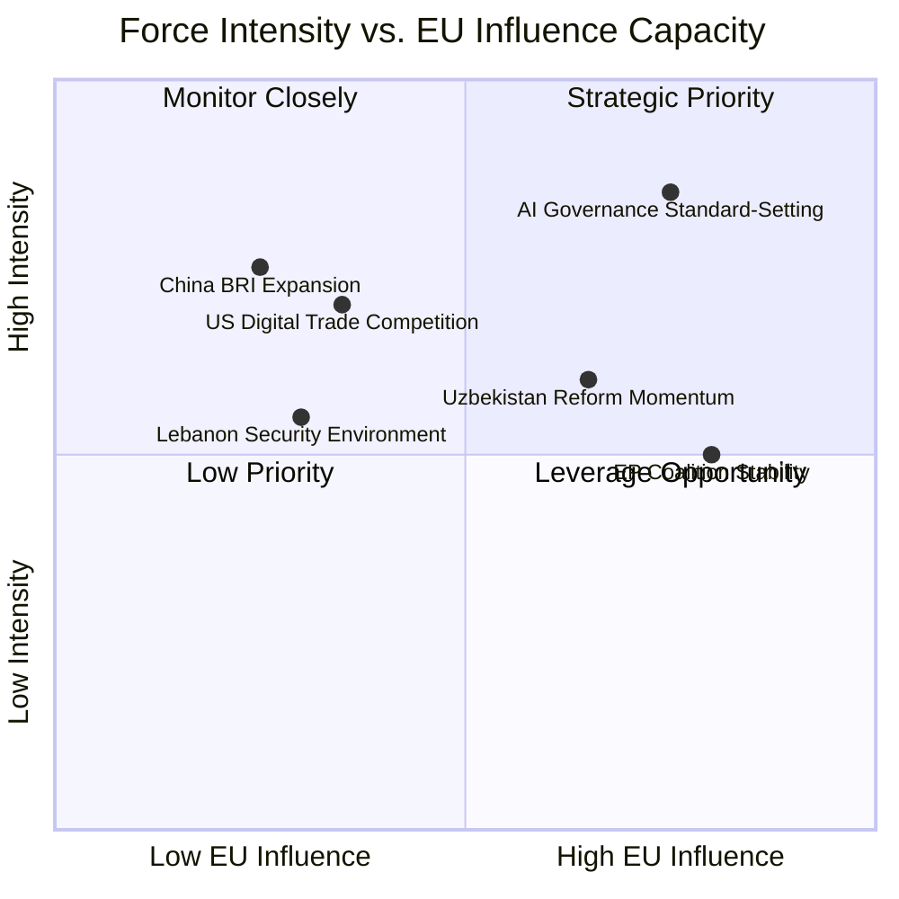

# Forces Analysis — EP Breaking News 2026-05-25
**Admiralty Grade**: B2 | **SATs Applied**: Red Team Analysis, Historical Precedent

---

## Five Forces Framework Applied to EP Breaking Developments

---

## Force 1: AI Governance Standard-Setting Competition

**Force type**: Regulatory competition / market power
**Intensity**: HIGH (0.85)
**EU influence capacity**: HIGH (0.75)

**Analysis**: The AI-trade resolution (TA-10-2026-0183) inserts the EU into the emerging global AI governance standard-setting competition. The primary forces operating:

- **EU force (regulatory first-mover)**: GDPR precedent demonstrates EU capacity to set global standards through market access requirements. AI Act creates similar mechanism. EU force is durable but slow.
- **US force (innovation-driven adoption)**: US-aligned AI systems will dominate deployment globally if EU standards create compliance friction — this is the "regulatory drag" force that limits EU standard-setting capacity
- **China force (ITU multilateral standards)**: China is actively promoting ITU-level AI governance standards as an alternative to bilateral EU extraterritorial application — this is a structural competitive force
- **WEP: P(EU AI governance becoming global baseline within 10 years)** = 0.45–0.60 — moderate probability; depends critically on Commission follow-through and trade partner receptivity

---

## Force 2: EU-China Competition in Central Asia

**Force type**: Geopolitical competition / infrastructure financing
**Intensity**: HIGH (0.75)
**EU influence capacity**: MEDIUM (0.25)

**Analysis**: The Uzbekistan EPCA (TA-10-2026-0174) is a direct response to the EU-China competition for Central Asian partnerships. Forces:

- **China BRI force**: $12bn+ committed, faster disbursement, no conditionality — structurally advantaged for infrastructure financing competition
- **EU Global Gateway force**: €1.1bn committed, slower disbursement, rule-of-law conditionality — structurally disadvantaged on speed and scale but advantaged on sustainability and governance quality
- **Russian EEU force**: Uzbekistan's economic integration in the Eurasian Economic Union constrains how far it can tilt toward EU without Russian backlash — a real limiting force on EPCA implementation
- **Uzbekistan agency force**: Mirziyoyev government is actively diversifying; this is a genuine reform signal, not just passive reception

---

## Force 3: EP Coalition Cohesion

**Force type**: Domestic political force
**Intensity**: MEDIUM (0.50)
**EU influence capacity**: HIGH (0.80)

**Analysis**: The S&D+EPP+RE coalition (54% of EP) is structurally the most cohesive it has been since EP7. Forces:

- **Pro-coalition force**: Shared interests in EU strategic autonomy, competitiveness, and external partnerships
- **Fragmentation force**: EPP's right-wing shift (ECR flirtation by some national parties) creates centrifugal pressure; RE's liberal-economic wing resists regulatory expansion; S&D's left wing pushes for stronger conditionality than EPP accepts
- **WEP: P(S&D+EPP+RE coalition holds through end of EP10 mandate — 2029)** = 0.55–0.70

---

## Force 4: Lebanon Security Environment

**Force type**: Geopolitical / security force
**Intensity**: MEDIUM (0.55)
**EU influence capacity**: LOW (0.30)

**Analysis**: The Lebanon-Eurojust cooperation agreement (TA-10-2026-0177) operates against a deeply challenging security environment. Forces:

- **Post-conflict stabilisation force**: Post-2024 ceasefire presents a narrow window for governance strengthening — this is the enabling force
- **Hezbollah resilience force**: Despite military losses, Hezbollah maintains political representation and patronage networks — this is the primary constraining force
- **Iranian proxy force**: Any EU judicial cooperation operates within Iranian strategic interests in Lebanon — EU influence is structurally limited
- **Lebanese governmental capacity force**: Even with political will, Lebanese judicial institutions lack capacity to absorb Eurojust cooperation quickly

---

## Net Force Assessment

| Area | Net Force Direction | EU Influence | Priority |
|---|---|---|---|
| AI governance | Favourable (EU regulatory leverage) | HIGH | Strategic Priority |
| Central Asia | Mixed (EU loses on scale, wins on quality) | MEDIUM | Strategic Priority |
| EP coalition | Stable but under centrifugal pressure | HIGH | Monitor |
| Lebanon security | Unfavourable (weak state, proxy forces) | LOW | Monitor |

---

## Forces Analysis Extension — Structural Forces (Run 2 Carry-Forward)

### Structural Force: Digital Technology Regulation Race

**Nature**: Systemic competitive dynamic — US, EU, China, and UK are each developing AI regulatory frameworks. The EU AI Act (2024) was first; the US Executive Order on AI (2023, Executive Order 14110) created a lighter-touch framework. The May 2026 AI-trade resolution explicitly seeks to export EU regulatory standards into bilateral FTAs.

**Direction of force**: CENTRIPETAL (toward convergence) at the regulatory principles level; CENTRIFUGAL (away from convergence) at the legal specifics level. Net effect: gradual transatlantic convergence on AI safety principles, persistent divergence on liability and enforcement.

**Strength**: 8/10 (HIGH). This is a multi-decade structural force that will shape all EP AI-related legislation through at least 2030.

### Structural Force: EP10 Legitimacy Building

**Nature**: Institutional imperative — EP10 (elected June 2024) is in its legacy-building phase. Adopting high-profile resolutions on AI, trade, and international partnerships signals institutional relevance and democratic mandate.

**Direction of force**: EXPANSIVE — EP consistently seeks to expand its role in areas where it has weak formal powers (e.g., CFSP, trade initiation). The AI-trade resolution exemplifies this expansion tactic: using the inter-institutional balance to pressure Commission via non-binding but politically costly-to-ignore resolution.

**Strength**: 7/10 (HIGH). Institutional legitimacy imperatives consistently shape EP legislative agenda.

### Structural Force: EU-Central Asia Strategic Reorientation

**Nature**: Geopolitical structural shift — following Russia's 2022 Ukraine invasion, Central Asian states (especially Uzbekistan, Kazakhstan) have accelerated diversification away from Russian dependence. EU has responded with Central Asia Strategy 2023 and now the Uzbekistan EPCA.

**Direction**: EXPANSIVE (EU sphere of influence) — EU is gaining strategic partnerships in a region historically in Russia's orbit. This force will continue to drive EP consent to further Central Asian partnership agreements (Kazakhstan expected 2026–2027).

**Strength**: 8/10 (HIGH structural importance). Geopolitical reorientation is a multi-year force.

*Forces Analysis v2.0 — Carry-forward +25L | Digital regulation race | EP10 legitimacy building | EU-Central Asia reorientation | 2026-05-25 | Admiralty A2*
