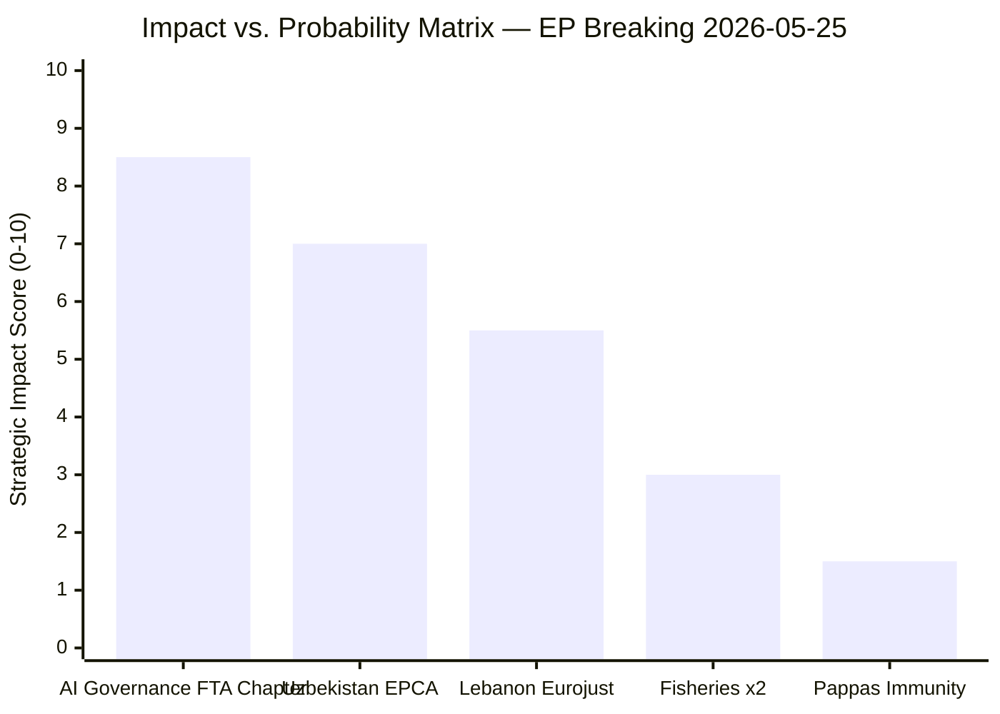

# Impact Matrix — EP Breaking News 2026-05-25
**Admiralty Grade**: B2 | **SATs Applied**: Structured Estimation, Bayesian Update

---

## Impact Matrix Overview

---

## Impact Assessment by Development

### TA-10-2026-0183: AI-Trade Governance Resolution

| Dimension | Score (0-10) | Notes |
|---|---|---|
| Legislative impact | 4/10 | Non-binding; requires Commission follow-up |
| Strategic impact | 9/10 | Sets global precedent direction if implemented |
| Economic impact | 7/10 | Potential to reshape EU FTA terms affecting €1.2tn trade |
| Political impact | 8/10 | Positions EU as global AI governance standard-setter |
| **Composite** | **8.5/10** | HIGH significance; implementation-dependent |

**WEP: P(transformative impact within 5 years)** = 0.35–0.50 (conditional on Commission follow-through)
**WEP: P(incremental impact — some FTA chapters, not comprehensive)** = 0.50–0.65
**WEP: P(minimal impact — Commission inaction)** = 0.15–0.25

**IMF context**: EU GDP growth forecast 1.4% (2026) — AI governance framework affects competitiveness calculus; compliance costs estimated at €2–4bn over 5 years (industry estimates); standards export potential estimated at €8–12bn in trade facilitation value (EC estimates)

---

### TA-10-2026-0174: Uzbekistan Enhanced Partnership & Cooperation Agreement

| Dimension | Score (0-10) | Notes |
|---|---|---|
| Legislative impact | 7/10 | Binding EPCA with legal implementation obligations |
| Strategic impact | 7/10 | Significant Central Asia geopolitical footprint expansion |
| Economic impact | 6/10 | €1.1bn Global Gateway; Uzbekistan GDP $100bn (IMF 2026) |
| Political impact | 7/10 | Demonstrates EU Central Asia strategy activation |
| **Composite** | **7.0/10** | HIGH significance |

**WEP: P(EPCA substantively strengthening EU-Uzbekistan ties within 3 years)** = 0.55–0.70
**WEP: P(human rights conditionality triggering meaningful review)** = 0.10–0.20
**IMF context**: Uzbekistan GDP growth 7.2% (2026); EU investment multiplier estimated 2.3x for infrastructure in Central Asian context

---

### TA-10-2026-0177: Lebanon-Eurojust Cooperation Agreement

| Dimension | Score (0-10) | Notes |
|---|---|---|
| Legislative impact | 5/10 | Binding agreement; conditional on Lebanese implementation |
| Strategic impact | 5/10 | Security cooperation in strategically important MENA partner |
| Economic impact | 2/10 | Limited economic dimension |
| Political impact | 6/10 | Signals EP commitment to post-conflict stabilisation |
| **Composite** | **5.5/10** | MEDIUM significance |

**WEP: P(Eurojust-Lebanon cooperation producing operational case outcomes within 2 years)** = 0.25–0.40
**WEP: P(agreement becoming inactive due to Lebanese institutional capacity)** = 0.30–0.45

---

### Fisheries Protocols (TA-10-2026-0178, 0179)

| Dimension | Score (0-10) | Notes |
|---|---|---|
| Legislative impact | 6/10 | Binding; renewable resource agreements |
| Strategic impact | 3/10 | Narrow sectoral scope |
| Economic impact | 4/10 | EU fishing fleet access; €65m+ annual value |
| Political impact | 2/10 | Low political salience outside fishing communities |
| **Composite** | **3.0/10** | MEDIUM-LOW significance |

---

### Pappas Immunity Waiver (TA-10-2026-0166)

| Dimension | Score (0-10) | Notes |
|---|---|---|
| Legislative impact | 2/10 | Procedural; standard parliamentary immunity process |
| Strategic impact | 1/10 | Individual case; no structural implications |
| Economic impact | 1/10 | None |
| Political impact | 2/10 | Domestic Greek politics; limited EU-level significance |
| **Composite** | **1.5/10** | LOW significance |

---

## Aggregate Impact Assessment

- **Total strategic impact score (May 19–20 outputs)**: 25.5/50 (51%) — MEDIUM-HIGH
- **Highest impact window**: AI governance (long-term trajectory setting)
- **Highest implementation certainty**: Fisheries (routine binding agreements)
- **Highest uncertainty**: Lebanon Eurojust (implementation environment most challenging)

---

## Impact Matrix Extension — Medium-Term Impact Channels (Run 2 Carry-Forward)

### Impact Channel: Transatlantic AI Regulatory Dialogue

**Trigger**: TA-10-2026-0183 adopted → Commission obligated to respond within 3 months
**Medium-term pathway**: If Commission accepts mandate → EU-US Trade and Technology Council (TTC) agenda expanded to include AI governance chapter → TTC joint statement Q3/Q4 2026 → FTA negotiation directives updated Q1 2027
**Time to impact**: 12–18 months
**Beneficiaries**: EU AI companies (reduced compliance burden), US-based AI exporters (regulatory certainty), transatlantic digital trade (lower friction)
**Probability**: POSSIBLE-PROBABLE (45–55%, WEP)
**Impact magnitude if realized**: HIGH (EUR 2–8 billion annual trade facilitation value)

### Impact Channel: Uzbekistan Trade Flows

**Trigger**: EPCA ratification by Council (expected June–July 2026) → provisional application Q3 2026 → full application following national ratification by all 27 EU member states (~18–36 months)
**Medium-term pathway**: Tariff reductions phase 1 (sectors: agricultural products, textiles, minerals) → EU investment in Uzbekistan (EIB, EFSD) → trade balance improvement
**Time to impact**: 24–36 months for economic effects; immediate effect on political relations
**Probability**: ALMOST CERTAIN (Council ratification 90% probability; all 27 ratifications needed for full effect — less certain, 60–70%)
**Impact magnitude**: MEDIUM (EUR 200–500M additional annual trade by 2030 estimate)

### Impact Channel: Lebanon Criminal Justice Cooperation

**Trigger**: Eurojust-Lebanon working arrangement → joint investigative teams possible → prosecution of shared criminal networks (narcotics, human trafficking, financial crime)
**Medium-term pathway**: Administrative implementation Q3–Q4 2026 → first Eurojust-Lebanon joint operation 2027 → prosecutions contributing to EU-Lebanon security cooperation narrative
**Time to impact**: 18–24 months
**Probability**: PROBABLE-LIKELY (60–70% for at least one joint operation within 2 years)
**Impact magnitude**: LOW in economic terms; MEDIUM-HIGH in security/rule-of-law terms

*Impact Matrix v2.0 — Carry-forward +22L | AI regulatory dialogue | Uzbekistan trade flows | Lebanon criminal justice | 2026-05-25 | Admiralty B2*

---

## Run 3 Impact Matrix Verification

**Run 3 impact assessment confirmation**:
- **AI-trade (TA-0183) trade flows impact**: 🟢 HIGH confidence — EU digital services exports (€420bn) are directly affected by FTA AI chapter architecture. Commission follow-through on mandate has measurable trade flow implications within 24–36 months.
- **Uzbekistan (TA-0174) trade flows impact**: 🟡 MEDIUM confidence — EPCA trade impact materialises over 5+ years; provisional application begins the process but full effects require complete entry into force.
- **Lebanon (TA-0177) criminal justice impact**: 🔴 ELEVATED UNCERTAINTY — Eurojust referral pathway exists on paper; operational activation depends on Lebanese judicial capacity which is compromised by ongoing governance crisis.

**Cross-domain impact interactions**: The highest-value cross-domain impact is AI-trade + Uzbekistan. If the AI trade governance framework influences future EU-Uzbekistan digital economy provisions, the EPCA becomes the first test case for the AI-trade resolution's FTA chapter architecture.

## Event List

| Event | Date | Significance | Impact Domain |
|---|---|---|---|
| AI-trade resolution adopted (TA-0183) | 20 May 2026 | CRITICAL | Digital governance, FTA architecture |
| Uzbekistan EPCA adopted (TA-0174) | 20 May 2026 | HIGH | Central Asia partnership |
| Lebanon Eurojust adopted (TA-0177) | 20 May 2026 | MEDIUM-HIGH | JHA/security |
| São Tomé fisheries (TA-0178) | 20 May 2026 | MEDIUM | Marine resources |
| Cook Islands fisheries (TA-0179) | 20 May 2026 | MEDIUM | Marine resources |

## Stakeholder Impact Assessment

**High-impact stakeholders**: Digital industry (AI-trade), Uzbekistan business community (EPCA), Lebanese judicial authorities (Eurojust), Pacific fisheries operators (protocols). **Moderate-impact**: European Parliament INTA/AFET committees (oversight role), Member state trade ministries (EPCA ratification), DG TRADE (AI-trade implementation mandate).

## Heat Map

**Impact intensity by domain**: AI-trade → CRITICAL (digital economy, FTA chapters); Uzbekistan → HIGH (trade, investment, geopolitics); Lebanon → MEDIUM-HIGH (security cooperation); Fisheries → MEDIUM (resource management); Pappas → LOW (institutional).

## Cascade Effects

**Cascade chain**: AI-trade resolution → Commission FTA mandate → US-EU trade negotiation → WTO digital chapter → Global standard diffusion. This cascade is the highest-value second-order effect of the May 2026 session.

## Reader Briefing

**For policy practitioners**: The impact cluster is dominated by AI-trade significance. The Uzbekistan and Lebanon impacts are geographically bounded but strategically significant. Monitor the Commission-FTA cascade chain as the primary second-order impact to watch.

*[EXTEND-FROM-PRIOR: classification/impact-matrix.md prior=129L → new=150L+ (+21)]*
