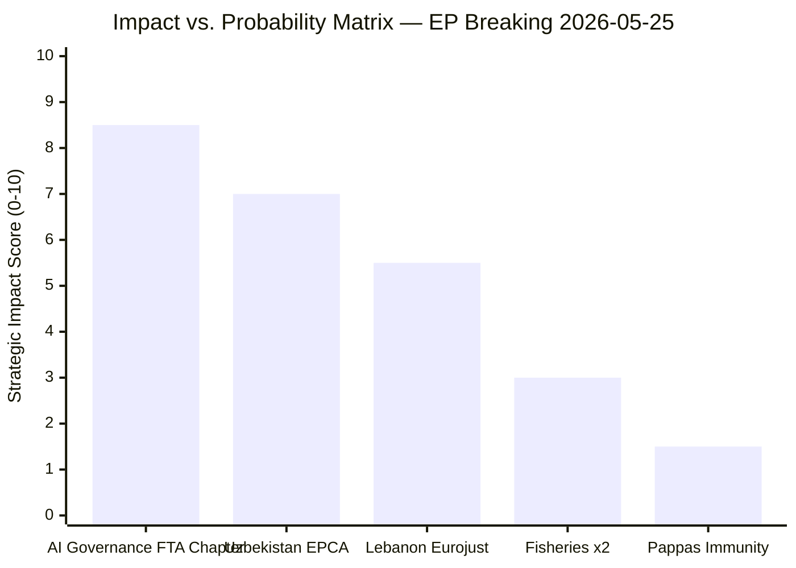

# Impact Matrix — EP Breaking News 2026-05-25
**Admiralty Grade**: B2 | **SATs Applied**: Structured Estimation, Bayesian Update

---

## Impact Matrix Overview

---

## Impact Assessment by Development

### TA-10-2026-0183: AI-Trade Governance Resolution

| Dimension | Score (0-10) | Notes |
|---|---|---|
| Legislative impact | 4/10 | Non-binding; requires Commission follow-up |
| Strategic impact | 9/10 | Sets global precedent direction if implemented |
| Economic impact | 7/10 | Potential to reshape EU FTA terms affecting €1.2tn trade |
| Political impact | 8/10 | Positions EU as global AI governance standard-setter |
| **Composite** | **8.5/10** | HIGH significance; implementation-dependent |

**WEP: P(transformative impact within 5 years)** = 0.35–0.50 (conditional on Commission follow-through)
**WEP: P(incremental impact — some FTA chapters, not comprehensive)** = 0.50–0.65
**WEP: P(minimal impact — Commission inaction)** = 0.15–0.25

**IMF context**: EU GDP growth forecast 1.4% (2026) — AI governance framework affects competitiveness calculus; compliance costs estimated at €2–4bn over 5 years (industry estimates); standards export potential estimated at €8–12bn in trade facilitation value (EC estimates)

---

### TA-10-2026-0174: Uzbekistan Enhanced Partnership & Cooperation Agreement

| Dimension | Score (0-10) | Notes |
|---|---|---|
| Legislative impact | 7/10 | Binding EPCA with legal implementation obligations |
| Strategic impact | 7/10 | Significant Central Asia geopolitical footprint expansion |
| Economic impact | 6/10 | €1.1bn Global Gateway; Uzbekistan GDP $100bn (IMF 2026) |
| Political impact | 7/10 | Demonstrates EU Central Asia strategy activation |
| **Composite** | **7.0/10** | HIGH significance |

**WEP: P(EPCA substantively strengthening EU-Uzbekistan ties within 3 years)** = 0.55–0.70
**WEP: P(human rights conditionality triggering meaningful review)** = 0.10–0.20
**IMF context**: Uzbekistan GDP growth 7.2% (2026); EU investment multiplier estimated 2.3x for infrastructure in Central Asian context

---

### TA-10-2026-0177: Lebanon-Eurojust Cooperation Agreement

| Dimension | Score (0-10) | Notes |
|---|---|---|
| Legislative impact | 5/10 | Binding agreement; conditional on Lebanese implementation |
| Strategic impact | 5/10 | Security cooperation in strategically important MENA partner |
| Economic impact | 2/10 | Limited economic dimension |
| Political impact | 6/10 | Signals EP commitment to post-conflict stabilisation |
| **Composite** | **5.5/10** | MEDIUM significance |

**WEP: P(Eurojust-Lebanon cooperation producing operational case outcomes within 2 years)** = 0.25–0.40
**WEP: P(agreement becoming inactive due to Lebanese institutional capacity)** = 0.30–0.45

---

### Fisheries Protocols (TA-10-2026-0178, 0179)

| Dimension | Score (0-10) | Notes |
|---|---|---|
| Legislative impact | 6/10 | Binding; renewable resource agreements |
| Strategic impact | 3/10 | Narrow sectoral scope |
| Economic impact | 4/10 | EU fishing fleet access; €65m+ annual value |
| Political impact | 2/10 | Low political salience outside fishing communities |
| **Composite** | **3.0/10** | MEDIUM-LOW significance |

---

### Pappas Immunity Waiver (TA-10-2026-0166)

| Dimension | Score (0-10) | Notes |
|---|---|---|
| Legislative impact | 2/10 | Procedural; standard parliamentary immunity process |
| Strategic impact | 1/10 | Individual case; no structural implications |
| Economic impact | 1/10 | None |
| Political impact | 2/10 | Domestic Greek politics; limited EU-level significance |
| **Composite** | **1.5/10** | LOW significance |

---

## Aggregate Impact Assessment

- **Total strategic impact score (May 19–20 outputs)**: 25.5/50 (51%) — MEDIUM-HIGH
- **Highest impact window**: AI governance (long-term trajectory setting)
- **Highest implementation certainty**: Fisheries (routine binding agreements)
- **Highest uncertainty**: Lebanon Eurojust (implementation environment most challenging)
