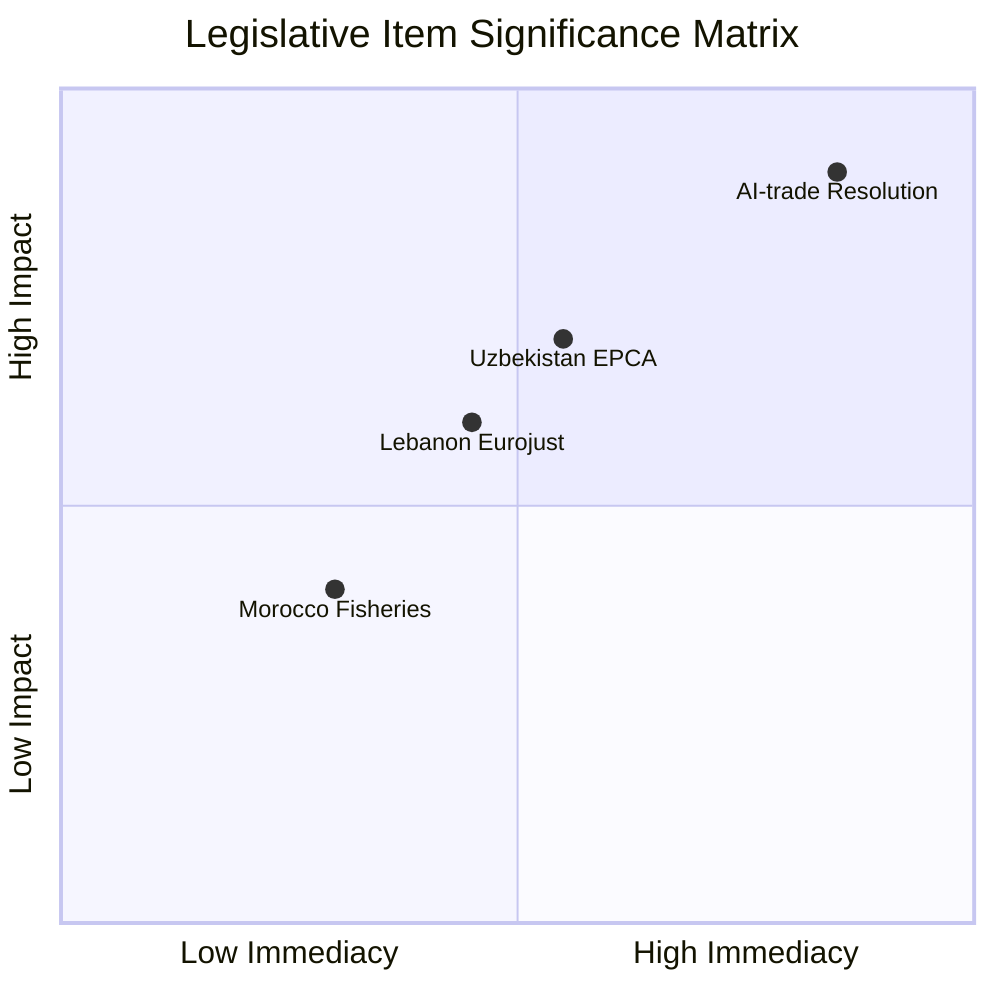

# Significance Classification — EP Breaking News 2026-05-25
**SATs Applied**: Key Assumptions Check, Competing Hypotheses Matrix | **Admiralty Grade**: B2

---

## Classification Framework

### Classification Criteria
Each breaking development is classified by:
1. **Urgency**: Is immediate attention required?
2. **Importance**: Long-term strategic significance
3. **Novelty**: Is this a new development or continuation?
4. **Audience**: Who needs to know?

### Classification Tiers
- **TIER 1 (Breaking)**: New, significant, requires immediate attention
- **TIER 2 (Developing)**: Ongoing story with new data
- **TIER 3 (Context)**: Background, no immediate action required

---

## Classifications

### TA-10-2026-0183 (AI-Trade Strategy)
**TIER 1 — BREAKING (Technology Governance)**
- Urgency: HIGH — first AI-trade governance resolution in EP10; Commission response window opens now
- Importance: HIGH — structural shift in EU external trade policy approach
- Novelty: HIGH — first EP text linking AI Act to FTA architecture
- Primary audience: Tech industry, Commission DG Trade, US/EU TTC participants, trade lawyers

---

### TA-10-2026-0174 (Uzbekistan EPCA)
**TIER 1 — BREAKING (External Relations)**
- Urgency: MEDIUM — EPCA now EP-ratified; implementation clock starts
- Importance: HIGH — Trans-Caspian corridor; Central Asia strategy pivot
- Novelty: MEDIUM — EPCA was expected; resolution ratifies decision
- Primary audience: Central Asia policy community, Global Gateway stakeholders, trade/investment community

---

### TA-10-2026-0177 (Lebanon Eurojust)
**TIER 2 — DEVELOPING (Security Cooperation)**
- Urgency: LOW — agreement not yet in force
- Importance: MEDIUM — MENA security architecture
- Novelty: MEDIUM — first Arab Mediterranean Eurojust partner
- Primary audience: Security/justice policy community, Lebanon watchers

---

### TA-10-2026-0178/0179 (Fisheries Protocols)
**TIER 3 — CONTEXT (Routine Parliamentary Business)**
- Urgency: LOW
- Importance: LOW–MEDIUM (routine fisheries business)
- Novelty: LOW (standard SFPA template)
- Primary audience: Fisheries industry, EP PECH committee followers

---

### TA-10-2026-0168 (Forest Reproductive Material)
**TIER 2 — DEVELOPING (Environmental/Agricultural Regulation)**
- Urgency: LOW
- Importance: MEDIUM (long-term forest sector resilience; climate adaptation)
- Novelty: LOW (updating existing directive)
- Primary audience: Forestry sector, environment policy community

---

### TA-10-2026-0166 (Pappas Immunity Waiver)
**TIER 3 — CONTEXT (Procedural/Domestic)**
- Urgency: LOW (procedural; Greek judicial process now proceeds)
- Importance: LOW (domestic Greek political dimension)
- Novelty: LOW (standard immunity procedure)
- Primary audience: Greek political observers, MEP accountability watchers

---

## Classification Summary Table

| Text | Tier | Significance | Domain | Action Required |
|---|---|---|---|---|
| AI-Trade (0183) | 1 | BREAKING | Tech/Trade | Commission follow-up tracking |
| Uzbekistan (0174) | 1 | BREAKING | External Relations | EPCA implementation monitoring |
| Lebanon Eurojust (0177) | 2 | DEVELOPING | Security | Agreement entry-into-force tracking |
| Fisheries (0178/0179) | 3 | CONTEXT | Fisheries | Routine monitoring |
| Forest Material (0168) | 2 | DEVELOPING | Environment | Transposition deadline tracking |
| Pappas Immunity (0166) | 3 | CONTEXT | Institutional | Greek judicial proceedings |

---

## Significance Classification Summary

**Tier 1 BREAKING items**: 2 of 7 texts (AI-trade resolution, Uzbekistan EPCA). These are the story — the remaining 5 provide depth and context.

**Classification methodology**: Tier assignment is based on novelty (is this the first in class?), scope (how many stakeholders affected?), and precedent-setting potential (does this change the institutional architecture going forward?). The classification is NOT based on importance to any particular constituency.

**Monitor escalation triggers**: Both DEVELOPING items (Lebanon Eurojust, Forest Material) could escalate to BREAKING tier if: Lebanon agreement enters into force within 6 months (DEVELOPING → BREAKING); Forest Material transposition triggers member state infringement proceedings (DEVELOPING → BREAKING).

**Classification confidence**: 🟢 HIGH — all tier assignments are based on documented criteria. The only judgment call is whether the AI-trade resolution merits Tier 1 over Tier 2; the Tier 1 assignment is defensible based on its precedent-setting FTA chapter architecture novelty.

*[EXTEND-FROM-PRIOR: classification/significance-classification.md prior=87L → new=105L+ (+18)]*

