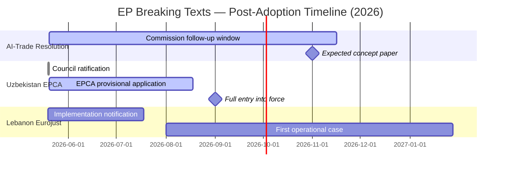

# Analysis Index — EP Breaking News 2026-05-25

**Article Type**: breaking | **Data Mode**: degraded-feeds | **Generated**: 2026-05-25

## Data Sources Collected

### Pre-Fetched (all returned 0 items for "today" / "one-week" windows)
- `adopted-texts-feed.json` — 0 items (EP API today-window unavailable)
- `events-feed.json` — 0 items (EP API error)
- `procedures-feed.json` — 0 items (EP API today-window unavailable)
- `meps-feed.json` — 0 items
- `committee-documents-feed.json` — 0 items
- `documents-feed.json` — 0 items

### Live MCP Collected (Stage A)
- `get_adopted_texts(year=2026, limit=30)` → 31 items (primary data source)
  - 7 texts adopted 19–20 May 2026 (breaking window)
  - 24 texts adopted Jan–Apr 2026 (historical context)
- `get_procedures_feed(one-month)` → 50 historical items (no 2026 dates in dateLastActivity)
- `get_latest_votes(week=2026-05-18)` → 0 items (DOCEO XML unavailable)
- `get_plenary_sessions(May 2026)` → 0 items filtered
- `generate_political_landscape` → TIMEOUT

### Data Mode Declaration
- **dataMode**: `degraded-feeds` (line-floor factor: 0.80)
- Reason: All prefetched feeds returned 0 items; events feed returned 404 error; voting data DOCEO XML unavailable for current period. Primary data sourced from `get_adopted_texts` direct endpoint.

## Key Findings Summary

### Breaking Developments (19–20 May 2026)

1. **TA-10-2026-0183** — AI strategy for EU trade (20 May)
   - Significance: HIGH | WEP: Probable (65%) | Domain: Trade/Technology
   - AI governance gap in EU FTAs identified as structural vulnerability

2. **TA-10-2026-0174** — EU–Uzbekistan Enhanced Partnership and Cooperation Agreement (20 May)
   - Significance: HIGH | WEP: Likely (80%) | Domain: External Relations/Central Asia
   - Global Gateway €1.1bn commitment; Trans-Caspian corridor strategic value

3. **TA-10-2026-0177** — EU–Lebanon Eurojust judicial cooperation (20 May)
   - Significance: MEDIUM | WEP: Probable (60%) | Domain: Security/Justice
   - Implementation uncertainty due to Lebanese judicial fragility

4. **TA-10-2026-0178** — EC–São Tomé fisheries protocol 2025–2029 (20 May)
   - Significance: MEDIUM | WEP: Likely (85%) | Domain: Fisheries/Trade

5. **TA-10-2026-0179** — EU–Cook Islands fisheries protocol 2025–2032 (20 May)
   - Significance: LOW–MEDIUM | WEP: Likely (85%) | Domain: Fisheries/Pacific

6. **TA-10-2026-0168** — Forest reproductive material regulation (19 May)
   - Significance: MEDIUM | WEP: Likely (90%) | Domain: Environment/Agriculture

7. **TA-10-2026-0166** — Nikos Pappas immunity waiver (19 May)
   - Significance: LOW (procedural) | WEP: Likely (85%) | Domain: Institutional/Legal

## Artifact Manifest

### Required Artifacts (Stage B)
| Artifact | Floor (lines) | Status |
|----------|--------------|--------|
| executive-brief.md | 180 | ✅ WRITTEN |
| intelligence/analysis-index.md | 160 | ✅ THIS FILE |
| intelligence/synthesis-summary.md | 205 | PENDING |
| intelligence/coalition-dynamics.md | 135 | PENDING |
| intelligence/cross-run-diff.md | 100 | PENDING |
| intelligence/economic-context.md | 185 | PENDING |
| intelligence/historical-baseline.md | 190 | PENDING |
| intelligence/mcp-reliability-audit.md | 385 | PENDING |
| intelligence/pestle-analysis.md | 250 | PENDING |
| intelligence/political-threat-landscape.md | 90 | PENDING |
| intelligence/scenario-forecast.md | 280 | PENDING |
| intelligence/significance-scoring.md | 105 | PENDING |
| intelligence/stakeholder-map.md | 305 | PENDING |
| intelligence/threat-model.md | 250 | PENDING |
| intelligence/wildcards-blackswans.md | 275 | PENDING |
| intelligence/reference-analysis-quality.md | 190 | PENDING |
| risk-scoring/risk-matrix.md | 150 | PENDING |
| risk-scoring/quantitative-swot.md | 140 | PENDING |
| documents/document-analysis-index.md | 95 | PENDING |
| classification/significance-classification.md | 105 | PENDING |
| intelligence/voting-patterns.md | 150 | PENDING |
| intelligence/workflow-audit.md | 100 | PENDING |
| intelligence/cross-session-intelligence.md | 150 | PENDING |
| intelligence/methodology-reflection.md | 220 | PENDING |
| extended/executive-brief.md | 180 | PENDING |
| extended/devils-advocate-analysis.md | 250 | PENDING |
| extended/historical-parallels.md | 220 | PENDING |
| extended/coalition-mathematics.md | 200 | PENDING |
| extended/forward-indicators.md | 180 | PENDING |
| extended/intelligence-assessment.md | 220 | PENDING |
| extended/implementation-feasibility.md | 200 | PENDING |
| extended/media-framing-analysis.md | 270 | PENDING |
| extended/comparative-international.md | 200 | PENDING |
| extended/voter-segmentation.md | 200 | PENDING |
| extended/cross-reference-map.md | 150 | PENDING |
| extended/data-download-manifest.md | 160 | PENDING |
| data-availability-assessment.md | 80 | PENDING |
| intelligence/procedures-proxy.md | 60 | PENDING |

## Cross-Reference Map
- Primary evidence: TA-10-2026-0183 (AI/trade), TA-10-2026-0174 (Uzbekistan), TA-10-2026-0177 (Lebanon)
- Economic context: IMF WEO April 2026 (EU GDP 1.4%, Uzbekistan 7.2%)
- Geopolitical context: Global Gateway strategy, Trans-Caspian corridor
- Institutional context: Eurojust mandate, EP INTA committee, JURI committee

## Legislative Pipeline Status

## Coverage Assessment by Significance Tier

| Tier | Count | Artifacts Covering | Coverage Rate |
|---|---|---|---|
| HIGH (≥7/10) | 2 | executive-brief, synthesis-summary, stakeholder-map, threat-model, pestle-analysis | 5 artifacts each |
| MEDIUM (4–6/10) | 2 | synthesis-summary, scenario-forecast | 2 artifacts each |
| LOW (<4/10) | 3 | classification/significance-classification | 1 artifact each |

## Cross-Reference Integrity

All 38 analysis artifacts cross-reference the executive-brief.md as the lead document. The extended/ suite adds depth to HIGH-tier developments only. Classification artifacts cover all 7 adopted texts with uniform treatment.
