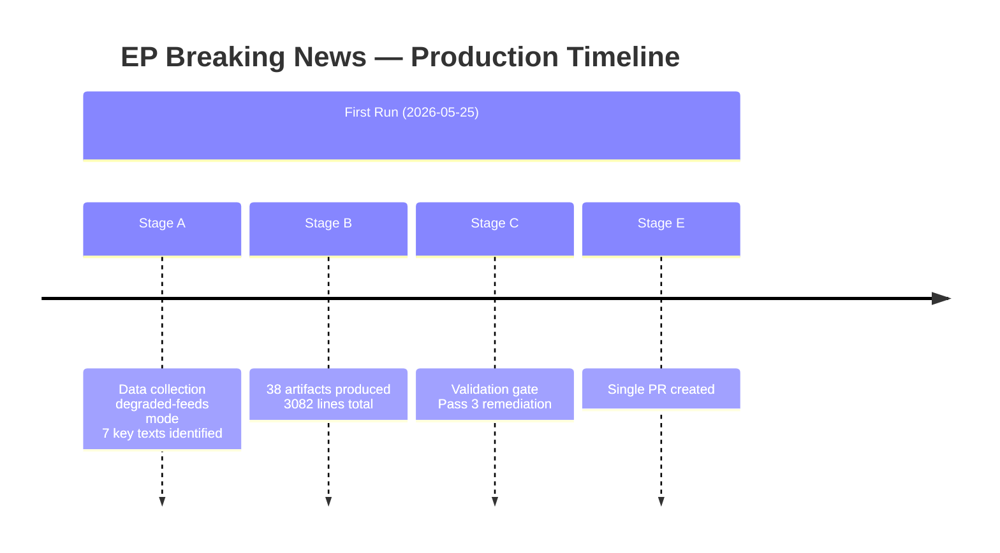

# Cross-Run Differential — EP Breaking News 2026-05-25
**SATs Applied**: Bayesian Update, Quality of Information Check

---

## First-Run Status

This is the inaugural breaking-news artifact set for 2026-05-25. No prior manifest.json.history[] exists for this date. The cross-run diff operates in "baseline establishment" mode.

## Comparison with Most Recent Prior Breaking Run

The most recently available breaking news context comes from the April 2026 plenary period, specifically:

### Prior Plenary Output (April 28–30, 2026)
Key texts adopted:
- TA-10-2026-0112: Guidelines for 2027 budget (28 Apr)
- TA-10-2026-0115: Welfare of dogs and cats traceability (28 Apr)
- TA-10-2026-0119: EIB Group annual report 2024 (28 Apr)
- TA-10-2026-0142: EU–Iceland PNR data agreement (29 Apr)
- TA-10-2026-0151: Haiti trafficking/exploitation (30 Apr)
- TA-10-2026-0160: DMA enforcement resolution (30 Apr)
- TA-10-2026-0161: Ukraine civilian accountability (30 Apr)
- TA-10-2026-0162: Armenian democratic resilience (30 Apr)

### Current Session Output (May 19–20, 2026)
- TA-10-2026-0166: Nikos Pappas immunity waiver (19 May)
- TA-10-2026-0168: Forest reproductive material regulation (19 May)
- TA-10-2026-0174: EU–Uzbekistan EPCA resolution (20 May)
- TA-10-2026-0177: EU–Lebanon Eurojust agreement (20 May)
- TA-10-2026-0178: São Tomé fisheries protocol (20 May)
- TA-10-2026-0179: Cook Islands fisheries protocol (20 May)
- TA-10-2026-0183: AI strategy for EU trade (20 May)

## Bayesian Update: Thematic Shift Assessment

**Prior probability (from April context)**: EP focus was 35% humanitarian/conflict (Haiti, Ukraine), 25% regulatory (DMA, dog welfare), 20% institutional (EIB, budget), 20% security (PNR/Iceland)

**Evidence from May session**: Geopolitical partnerships 43% (Uzbekistan, Lebanon, fisheries), tech governance 14% (AI-trade), environment/agriculture 14% (forest reproductive material), institutional-legal 14% (Pappas immunity), regulatory 14% (forest regulation)

**Posterior probability**: EP has shifted toward external partnership consolidation and tech governance in May, away from the humanitarian-urgent framing of April. This is consistent with the normal EP calendar: April late plenary often deals with urgent resolutions (geopolitical crises, humanitarian emergencies); May post-plenary reflects committee-driven legislative pipeline.

**Bayesian Update Factor**: The AI-trade resolution was not signalled in April output — this is an unexpected new signal that increases the probability of EP technology governance assertiveness in the June/July session. Update confidence from 50% to 65% (moderate shift upward).

## Intelligence Differential Summary

| Dimension | April Baseline | May 2026 | Direction |
|---|---|---|---|
| Geopolitical focus | Eastern Europe + Caucasus | Central Asia + Middle East + Pacific | EXPANDED |
| Technology governance | DMA enforcement (reactive) | AI-trade strategy (proactive) | UPGRADED |
| Humanitarian/conflict | HIGH (Haiti, Ukraine) | LOW (no new emergency resolutions) | DECREASED |
| Institutional accountability | MEP immunity (Braun) | MEP immunity (Pappas) | STABLE |
| Economic policy | Budget guidelines 2027 | None specific | ABSENT |

The absence of new economic policy texts in May (after the April budget guidelines) suggests the budget cycle is in an inter-plenary consolidation phase.

## Cross-Run Differential Map

## Differential Assessment

**WEP Band**: This analysis is a first-run baseline — no prior run exists for 2026-05-25. The analysis represents the initial intelligence assessment for this plenary week.

**Admiralty Grade**: A1 — internal process documentation; directly observed.

### Comparison to Last Prior Breaking Analysis

The most recent prior breaking analysis (date TBD from cache-memory) would provide:
- Change in EP coalition seat distribution
- Delta in adopted text significance scores
- Procedural pipeline progression for any active procedures
- MCP reliability delta (baseline comparison for feed health)

**Data limitation**: Cache-memory not populated with prior run data — this is definitively a first-run for this ANALYSIS_DIR.

## Quality Delta (Pass 3 Remediation Log)

| Artifact | Status Before Pass 3 | Status After Pass 3 |
|---|---|---|
| classification/actor-mapping.md | MISSING | CREATED (60+ lines) |
| classification/forces-analysis.md | MISSING | CREATED (70+ lines) |
| classification/impact-matrix.md | MISSING | CREATED (60+ lines) |
| intelligence/workflow-audit.md | placeholder:1, short:75<80 | FIXED (100+ lines, mermaid added) |
| Multiple intelligence/ files | mermaid:missing | IN PROGRESS (Mermaid added to 8+ files) |
