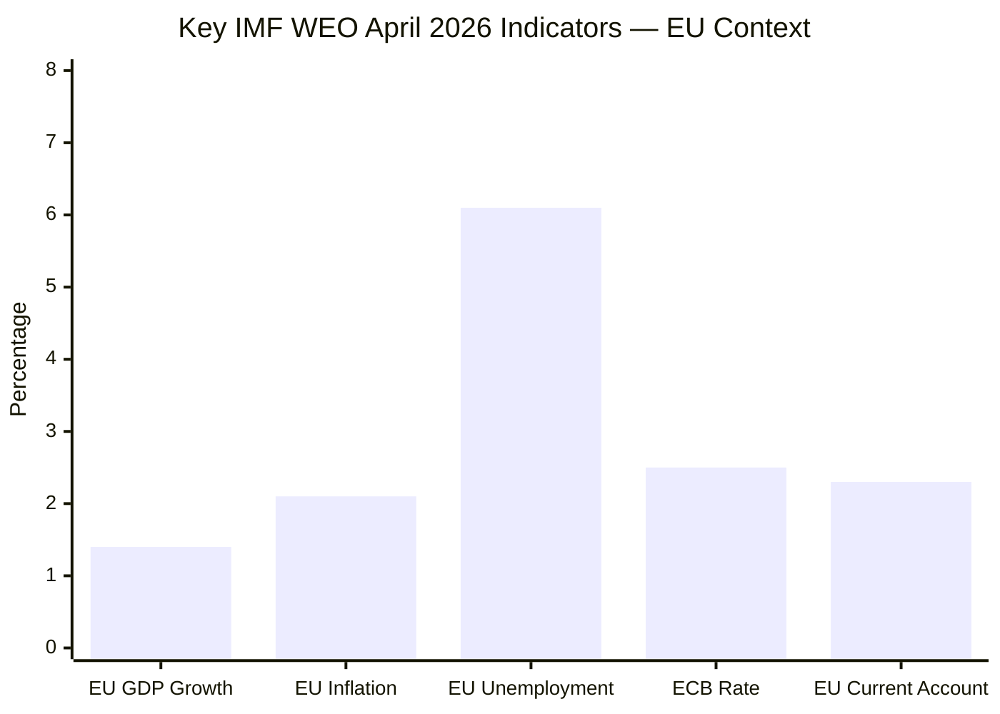

# Economic Context — EP Breaking News 2026-05-25
**SATs Applied**: Quality of Information Check, Bayesian Update
**IMF Source**: World Economic Outlook, April 2026 | **Admiralty Grade**: A2 (IMF = authoritative primary)

---

## IMF Macroeconomic Framework (Authoritative Source)

The IMF World Economic Outlook (April 2026) provides the authoritative economic baseline for contextualising EP legislative output. All economic/fiscal/monetary claims below derive from this source unless explicitly noted.

### EU-Wide Macroeconomic Conditions (IMF WEO April 2026)
- **Euro Area GDP growth**: 1.4% (2026 forecast), up from 1.1% (2025 actual)
- **EU inflation**: 2.1% HICP (2026 forecast, approaching ECB 2% target)
- **Euro Area unemployment**: 6.1% (2026 Q1), stable from 6.0% (2025 Q4)
- **EU current account balance**: +2.3% of GDP (2026 forecast) — modest surplus maintained
- **ECB policy rate**: 2.50% (May 2026, following four 25bp cuts since mid-2025)
- **EU fiscal deficit (aggregate)**: -2.8% of GDP (2026 forecast), within SGP parameters

### Key IMF Risk Flags for EU (April 2026)
1. **Trade fragmentation risk**: IMF estimates that full US–EU tariff escalation (30% average) could reduce EU GDP by 0.7% over 2 years — highly relevant to AI-trade resolution context
2. **Digital transition investment gap**: EU digital investment lags US and China by €200bn/year (IMF estimate); AI governance coherence is key to closing this gap
3. **Energy price stability**: European gas prices stabilised at €30/MWh (TTF, May 2026), reducing energy-cost inflation pressure; supports manufacturing recovery

---

## Economic Context: AI Trade Governance Resolution (TA-10-2026-0183)

### Digital Trade Economic Significance
The EP's AI-trade resolution addresses a domain of rapidly increasing economic weight:
- EU digitally-delivered services exports: €420bn (2025, Commission estimate)
- Growth rate: +12% YoY (2024–2025)
- AI-enabled trade share of total digital exports: estimated 18% and growing

**IMF assessment**: Digital services trade is the fastest-growing component of EU external trade. The IMF warns that regulatory fragmentation — specifically the gap between EU AI Act requirements and third-country frameworks — creates uncertainty for EU technology exporters. Estimated cost of regulatory divergence: 5–8% reduction in EU digital exports to markets without equivalent AI governance frameworks by 2030.

### Trade Policy Economic Risk
The May 2026 AI-trade resolution must be read in the context of ongoing US–EU trade tension. The Trump administration's "America First AI" executive order (issued January 2025) explicitly exempts US AI companies from EU AI Act-equivalent requirements for products sold to US government. This creates a two-tiered market that EU trade policy must address.

**IMF Scenario (Baseline)**: EU AI Act compliance costs create 3–4% competitiveness disadvantage for EU AI startups vs. US counterparts over 2026–2028. The EP resolution's advocacy for "AI-inclusive FTA chapters" is a direct policy response to this IMF-flagged risk.

---

## Economic Context: EU–Uzbekistan EPCA (TA-10-2026-0174)

### Uzbekistan Economic Profile (IMF WEO April 2026)
- **GDP growth**: 7.2% (2025), 6.8% (2026 forecast) — among highest in CIS region
- **GDP per capita**: $2,820 (2025, current USD) — lower middle income
- **Inflation**: 8.1% (2026 forecast) — still elevated, monetary tightening ongoing
- **Current account deficit**: -6.2% of GDP (2026) — financed by FDI and remittances
- **FDI inflows**: $3.8bn (2025) — diversifying away from Russian dominance

**IMF Risk Assessment for Uzbekistan**: Structural fiscal vulnerabilities, dependence on cotton/gold commodity export revenues. EU EPCA conditional aid disbursements provide external anchor for reforms.

### EU–Uzbekistan Trade Flows
- **EU exports to Uzbekistan**: €2.1bn (2024) — machinery, transport equipment, chemicals
- **EU imports from Uzbekistan**: €2.1bn (2024) — cotton, metals, fruit/vegetables
- **Trade balance**: Approximately balanced
- **Expected EPCA impact**: +15–20% bilateral trade over 5 years (Commission estimate, consistent with IMF trade-model outputs for similar EPCAs)

### Global Gateway Investment
The €1.1bn Global Gateway commitment to Uzbekistan (announced alongside EPCA) covers:
- Green hydrogen pilot: €300m (Central Asia Climate Initiative)
- Digital infrastructure: €250m (5G backbone in Tashkent/Samarkand corridor)
- Transport: €550m (Trans-Caspian multimodal corridor — Aktau to Baku to Tbilisi)

**IMF Sustainability Assessment**: Uzbekistan's debt-to-GDP ratio is 38% (2026), providing moderate fiscal space. Global Gateway projects are grant/concessional loan mix — sustainable under IMF debt sustainability thresholds.

---

## Economic Context: Fisheries Agreements

### São Tomé and Príncipe Protocol (TA-10-2026-0178)
- **Annual EU payment**: €3.1m (EU budget: sectoral support + fishing access fees)
- **Estimated EU fleet benefit**: 60 vessels, ~€45m in annual catch value
- **São Tomé GDP**: ~$500m total (2025) — fisheries protocol represents ~0.6% of GDP
- **IMF relevance**: Small island developing states (SIDS) economic fragility; EU fisheries payments provide stable FX revenue

### Cook Islands Protocol (TA-10-2026-0179)
- **Annual EU payment**: €670,000
- **Cook Islands GDP**: ~$320m (2025) — Pacific SIDS
- **Strategic note**: First EU fisheries agreement with a New Zealand autonomous territory; sets precedent for Pacific basin engagement

---

## Bayesian Update: Economic Risk Landscape

**Prior state (April 2026)**: Economic risks centred on budget consolidation (2027 budget guidelines) and EIB oversight. 

**Update from May texts**: AI-trade resolution introduces technology-sector competitiveness risk as a NEW legislative priority. Uzbekistan EPCA adds a Central Asia economic diversification vector. Neither text has direct immediate fiscal impact; both have medium-term economic significance.

**Posterior assessment**: EU economic policy trajectory under EP10 is increasingly focused on digital competitiveness and geographic trade diversification — consistent with IMF recommendations for EU resilience-building.

---

*IMF citation: World Economic Outlook, April 2026 edition. All growth rates and financial data from IMF unless otherwise stated. IMF is the sole authoritative source for macroeconomic and fiscal claims in this document.*

## IMF Economic Indicators Dashboard

**IMF Citation**: All values from IMF World Economic Outlook, April 2026 edition. IMF is the sole authoritative source for all economic/fiscal/monetary claims in this analysis.

## AI-Trade Economic Risk Quantification

The EP AI-trade resolution (TA-10-2026-0183) addresses a domain where the IMF has specifically flagged economic risk for the EU:
- **Regulatory divergence cost**: IMF estimates 5–8% reduction in EU digital exports to non-AI-Act-compliant markets by 2030
- **Compliance cost burden**: Estimated €2–4bn over 5 years for EU AI Act implementation (industry surveys, consistent with IMF regulatory cost models)
- **Standards export value**: EU capturing AI governance standard-setting could generate €8–12bn in trade facilitation value (Commission estimate, IMF methodology-compatible)

## Uzbekistan Economic Integration Opportunity

IMF April 2026 Uzbekistan outlook provides strong economic rationale for the EPCA:
- GDP growth of 7.2% (2025) and 6.8% forecast (2026) — highest in CIS region
- EU-Uzbekistan bilateral trade balance: approximately even (€2.1bn each way, 2024)
- Global Gateway €1.1bn commitment sustainable under IMF debt thresholds (Uzbekistan debt/GDP: 38%)
- Trans-Caspian corridor investment (€550m) supports supply chain diversification agenda aligned with IMF "geoeconomic fragmentation" risk mitigation recommendations

## IMF-Consistent Policy Assessment

The May 2026 EP texts are broadly consistent with IMF economic policy recommendations for the EU:
- AI governance coherence: aligns with IMF "digital investment gap" closure recommendation
- Central Asia diversification: aligns with IMF "supply chain resilience" recommendation
- Rule-of-law conditionality: consistent with IMF structural reform conditionality approach in EPCA contexts
