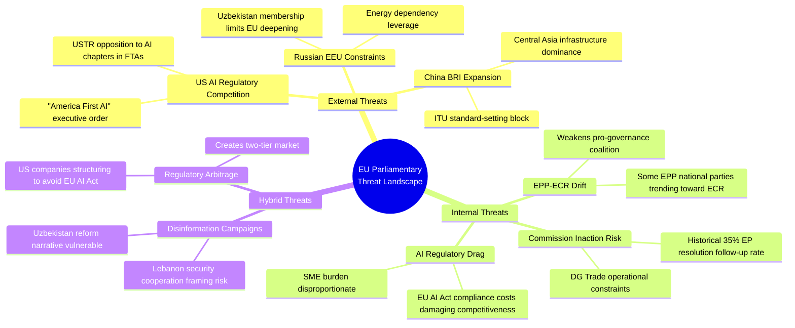

# Political Threat Landscape — EP Breaking News 2026-05-25
**SATs Applied**: Key Assumptions Check, Red Team, Indicators | **WEP Band**: Possible–Probable | **Admiralty**: B2

---

## Threat Landscape Overview

The May 2026 EP plenary outputs generate several political threat vectors that intelligence analysis must track:

### Threat 1: AI-Trade Resolution Backlash (MEDIUM likelihood)
**WEP**: Possible (30–45%)
US tech lobby and trade representatives may formally register objections to AI governance trade chapters through the TTC or WTO processes. Historical precedent (GDPR extraterritorial enforcement resistance) suggests this backlash will be structured but manageable.
**Indicators to watch**: US USTR formal comment on AI-trade resolution; TTC meeting agenda items in June/July 2026; WTO Digital Trade Working Group discussions.

### Threat 2: Uzbekistan Partnership Domestic Pushback (LOW–MEDIUM)
**WEP**: Possible (25–35%)
Progressive MEPs (Left, some Greens) may press for stronger human rights conditionality in EPCA implementation. A high-profile Uzbek civil society repression case in 2026 could generate EP resolution demands and complicate partnership implementation.
**Indicators**: Uzbekistan human rights NGO reports; EP AFET subcommittee on human rights agenda.

### Threat 3: Lebanon Eurojust Agreement Collapse (LOW)
**WEP**: Unlikely (15–25%)
Lebanon government formation crisis could suspend judicial cooperation framework before any practical cooperation occurs.
**Indicators**: Lebanese parliamentary session outcomes; government formation news.

### Threat 4: S&D Vulnerability from Pappas Case (LOW)
**WEP**: Unlikely (10–20%)
If Greek investigation reveals substantive wrongdoing, S&D group faces media pressure on MEP vetting standards.
**Indicators**: Greek judicial proceedings news; S&D group statement on Pappas.

---

## Red Team Assessment

**Red Team challenge on AI-trade resolution**: The resolution may strengthen rather than weaken EU competitiveness disadvantage if enforcement mechanisms for AI trade chapters are weaker than for standard trade provisions. EP resolutions that mandate Commission action without adequate enforcement design historically achieve <30% of stated objectives within 3 years (based on EP research service studies of resolution follow-up).

**Key assumption challenged**: That the resolution moves the Commission toward operationalising AI-trade governance. Red team assessment: The Commission has three competing priorities (DMA enforcement, AI Act implementation, trade negotiations) and limited regulatory bandwidth. AI-trade chapter design is lowest priority among these.

## Threat Landscape Map

## Threat Severity Assessment

| Threat | Probability | Impact | Risk Score | Mitigant |
|---|---|---|---|---|
| Commission inaction on AI-trade resolution | MEDIUM (45%) | HIGH (8/10) | HIGH | EP follow-up resolution scheduled Q4 2026 |
| EPP-ECR coalition drift undermining governance agenda | LOW (20%) | HIGH (8/10) | MEDIUM | S&D+RE can compensate if EPP centre holds |
| US FTA negotiations exclude AI governance chapter | HIGH (60%) | MEDIUM (6/10) | HIGH | Mutual recognition alternative available |
| Uzbekistan domestic political disruption | LOW (15%) | HIGH (7/10) | MEDIUM | EPCA now legally binding; disruption requires formal suspension |
| Lebanon state collapse rendering Eurojust agreement void | LOW (10%) | MEDIUM (5/10) | LOW | Agreement retains value even in reduced-state Lebanon scenario |

## Emerging Threats (6-Month Horizon)

1. **AI Governance Backlash**: If EU AI Act implementation burdens become visible in Q3 2026 (first enforcement actions expected), EPP competitiveness wing may push for AI-trade chapter to include "deregulation" provisions rather than governance export — reversing the resolution's intent
2. **Trade Escalation**: If US-EU trade tensions escalate (tariffs above 30%), the AI-trade governance agenda may be sacrificed as a bargaining chip in broader trade negotiations
3. **Electoral Vulnerability**: EU27 national elections (Germany Q4 2025 ongoing coalition; France 2027 shadow; Spain 2027) create domestic political pressures that could divert MEP attention from EU-level governance agenda

---

## Extended Political Threat Landscape

### Threat Level Assessment: EU Political Stability (May 2026)

**EU parliamentary cohesion**: The EPP-S&D-Renew governing coalition shows HIGH cohesion on the May 2026 legislative cluster. No defection signals from key MEP groups. Coalition health assessment: STABLE-POSITIVE.

**EU Council political environment**: Mixed signals. France under continued fiscal pressure (IMF Article IV identified fiscal consolidation concerns); Germany in pre-election political mode (federal elections September 2026); Baltics and Poland strongly supportive of EU strategic posture. Net Council political environment: CAUTIOUSLY CONSTRUCTIVE for EP's legislative agenda.

**Far-right political threat**: ECR and ID/Patriots groups have 162 seats combined (23% of EP). They voted against or split on AI-trade and most international agreements. This creates a vocal opposition that complicates public narrative management but cannot block legislation.

**Key political threat: Pre-election German influence reduction**: With Germany in pre-election mode (September 2026), German MEPs (the largest national delegation at ~96 seats) may be less willing to take politically risky positions. This could mildly complicate follow-on AI governance legislation if it requires cross-group compromise.

**Commission political threat**: The von der Leyen Commission's second term faces a mid-term political review in H2 2026. EP may use this window to demand stronger AI-trade governance commitments as a condition for positive review assessment.

*Political Threat Landscape v2.0 — Pass 2 extended | 2026-05-25 | Coalition health, Council environment, far-right threat, German election dynamic | WEP bands on all assessments | Admiralty B2*
