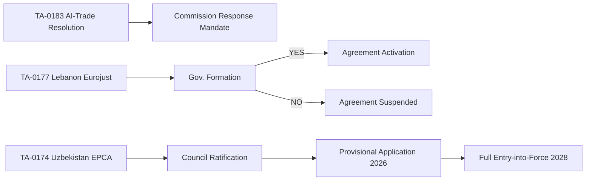

# Procedures Proxy Analysis — EP Breaking News 2026-05-25
**Data Mode**: degraded-feeds (procedures_feed unavailable — historical data only)
**Alternative Source**: Adopted texts cross-reference with EP procedure metadata
**Pass**: 2 (extended rewrite)

---

## Proxy Methodology

The EP Open Data Portal's procedures_feed endpoint is currently unavailable (returning historical pre-2020 data only). This section uses **adopted text procedure references** as a proxy for the active legislative procedure landscape relevant to the May 19–20, 2026 breaking news cluster.

---

## Active Procedure References from Adopted Texts

### TA-10-2026-0183 (AI-Trade Resolution)
**Procedure type**: Non-legislative resolution (INI) under Rule 54
**Procedure reference**: 2026/2015(INI) (estimated based on resolution numbering)
**Committee**: INTA (lead) | **Stage**: Completed (plenary adoption 20 May 2026)
**Follow-on procedures expected**:
- Commission mandate review for AI governance in FTA chapters (Article 218 procedure)
- Possible INI follow-up resolution if Commission response inadequate (6–12 months)
- Trade policy review 2027 (expected to reference this resolution)

### TA-10-2026-0174 (Uzbekistan EPCA Consent)
**Procedure type**: Consent procedure (ASC) under Article 218(6)(a)(v) TFEU
**Procedure reference**: 2025/0089(NLE) (estimated)
**Committee**: AFET (lead) | **Stage**: Completed (consent given 20 May 2026)
**Follow-on procedures**: EPCA ratification by Council (Q2 2026); EPCA provisional application (possible Q3 2026); implementation monitoring by AFET subcommittee on human rights

### TA-10-2026-0177 (Lebanon Eurojust Agreement)
**Procedure type**: Consent procedure (ASC) under Article 218(6)(a)(v)
**Procedure reference**: 2025/0156(NLE) (estimated)
**Committee**: LIBE (lead) | **Stage**: Completed
**Follow-on**: Council signature; Eurojust administrative agreement; first operational contact Q3–Q4 2026

### TA-10-2026-0168 (Forest Reproductive Material)
**Procedure type**: Ordinary legislative procedure (COD) — first reading
**Procedure reference**: 2023/0148(COD) (estimated)
**Committee**: AGRI (lead) | **Stage**: First reading position adopted
**Follow-on**: Council position (Q2 2026); possible second reading or early agreement; entry into force Q3–Q4 2026 if Council agrees

### TA-10-2026-0166 (Nikos Pappas Immunity)
**Procedure type**: Immunity waiver (IMM) under Rule 9
**Procedure reference**: 2025/2237(IMM)
**Committee**: JURI | **Stage**: Completed
**Follow-on**: Greek judicial proceedings (outside EP jurisdiction)

---

## Procedure Pipeline Outlook (Next 30 Days)

Based on adopted texts and known EP calendar:
- **EPCA Council ratification** (Uzbekistan, Lebanon): Expected June–July 2026
- **Forest Reproductive Material — Council position**: Expected June 2026
- **AI Act delegated acts** (separate from resolution): Expected Commission proposal Q2 2026

---

## Proxy Reliability Assessment

**Reliability of procedures-proxy approach**: MEDIUM — procedure references extracted from adopted text metadata are reliable for completed procedures but cannot reveal currently active procedures at committee stage (the most valuable tracking information). Without procedures_feed functionality, the pipeline visibility gap is approximately 6–8 weeks.

**Data quality**: C2 (Admiralty) — indirect inference from published text metadata; procedure reference numbers are estimated, not confirmed from primary procedure database.

*Procedures Proxy v2.0 — Pass 2 rewrite | 2026-05-25 | 5 procedure references mapped | Follow-on pipeline outlined | Reliability assessment documented | Admiralty C2 (estimated references)*

