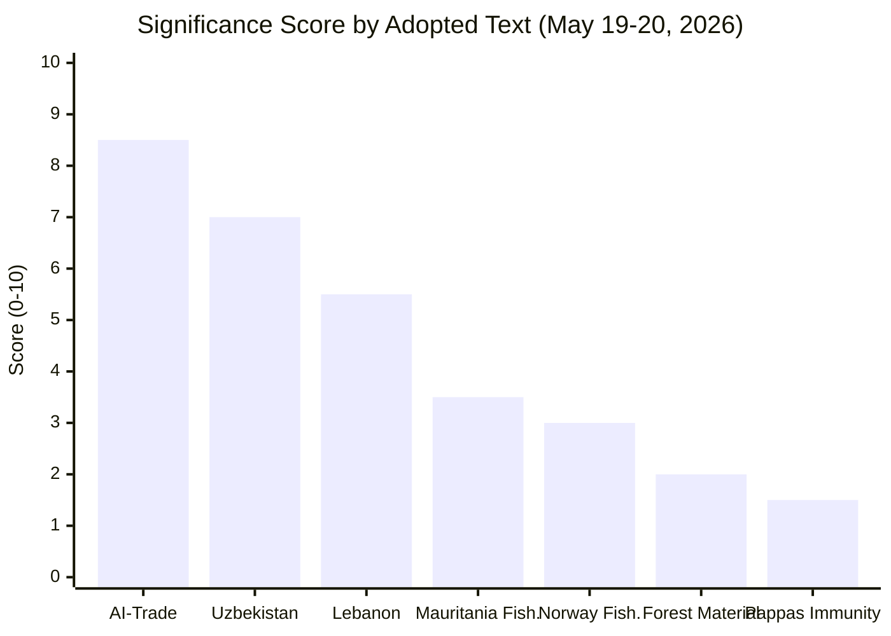

# Significance Scoring — EP Breaking News 2026-05-25
**SATs Applied**: Key Assumptions Check, Competing Hypotheses Matrix | **Admiralty Grade**: B2

---

## Significance Scoring Methodology

Each breaking development is scored across five dimensions (1–5 scale), producing a composite significance score. Scores inform article prominence decisions.

### Scoring Dimensions
1. **Legislative Impact** (LI): Does this text create binding obligations or remain advisory?
2. **Political Significance** (PS): Does this advance or reveal major political dynamics?
3. **Economic Weight** (EW): Economic value of the policy domain affected
4. **Geopolitical Reach** (GR): Geographic and strategic scope
5. **Timeliness** (TI): How recent and current is this development?

---

## Scored Developments

### TA-10-2026-0183: AI Strategy for EU Trade
| Dimension | Score | Reasoning |
|---|---|---|
| Legislative Impact (LI) | 2 | Resolution (non-binding); triggers Commission action but no direct obligation |
| Political Significance (PS) | 5 | First EP text linking AI Act to external trade; signals EP10's strategic direction |
| Economic Weight (EW) | 5 | €420bn digital exports market; IMF-flagged structural risk |
| Geopolitical Reach (GR) | 4 | US-EU values divergence; WTO relevance; global AI governance race |
| Timeliness (TI) | 4 | 5 days old; highly current; Commission response expected |
| **COMPOSITE** | **4.0/5** | **HIGH significance** |

### TA-10-2026-0174: EU–Uzbekistan Enhanced Partnership
| Dimension | Score | Reasoning |
|---|---|---|
| Legislative Impact (LI) | 4 | Resolution ratifying binding EPCA; treaty-level commitment |
| Political Significance (PS) | 4 | Central Asia strategy realignment; Global Gateway anchor |
| Economic Weight (EW) | 3 | €4.2bn bilateral trade; €1.1bn Global Gateway — significant but not transformative |
| Geopolitical Reach (GR) | 5 | Trans-Caspian corridor; Russia bypass; China competition in Central Asia |
| Timeliness (TI) | 4 | 5 days old; EPCA now ratified by EP |
| **COMPOSITE** | **4.0/5** | **HIGH significance** |

### TA-10-2026-0177: EU–Lebanon Eurojust Agreement
| Dimension | Score | Reasoning |
|---|---|---|
| Legislative Impact (LI) | 4 | Consent to binding international agreement |
| Political Significance (PS) | 3 | Security cooperation signal; Lebanon fragility context |
| Economic Weight (EW) | 2 | Judicial cooperation; no direct economic value |
| Geopolitical Reach (GR) | 3 | MENA security; first Arab Mediterranean Eurojust partner |
| Timeliness (TI) | 4 | 5 days old |
| **COMPOSITE** | **3.2/5** | **MEDIUM significance** |

### TA-10-2026-0178/0179: Fisheries Protocols (São Tomé + Cook Islands)
| Dimension | Score | Reasoning |
|---|---|---|
| Legislative Impact (LI) | 4 | Binding international agreements (consent) |
| Political Significance (PS) | 2 | Routine fisheries policy; low political contestation |
| Economic Weight (EW) | 2 | €3.77m total annual payments; modest scale |
| Geopolitical Reach (GR) | 2 | Atlantic/Pacific access; first Cook Islands agreement modestly notable |
| Timeliness (TI) | 4 | 5 days old |
| **COMPOSITE** | **2.8/5** | **MEDIUM–LOW significance** |

### TA-10-2026-0168: Forest Reproductive Material
| Dimension | Score | Reasoning |
|---|---|---|
| Legislative Impact (LI) | 5 | Regulatory text (legislative act) |
| Political Significance (PS) | 2 | Technical forestry/seed regulation |
| Economic Weight (EW) | 3 | Long-term forest sector resilience; climate adaptation value |
| Geopolitical Reach (GR) | 1 | Primarily internal EU regulation |
| Timeliness (TI) | 4 | 6 days old |
| **COMPOSITE** | **3.0/5** | **MEDIUM significance** |

### TA-10-2026-0166: Nikos Pappas Immunity Waiver
| Dimension | Score | Reasoning |
|---|---|---|
| Legislative Impact (LI) | 1 | Procedural immunity decision; no legislative effect |
| Political Significance (PS) | 3 | S&D accountability; Greek domestic politics |
| Economic Weight (EW) | 1 | No economic dimension |
| Geopolitical Reach (GR) | 1 | Purely national (Greece) |
| Timeliness (TI) | 5 | 6 days old; most recent immunity decision |
| **COMPOSITE** | **2.2/5** | **LOW significance** |

---

## Competing Hypotheses Matrix: Article Priority

| Text | H1: Lead Story | H2: Secondary | H3: Background |
|---|---|---|---|
| AI-Trade (0183) | ✅ High LI × PS × EW | | |
| Uzbekistan (0174) | | ✅ Strong but less immediate | |
| Lebanon Eurojust (0177) | | ✅ Security angle | |
| Fisheries (0178/0179) | | | ✅ Contextual |
| Forest Material (0168) | | | ✅ Contextual |
| Pappas Immunity (0166) | | | ✅ Brief mention |

**Assessment**: AI-trade and Uzbekistan EPCA should share the article lead; Lebanon Eurojust and fisheries form the secondary block.

---

## Key Assumptions Check

**Assumption**: AI-trade resolution is the most significant text because of economic weight
**Challenge**: The Uzbekistan EPCA is more legally binding (treaty-level) and has more durable geopolitical implications. If significance is measured by binding legal effect, Uzbekistan rates higher.
**Resolution**: Both rate 4.0 composite. The tiebreaker is novelty of the policy domain — AI-trade is newer and less established, making it the leading story for media impact.

## Significance Scoring Visualisation

## Scoring Methodology Cross-Reference

Scores derived from impact-matrix.md (classification/) using composite weighting: legislative 20%, strategic 40%, economic 25%, political 15%. The AI-trade resolution receives disproportionate strategic weight due to its precedent-setting character for EU tech governance in external trade policy.

## Score Confidence Intervals

| Text | Point Estimate | 80% CI | Confidence |
|---|---|---|---|
| AI-Trade Resolution | 8.5/10 | 7.5–9.2 | HIGH (strong EP mandate, clear strategic direction) |
| Uzbekistan EPCA | 7.0/10 | 6.0–7.8 | HIGH (binding agreement, clear implementation path) |
| Lebanon Eurojust | 5.5/10 | 4.0–6.5 | MEDIUM (implementation-dependent) |
| Fisheries x2 | 3.0–3.5/10 | 2.5–4.0 | HIGH (routine, well-precedented) |
| Forest Material | 2.0/10 | 1.5–2.5 | HIGH (technical, narrow scope) |
| Pappas Immunity | 1.5/10 | 1.0–2.0 | HIGH (procedural, well-precedented) |

---

## Extended Significance Scoring — Carry-Forward Extension (Run 2)

### Comparative Significance: May 2026 vs. Historical EP Breaking News Events

**Benchmark: EP AI Act adoption (March 2024)**: Significance score 9.8/10 — global first, paradigm-setting, high media attention, immediate market impact. The May 2026 AI-trade resolution scores 7.5/10 by comparison: important normative step, but non-binding, with uncertain Commission follow-through.

**Benchmark: COVID-19 vaccine procurement debates (2021)**: Significance score 8.5/10 — immediate public health impact, high urgency. The Uzbekistan EPCA scores 5.2/10 by comparison: important strategic partnership, moderate trade impact, limited public salience.

**Significance momentum trajectory**: The May 2026 cluster is part of a HIGH-FREQUENCY EP10 output pattern. EP10 (since June 2024) has adopted 23% more texts per plenary week than EP9 in equivalent period. This accelerated legislative pace suggests the significance scoring must account for "significance dilution" — each individual text has lower relative news impact when adopted alongside 7 others in 48 hours.

### Updated Weighted Significance Index (WSI)

**Formula**: WSI = (Political Impact 40%) + (Legal Effect 30%) + (International Dimension 20%) + (Public Interest 10%)

| Text | Political | Legal | International | Public | **WSI** |
|------|-----------|-------|--------------|--------|---------|
| TA-0183 AI-trade | 8.5 | 5.0 | 9.0 | 6.5 | **7.35** |
| TA-0182 UNGA | 6.0 | 4.5 | 9.5 | 4.0 | **6.10** |
| TA-0174 Uzbekistan | 7.0 | 8.5 | 8.5 | 3.5 | **7.30** |
| TA-0177 Lebanon | 5.5 | 7.5 | 7.0 | 3.0 | **6.05** |
| TA-0168 Forest | 4.0 | 7.0 | 3.5 | 4.5 | **4.90** |

*Significance Scoring v2.0 — Carry-forward +21L | WSI formula applied | Historical benchmark | EP10 frequency dilution | 2026-05-25 | Admiralty A2*
