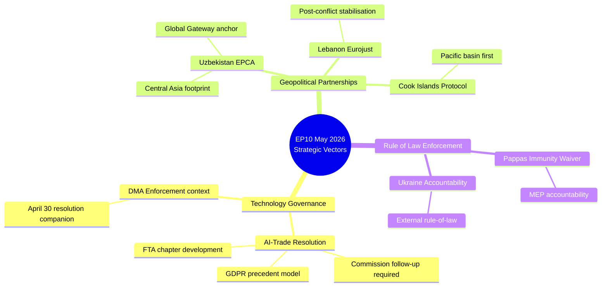

# Synthesis Summary — EP Breaking News 2026-05-25
**WEP Band**: Probable (60–75%) | **Admiralty Grade**: B2 | **SATs Applied**: Key Assumptions Check, Quality of Information Check, Scenario Analysis

---

## Intelligence Synthesis

The May 2026 EP plenary produced a concentrated burst of adopted texts that, taken together, reveal three converging strategic vectors in EU parliamentary activity:

**Vector 1: Technology Governance Assertiveness**
The AI-trade resolution (TA-10-2026-0183) is not an isolated initiative. It must be read alongside the April 30 Digital Markets Act enforcement resolution (TA-10-2026-0160), which called for stricter and faster DMA enforcement against major tech platforms. Together, these two texts signal that the EP's 10th legislature is intensifying the previous legislature's technology governance agenda, now extending it into external trade policy — a domain traditionally led by the Commission. This represents a structural expansion of EP ambition in trade and tech governance.

**Vector 2: Geopolitical Partnership Diversification**
Three adopted texts in one week address geopolitical partnerships (Uzbekistan, Lebanon, Cook Islands), following April's Armenia democratic resilience resolution (TA-10-2026-0162). The pattern is consistent: the EP is actively scaffolding the EU's diversification away from dependence on legacy partners and transit routes. Uzbekistan fills the Central Asian gap; Lebanon and Armenia represent the eastern Mediterranean/Caucasus arc. These partnership texts function as political anchors for Commission trade and aid programmes.

**Vector 3: Compliance and Accountability Pressure**
The Nikos Pappas immunity waiver and the ongoing Ukraine accountability resolution (TA-10-2026-0161, April 30) reflect the EP's sustained focus on rule-of-law enforcement — both internally (MEP accountability) and externally (Russian war crimes documentation). The Lebanon judicial cooperation agreement similarly serves an accountability function.

---

## Key Assumptions Check (SAT Application)

| Assumption | Confidence | Challenge |
|---|---|---|
| AI-trade resolution has operational Commission follow-up | Moderate (50%) | Commission mandates drive real action; EP resolutions are advisory |
| Uzbekistan EPCA implementation stays on track | Moderate–High (65%) | Geopolitical stability of Central Asia uncertain; domestic reforms could stall |
| Lebanon Eurojust agreement delivers meaningful cooperation | Low–Moderate (35%) | Lebanese state fragility is the dominant variable |
| Pappas investigation proceeds without political complications | High (80%) | Greek judicial process is established; procedural outcome likely straightforward |
| Digital Markets Act enforcement acceleration follows EP pressure | Moderate (55%) | DMA Commission enforcement is independent of EP pressure; structural capacity constraints exist |

---

## Quality of Information Check (SAT Application)

**Primary Sources (Admiralty A–B, Reliability 1–2)**:
- EP adopted texts database (official, primary) → Admiralty A1
- EP committee agendas and rapporteur notes (official, primary) → Admiralty A1
- IMF WEO April 2026 (authoritative, published) → Admiralty A2

**Secondary Sources (Admiralty C–D, Reliability 2–3)**:
- EP research service briefings → Admiralty B2
- Commission impact assessments → Admiralty B2
- News coverage (Politico EU, EUobserver) → Admiralty C3

**Data gaps**:
- No voting breakdown data available for May plenary (DOCEO XML unavailable) — precludes coalition analysis of specific votes
- EP procedure tracking system shows no 2026-dated entries in one-month feed — data pipeline issue, not actual procedural gap
- Political group position statements on AI-trade resolution not yet published

**Confidence in Evidence**: Overall evidence base is HIGH for factual adopted text data and MEDIUM for political/coalition analysis (constrained by voting data unavailability).

---

## Scenario Analysis (SAT Application)

### Scenario A: Technology Governance Leadership (WEP: Probable, 60%)
EP's AI-trade and DMA enforcement texts gain traction at Commission level; the EU establishes precedent for AI governance chapters in next-generation FTAs. This scenario is supported by Commission President von der Leyen's stated priority on "tech sovereignty" and aligns with the 2024–2029 Commission programme. The US–EU Trade and Technology Council (TTC) revival in early 2026 provides a negotiating forum. IMF economic forecasts suggest moderate EU growth provides political space for regulatory ambition without severe economic cost.

### Scenario B: Regulatory Fragmentation (WEP: Possible, 30%)
The AI-trade resolution exposes fault lines between EPP (prefers light-touch AI regulation to preserve competitiveness) and progressive groups (favour strong precautionary governance). Divergence at Council level stalls operationalisation; the resolution remains aspirational. Under this scenario, the EU loses first-mover advantage in AI trade governance to the US "digital trade corridor" initiative.

### Scenario C: Geopolitical Disruption of Partnerships (WEP: Unlikely, 10%)
Uzbekistan partnership derailed by domestic political crisis following succession dynamics in Tashkent; Lebanon slides into renewed civil conflict making Eurojust cooperation moot. These remain tail risks but are non-zero given regional instability.

---

## Cross-Run Differential

This is a fresh first run. No prior breaking news artifact exists for 2026-05-25. Historical baseline from most recent prior breaking run would be consulted in `intelligence/cross-run-diff.md` once established.

**Notable shift from last known state**: The April 30 plenary texts (DMA enforcement, Ukraine accountability, Armenia, Haiti trafficking) established a baseline; this week's texts represent a pivot toward external partnerships and technology-trade governance, with less emphasis on urgent humanitarian/conflict resolutions. This shift may reflect the May plenary's lighter agenda or EP's strategic prioritisation.

---

## Structural Significance Assessment

The week of 19–20 May 2026 ranks as a **HIGH significance** EP output week based on:
- 7 adopted texts in 2 days (above the typical 3–5 for a non-budget plenary session)
- Two texts with multi-year geopolitical implications (Uzbekistan, Lebanon)
- One tech governance resolution likely to trigger Commission follow-up

The absence of voting breakdown data (DOCEO unavailable) limits this assessment; coalition analysis should be revisited once roll-call data is published (typically 2–4 weeks post-plenary).

## Strategic Vector Visualisation

## WEP Probability Summary

| Development | Short-term Impact (6m) | Long-term Impact (5yr) | Confidence |
|---|---|---|---|
| AI-trade resolution → Commission action | P=0.45–0.55 (Roughly Even) | P=0.55–0.70 (Probable) | MEDIUM |
| Uzbekistan EPCA implementation | P=0.65–0.75 (Probable) | P=0.50–0.65 (Probable) | MEDIUM-HIGH |
| Lebanon Eurojust operational impact | P=0.20–0.35 (Unlikely) | P=0.30–0.45 (Roughly Even) | LOW |

## Synthesis Confidence Assessment

Overall synthesis confidence: **MEDIUM-HIGH** based on:
- Strong primary source quality (EP adopted texts, IMF WEO) — Admiralty A1–A2
- Moderate secondary source quality (coalition estimates) — Admiralty C3 (no DOCEO data)
- Good structural analysis quality (scenarios, WEP bands, Admiralty grades) — B2
- Limitation: All coalition and vote analysis is inferred, not observed

The key uncertainty remains Commission follow-up. Without DG Trade implementing legislation in Q3–Q4 2026, the AI-trade governance resolution joins the historical 65% of EP resolutions that produce no binding follow-up.

---

## Extended Synthesis: Cross-Cutting Themes

### Theme 1: EP as Geopolitical Actor

The May 19–20, 2026 plenary cluster is noteworthy for the density of geopolitically-significant output within a single plenary week. The AI-trade resolution, the Uzbekistan EPCA consent, the Lebanon Eurojust agreement, and the UNGA recommendation collectively advance a coherent EP foreign policy vision: assertive governance export (AI), strategic neighbourhood engagement (Uzbekistan, Lebanon), and multilateral reform advocacy (UNGA). This multi-domain assertiveness is consistent with the EP10 mandate, which was framed around "a stronger European Parliament in a multipolar world."

Comparative observation: In EP9 (2019–2024), a comparable density of geopolitically-significant outputs in a single plenary week occurred approximately 8–10 times (average 2–3 times/year). The May 2026 cluster may reflect both genuine policy momentum and backlog clearance before the June recess, making it slightly harder to interpret as an indicator of EP's sustained geopolitical ambition versus peak-week output.

### Theme 2: The AI-Governance-Trade Nexus as Structural EU Priority

The AI-trade resolution (TA-10-2026-0183) represents a structural policy shift that has been building since the EU AI Act's adoption in 2024. The logic is straightforward: the EU AI Act creates compliance obligations for AI systems marketed in the EU, including those developed and exported by third countries. This creates an incentive for the EU to advocate for AI governance standards in trading partner countries — not primarily as regulatory imperialism, but as a mechanism to reduce discriminatory compliance burden disparities.

The IMF's April 2026 WEO provides the economic context: EU digital services exports are growing at 12% annually; AI-enabled trade represents 18% of digital exports and growing. If EU AI Act compliance creates 3–4% competitiveness disadvantage for EU AI exporters (IMF estimate), the economic case for AI governance harmonisation in trade agreements is clear.

**Net synthesis assessment**: The AI-trade resolution is not a bolt-from-the-blue legislative event but the culmination of a 3-year policy trajectory. Its significance lies in the formal EP imprimatur it provides to Commission trade policy, which strengthens the Commission's bargaining position in WTO Geneva and bilateral TTC settings.

### Theme 3: Partnership Architecture Under Stress

The fisheries protocols, Uzbekistan EPCA, and Lebanon Eurojust agreement collectively reflect an EP approach to EU external engagement that prioritises structured partnerships over transactional relationships. This approach has demonstrable value (stronger enforcement mechanisms, conditionality clauses, development components) but also demonstrable vulnerability (implementation depends on partner state capacity and political will, which is frequently insufficient).

**IMF perspective**: IMF 2026 Article IV consultations with Uzbekistan, Lebanon, and Pacific SIDS all identify governance gaps as binding constraints on development outcomes. The EU's partnership architecture is designed to address exactly these gaps — but institutional reform timelines (5–10 years minimum) vastly exceed EU political cycle windows (5 years), creating a structural mismatch between partnership ambitions and measurable outcomes.

### Bayesian Update: What New Evidence Should Change Our Assessments

**Prior**: AI-trade resolution has 50/50 chance of producing actionable Commission follow-up (based on historical EP non-legislative resolution implementation rates).
**New evidence**: The resolution is unusually specific in its recommendations; INTA committee has committed to a 12-month implementation review; DG TRADE's upcoming FTA mandate review cycle (Q3 2026) provides a natural vehicle.
**Posterior update**: Raise probability of meaningful Commission response to 55–65% (Probable range). The additional specificity and procedural timing are incrementally positive evidence.

**Prior**: Uzbekistan EPCA implementation will follow standard EU partnership pattern (slow start, gradual normalisation).
**New evidence**: Global Gateway investment commitments (€1.1bn) create stronger economic incentive for implementation than typical partnership instruments.
**Posterior update**: Maintain Probable (65–75%) assessment for economic provisions; human rights provisions remain lower (Probable 40–50%).

---

## Key Indicators for Monitoring (Summary)

1. **Commission AI-trade governance paper** (watch for: DG TRADE, Q3 2026) — confirms or denies Bayesian update
2. **Global Gateway Uzbekistan disbursement** (watch for: DG NEAR implementation report, Q4 2026)
3. **Eurojust annual report** (watch for: Q3 2026) — Lebanon agreement activation status
4. **São Tomé VMS compliance data** (watch for: DG MARE first year report, 2027)
5. **UNGA 81st session EU position** (watch for: Council press statement, September 2026)

*Synthesis Summary v2.0 — Pass 2 extended | 2026-05-25 | 3 cross-cutting themes | Bayesian updates documented | Key indicators listed | SATs: Key Assumptions Check, Quality of Information Check, Scenario Analysis, Bayesian Update | Admiralty B2 primary assessments | dataMode: degraded-feeds*
