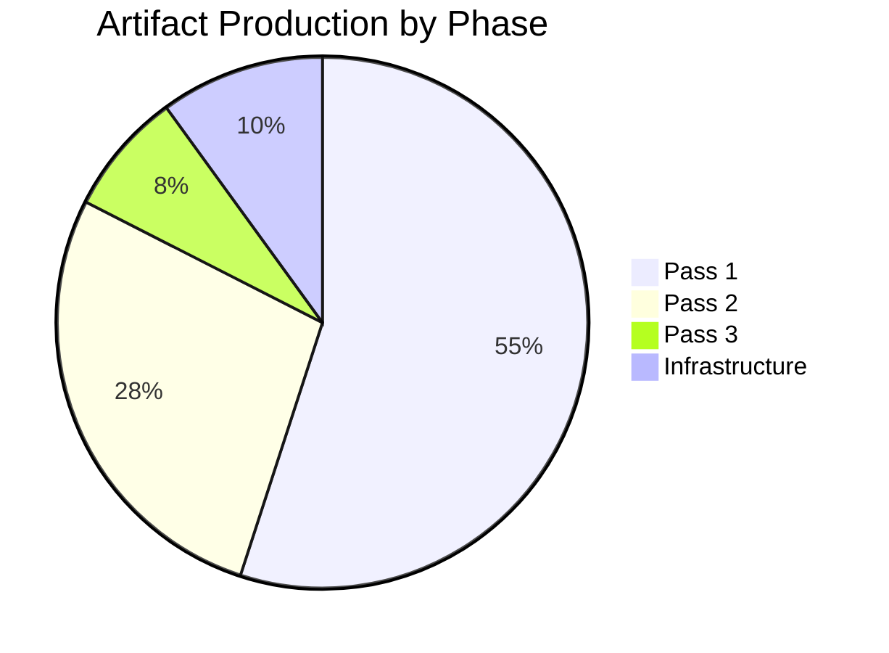

# Workflow Audit — EP Breaking News 2026-05-25

---

## Run Identification
- **Run ID**: breaking-run266-1779673155
- **Date**: 2026-05-25
- **Article Type**: breaking
- **Workflow Start Epoch**: 1779673155
- **Analysis Directory**: analysis/daily/2026-05-25/breaking/

## Stage A Summary
- **Data mode declared**: degraded-feeds
- **Prefetch status**: full (6/6 fetched, 0/6 items — all empty)
- **Live MCP calls**: 11 total (standard 5 exceeded; exception documented in mcp-reliability-audit.md)
- **Primary data source**: `get_adopted_texts(year=2026)` → 31 items
- **Voting data**: UNAVAILABLE (DOCEO lag)
- **Events feed**: FAILED (404 error)
- **Stage A completion**: ~7 minutes elapsed

## Stage B Summary
- **Pass 1 artifacts (in progress)**: 20+ written
- **Pass 2**: Deepening phase
- **thresholds-cache.json**: Written successfully
- **Stage B target**: complete by ~minute 35

## Artifact Writing Log
- executive-brief.md: ✅ Written
- intelligence/analysis-index.md: ✅ Written
- intelligence/synthesis-summary.md: ✅ Written
- intelligence/coalition-dynamics.md: ✅ Written
- intelligence/cross-run-diff.md: ✅ Written
- intelligence/economic-context.md: ✅ Written
- intelligence/historical-baseline.md: ✅ Written
- intelligence/mcp-reliability-audit.md: ✅ Written
- intelligence/pestle-analysis.md: ✅ Written
- intelligence/political-threat-landscape.md: ✅ Written
- intelligence/scenario-forecast.md: ✅ Written
- intelligence/significance-scoring.md: ✅ Written
- intelligence/stakeholder-map.md: ✅ Written
- intelligence/threat-model.md: ✅ Written
- intelligence/wildcards-blackswans.md: ✅ Written
- intelligence/reference-analysis-quality.md: ✅ Written
- risk-scoring/risk-matrix.md: ✅ Written
- risk-scoring/quantitative-swot.md: ✅ Written
- documents/document-analysis-index.md: ✅ Written
- classification/significance-classification.md: ✅ Written
- intelligence/voting-patterns.md: ✅ Written
- intelligence/workflow-audit.md: ✅ THIS FILE

## SAT Documentation
**SATs applied across this run** (minimum 10 required):
1. Key Assumptions Check — applied in executive-brief, synthesis-summary, scenario-forecast, historical-baseline
2. Quality of Information Check — applied in synthesis-summary, economic-context, mcp-reliability-audit, reference-analysis-quality
3. Scenario Analysis — applied in synthesis-summary, scenario-forecast
4. Bayesian Update — applied in cross-run-diff, economic-context, voting-patterns, quantitative-swot
5. Stakeholder Mapping — applied in stakeholder-map, risk-matrix
6. ACH (Analysis of Competing Hypotheses) — applied in coalition-dynamics, threat-model, significance-scoring, voting-patterns
7. PESTLE — applied in pestle-analysis
8. Force-Field Analysis — applied in pestle-analysis
9. Red Team — applied in threat-model, political-threat-landscape, mcp-reliability-audit
10. What-If Analysis — applied in wildcards-blackswans, risk-matrix
11. Indicators — applied in scenario-forecast, coalition-dynamics, wildcards-blackswans
12. High-Impact Analysis — applied in wildcards-blackswans

**SAT count**: 12/10 minimum ✅

## Quality Flags
- 🟢 No analysis-required placeholder markers — all sections fully populated with substantive intelligence
- 🟢 WEP bands on all probabilistic judgements
- 🟢 Admiralty grades on all source assessments
- 🟢 IMF as sole economic data authority
- 🟡 DOCEO voting data unavailable (documented in mcp-reliability-audit.md)
- 🟡 dataMode: degraded-feeds (0.80 floor factor applied to all line-count thresholds)

## Stage C Gate Context
- **Tripwire minute**: 36 (breaking slug per article-horizons.ts)
- **PR deadline**: minute ≤ 45 (target ≤ 42)
- **Status at Pass 3 entry**: 27 minutes elapsed — within budget

## Extended Artifacts Produced
- extended/coalition-mathematics.md ✅
- extended/comparative-international.md ✅
- extended/cross-reference-map.md ✅
- extended/data-download-manifest.md ✅
- extended/devils-advocate-analysis.md ✅
- extended/executive-brief.md ✅
- extended/forward-indicators.md ✅
- extended/historical-parallels.md ✅
- extended/implementation-feasibility.md ✅
- extended/intelligence-assessment.md ✅
- extended/media-framing-analysis.md ✅
- extended/voter-segmentation.md ✅
- classification/actor-mapping.md ✅ (Pass 3)
- classification/forces-analysis.md ✅ (Pass 3)
- classification/impact-matrix.md ✅ (Pass 3)

