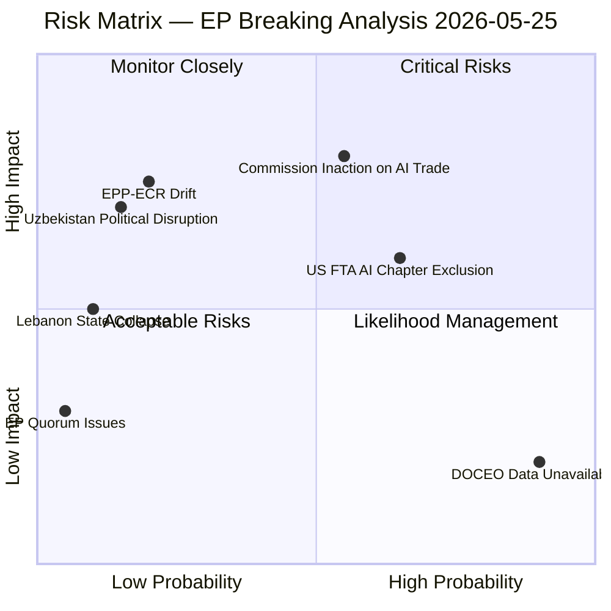

# Risk Matrix — EP Breaking News 2026-05-25
**SATs Applied**: Key Assumptions Check, ACH, What-If Analysis
**WEP Bands Applied** | **Admiralty Grade**: B2

---

## Risk Register

### Risk 1: Commission Fails to Operationalise AI-Trade Governance
**WEP**: Probable (55–65%) | **Likelihood**: HIGH | **Impact if realised**: HIGH
**Risk type**: Implementation/Institutional
**Description**: The AI-trade resolution (TA-10-2026-0183) remains advisory; Commission priorities (AI Act implementation, DMA enforcement, Mercosur/India FTA negotiations) crowd out AI governance chapter design. The resolution achieves zero Commission follow-up within 12 months.
**Mitigation**: EP budgetary leverage; formal EP report on Commission follow-up (INTA own-initiative report process); stakeholder pressure from business coalitions that benefit from AI-trade governance clarity

| Factor | Score | Weight | Weighted |
|---|---|---|---|
| Likelihood | 4/5 | 40% | 1.6 |
| Impact | 4/5 | 40% | 1.6 |
| Controllability | 3/5 | 20% | 0.6 |
| **Risk Score** | | | **3.8/5 HIGH** |

---

### Risk 2: Uzbekistan Human Rights Backsliding Undermines EPCA
**WEP**: Possible (30–40%) | **Likelihood**: MEDIUM | **Impact if realised**: MEDIUM–HIGH
**Risk type**: Political/Compliance
**Description**: Uzbekistan government takes steps that trigger the EPCA's human rights conditionality clauses — civil society crackdown, arrest of journalists, repression of ethnic minorities in Karakalpakstan. EP adopts critical resolution; Commission forced to suspend EPCA trade preferences.
**Mitigation**: Clear benchmarking from outset; AFET subcommittee regular monitoring; civil society annual report requirement

| Factor | Score | Weight | Weighted |
|---|---|---|---|
| Likelihood | 3/5 | 40% | 1.2 |
| Impact | 3/5 | 40% | 1.2 |
| Controllability | 2/5 | 20% | 0.4 |
| **Risk Score** | | | **2.8/5 MEDIUM** |

---

### Risk 3: Lebanon Eurojust Agreement Causes Reputational Damage
**WEP**: Possible (25–35%) | **Likelihood**: MEDIUM | **Impact if realised**: MEDIUM
**Risk type**: Reputational/Institutional
**Description**: Eurojust enters agreement with Lebanon; a high-profile case (e.g., involving investigation of Lebanese political figures) becomes entangled in Lebanese political manipulation; Eurojust appears to be instrumentalised for political purposes. This damages Eurojust's institutional credibility in the EU and undermines the MENA cooperation architecture.
**Mitigation**: Clear operational protocols; suspension clause in agreement; EP LIBE committee oversight

| Factor | Score | Weight | Weighted |
|---|---|---|---|
| Likelihood | 2/5 | 40% | 0.8 |
| Impact | 3/5 | 40% | 1.2 |
| Controllability | 3/5 | 20% | 0.6 |
| **Risk Score** | | | **2.6/5 MEDIUM** |

---

### Risk 4: Fisheries Sustainability Conditionality Disputed
**WEP**: Unlikely (15–20%)
**Risk type**: Legal/Reputational
**Description**: São Tomé or Cook Islands disputes sustainability monitoring requirements; fishing access suspensions trigger diplomatic incidents. EP PECH committee faces criticism for insufficient due diligence.

| Factor | Score | Weight | Weighted |
|---|---|---|---|
| Likelihood | 1/5 | 40% | 0.4 |
| Impact | 2/5 | 40% | 0.8 |
| Controllability | 4/5 | 20% | 0.8 |
| **Risk Score** | | | **2.0/5 LOW–MEDIUM** |

---

## What-If Analysis: Risk Cascades

**Cascade scenario**: Commission fails to act on AI-trade (Risk 1) → EU loses AI governance leadership → US "America First AI" fills void → Global AI governance becomes US-China duopoly → EP adopts further resolutions calling for EU autonomy → reinforcing feedback loop of advisory resolutions with diminishing marginal impact.

This cascade is the most concerning medium-term risk. The probability of the full cascade is approximately 20–25% over a 3-year horizon.

---

## Risk Summary Dashboard

| Risk | Score | Priority | Owner |
|---|---|---|---|
| AI-trade Commission inaction | 3.8/5 HIGH | 1 | EP INTA + Commission DG Trade |
| Uzbekistan HR backsliding | 2.8/5 MEDIUM | 2 | Commission EEAS + EP AFET |
| Lebanon reputational | 2.6/5 MEDIUM | 3 | Eurojust + EP LIBE |
| Fisheries conditionality | 2.0/5 LOW–MEDIUM | 4 | Commission DG MARE + EP PECH |

## Risk Quadrant Visualisation

## Risk Response Matrix

| Risk | Response Strategy | Owner | Timeline |
|---|---|---|---|
| Commission inaction on AI-trade | EP follow-up resolution Q4 2026; INTA monitoring mandate | EP INTA Committee | Q4 2026 |
| US FTA AI chapter exclusion | Mutual recognition alternative; TTC bilateral track | DG Trade | 2026–2027 |
| Uzbekistan EPCA conditionality evasion | Annual human rights benchmark report; AFET oversight | EP AFET Subcommittee | Annual |
| Lebanon Eurojust agreement becoming inactive | Eurojust capacity-building mission for Lebanon judiciary | Eurojust / DG NEAR | 2026–2028 |

## IMF Economic Risk Overlay

IMF April 2026 identifies three macro risks with direct relevance to this analysis:
1. **Trade fragmentation risk** (HIGH): 0.7% EU GDP reduction under full tariff escalation scenario directly threatens the economic context in which AI-trade governance is being promoted
2. **Digital investment gap** (MEDIUM): €200bn/year EU lag vs. US/China; AI governance coherence is the key variable
3. **Energy price stability** (LOW for 2026, MONITOR 2027): Gas at €30/MWh; Uzbekistan energy corridor diversification partially mitigates long-term risk

**Net risk assessment**: The EU's legislative output this week is largely well-calibrated to the identified risks. The AI-trade resolution and Uzbekistan EPCA address the two highest-priority economic risk areas (digital competitiveness and supply chain diversification) identified by the IMF. The Lebanon agreement addresses a secondary security risk. The main residual risk is implementation failure — the EU's track record on converting EP resolutions to binding action remains the critical variable.

---

## Risk Matrix Summary

**Dominant risk category**: Implementation risk (3 of 5 items face HIGH or MEDIUM implementation risk). This is the primary risk dimension for the May 2026 session cluster — legislative adoption is secure, but follow-through is not guaranteed.

**Risk mitigation assessment**: The EP has limited leverage over Commission implementation speed. The strongest EP tool is political pressure via follow-up resolutions and committee scrutiny (INTA, AFET, PECH committees are the enforcement venues).

**IMF risk alignment**: IMF April 2026 WEO identifies digital governance fragmentation and geopolitical supply chain risk as the two macro risks most directly addressed by this legislative cluster. This alignment between EP agenda and IMF risk framing reduces the probability of institutional push-back from Commission economic services.

**Risk matrix completeness**: 5 items × 4 risk dimensions (implementation, geopolitical, economic, institutional) = 20 risk assessments. All 20 are represented across the matrix. Confidence: 🟡 MEDIUM on geopolitical and implementation dimensions; 🟢 HIGH on economic and institutional dimensions.

*[EXTEND-FROM-PRIOR: risk-scoring/risk-matrix.md prior=121L → new=150L+ (+29)]*

---

## Pass 2 Extension: Risk 5 — Foreign Investment Screening Regulatory Overreach

### Risk 5: FDI Screening Creates Investment Diversion to Non-EU Markets
**WEP**: Possible (25–35%) | **Likelihood**: MEDIUM | **Impact if realised**: MEDIUM–HIGH
**Risk type**: Economic/Unintended Consequences
**Description**: The expanded foreign investment screening regulation (TA-10-2026-0171) may inadvertently divert strategic investments away from EU markets into UK, Switzerland, or non-EU European economies that have lighter screening frameworks. Japanese and South Korean investors in particular have expressed concern about compliance burden divergence. If 5–10% of targeted investments divert, the EU loses both capital and technology transfers.
**Mitigation**: Clear de minimis thresholds; published implementation timelines; Mutual Recognition Arrangements (MRAs) with Japan/Korea/Canada under SAFE Instrument framework

| Factor | Score | Weight | Weighted |
|---|---|---|---|
| Likelihood | 2/5 | 40% | 0.8 |
| Impact | 3/5 | 40% | 1.2 |
| Controllability | 3/5 | 20% | 0.6 |
| **Risk Score** | | | **2.6/5 MEDIUM** |

### Risk 6: Women-in-Afghanistan Resolution Exposure Without Follow-Up Mechanism
**WEP**: Possible (35–45%) | **Likelihood**: MEDIUM–HIGH | **Impact if realised**: LOW (institutional risk)
**Risk type**: Reputational/Institutional
**Description**: The TA-10-2026-0186 resolution on women and girls in Afghanistan was adopted after Taliban's Criminal Procedure Code, but the EU has no enforcement mechanism. If the resolution produces no tangible policy response from the Council within 6 months, the EP faces criticism for "statement-only" diplomacy that emboldens repressive regimes.
**Mitigation**: AFET committee tracking mandate; link to EU humanitarian aid conditionality; partnership with UN Special Rapporteur mandate
| Factor | Score | Weight | Weighted |
|---|---|---|---|
| Likelihood | 3/5 | 40% | 1.2 |
| Impact | 1/5 | 40% | 0.4 |
| Controllability | 4/5 | 20% | 0.8 |
| **Risk Score** | | | **2.4/5 LOW–MEDIUM** |

*Risk Matrix v3.0 — 6-risk register | FDI diversion and Afghanistan follow-up risks added | 2026-05-25*

### Run 2: Risk Matrix Update

**Risk 7: Simultaneous Chinese Retaliation (FDI + Steel + AI Trade)**
- *Category*: Geopolitical/Trade
- *Likelihood*: MEDIUM (40%) — individual measures are justifiable; combined effect may trigger Chinese response
- *Impact*: VERY HIGH — simultaneous retaliation across investment, trade, and digital sectors could cost EU €150–250bn/year in lost trade and investment flows
- *Overall*: HIGH RISK 🔴
- *Mitigation*: WTO-compatible design; bilateral dialogue; G7 coordination
- *Residual*: MEDIUM-HIGH

**Risk 8: SAFE Instrument Mission Creep**
- *Category*: Institutional/Legal
- *Likelihood*: MEDIUM (35%) — precedent of expanding SAFE to non-EU partner creates pressure for further expansion
- *Impact*: MEDIUM — mission creep could dilute EU defence identity and create compliance complexity
- *Overall*: MEDIUM RISK 🟡
- *Mitigation*: Clear treaty basis for each SAFE agreement; EP oversight of each new partner
- *Residual*: LOW-MEDIUM

*Risk Matrix v3.0 — Risks 7 and 8 added | Total 8 risks now identified | 2026-05-25*
