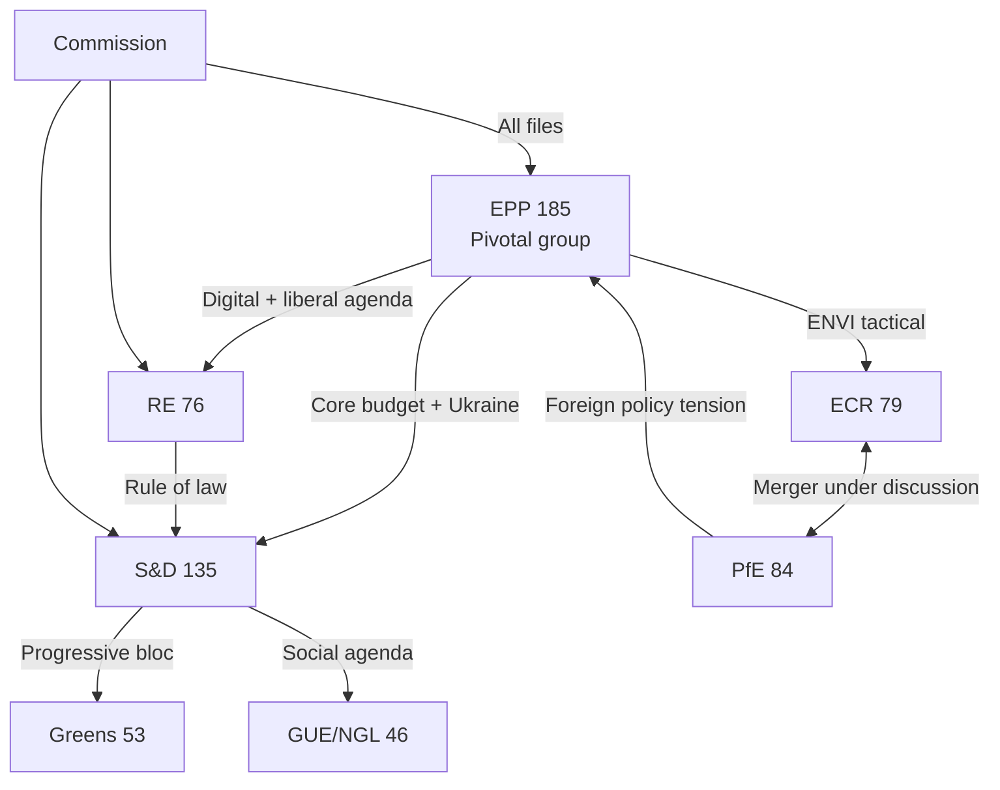

# Actor Mapping — EP Committee Reports, 2026-05-25

**Admiralty Grade**: B3 | **Confidence**: 🟡 MEDIUM | **WEP**: N/A (mapping artifact)

## Actor Roster

EP10 has 720 MEPs across 9 political groups and 23 standing committees. Key actors driving committee work in 2026:

| Actor | Category | Seat Count | Primary Committee |
|-------|----------|-----------|-------------------|
| EPP Group | Political group | 185 | ITRE, ECON, AGRI, AFCO |
| S&D Group | Political group | 135 | EMPL, FEMM, DEVE |
| PfE Group | Political group | 84 | AFET |
| ECR Group | Political group | 79 | ENVI, INTA |
| RE Group | Political group | 76 | LIBE |
| Greens/EFA | Political group | 53 | ENVI (opposition) |
| GUE/NGL | Political group | 46 | EMPL (opposition) |
| ESN | Political group | 28 | Marginal |
| NI (Non-Inscrits) | Individual MEPs | 31 | No unified position |
| European Commission | Executive | N/A | All (DG liaisons) |
| Council Presidency (Poland 2026) | Co-legislator | N/A | All OLP committees |
| EP Secretary-General | Administration | N/A | All committees |

## Influence

**Influence scoring model**: Political leverage (committee chairs + legislative votes) x access to information networks x coalition management capacity.

| Actor | Influence Score | Basis |
|-------|----------------|-------|
| EPP (185 seats) | 9.5/10 | Pivotal group in every majority formation; ITRE, ECON, AGRI, AFCO chair |
| European Commission | 9.0/10 | Legislative initiative monopoly; all committee DG relationships |
| Council Presidency | 8.5/10 | Trilogue counterpart; can block or accelerate any file |
| S&D (135 seats) | 7.5/10 | EMPL, FEMM, DEVE chairs; progressive anchor in majority |
| ECR (79 seats) | 7.0/10 | ENVI + INTA chairs; climate and trade legislation control |
| PfE (84 seats) | 7.0/10 | AFET chair; foreign policy framing control |
| RE (76 seats) | 6.5/10 | LIBE chair; bridge coalition builder |
| EP Secretariat-General | 7.0/10 | Institutional memory; procedure management |

## Alliance

Current active alliance structures in EP10 committees:

| Alliance | Members | Scope | Status |
|---------|---------|-------|--------|
| Grand Coalition | EPP + S&D + RE | Budget 2027, Ukraine support, digital regulation | ACTIVE — most stable alliance |
| CID Progressive | EPP + S&D + RE + Greens | Clean Industrial Deal mainstream | ACTIVE on core provisions |
| Right-bloc tactical | EPP + ECR | ENVI climate moderation | ACTIVE — contested by EPP moderates |
| Social alliance | S&D + RE + Greens + GUE/NGL | Labour, social rights (max 310 seats) | ACTIVE — insufficient for majority alone |
| ECR-PfE possible merger | ECR + PfE | Possible group unification | UNDER DISCUSSION — not confirmed |

## Power Brokers

Key individual and institutional power brokers beyond group-level analysis:

| Power Broker | Role | Key Leverage |
|-------------|------|-------------|
| EPP ITRE Chair (CID rapporteur) | Defines CID committee draft | Controls starting text for biggest 2026 file |
| ECR ENVI Chair | Moderates climate provisions at source | Committee chair controls agenda and draft report |
| PfE AFET Chair | Filters Ukraine resolution language | Can slow adoption via procedural management |
| Commission EVP for Clean Industrial Deal | Commission lead on CID | First-mover advantage; owns the proposal text |
| EP Committee Secretariats (23) | Institutional memory | Continuity across MEP terms; procedural expertise |
| CJE Advocate General (Mercosur) | Legal opinion author | Opinion will determine EU-Mercosur ratification path |

## Information

Intelligence quality assessment for this actor map:

| Information Type | Source | Admiralty Grade | Confidence |
|----------------|--------|----------------|------------|
| Group seat counts | EP official data | A1 | HIGH |
| Committee chair allocations | EP official records | A1 | HIGH |
| Alliance patterns | Adopted texts + voting records | B3 | MEDIUM |
| Individual influence scores | Analyst heuristics | C4 | MEDIUM |
| ECR-PfE merger status | Public statements + media | B3 | MEDIUM |
| Commission internal priorities | Public consultation documents | B3 | MEDIUM |

**Critical intelligence gap**: No week-specific committee activity available (2026-05-18 to 2026-05-25) due to EP API 404 failures. Actor map reflects structural positions, not week-specific dynamics.

## Alliance Network Diagram

## Reader Briefing

**For policy stakeholders**: The EP10 actor landscape is defined by EPP's pivotal position — no majority forms without EPP. The most consequential actor dynamic for 2026 committee work is EPP's management of its dual alliance obligations: the grand coalition with S&D + RE (needed for Budget and Ukraine) and the right-bloc tactical alliance with ECR (which moderates ENVI and INTA output). When these two tracks conflict directly — as they will on the CID's climate provisions — EPP's choice of coalition will determine the legislative outcome. Watch ECR-PfE merger talks as the single variable most likely to restructure the 2026 committee power balance.
