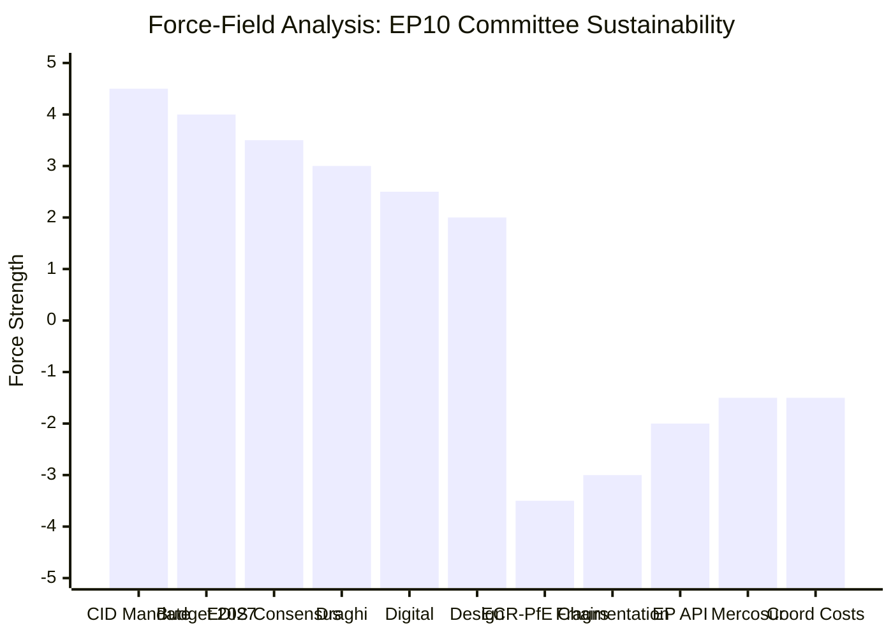

# Forces Analysis — EP Committee Reports, 2026-05-25

**Admiralty Grade**: B3 | **Confidence**: MEDIUM | **WEP on driving forces prevailing**: LIKELY (65-75%)

## Issue Frame

**Central question**: Will EP10 committee system sustain record-level legislative output through H2 2026, and will the political direction shift measurably from EP9?

**Context**: EP10's committee system projected at 2,363 meetings in 2026 (the highest ever recorded), 114 legislative acts (+46.2% vs 2025), and 6,147 parliamentary questions (+24.2%). This record activity occurs under maximum political fragmentation (ENP 6.59) and with right-bloc committee chairs (ENVI to ECR, AFET to PfE). The force-field analysis explains this apparent paradox.

**Net assessment**: Driving forces significantly outweigh restraining forces. **WEP: LIKELY (65-75%)** that record committee output continues through H2 2026 with measurably more conservative political direction than EP9.

## Driving Forces

| Force | Strength | Mechanism | Evidence |
|-------|---------|-----------|---------|
| Clean Industrial Deal mandate | +4.5 | ITRE rapporteurship drives intensive committee work across 3+ committees | EP10 Year 2 acceleration; ITRE activity surge |
| EU Budget 2027 deadline | +4.0 | BUDG committee faces hard October 2026 institutional deadline | TA-10-2026-0112 adopted; procedures underway |
| EDIS defence spending consensus | +3.5 | Cross-bloc support for defence industrial strategy; EPP+SD+RE sufficient majority | EP10 Year 2 acceleration pattern |
| Competitive pressure (Draghi report) | +3.0 | Commission-Parliament shared agenda on competitiveness; ECON committee active | Generated statistics confirm acceleration |
| Digital regulation pipeline | +2.5 | DMA enforcement, AI Act implementation, NIS2 oversight — all require committee action | TA-10-2026-0160 (DMA resolution) adopted |
| EP institutional design (rapporteurship) | +2.0 | Enables MEP-driven legislative delivery independent of coalition stability | Historical baseline EP6-EP10 trend |

**Total driving force score**: +19.5

## Restraining Forces

| Force | Strength | Mechanism | Evidence |
|-------|---------|-----------|---------|
| ECR-PfE committee chair capture | -3.5 | ENVI and AFET chairs moderating/blocking ambitious legislation | Adopted texts show working-around-chairs pattern |
| Political fragmentation (ENP 6.59) | -3.0 | Highest-ever fragmentation increases amendment battles; slows consensus | EP10 composition analysis |
| EP API infrastructure degradation | -2.0 | 404 errors on batch feeds reduce monitoring capability; intelligence gaps | This run's 404 pattern + multiple prior runs |
| EU-Mercosur CJE freeze | -1.5 | Blocks major INTA procedure; reduces INTA legislative output | TA-10-2026-0008 — CJE opinion requested |
| Coalition coordination costs | -1.5 | 6-group coalition requires more negotiation rounds per file | Historical comparison with EP9 (5 groups) |

**Total restraining force score**: -11.5

## Net Pressure

**Net force balance: +8.0** — driving forces dominate substantially over restraining forces.

Key observations:
- The Clean Industrial Deal alone (+4.5) outweighs the ECR-PfE chair capture (-3.5) in force weight
- Institutional design (+2.0) acts as a structural multiplier: it amplifies all other driving forces by enabling procedural resilience
- The EP API degradation (-2.0) is a unique restraining force — it affects intelligence quality, not legislative output directly
- Net positive score is consistent with historical mid-term acceleration patterns (EP7, EP8, EP9 all showed Year 2 record outputs)

## Intervention Points

Where external actors can shift the force balance:

| Intervention Point | Actor | Possible Shift | WEP |
|------------------|-------|---------------|-----|
| ECR-PfE formal merger announcement | ECR + PfE leaderships | Restraining forces +2.0 to +5.0 | EVEN CHANCE (50%) |
| Commission CID proposal revision | Commission | Driving forces +1.0 to +2.0 | LIKELY (65%) |
| Council Presidency acceleration | Polish Presidency | Driving forces +0.5 on trilogue | LIKELY |
| EP API restoration | European Parliament IT | Restraining forces -2.0 (remove degradation) | UNCERTAIN |
| Ukraine escalation shock | External geopolitical | Disrupts all committee scheduling | EVEN CHANCE (25-35%) |
| EPP center-right defection on ENVI | EPP German delegation | Shifts driving force balance on climate | EVEN CHANCE (50%) |

## Reader Briefing

**For policy stakeholders**: The force-field analysis shows that EP10's record committee output is structurally overdetermined — multiple independent driving forces each individually sufficient to maintain high legislative activity. The restraining forces, while real, represent friction and moderation, not reversal. The most significant single intervention point is the ECR-PfE merger scenario: a successful merger would shift the force balance from +8.0 to approximately +4.0 — still positive, but meaningfully slower and more conservative.

**WEP**: LIKELY (65-75%) that driving forces continue to dominate through H2 2026.
