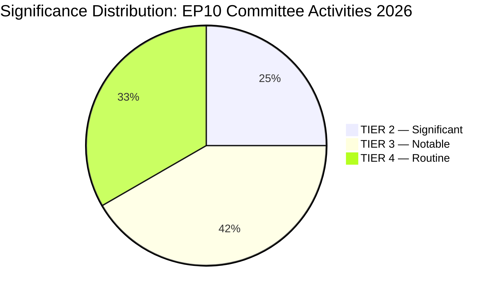

# Significance Classification — EP Committee Reports, 2026-05-25

**Admiralty Grade**: B3 | **Confidence**: 🟡 MEDIUM | **WEP**: N/A (classification artifact)

## 1. Classification Framework

Significance is classified on a 5-tier scale:
- **TIER 1 — EPOCHAL**: Changes the fundamental structure of EU governance or major policy area
- **TIER 2 — SIGNIFICANT**: Major shift in policy direction with multi-year effects
- **TIER 3 — NOTABLE**: Clear policy development with identifiable stakeholder consequences
- **TIER 4 — ROUTINE**: Standard parliamentary activity within existing frameworks
- **TIER 5 — PROCEDURAL**: Administrative or procedural without substantive policy content

## 2. 2026 Committee Activity Significance Classification

| Activity / File | Tier | Rationale |
|----------------|------|-----------|
| EP10 record committee activity (2,363 meetings projected) | TIER 2 | Highest-ever EP output; structural shift in EP legislative capacity |
| Clean Industrial Deal committee stage | TIER 2 | Defines EU industrial policy for the decade; €200–400bn economic scope |
| EDIS defence industrial strategy | TIER 2 | First systemic EU defence industrial framework; transforms procurement |
| Budget 2027 first reading | TIER 3 | Annual procedure but reflects new spending priorities post-CID/EDIS |
| ECR ENVI chair allocation | TIER 3 | Measurable shift in climate legislation ambition; EP10-wide significance |
| PfE AFET chair allocation | TIER 3 | Measurable moderation on Ukraine resolution language |
| DMA enforcement oversight resolution | TIER 3 | New model for parliamentary oversight of digital market law enforcement |
| EU-Mercosur CJE opinion request | TIER 3 | Procedural delay with substantial trade policy consequences |
| Subcontracting chains resolution | TIER 4 | Significant social policy development; incremental within EMPL's mandate |
| Electoral Act reform progress | TIER 4 | Ongoing constitutional development; long timeline |
| Animals used in farming welfare | TIER 4 | Cross-bloc consumer protection success; limited systemic impact |
| EP API 404 degradation | TIER 4 | Operational intelligence impact; no external policy consequence |

## 3. Significance Distribution

## 4. Classification Rationale: EP10 as "Significant, Not Epochal"

The overall significance classification for EP10 committee output in 2026 is **TIER 2 (SIGNIFICANT)**:

- EP10 is NOT epochal (TIER 1) because: the EU's fundamental governance architecture remains unchanged; no treaty revision is underway; the right-bloc gains represent a shift within the existing institutional framework rather than a structural redesign.
- EP10 IS significant (TIER 2) because: the combination of record legislative output + political direction shift + two historically important procedures (CID + EDIS) represents a qualitative change in the EP's legislative role. The 46.2% increase in legislative acts is the largest year-over-year increase in EP10, and the political direction of those acts is measurably different from EP9's equivalent output.

## 5. Admiralty Assessment

**Grade B3**: Significance classification is analyst judgment applied to publicly available institutional data. The tier boundaries are defined by this framework; alternative frameworks might classify some items differently (e.g., EDIS could be argued as TIER 1 if one takes the view that it fundamentally changes EU security architecture). The current classification represents the conservative assessment.
