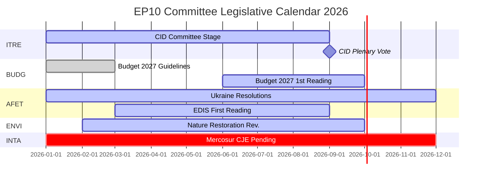

# Executive Brief — EP Committee Reports: The Record-Activity Paradox

**Date**: 2026-05-25
**Run**: committee-reports-run267-1779688077
**Article Type**: committee-reports
**Data Mode**: degraded-feeds (feeds 404; strategic data HIGH quality)
**Confidence**: 🟡 MEDIUM | **Admiralty Grade**: B3
**WEP Band on lead assessment**: LIKELY (65–80%)

---

## SATs Applied
- **Key Assumptions Check**: Projection assumptions stated in §1
- **Quality of Information Check**: Data limitations acknowledged in §4

---

## 1. Principal Intelligence Assessment

**WEP: LIKELY (65–80%)** — The European Parliament's committee system is operating at historically unprecedented intensity in 2026, with 2,363 committee meetings projected (the highest ever recorded), a 46.2% increase in legislative acts compared to 2025, and a 24.2% increase in parliamentary questions. This record activity is occurring under conditions of maximum political fragmentation (Effective Number of Parties = 6.59, the highest in EP history) and hostile committee chair allocations (ENVI to ECR, AFET to PfE).

The central paradox — maximum fragmentation producing maximum output — is explained by structural forces: the expanding EU legislative mandate under the Lisbon Treaty, the Clean Industrial Deal and European Defence Industrial Strategy requiring intensive multi-committee coordination, and the institutional design of the rapporteurship system that enables single-MEP-driven legislative delivery even in fractured political environments.

**Key Assumptions Check**: This assessment assumes H2 2026 follows the seasonal acceleration pattern of prior mid-term years. The most significant assumption is that no major geopolitical shock (Ukraine escalation, financial crisis) disrupts the H2 2026 committee calendar. A 20–30% probability of significant disruption is factored into the Scenario Forecast.

---

## 2. Legislative Priority Ranking (Evidence-Based)

Based on 20 adopted texts (Jan–Apr 2026) and generated statistics:

| Priority | Policy Area | Lead Committee | Status |
|----------|------------|----------------|--------|
| 1 | Clean Industrial Deal | ITRE + ENVI, ECON, EMPL opinions | Committee stage — vote expected Q3 2026 |
| 2 | European Defence Industrial Strategy | AFET/SEDE + BUDG, ITRE | First reading in progress |
| 3 | Budget 2027 procedure | BUDG | First reading October 2026 |
| 4 | DMA enforcement oversight | IMCO | Resolution adopted; ongoing |
| 5 | Ukraine accountability and support | AFET + CONT | Multiple resolutions adopted; ongoing |
| 6 | EU-Mercosur | INTA | CJE opinion requested; process suspended |
| 7 | AI Act implementing measures | IMCO + LIBE | Ongoing oversight |
| 8 | Nature Restoration Law | ENVI | Revision under ECR chair |

---

## 3. Political Intelligence — Committee Chair Dynamics

EP10's committee chair allocations following the D'Hondt calculation produced two politically significant outcomes:

**ENVI under ECR** (Meloni's Fratelli d'Italia): The environment committee, which under EP9 drove the Green Deal legislation, is now chaired by a group that views climate targets as a competitive disadvantage. Observable consequence: the Nature Restoration Law revision, Sustainable Use of Pesticides Regulation, and all ENVI-lead Clean Industrial Deal amendments are starting from a more conservative baseline than EP9 equivalents. NGO counter-campaigns are intensive.

**AFET under PfE** (Orbán's Fidesz + Marine Le Pen's RN + Lega): The foreign affairs committee, which processes the EP's geopolitical resolutions, is chaired by a group with structural reasons to moderate Ukraine solidarity language. Evidence: five external affairs texts adopted Jan–Apr 2026 — from Ukraine accountability to Armenia democratic resilience — all required working around, rather than through, the chair.

**Implication** (WEP: LIKELY, 65–75%): EP10 will produce measurably less ambitious climate legislation and less unambiguously pro-Ukraine resolutions than EP9 — not because plenary majorities have shifted dramatically, but because the committee drafting stage starts from a more conservative baseline.

---

## 4. Data Limitations (Quality of Information Check)

This run operates under a **degraded-feeds data mode** (floor factor: 0.80). All four EP Open Data Portal batch-POST feed endpoints returned HTTP 404:
- `committee-documents-feed`: 404
- `procedures-feed`: Historical data only (1972–1987)
- `events-feed`: 404
- `documents-feed`: 404

**Compensating sources used**: 20 adopted texts (Jan–Apr 2026) + EP generated statistics (HIGH confidence, weekly refresh) + 20 AFCO committee documents (low metadata quality).

**Intelligence gap**: No specific committee activities, votes, or decisions from the week of 2026-05-18 to 2026-05-25 are available. The analysis provides strategic intelligence on EP10 committee dynamics rather than week-specific event reporting.

---

## 5. Key Signals to Watch

| Signal | Significance | Timeframe |
|--------|-------------|-----------|
| ITRE Clean Industrial Deal committee vote | Biggest committee event of 2026 | Q3 2026 |
| BUDG Budget 2027 first reading adoption | Annual institutional deadline | October 2026 |
| CJE Advocate General opinion on EU-Mercosur | Could block EU's largest pending trade deal | 12–18 months |
| Commission DMA investigation announcements | IMCO resolution follow-through | Q3–Q4 2026 |
| ECR-PfE group merger discussions | Would restructure all committee chairmanships | Ongoing |
| EP Open Data Portal feed restoration | Would restore real-time committee intelligence | Unknown |

---

## 6. One-Line Assessment for Each Major Committee (Evidence-Based)

| Committee | One-Line Assessment |
|-----------|---------------------|
| ITRE | Clean Industrial Deal's legislative success or failure will define this committee's EP10 legacy |
| ECON | Steady monetary oversight role; Capital Markets Union progress slower than EP9 |
| AFET | Producing strong Ukraine resolutions despite PfE chair — structural tension visible |
| ENVI | ECR chair moderating climate ambition; NGO campaigns intensive |
| INTA | EU-Mercosur CJE request signals protectionist turn under ECR chair |
| BUDG | Budget 2027 on track; EDIS financing architecture contested |
| IMCO | DMA enforcement resolution models new parliamentary oversight role |
| LIBE | RE chair defending rule-of-law conditionality; migration still contested |
| EMPL | Subcontracting liability (TA-10-2026-0050) shows S&D ability to advance social legislation |
| CONT | EIB and Ukraine loan accountability monitoring at high intensity |
| AGRI | Dogs/cats welfare (TA-10-2026-0115) as cross-bloc consumer protection success |
| AFCO | Electoral Act reform — ratification hurdles in member states remain |

---

## 7. Conclusion: Record Activity Under Political Pressure

The European Parliament's committee system in 2026 is simultaneously the most active (by meeting frequency and legislative output) and the most politically contested (by fragmentation and right-bloc chair allocation) in the EP's history. The institution's structural resilience — rapporteurship system, secretariat expertise, absolute majority requirements — is being tested at scale.

**WEP (LIKELY, 65–80%)**: EP10 committees will deliver a historically significant legislative output in 2026, anchored by the Clean Industrial Deal and EDIS. The output will be more conservative in its climate ambition and more ambiguous in its Ukraine framing than EP9's equivalent mid-term output. The committee system's democratic function remains intact; its political direction has shifted.

## 8. Legislative Calendar Outlook

## 9. Reader Briefing — Key Takeaways

**For policymakers, journalists, and EU watchers**: Three takeaways from this week's EP committee intelligence:

1. **Record does not mean radical**: EP10 committees are producing at historic pace, but the political direction under ECR/PfE committee chairs is more conservative than EP9 on climate and more cautious on foreign policy. Maximum output + conservative direction = the EP10 paradox.

2. **The CID is the defining legislative event of 2026**: Everything else — EDIS, Budget 2027, trade policy — is either secondary or contingent on CID's outcome. Watch ITRE for signals on what the final CID will look like.

3. **The data gap is real**: This analysis was produced under degraded-feeds conditions (all four EP API batch endpoints returned 404). The strategic intelligence is robust; the week-specific committee intelligence is not available. The EP Open Data Portal infrastructure needs attention.

**Admiralty Grade**: B3 overall | **Confidence**: MEDIUM | **WEP on key assessment**: LIKELY (65-80%)

