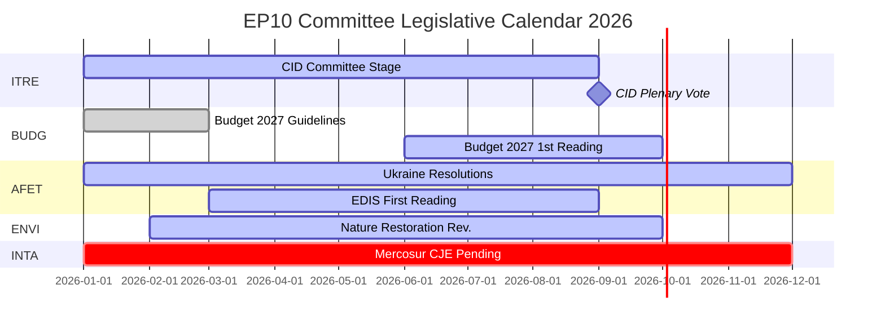

# موجز استخباراتي — تقارير لجان البرلمان الأوروبي: مفارقة النشاط القياسي

**التاريخ**: 2026-05-25
**التشغيل**: committee-reports-run267-1779688077
**نوع المقال**: committee-reports
**وضع البيانات**: degraded-feeds (تغذيات 404؛ بيانات استراتيجية جودة عالية)
**الثقة**: 🟡 MEDIUM | **درجة الأميرالية**: B3
**نطاق WEP للتقييم الرئيسي**: محتمل (65–80 %)

---

## SATs Applied
- **Key Assumptions Check**: الافتراضات التوقعية مذكورة في §1
- **Quality of Information Check**: قيود البيانات معترف بها في §4

---

## 1. Principal Intelligence Assessment

**WEP: محتمل (65–80 %)** — يعمل نظام لجان البرلمان الأوروبي في عام 2026 بكثافة غير مسبوقة تاريخياً: يُتوقع عقد 2,363 اجتماعاً للجان (الأعلى على الإطلاق)، مع ارتفاع بنسبة 46.2 % في الأعمال التشريعية مقارنةً بعام 2025 وارتفاع بنسبة 24.2 % في الأسئلة البرلمانية. يحدث هذا النشاط القياسي في ظل تشرذم سياسي أقصى (العدد الفعّال للأحزاب = 6.59، الأعلى في تاريخ البرلمان الأوروبي) وتوزيع معادٍ لرئاسات اللجان (ENVI لصالح ECR، وAFET لصالح PfE).

تُفسَّر المفارقة المركزية — التشرذم الأقصى ينتج إنتاجاً أقصى — بقوى هيكلية: التوسع في الولاية التشريعية للاتحاد الأوروبي بموجب معاهدة لشبونة، والصفقة الصناعية النظيفة (Clean Industrial Deal) والاستراتيجية الأوروبية للصناعة الدفاعية التي تستلزم تنسيقاً مكثفاً عبر لجان متعددة، والتصميم المؤسسي لنظام المقرر الذي يتيح التنفيذ التشريعي الذي يقوده عضو برلمان واحد حتى في البيئات السياسية المتشرذمة.

**Key Assumptions Check**: يفترض هذا التقييم أن الفصل الثاني من عام 2026 يتبع نمط التسارع الموسمي للسنوات النصفية السابقة. أهم افتراض هو عدم وقوع أي صدمة جيوسياسية كبرى (تصعيد أوكراني، أزمة مالية) تعطّل جدول أعمال اللجان في الفصل الثاني من 2026. احتمال بنسبة 20–30 % لاضطراب كبير مدرج ضمن توقعات السيناريوهات.

---

## 2. Legislative Priority Ranking (Evidence-Based)

استناداً إلى 20 نصاً معتمداً (يناير–أبريل 2026) والإحصاءات المولّدة:

| الأولوية | مجال السياسة | اللجنة الرائدة | الحالة |
|---------|------------|--------------|--------|
| 1 | Clean Industrial Deal | ITRE + ENVI, ECON, آراء EMPL | مرحلة لجنة — تصويت متوقع الربع الثالث 2026 |
| 2 | الاستراتيجية الأوروبية للصناعة الدفاعية | AFET/SEDE + BUDG, ITRE | القراءة الأولى جارية |
| 3 | إجراء ميزانية 2027 | BUDG | القراءة الأولى أكتوبر 2026 |
| 4 | الإشراف على تطبيق DMA | IMCO | قرار معتمد؛ جارٍ |
| 5 | المساءلة والدعم لأوكرانيا | AFET + CONT | قرارات متعددة معتمدة؛ جارية |
| 6 | EU-Mercosur | INTA | طُلب رأي CJE؛ العملية معلّقة |
| 7 | تدابير تنفيذ قانون الذكاء الاصطناعي | IMCO + LIBE | رقابة جارية |
| 8 | قانون استعادة الطبيعة | ENVI | مراجعة تحت رئاسة ECR |

---

## 3. Political Intelligence — Committee Chair Dynamics

أفرز توزيع رئاسات اللجان في EP10 وفق حساب D'Hondt نتيجتين ذواتَي أهمية سياسية:

**ENVI تحت قيادة ECR** (حزب برادري إيطاليا لميلوني): لجنة البيئة التي دفعت تشريعات الصفقة الخضراء في EP9 تتولى رئاستها الآن مجموعة ترى في الأهداف المناخية عيباً تنافسياً. النتيجة الملحوظة: مراجعة قانون استعادة الطبيعة ولوائح الاستخدام المستدام لمبيدات الآفات وجميع تعديلات الصفقة الصناعية النظيفة التي تقودها ENVI تنطلق من خط أساس أكثر محافظة من نظيراتها في EP9. حملات المنظمات غير الحكومية المضادة مكثّفة.

**AFET تحت قيادة PfE** (فيدز أوربان + التجمع الوطني لمارين لوبان + ليغا): لجنة الشؤون الخارجية التي تعالج القرارات الجيوسياسية للبرلمان الأوروبي تتولى رئاستها مجموعة لديها أسباب هيكلية لتلطيف لغة التضامن مع أوكرانيا. الشواهد: خمسة نصوص للسياسة الخارجية معتمدة يناير–أبريل 2026 — من مساءلة أوكرانيا إلى الصمود الديمقراطي لأرمينيا — جميعها تطلّبت التحايل على الرئيس لا العمل من خلاله.

**الاستنتاج** (WEP: محتمل، 65–75 %): سينتج EP10 تشريعات مناخية أقل طموحاً وقرارات أقل وضوحاً في دعم أوكرانيا مقارنةً بـ EP9 — ليس لأن أغلبيات الجلسة العامة تحولت جذرياً، بل لأن مرحلة صياغة اللجنة تنطلق من خط أساس أكثر محافظة.

---

## 4. Data Limitations (Quality of Information Check)

يعمل هذا التشغيل في **وضع تغذية بيانات متدهور** (معامل الحد الأدنى: 0.80). أعادت جميع نقاط نهاية التغذية الدفعية POST الأربعة لبوابة البيانات المفتوحة للبرلمان الأوروبي HTTP 404:
- `committee-documents-feed`: 404
- `procedures-feed`: بيانات تاريخية فحسب (1972–1987)
- `events-feed`: 404
- `documents-feed`: 404

**المصادر التعويضية المستخدمة**: 20 نصاً معتمداً (يناير–أبريل 2026) + إحصاءات مولّدة من البرلمان الأوروبي (ثقة عالية، تحديث أسبوعي) + 20 وثيقة للجنة AFCO (جودة بيانات وصفية منخفضة).

**الفجوة الاستخباراتية**: لا تتوفر أنشطة محددة للجان أو تصويتات أو قرارات من الأسبوع الممتد بين 2026-05-18 و2026-05-25. يقدم التحليل استخبارات استراتيجية حول ديناميكيات لجان EP10 لا تقارير أحداث أسبوعية.

---

## 5. Key Signals to Watch

| الإشارة | الأهمية | الإطار الزمني |
|--------|---------|--------------|
| تصويت لجنة ITRE على Clean Industrial Deal | أكبر حدث للجنة في 2026 | الربع الثالث 2026 |
| اعتماد BUDG قراءة أولى لميزانية 2027 | الموعد النهائي المؤسسي السنوي | أكتوبر 2026 |
| رأي المحامي العام CJE بشأن EU-Mercosur | قد يعرقل أكبر صفقة تجارية معلقة للاتحاد الأوروبي | 12–18 شهراً |
| إعلانات تحقيق DMA للمفوضية | متابعة قرار IMCO | الربع الثالث–الرابع 2026 |
| نقاشات اندماج مجموعة ECR-PfE | ستعيد هيكلة جميع رئاسات اللجان | جارٍ |
| استعادة تغذيات بوابة البيانات المفتوحة للبرلمان الأوروبي | ستعيد الاستخبارات الفورية للجان | غير معروف |

---

## 6. One-Line Assessment for Each Major Committee (Evidence-Based)

| اللجنة | التقييم بسطر واحد |
|--------|-----------------|
| ITRE | سينتج نجاح أو فشل Clean Industrial Deal التشريعي إرث هذه اللجنة في EP10 |
| ECON | دور رقابة نقدية مستقر؛ تقدم اتحاد أسواق رأس المال أبطأ من EP9 |
| AFET | تنتج قرارات قوية بشأن أوكرانيا رغم رئاسة PfE — توتر هيكلي مرئي |
| ENVI | رئاسة ECR تلطّف الطموح المناخي؛ حملات المنظمات غير الحكومية مكثّفة |
| INTA | طلب رأي CJE لـ EU-Mercosur يُشير إلى توجه حمائي تحت رئاسة ECR |
| BUDG | ميزانية 2027 على المسار؛ معمارية تمويل EDIS محل خلاف |
| IMCO | قرار تطبيق DMA يُنشئ دوراً جديداً للرقابة البرلمانية |
| LIBE | رئاسة RE تدافع عن مشروطية سيادة القانون؛ الهجرة لا تزال محل خلاف |
| EMPL | مسؤولية التعاقد من الباطن (TA-10-2026-0050) تُظهر قدرة S&D على تقديم التشريعات الاجتماعية |
| CONT | رقابة محاسبة قروض البنك الأوروبي للاستثمار وأوكرانيا بكثافة عالية |
| AGRI | رفاهية الكلاب/القطط (TA-10-2026-0115) نجاح لحماية المستهلك عبر الكتل |
| AFCO | إصلاح قانون الانتخاب — عقبات التصديق في الدول الأعضاء قائمة |

---

## 7. Conclusion: Record Activity Under Political Pressure

نظام لجان البرلمان الأوروبي في عام 2026 هو في آنٍ واحد الأكثر نشاطاً (من حيث وتيرة الاجتماعات والإنتاج التشريعي) والأكثر جدلاً سياسياً (من حيث التشرذم وتوزيع الرئاسات على الكتلة اليمينية) في تاريخ البرلمان الأوروبي. تُختبر المرونة الهيكلية للمؤسسة — نظام المقرر، خبرة الأمانة العامة، متطلبات الأغلبية المطلقة — على نطاق واسع.

**WEP (محتمل، 65–80 %)**: ستُقدّم لجان EP10 إنتاجاً تشريعياً ذا أهمية تاريخية في 2026، يرتكز على Clean Industrial Deal وEDIS. سيكون الإنتاج أكثر محافظة في طموحه المناخي وأكثر غموضاً في تأطيره لأوكرانيا مقارنةً بالإنتاج النصفي المقابل لـ EP9. تظل الوظيفة الديمقراطية لنظام اللجان سليمة؛ توجهه السياسي قد تحوّل.

## 8. Legislative Calendar Outlook

## 9. Reader Briefing — Key Takeaways

**لصانعي السياسات والصحفيين ومتابعي الاتحاد الأوروبي**: ثلاثة استنتاجات من الاستخبارات البرلمانية الأسبوعية للجان البرلمان الأوروبي:

1. **القياس لا يعني الجذرية**: تنتج لجان EP10 بإيقاع تاريخي، لكن التوجه السياسي تحت رئاسات ECR/PfE أكثر محافظةً من EP9 في المناخ وأكثر تحفظاً في السياسة الخارجية. الإنتاج الأقصى + التوجه المحافظ = مفارقة EP10.

2. **CID هو الحدث التشريعي المحوري لعام 2026**: كل ما عداه — EDIS، ميزانية 2027، السياسة التجارية — إما ثانوي أو مشروط بنتيجة CID. راقب ITRE للحصول على إشارات حول ما ستبدو عليه نسخة CID النهائية.

3. **فجوة البيانات حقيقية**: أُنتج هذا التحليل في ظروف تغذية متدهورة (أعادت جميع نقاط نهاية دفعة API للبرلمان الأوروبي الأربع 404). الاستخبارات الاستراتيجية متينة؛ أما استخبارات اللجان الأسبوعية فغير متاحة. تستوجب البنية التحتية لبوابة البيانات المفتوحة للبرلمان الأوروبي الانتباه.

**درجة الأميرالية**: B3 إجمالاً | **الثقة**: MEDIUM | **WEP للتقييم الرئيسي**: محتمل (65–80 %)
