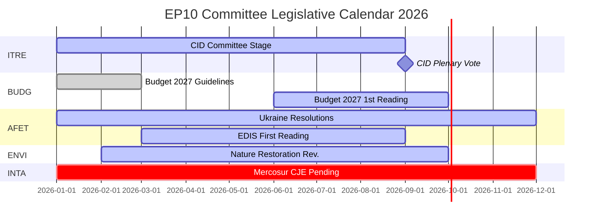

# Efterretningsbriefing — EP-udvalgsrapporter: Rekordaktivitetens paradoks

**Dato**: 2026-05-25
**Kørsel**: committee-reports-run267-1779688077
**Artikeltype**: committee-reports
**Datatilstand**: degraded-feeds (feeds 404; strategiske data HØJ kvalitet)
**Konfidens**: 🟡 MEDIUM | **Admiralitetsvurdering**: B3
**WEP-bånd for ledende vurdering**: SANDSYNLIGT (65–80 %)

---

## SATs Applied
- **Key Assumptions Check**: Prognoseforudsætninger angivet i §1
- **Quality of Information Check**: Databegrænsninger anerkendt i §4

---

## 1. Principal Intelligence Assessment

**WEP: SANDSYNLIGT (65–80 %)** — Europa-Parlamentets udvalgssystem opererer i 2026 med historisk enestående intensitet: 2.363 udvalgsmøder er projekteret (det højeste nogensinde registreret), en stigning på 46,2 % i lovgivningsmæssige retsakter sammenlignet med 2025 og en stigning på 24,2 % i parlamentariske spørgsmål. Denne rekordaktivitet finder sted under maksimal politisk fragmentering (Effektivt antal partier = 6,59, det højeste i EP's historie) og fjendtlige udvalgsformandsfordelinger (ENVI til ECR, AFET til PfE).

Det centrale paradoks — maksimal fragmentering der producerer maksimal output — forklares af strukturelle kræfter: det ekspanderende EU-lovgivningsmandatet under Lissabontraktaten, den Rene Industriaftale (Clean Industrial Deal) og den Europæiske Forsvarsindustrielle Strategi der kræver intensiv koordination på tværs af udvalg, samt den institutionelle udformning af ordførerordningen der muliggør lovgivningsleverance drevet af en enkelt MEP selv i fragmenterede politiske miljøer.

**Key Assumptions Check**: Denne vurdering antager, at H2 2026 følger det sæsonmæssige accelerationsmønster fra tidligere halvtidsår. Den mest betydningsfulde antagelse er, at intet større geopolitisk chok (Ukraine-eskalering, finanskrise) forstyrrer H2 2026's udvalgskalender. En sandsynlighed på 20–30 % for en væsentlig forstyrrelse er indregnet i scenarieprognosen.

---

## 2. Legislative Priority Ranking (Evidence-Based)

Baseret på 20 vedtagne tekster (jan–apr 2026) og genererede statistikker:

| Prioritet | Politikområde | Ledende udvalg | Status |
|-----------|--------------|----------------|--------|
| 1 | Clean Industrial Deal | ITRE + ENVI, ECON, EMPL-udtalelser | Udvalgsstadie — afstemning forventet Q3 2026 |
| 2 | Europæisk forsvarsindustriel strategi | AFET/SEDE + BUDG, ITRE | Første behandling i gang |
| 3 | Budget 2027-procedure | BUDG | Første behandling oktober 2026 |
| 4 | DMA-håndhævelsesovervågning | IMCO | Beslutning vedtaget; igangværende |
| 5 | Ukraines ansvarlighed og støtte | AFET + CONT | Adskillige beslutninger vedtaget; igangværende |
| 6 | EU-Mercosur | INTA | CJE-udtalelse anmodet; processen suspenderet |
| 7 | AI Act-gennemførelsesforanstaltninger | IMCO + LIBE | Igangværende tilsyn |
| 8 | Naturgenopretningsloven | ENVI | Revision under ECR-formand |

---

## 3. Political Intelligence — Committee Chair Dynamics

EP10's fordeling af udvalgsformandsposterne efter D'Hondt-beregningen resulterede i to politisk betydningsfulde udfald:

**ENVI under ECR** (Melonis Fratelli d'Italia): Miljøudvalget, der under EP9 drev Green Deal-lovgivningen, ledes nu af en gruppe der betragter klimamål som en konkurrencemæssig ulempe. Observerbar konsekvens: revisionen af naturgenopretningsloven, forordningen om bæredygtig anvendelse af pesticider og alle ENVI-ledede Clean Industrial Deal-ændringsforslag udgår fra en mere konservativ baseline end EP9-ækvivalenterne. NGO-modkampagner er intensive.

**AFET under PfE** (Orbáns Fidesz + Marine Le Pens RN + Lega): Udenrigsudvalget, der behandler EP's geopolitiske beslutninger, ledes af en gruppe med strukturelle grunde til at moderere sprog om Ukraine-solidaritet. Bevis: fem udenrigspolitiske tekster vedtaget jan–apr 2026 — fra Ukraines ansvarlighed til demokratisk resiliens i Armenien — krævede alle at arbejde uden om snarere end igennem formanden.

**Implikation** (WEP: SANDSYNLIGT, 65–75 %): EP10 vil producere målbart mindre ambitiøs klimalovgivning og mindre entydigt pro-ukrainske beslutninger end EP9 — ikke fordi plenumflertal har skiftet dramatisk, men fordi udvalgets udformningsstadium udgår fra en mere konservativ baseline.

---

## 4. Data Limitations (Quality of Information Check)

Denne kørsel opererer under en **degraderet datafeedstilstand** (gulvfaktor: 0,80). Alle fire EP's Open Data Portal-batchfeed-endepunkter returnerede HTTP 404:
- `committee-documents-feed`: 404
- `procedures-feed`: Kun historiske data (1972–1987)
- `events-feed`: 404
- `documents-feed`: 404

**Kompenserende kilder anvendt**: 20 vedtagne tekster (jan–apr 2026) + EP's genererede statistikker (HØJ konfidens, ugentlig opdatering) + 20 AFCO-udvalgs dokumenter (lav metadatakvalitet).

**Efterretningslakune**: Ingen specifikke udvalgsaktiviteter, afstemninger eller beslutninger fra ugen 2026-05-18 til 2026-05-25 er tilgængelige. Analysen tilvejebringer strategisk efterretning om EP10's udvalgsdynamik snarere end ugespecifik begivenhedsrapportering.

---

## 5. Key Signals to Watch

| Signal | Betydning | Tidsramme |
|--------|-----------|-----------|
| ITRE Clean Industrial Deal-udvalgsafstemning | Udvalgets største begivenhed i 2026 | Q3 2026 |
| BUDG Budget 2027 første behandlingsvedtagelse | Institutionel årsdeadline | Oktober 2026 |
| CJE generaladvokat-udtalelse om EU-Mercosur | Kan blokere EU's største afventende handelsaftale | 12–18 måneder |
| Kommissionens DMA-undersøgelsesmeddelelser | IMCO-beslutningens opfølgning | Q3–Q4 2026 |
| ECR-PfE-gruppefusionsdiskussioner | Ville omstrukturere alle udvalgsformandsposterne | Igangværende |
| Genopretning af EP's Open Data Portal-feeds | Ville genskabe efterretning om udvalg i realtid | Ukendt |

---

## 6. One-Line Assessment for Each Major Committee (Evidence-Based)

| Udvalg | Enlinjebedømmelse |
|--------|------------------|
| ITRE | Clean Industrial Deals lovgivningsmæssige succes eller fiasko vil definere dette udvalgs EP10-arv |
| ECON | Stabil monetær tilsynsrolle; Capital Markets Union-fremskridt langsommere end EP9 |
| AFET | Producerer stærke Ukraine-beslutninger trods PfE-formand — strukturel spænding synlig |
| ENVI | ECR-formand modererer klimaambition; NGO-kampagner intensive |
| INTA | EU-Mercosur CJE-anmodning signalerer protektionistisk drejning under ECR-formand |
| BUDG | Budget 2027 på rette spor; EDIS-finansieringsarkitektur omstridt |
| IMCO | DMA-håndhævelsesbeslutning skaber ny parlamentarisk tilsynsrolle |
| LIBE | RE-formand forsvarer retsstatsbetinget finansiering; migration stadig omstridt |
| EMPL | Underentrepriseansvar (TA-10-2026-0050) viser S&D's evne til at fremme social lovgivning |
| CONT | EIB og Ukraine-låneansvarlighedsovervågning på høj intensitet |
| AGRI | Hunde/katte-velfærd (TA-10-2026-0115) som succesfuld forbrugerbeskyttelse på tværs af blokke |
| AFCO | Valgloven reform — ratifikationshindringer i medlemsstaterne består |

---

## 7. Conclusion: Record Activity Under Political Pressure

Europa-Parlamentets udvalgssystem i 2026 er på én gang det mest aktive (hvad angår mødehyppighed og lovgivningsoutput) og det mest politisk omstridte (hvad angår fragmentering og højreblok-tildeling af formandsposterne) i EP's historie. Institutionens strukturelle robusthed — ordførerordningen, sekretariatets ekspertise, absolutte flertalskrav — testes i stor skala.

**WEP (SANDSYNLIGT, 65–80 %)**: EP10's udvalg vil levere en historisk set betydningsfuld lovgivningsoutput i 2026, forankret i Clean Industrial Deal og EDIS. Outputen vil være mere konservativ i sin klimaambition og mere tvetydig i sin Ukraine-framing end EP9's tilsvarende halvtidsoutput. Udvalgssystemets demokratiske funktion forbliver intakt; dets politiske retning har forskudt sig.

## 8. Legislative Calendar Outlook

## 9. Reader Briefing — Key Takeaways

**For beslutningstagere, journalister og EU-iagttagere**: Tre pointer fra ugens EP-udvalgsefterretning:

1. **Rekord betyder ikke radikalt**: EP10's udvalg producerer i historisk tempo, men den politiske retning under ECR/PfE-udvalgsformænd er mere konservativ end EP9 på klima og mere forsigtig i udenrigspolitikken. Maksimal output + konservativ retning = EP10-paradokset.

2. **CID er 2026's afgørende lovgivningshændelse**: Alt andet — EDIS, Budget 2027, handelspolitik — er enten sekundært eller betinget af CID's udfald. Hold øje med ITRE for signaler om, hvad det endelige CID vil indebære.

3. **Datagabet er reelt**: Denne analyse blev produceret under degraderede feed-forhold (alle fire EP's API-batchendepunkter returnerede 404). Den strategiske efterretning er robust; den ugespecifikke udvalgsefterretning er ikke tilgængelig. EP's Open Data Portal-infrastruktur kræver opmærksomhed.

**Admiralitetsvurdering**: B3 samlet | **Konfidens**: MEDIUM | **WEP for nøglebedømmelse**: SANDSYNLIGT (65–80 %)
