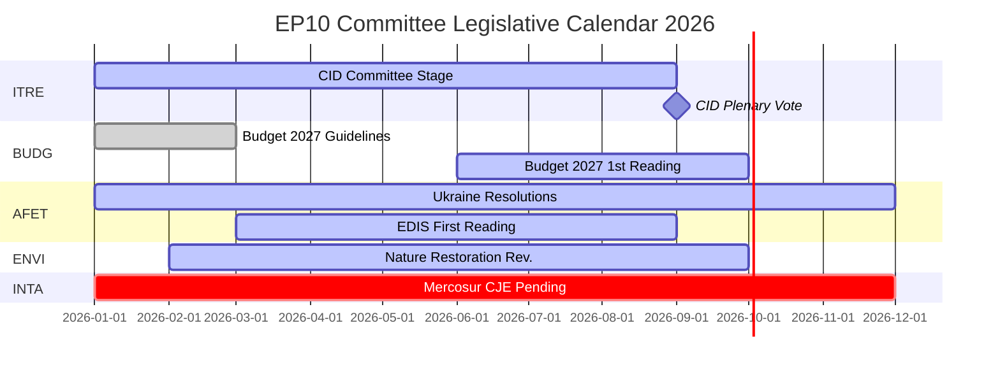

# Nachrichtenbriefing — EP-Ausschussberichte: Das Paradox der Rekordaktivität

**Datum**: 2026-05-25
**Lauf**: committee-reports-run267-1779688077
**Artikeltyp**: committee-reports
**Datenmodus**: degraded-feeds (Feeds 404; strategische Daten HOHE Qualität)
**Konfidenz**: 🟡 MEDIUM | **Admiralitätsnote**: B3
**WEP-Band für Leitbewertung**: WAHRSCHEINLICH (65–80 %)

---

## SATs Applied
- **Key Assumptions Check**: Prognosenannahmen in §1 angegeben
- **Quality of Information Check**: Datenbeschränkungen in §4 anerkannt

---

## 1. Principal Intelligence Assessment

**WEP: WAHRSCHEINLICH (65–80 %)** — Das Ausschusssystem des Europäischen Parlaments operiert 2026 mit historisch einzigartiger Intensität: 2.363 Ausschusssitzungen sind prognostiziert (der höchste je verzeichnete Wert), ein Anstieg von 46,2 % bei Gesetzgebungsakten im Vergleich zu 2025 und ein Anstieg von 24,2 % bei parlamentarischen Anfragen. Diese Rekordaktivität erfolgt unter Bedingungen maximaler politischer Fragmentierung (Effektive Parteienzahl = 6,59, der höchste Wert in der EP-Geschichte) und feindseligen Ausschussvorsitzzuweisungen (ENVI an ECR, AFET an PfE).

Das zentrale Paradox — maximale Fragmentierung bei gleichzeitig maximaler Leistung — erklärt sich durch strukturelle Kräfte: das expandierende EU-Gesetzgebungsmandat unter dem Vertrag von Lissabon, der Clean Industrial Deal und die Europäische Verteidigungsindustrielle Strategie, die eine intensive Koordination zwischen mehreren Ausschüssen erfordern, sowie die institutionelle Gestaltung des Berichterstattungsystems, das eine von einer einzelnen MEP getriebene legislative Lieferung auch in fragmentierten politischen Umgebungen ermöglicht.

**Key Assumptions Check**: Diese Bewertung geht davon aus, dass H2 2026 dem saisonalen Beschleunigungsmuster früherer Halbzeitjahre folgt. Die bedeutsamste Annahme ist, dass kein größerer geopolitischer Schock (Ukraine-Eskalation, Finanzkrise) den H2 2026-Ausschusskalender stört. Eine Wahrscheinlichkeit von 20–30 % für eine erhebliche Störung ist in die Szenarioprognose eingerechnet.

---

## 2. Legislative Priority Ranking (Evidence-Based)

Basierend auf 20 angenommenen Texten (Jan.–Apr. 2026) und generierten Statistiken:

| Priorität | Politikbereich | Federführender Ausschuss | Status |
|-----------|---------------|--------------------------|--------|
| 1 | Clean Industrial Deal | ITRE + ENVI, ECON, EMPL-Stellungnahmen | Ausschussphase — Abstimmung Q3 2026 erwartet |
| 2 | Europäische Verteidigungsindustrielle Strategie | AFET/SEDE + BUDG, ITRE | Erste Lesung im Gange |
| 3 | Haushaltsverfahren 2027 | BUDG | Erste Lesung Oktober 2026 |
| 4 | DMA-Durchsetzungsüberwachung | IMCO | Entschließung angenommen; laufend |
| 5 | Ukraine-Rechenschaftspflicht und -unterstützung | AFET + CONT | Mehrere Entschließungen angenommen; laufend |
| 6 | EU-Mercosur | INTA | CJE-Stellungnahme beantragt; Verfahren ausgesetzt |
| 7 | KI-Gesetz Durchführungsmaßnahmen | IMCO + LIBE | Laufende Überwachung |
| 8 | Naturwiederherstellungsgesetz | ENVI | Überarbeitung unter ECR-Vorsitz |

---

## 3. Political Intelligence — Committee Chair Dynamics

Die Zuweisung der Ausschussvorsitze in EP10 nach der D'Hondt-Berechnung hat zwei politisch bedeutsame Ergebnisse hervorgebracht:

**ENVI unter ECR** (Melonis Fratelli d'Italia): Der Umweltausschuss, der in EP9 die Green-Deal-Gesetzgebung vorangetrieben hat, wird nun von einer Gruppe geleitet, die Klimaziele als Wettbewerbsnachteil betrachtet. Beobachtbare Konsequenz: Die Überarbeitung des Naturwiederherstellungsgesetzes, die Verordnung über die nachhaltige Verwendung von Pestiziden und alle von ENVI geleiteten Clean Industrial Deal-Änderungsanträge gehen von einer konservativeren Ausgangslage aus als EP9-Äquivalente. NGO-Gegenkampagnen sind intensiv.

**AFET unter PfE** (Orbáns Fidesz + Marine Le Pens RN + Lega): Der Ausschuss für auswärtige Angelegenheiten, der die geopolitischen Entschließungen des EP behandelt, wird von einer Gruppe geleitet, die strukturelle Gründe hat, die Sprache zur Ukraine-Solidarität zu mäßigen. Belege: Fünf außenpolitische Texte Jan.–Apr. 2026 angenommen — von der Ukraine-Rechenschaftspflicht bis zur demokratischen Resilienz Armeniens — alle erforderten eine Umgehung des Vorsitzes anstatt eine Zusammenarbeit damit.

**Implikation** (WEP: WAHRSCHEINLICH, 65–75 %): EP10 wird messbar weniger ambitionierte Klimagesetzgebung und weniger eindeutig pro-ukrainische Entschließungen produzieren als EP9 — nicht weil sich Plenarmehrheiten dramatisch verschoben haben, sondern weil die Ausschussentwurfsphase von einer konservativeren Ausgangslage aus beginnt.

---

## 4. Data Limitations (Quality of Information Check)

Dieser Lauf operiert unter einem **degradierten Datenfeed-Modus** (Bodenfaktor: 0,80). Alle vier EP-Open-Data-Portal-Batch-POST-Feed-Endpunkte gaben HTTP 404 zurück:
- `committee-documents-feed`: 404
- `procedures-feed`: Nur historische Daten (1972–1987)
- `events-feed`: 404
- `documents-feed`: 404

**Verwendete Kompensationsquellen**: 20 angenommene Texte (Jan.–Apr. 2026) + EP-generierte Statistiken (HOHE Konfidenz, wöchentliche Aktualisierung) + 20 AFCO-Ausschussdokumente (geringe Metadatenqualität).

**Nachrichtenlücke**: Keine spezifischen Ausschussaktivitäten, Abstimmungen oder Entscheidungen aus der Woche 2026-05-18 bis 2026-05-25 sind verfügbar. Die Analyse liefert strategische Nachrichtendaten zur EP10-Ausschussdynamik und keine wochenspezifische Ereignisberichterstattung.

---

## 5. Key Signals to Watch

| Signal | Bedeutung | Zeitrahmen |
|--------|-----------|-----------|
| ITRE Clean Industrial Deal-Ausschussabstimmung | Größtes Ausschussereignis 2026 | Q3 2026 |
| BUDG Haushalt 2027 erste Lesung Annahme | Institutionelle Jahresfrist | Oktober 2026 |
| CJE Generalanwalt-Stellungnahme zu EU-Mercosur | Könnte EU's größtes ausstehende Handelsabkommen blockieren | 12–18 Monate |
| DMA-Untersuchungsankündigungen der Kommission | IMCO-Entschließung Folgemaßnahmen | Q3–Q4 2026 |
| ECR-PfE-Gruppenfusionsgespräche | Würde alle Ausschussvorsitze umstrukturieren | Laufend |
| Wiederherstellung der EP-Open-Data-Portal-Feeds | Würde Echtzeit-Ausschussnachrichten wiederherstellen | Unbekannt |

---

## 6. One-Line Assessment for Each Major Committee (Evidence-Based)

| Ausschuss | Einzeilen-Bewertung |
|-----------|---------------------|
| ITRE | Der legislative Erfolg oder Misserfolg des Clean Industrial Deal wird das EP10-Vermächtnis dieses Ausschusses definieren |
| ECON | Stabile geldpolitische Überwachungsrolle; Kapitalmarktunion-Fortschritte langsamer als EP9 |
| AFET | Produziert trotz PfE-Vorsitz starke Ukraine-Entschließungen — strukturelle Spannung sichtbar |
| ENVI | ECR-Vorsitz mäßigt Klimaambition; NGO-Kampagnen intensiv |
| INTA | EU-Mercosur CJE-Antrag signalisiert protektionistischen Kurswechsel unter ECR-Vorsitz |
| BUDG | Haushalt 2027 auf Kurs; EDIS-Finanzierungsarchitektur umstritten |
| IMCO | DMA-Durchsetzungsentschließung schafft neue parlamentarische Überwachungsrolle |
| LIBE | RE-Vorsitz verteidigt Rechtsstaatlichkeitskonditionalität; Migration weiterhin umstritten |
| EMPL | Unterauftragnehmer-Haftung (TA-10-2026-0050) zeigt S&D-Fähigkeit, Sozialgesetzgebung voranzutreiben |
| CONT | EIB- und Ukraine-Darlehen-Rechenschaftsüberwachung mit hoher Intensität |
| AGRI | Hunde-/Katzentierschutz (TA-10-2026-0115) als blockübergreifender Verbraucherschutzerfolg |
| AFCO | Wahlrechtsreform — Ratifizierungshürden in Mitgliedstaaten bestehen fort |

---

## 7. Conclusion: Record Activity Under Political Pressure

Das Ausschusssystem des Europäischen Parlaments im Jahr 2026 ist gleichzeitig das aktivste (nach Sitzungshäufigkeit und Gesetzgebungsleistung) und das am stärksten politisch umstrittene (nach Fragmentierung und Rechtsblock-Vorsitzzuweisung) in der EP-Geschichte. Die strukturelle Widerstandsfähigkeit der Institution — Berichterstattungssystem, Sekretariatsexpertise, absolute Mehrheitserfordernisse — wird in großem Maßstab erprobt.

**WEP (WAHRSCHEINLICH, 65–80 %)**: EP10-Ausschüsse werden 2026 eine historisch bedeutsame Gesetzgebungsleistung erbringen, verankert im Clean Industrial Deal und EDIS. Die Leistung wird in ihrer Klimaambition konservativer und in ihrer Ukraine-Rahmung mehrdeutiger sein als das entsprechende Halbzeitergebnis von EP9. Die demokratische Funktion des Ausschusssystems bleibt intakt; seine politische Ausrichtung hat sich verschoben.

## 8. Legislative Calendar Outlook

## 9. Reader Briefing — Key Takeaways

**Für Entscheidungsträger, Journalisten und EU-Beobachter**: Drei Erkenntnisse aus der EP-Ausschussnachrichtenlage dieser Woche:

1. **Rekord bedeutet nicht radikal**: EP10-Ausschüsse produzieren in historischem Tempo, aber die politische Ausrichtung unter ECR/PfE-Ausschussvorsitzenden ist konservativer als EP9 beim Klima und vorsichtiger in der Außenpolitik. Maximale Leistung + konservative Ausrichtung = das EP10-Paradox.

2. **Der CID ist das entscheidende Gesetzgebungsereignis des Jahres 2026**: Alles andere — EDIS, Haushalt 2027, Handelspolitik — ist entweder sekundär oder vom CID-Ergebnis abhängig. Beobachten Sie ITRE auf Signale, wie der endgültige CID aussehen wird.

3. **Die Datenlücke ist real**: Diese Analyse wurde unter degradierten Feed-Bedingungen erstellt (alle vier EP-API-Batch-Endpunkte gaben 404 zurück). Die strategischen Nachrichten sind robust; die wochenspezifischen Ausschussnachrichten sind nicht verfügbar. Die EP-Open-Data-Portal-Infrastruktur benötigt Aufmerksamkeit.

**Admiralitätsnote**: B3 gesamt | **Konfidenz**: MEDIUM | **WEP für Kernbewertung**: WAHRSCHEINLICH (65–80 %)
