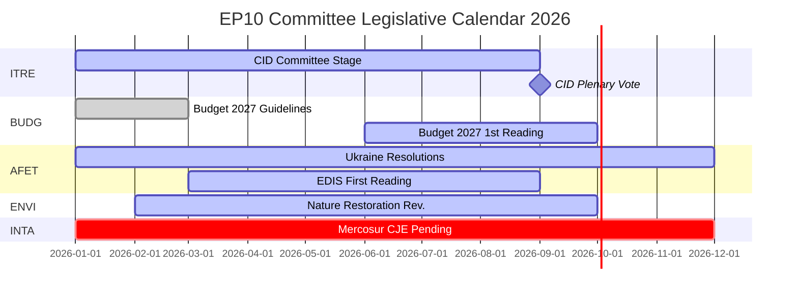

# Nota de síntesis — Informes de comisiones del PE: La paradoja de la actividad récord

**Fecha**: 2026-05-25
**Ejecución**: committee-reports-run267-1779688077
**Tipo de artículo**: committee-reports
**Modo de datos**: degraded-feeds (feeds 404; datos estratégicos calidad ALTA)
**Confianza**: 🟡 MEDIUM | **Nota de Almirantazgo**: B3
**Banda WEP para evaluación principal**: PROBABLE (65–80 %)

---

## SATs Applied
- **Key Assumptions Check**: Supuestos de proyección expuestos en §1
- **Quality of Information Check**: Limitaciones de datos reconocidas en §4

---

## 1. Principal Intelligence Assessment

**WEP: PROBABLE (65–80 %)** — El sistema de comisiones del Parlamento Europeo opera en 2026 con una intensidad históricamente sin precedentes: se proyectan 2.363 reuniones de comisiones (el valor más alto jamás registrado), un aumento del 46,2 % en actos legislativos en comparación con 2025 y un aumento del 24,2 % en preguntas parlamentarias. Esta actividad récord se produce bajo condiciones de máxima fragmentación política (Número efectivo de partidos = 6,59, el más alto en la historia del PE) y asignaciones hostiles de presidencias de comisiones (ENVI a ECR, AFET a PfE).

La paradoja central — fragmentación máxima produciendo producción máxima — se explica por fuerzas estructurales: el mandato legislativo de la UE en expansión bajo el Tratado de Lisboa, el Clean Industrial Deal y la Estrategia Industrial Europea de Defensa que requieren una coordinación intensiva entre múltiples comisiones, y el diseño institucional del sistema de ponencia que permite la entrega legislativa impulsada por un único eurodiputado incluso en entornos políticos fragmentados.

**Key Assumptions Check**: Esta evaluación asume que el segundo semestre de 2026 sigue el patrón de aceleración estacional de años de mitad de mandato anteriores. El supuesto más significativo es que ningún gran choque geopolítico (escalada en Ucrania, crisis financiera) perturba el calendario de comisiones del segundo semestre de 2026. Una probabilidad del 20–30 % de perturbación significativa está incorporada en la previsión de escenarios.

---

## 2. Legislative Priority Ranking (Evidence-Based)

Basado en 20 textos adoptados (ene.–abr. 2026) y estadísticas generadas:

| Prioridad | Área política | Comisión líder | Estado |
|-----------|--------------|----------------|--------|
| 1 | Clean Industrial Deal | ITRE + ITRE + ENVI, ECON, EMPL dictámenes | Fase de comisión — votación prevista T3 2026 |
| 2 | Estrategia Industrial Europea de Defensa | AFET/SEDE + BUDG, ITRE | Primera lectura en curso |
| 3 | Procedimiento presupuestario 2027 | BUDG | Primera lectura octubre 2026 |
| 4 | Supervisión de la aplicación del DMA | IMCO | Resolución adoptada; en curso |
| 5 | Responsabilidad y apoyo de Ucrania | AFET + CONT | Varias resoluciones adoptadas; en curso |
| 6 | UE-Mercosur | INTA | Dictamen CJE solicitado; proceso suspendido |
| 7 | Medidas de aplicación de la AI Act | IMCO + LIBE | Supervisión en curso |
| 8 | Ley de Restauración de la Naturaleza | ENVI | Revisión bajo presidencia ECR |

---

## 3. Political Intelligence — Committee Chair Dynamics

Las asignaciones de presidencias de comisiones en EP10 tras el cálculo D'Hondt produjeron dos resultados políticamente significativos:

**ENVI bajo ECR** (Fratelli d'Italia de Meloni): La comisión de medio ambiente, que bajo EP9 impulsó la legislación del Pacto Verde, está ahora presidida por un grupo que considera los objetivos climáticos como una desventaja competitiva. Consecuencia observable: la revisión de la Ley de Restauración de la Naturaleza, el Reglamento sobre el uso sostenible de plaguicidas y todas las enmiendas al Clean Industrial Deal lideradas por ENVI parten de una línea de base más conservadora que sus equivalentes en EP9. Las contracampañas de ONG son intensivas.

**AFET bajo PfE** (Fidesz de Orbán + RN de Marine Le Pen + Lega): La comisión de asuntos exteriores, que procesa las resoluciones geopolíticas del PE, está presidida por un grupo con razones estructurales para moderar el lenguaje de solidaridad con Ucrania. Evidencia: cinco textos de política exterior adoptados ene.–abr. 2026 — desde la responsabilidad de Ucrania hasta la resiliencia democrática de Armenia — todos requirieron sortear al presidente en lugar de trabajar a través de él.

**Implicación** (WEP: PROBABLE, 65–75 %): EP10 producirá una legislación climática sensiblemente menos ambiciosa y resoluciones menos inequívocamente pro-ucranianas que EP9 — no porque las mayorías del pleno hayan cambiado dramáticamente, sino porque la fase de redacción en comisión parte de una línea de base más conservadora.

---

## 4. Data Limitations (Quality of Information Check)

Esta ejecución opera bajo un **modo de feeds de datos degradado** (factor suelo: 0,80). Los cuatro puntos finales de feeds batch-POST del portal de datos abiertos del PE devolvieron HTTP 404:
- `committee-documents-feed`: 404
- `procedures-feed`: Solo datos históricos (1972–1987)
- `events-feed`: 404
- `documents-feed`: 404

**Fuentes compensatorias utilizadas**: 20 textos adoptados (ene.–abr. 2026) + estadísticas generadas por el PE (confianza ALTA, actualización semanal) + 20 documentos de la comisión AFCO (baja calidad de metadatos).

**Brecha de inteligencia**: No hay actividades específicas de comisión, votaciones o decisiones de la semana del 2026-05-18 al 2026-05-25 disponibles. El análisis proporciona inteligencia estratégica sobre la dinámica de las comisiones EP10 en lugar de informes de eventos semanales específicos.

---

## 5. Key Signals to Watch

| Señal | Importancia | Plazo |
|-------|-------------|-------|
| Votación de la comisión ITRE sobre el Clean Industrial Deal | El mayor evento de comisión de 2026 | T3 2026 |
| Adopción en primera lectura del presupuesto 2027 por BUDG | Fecha límite institucional anual | Octubre 2026 |
| Dictamen del Abogado General CJE sobre UE-Mercosur | Podría bloquear el mayor acuerdo comercial pendiente de la UE | 12–18 meses |
| Anuncios de investigaciones DMA de la Comisión | Seguimiento de la resolución IMCO | T3–T4 2026 |
| Debates sobre fusión de grupos ECR-PfE | Reestructuraría todas las presidencias de comisiones | En curso |
| Restauración de los feeds del portal de datos abiertos del PE | Restauraría la inteligencia de comisiones en tiempo real | Desconocido |

---

## 6. One-Line Assessment for Each Major Committee (Evidence-Based)

| Comisión | Evaluación en una línea |
|---------|------------------------|
| ITRE | El éxito o fracaso legislativo del Clean Industrial Deal definirá el legado EP10 de esta comisión |
| ECON | Estable función de supervisión monetaria; progreso de la Unión de Mercados de Capitales más lento que EP9 |
| AFET | Produce sólidas resoluciones sobre Ucrania a pesar de la presidencia PfE — tensión estructural visible |
| ENVI | La presidencia ECR modera la ambición climática; campañas de ONG intensivas |
| INTA | La solicitud de dictamen CJE UE-Mercosur señala un giro proteccionista bajo la presidencia ECR |
| BUDG | Presupuesto 2027 en camino; arquitectura de financiación EDIS impugnada |
| IMCO | La resolución de aplicación del DMA crea un nuevo papel de supervisión parlamentaria |
| LIBE | La presidencia RE defiende la condicionalidad del estado de derecho; la migración sigue siendo controvertida |
| EMPL | Responsabilidad de subcontratación (TA-10-2026-0050) muestra la capacidad de S&D para impulsar la legislación social |
| CONT | Supervisión de responsabilidad de préstamos del BEI y Ucrania con alta intensidad |
| AGRI | Bienestar de perros/gatos (TA-10-2026-0115) como éxito de protección del consumidor inter-bloques |
| AFCO | Reforma de la Ley Electoral — obstáculos de ratificación en los Estados miembros persisten |

---

## 7. Conclusion: Record Activity Under Political Pressure

El sistema de comisiones del Parlamento Europeo en 2026 es simultáneamente el más activo (por frecuencia de reuniones y producción legislativa) y el más políticamente disputado (por fragmentación y asignación de presidencias al bloque de derechas) en la historia del PE. La resiliencia estructural de la institución — sistema de ponencia, experiencia del secretariado, requisitos de mayoría absoluta — se está poniendo a prueba a gran escala.

**WEP (PROBABLE, 65–80 %)**: Las comisiones EP10 entregarán una producción legislativa históricamente significativa en 2026, anclada en el Clean Industrial Deal y el EDIS. La producción será más conservadora en su ambición climática y más ambigua en su encuadre ucraniano que la producción equivalente de mitad de mandato de EP9. La función democrática del sistema de comisiones permanece intacta; su dirección política ha cambiado.

## 8. Legislative Calendar Outlook

## 9. Reader Briefing — Key Takeaways

**Para responsables políticos, periodistas y observadores de la UE**: Tres conclusiones de la inteligencia sobre las comisiones del PE de esta semana:

1. **Récord no significa radical**: Las comisiones EP10 producen a un ritmo histórico, pero la dirección política bajo las presidencias ECR/PfE de las comisiones es más conservadora que EP9 en clima y más cautelosa en política exterior. Producción máxima + dirección conservadora = la paradoja EP10.

2. **El CID es el evento legislativo definitorio de 2026**: Todo lo demás — EDIS, Presupuesto 2027, política comercial — es secundario o contingente al resultado del CID. Observe ITRE para obtener señales sobre cómo será el CID final.

3. **La brecha de datos es real**: Este análisis fue producido bajo condiciones de feeds degradadas (los cuatro puntos finales batch de la API del PE devolvieron 404). La inteligencia estratégica es sólida; la inteligencia semanal específica de comisiones no está disponible. La infraestructura del portal de datos abiertos del PE necesita atención.

**Nota de Almirantazgo**: B3 general | **Confianza**: MEDIUM | **WEP para evaluación clave**: PROBABLE (65–80 %)
