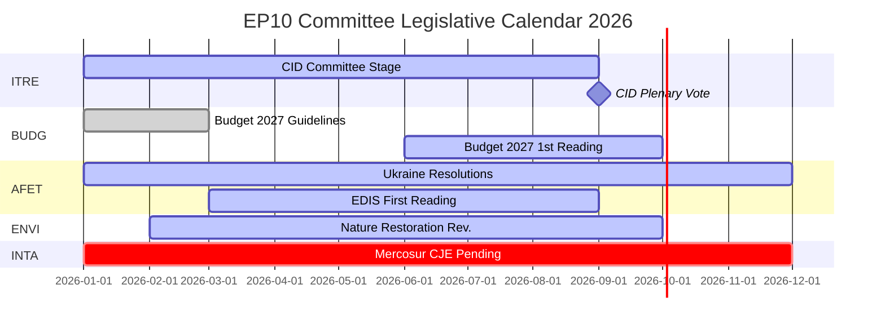

# Tiedustelubriefing — EP:n valiokuntaraportit: Ennätysaktiivisuuden paradoksi

**Päiväys**: 2026-05-25
**Ajo**: committee-reports-run267-1779688077
**Artikkelityyppi**: committee-reports
**Datatila**: degraded-feeds (syötteet 404; strategiset tiedot KORKEA laatu)
**Luottamus**: 🟡 MEDIUM | **Admiraliteettiarvo**: B3
**WEP-kaista johtavalle arviolle**: TODENNÄKÖINEN (65–80 %)

---

## SATs Applied
- **Key Assumptions Check**: Ennusteolettamukset esitetty §1:ssä
- **Quality of Information Check**: Tietorajoitukset tunnustettu §4:ssä

---

## 1. Principal Intelligence Assessment

**WEP: TODENNÄKÖINEN (65–80 %)** — Euroopan parlamentin valiokuntajärjestelmä toimii vuonna 2026 historiallisen poikkeuksellisella intensiteetillä: projektoidaan 2 363 valiokunnan kokousta (korkein koskaan kirjattu), 46,2 %:n kasvu lainsäädäntötoimissa vuoteen 2025 verrattuna ja 24,2 %:n kasvu parlamentaarisissa kysymyksissä. Tämä ennätysaktiivisuus tapahtuu maksimaalisen poliittisen pirstoutumisen olosuhteissa (Puolueiden efektiivinen lukumäärä = 6,59, korkein EP:n historiassa) ja vihamielisten valiokunnan puheenjohtajien jakojen myötä (ENVI ECR:lle, AFET PfE:lle).

Keskeinen paradoksi — maksimaalinen pirstoutuminen tuottaa maksimaalisen tuloksen — selittyy rakenteellisilla voimilla: EU:n lainsäädäntövaltuuksien laajentuminen Lissabonin sopimuksen nojalla, Clean Industrial Deal ja Euroopan puolustus­teollinen strategia, jotka edellyttävät intensiivistä monivaliokuntaista koordinaatiota, sekä esittelijäjärjestelmän institutionaalinen rakenne, joka mahdollistaa yhden MEP:n ohjaaman lainsäädäntötuloksen jopa pirstoutuneissa poliittisissa ympäristöissä.

**Key Assumptions Check**: Tämä arvio olettaa, että H2 2026 seuraa aiempien puolivälin vuosien kausiluonteista kiihtymismallia. Merkittävin olettamus on, että mikään suuri geopoliittinen shokki (Ukrainan eskaloituminen, finanssikriisi) ei häiritse H2 2026:n valiokunnan kalenteria. 20–30 %:n todennäköisyys merkittävälle häiriölle on otettu huomioon skenaariosennusteessa.

---

## 2. Legislative Priority Ranking (Evidence-Based)

Perustuu 20 hyväksyttyyn tekstiin (tammi–huhtikuu 2026) ja generoituihin tilastoihin:

| Prioriteetti | Politiikka-alue | Johtava valiokunta | Tila |
|--------------|----------------|-------------------|------|
| 1 | Clean Industrial Deal | ITRE + ENVI, ECON, EMPL-lausunnot | Valiokuntavaihe — äänestys odotettavissa Q3 2026 |
| 2 | Euroopan puolustus­teollinen strategia | AFET/SEDE + BUDG, ITRE | Ensimmäinen käsittely käynnissä |
| 3 | Talousarvio 2027 -menettely | BUDG | Ensimmäinen käsittely lokakuuta 2026 |
| 4 | DMA:n täytäntöönpanon valvonta | IMCO | Päätöslauselma hyväksytty; käynnissä |
| 5 | Ukrainan vastuullisuus ja tuki | AFET + CONT | Useita päätöslauselmia hyväksytty; käynnissä |
| 6 | EU-Mercosur | INTA | CJE-lausunto pyydetty; prosessi keskeytetty |
| 7 | Tekoälylain täytäntöönpanotoimenpiteet | IMCO + LIBE | Käynnissä oleva valvonta |
| 8 | Luonnonennallistamislaki | ENVI | Tarkistus ECR-puheenjohtajan alaisuudessa |

---

## 3. Political Intelligence — Committee Chair Dynamics

EP10:n valiokunnan puheenjohtajien jakaminen D'Hondt-laskelman jälkeen tuotti kaksi poliittisesti merkittävää lopputulosta:

**ENVI ECR:n alaisuudessa** (Melonin Fratelli d'Italia): Ympäristövaliokunta, joka EP9:n aikana ajoi vihreän kehityksen ohjelman lainsäädäntöä, on nyt ryhmän johdossa, joka pitää ilmastotavoitteita kilpailuhaittana. Havaittava seuraus: luonnonennallistamislain tarkistus, torjunta-aineiden kestävää käyttöä koskeva asetus ja kaikki ENVI-johtoiset Clean Industrial Deal -muutokset lähtevät konservatiivisemmasta lähtökohdasta kuin EP9:n vastaavat. Kansalaisjärjestöjen vastakampanjat ovat intensiivisiä.

**AFET PfE:n alaisuudessa** (Orbánin Fidesz + Marine Le Penin RN + Lega): Ulkoasiainvaliokunta, joka käsittelee EP:n geopoliittisia päätöslauselmia, on ryhmän johdossa, jolla on rakenteellisia syitä lieventää Ukraina-solidaarisuuden kieltä. Todisteet: viisi ulkosuhteita koskevaa tekstiä hyväksytty tammi–huhtikuuta 2026 — Ukrainan vastuullisuudesta Armenian demokraattiseen resilienssiin — kaikki edellyttivät puheenjohtajan kiertämistä eikä sen kautta toimimista.

**Vaikutus** (WEP: TODENNÄKÖINEN, 65–75 %): EP10 tuottaa mitattavasti vähemmän kunnianhimoista ilmastolainsäädäntöä ja vähemmän yksiselitteisesti Ukrainaa tukevia päätöslauselmia kuin EP9 — ei siksi, että täysistuntoenemmistöt olisivat muuttuneet dramaattisesti, vaan siksi, että valiokunnan laadintavaihe lähtee konservatiivisemmasta lähtökohdasta.

---

## 4. Data Limitations (Quality of Information Check)

Tämä ajo toimii **heikentyneessä tietosyötteen tilassa** (lattiakerroin: 0,80). Kaikki neljä EP:n Open Data Portal -erä-POST-syötteen päätepistettä palauttivat HTTP 404:
- `committee-documents-feed`: 404
- `procedures-feed`: Vain historialliset tiedot (1972–1987)
- `events-feed`: 404
- `documents-feed`: 404

**Käytetyt kompensoivat lähteet**: 20 hyväksyttyä tekstiä (tammi–huhtikuu 2026) + EP:n generoidut tilastot (KORKEA luottamus, viikoittainen päivitys) + 20 AFCO-valiokunnan asiakirjaa (matala metadatan laatu).

**Tiedusteluaukko**: Mitään tiettyjä valiokunnan toimintoja, äänestyksiä tai päätöksiä viikolta 2026-05-18–2026-05-25 ei ole saatavilla. Analyysi tarjoaa strategista tiedustelua EP10:n valiokuntadynamiikasta eikä viikkokohtaista tapahtumaraportointia.

---

## 5. Key Signals to Watch

| Signaali | Merkitys | Aikajänne |
|----------|----------|-----------|
| ITRE Clean Industrial Deal -valiokunnan äänestys | Valiokunnan tärkein tapahtuma vuonna 2026 | Q3 2026 |
| BUDG Talousarvio 2027 ensimmäisen käsittelyn hyväksyminen | Institutionaalinen vuosittainen määräaika | Lokakuu 2026 |
| CJE:n julkisasiamiehen lausunto EU-Mercosurista | Voi estää EU:n suurimman vireillä olevan kauppasopimuksen | 12–18 kuukautta |
| Komission DMA-tutkimusilmoitukset | IMCO:n päätöslauselman seuranta | Q3–Q4 2026 |
| ECR-PfE:n ryhmäfuusiokeskustelut | Uudelleenrakentaisi kaikki valiokunnan puheenjohtajuudet | Käynnissä |
| EP:n Open Data Portal -syötteiden palauttaminen | Palauttaisi reaaliaikaisen valiokuntatieto­tiedustelun | Tuntematon |

---

## 6. One-Line Assessment for Each Major Committee (Evidence-Based)

| Valiokunta | Yhden rivin arvio |
|------------|------------------|
| ITRE | Clean Industrial Dealin lainsäädännöllinen onnistuminen tai epäonnistuminen määrittelee tämän valiokunnan EP10-perinnön |
| ECON | Vakaa rahatalouden valvontarooli; Capital Markets Unionin edistyminen hitaampaa kuin EP9 |
| AFET | Tuottaa vahvoja Ukraina-päätöslauselmia PfE-puheenjohtajasta huolimatta — rakenteellinen jännite näkyvissä |
| ENVI | ECR-puheenjohtaja lieventää ilmastokunnianhimoa; kansalaisjärjestökampanjat intensiivisiä |
| INTA | EU-Mercosur CJE-pyyntö merkitsee protektionistista käännettä ECR-puheenjohtajan alaisuudessa |
| BUDG | Talousarvio 2027 oikealla tiellä; EDIS-rahoitusarkkitehtuuri kiistelty |
| IMCO | DMA:n täytäntöönpanon päätöslauselma luo uuden parlamentaarisen valvontaroolin |
| LIBE | RE-puheenjohtaja puolustaa oikeusvaltioperiaatteen mukaista rahoitusta; muuttoliike edelleen kiistanalainen |
| EMPL | Alihankintavastuu (TA-10-2026-0050) osoittaa S&D:n kyvyn edistää sosiaalista lainsäädäntöä |
| CONT | EIB:n ja Ukraina-lainan vastuullisuuden seuranta korkealla intensiteetillä |
| AGRI | Koirien/kissojen hyvinvointi (TA-10-2026-0115) puolueiden välisensä kuluttajansuojan menestystarina |
| AFCO | Vaalilain uudistus — ratifiointiesteet jäsenvaltioissa säilyvät |

---

## 7. Conclusion: Record Activity Under Political Pressure

Euroopan parlamentin valiokuntajärjestelmä vuonna 2026 on samanaikaisesti aktiivisin (kokoushäufyyden ja lainsäädäntötuotoksen suhteen) ja poliittisesti kiistanalaisin (pirstoutumisen ja oikeisto­blokin puheenjohtajuuksien jaon suhteen) EP:n historiassa. Instituution rakenteellinen kestävyys — esittelijäjärjestelmä, sihteeristön asiantuntemus, absoluuttiset enemmistövaatimukset — on koetuksella laajassa mittakaavassa.

**WEP (TODENNÄKÖINEN, 65–80 %)**: EP10:n valiokunnat tuottavat historiallisesti merkittävän lainsäädäntötuotoksen vuonna 2026, ankkuroituna Clean Industrial Dealiin ja EDIS:iin. Tuotos on konservatiivisempaa ilmastokunnianhimoltaan ja epäselvempää Ukraina-kehystykseltään kuin EP9:n vastaava puolivälin tuotos. Valiokuntajärjestelmän demokraattinen tehtävä pysyy ehjänä; sen poliittinen suunta on siirtynyt.

## 8. Legislative Calendar Outlook

## 9. Reader Briefing — Key Takeaways

**Päätöksentekijöille, toimittajille ja EU-seuraajille**: Kolme keskeistä havaintoa tämän viikon EP-valiokunta­tiedustelusta:

1. **Ennätys ei tarkoita radikaalia**: EP10:n valiokunnat tuottavat historiallisessa tahdissa, mutta poliittinen suunta ECR/PfE-valiokunnan puheenjohtajien alaisuudessa on konservatiivisempaa kuin EP9 ilmaston osalta ja varovaisempaa ulkopolitiikassa. Maksimaalinen tuotos + konservatiivinen suunta = EP10-paradoksi.

2. **CID on vuoden 2026 ratkaiseva lainsäädäntötapahtuma**: Kaikki muu — EDIS, Talousarvio 2027, kauppapolitiikka — on joko toissijaista tai riippuvaista CID:n lopputuloksesta. Seuraa ITRE:ä saadaksesi signaaleja siitä, miltä lopullinen CID näyttää.

3. **Tietoaukko on todellinen**: Tämä analyysi tuotettiin heikentyneissä syöte-olosuhteissa (kaikki neljä EP:n API-eräpäätepistettä palauttivat 404). Strateginen tiedustelu on vankka; viikkokohtainen valiokuntatieto­tiedustelu ei ole saatavilla. EP:n Open Data Portal -infrastruktuuri kaipaa huomiota.

**Admiraliteettiarvo**: B3 kokonaisuudessaan | **Luottamus**: MEDIUM | **WEP avainarviolle**: TODENNÄKÖINEN (65–80 %)
