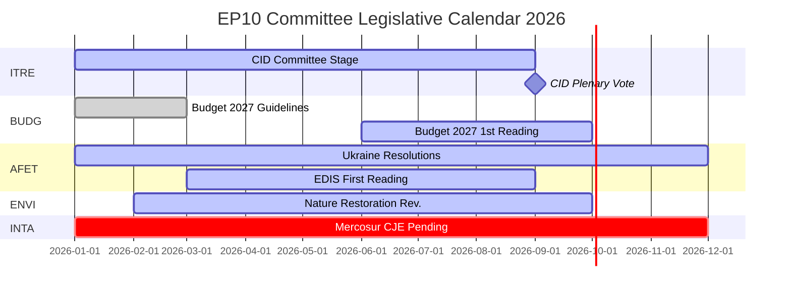

# Note de synthèse — Rapports de commissions du PE : Le paradoxe de l'activité record

**Date** : 2026-05-25
**Exécution** : committee-reports-run267-1779688077
**Type d'article** : committee-reports
**Mode de données** : degraded-feeds (flux 404 ; données stratégiques qualité HAUTE)
**Confiance** : 🟡 MEDIUM | **Note d'Amirauté** : B3
**Bande WEP pour l'évaluation principale** : PROBABLE (65–80 %)

---

## SATs Applied
- **Key Assumptions Check** : Hypothèses de projection exposées au §1
- **Quality of Information Check** : Limites des données reconnues au §4

---

## 1. Principal Intelligence Assessment

**WEP : PROBABLE (65–80 %)** — Le système de commissions du Parlement européen fonctionne en 2026 avec une intensité historiquement sans précédent : 2 363 réunions de commissions sont projetées (le record absolu), une hausse de 46,2 % des actes législatifs par rapport à 2025 et une hausse de 24,2 % des questions parlementaires. Cette activité record survient dans des conditions de fragmentation politique maximale (Nombre effectif de partis = 6,59, le plus élevé de l'histoire du PE) et d'allocations hostiles des présidences de commissions (ENVI à l'ECR, AFET au PfE).

Le paradoxe central — fragmentation maximale produisant une production maximale — s'explique par des forces structurelles : le mandat législatif de l'UE en expansion sous le traité de Lisbonne, le Clean Industrial Deal et la Stratégie industrielle européenne de défense qui nécessitent une coordination intensive entre plusieurs commissions, et la conception institutionnelle du système de rapporteurship qui permet une livraison législative pilotée par un seul député même dans des environnements politiques fractionnés.

**Key Assumptions Check** : Cette évaluation suppose que le second semestre 2026 suit le schéma d'accélération saisonnière des années de mi-mandat précédentes. L'hypothèse la plus importante est qu'aucun choc géopolitique majeur (escalade en Ukraine, crise financière) ne perturbe le calendrier des commissions du second semestre 2026. Une probabilité de 20–30 % de perturbation significative est intégrée dans les prévisions de scénario.

---

## 2. Legislative Priority Ranking (Evidence-Based)

Basé sur 20 textes adoptés (janv.–avr. 2026) et les statistiques générées :

| Priorité | Domaine politique | Commission cheffe de file | Statut |
|----------|-------------------|--------------------------|--------|
| 1 | Clean Industrial Deal | ITRE + ENVI, ECON, EMPL avis | Phase de commission — vote attendu T3 2026 |
| 2 | Stratégie industrielle européenne de défense | AFET/SEDE + BUDG, ITRE | Première lecture en cours |
| 3 | Procédure budgétaire 2027 | BUDG | Première lecture octobre 2026 |
| 4 | Suivi de l'application du DMA | IMCO | Résolution adoptée ; en cours |
| 5 | Responsabilité et soutien pour l'Ukraine | AFET + CONT | Plusieurs résolutions adoptées ; en cours |
| 6 | UE-Mercosur | INTA | Avis CJE demandé ; procédure suspendue |
| 7 | Mesures d'application de l'AI Act | IMCO + LIBE | Suivi en cours |
| 8 | Loi sur la restauration de la nature | ENVI | Révision sous présidence ECR |

---

## 3. Political Intelligence — Committee Chair Dynamics

Les attributions des présidences de commissions dans EP10 selon le calcul D'Hondt ont produit deux résultats politiquement significatifs :

**ENVI sous ECR** (Fratelli d'Italia de Meloni) : La commission environnement, qui sous EP9 a porté la législation du Pacte vert, est désormais présidée par un groupe qui considère les objectifs climatiques comme un désavantage compétitif. Conséquence observable : la révision de la loi sur la restauration de la nature, le règlement sur l'utilisation durable des pesticides et tous les amendements au Clean Industrial Deal portés par ENVI partent d'une base de référence plus conservatrice que leurs équivalents EP9. Les contre-campagnes des ONG sont intenses.

**AFET sous PfE** (Fidesz d'Orbán + RN de Marine Le Pen + Lega) : La commission des affaires étrangères, qui traite les résolutions géopolitiques du PE, est présidée par un groupe ayant des raisons structurelles de modérer le langage de solidarité envers l'Ukraine. Preuve : cinq textes de politique étrangère adoptés janv.–avr. 2026 — de la responsabilité de l'Ukraine à la résilience démocratique de l'Arménie — ont tous nécessité de contourner plutôt que de passer par le président.

**Implication** (WEP : PROBABLE, 65–75 %) : EP10 produira une législation climatique sensiblement moins ambitieuse et des résolutions moins clairement pro-ukrainiennes qu'EP9 — non pas parce que les majorités en plénière ont radicalement changé, mais parce que la phase de rédaction en commission part d'une base de référence plus conservatrice.

---

## 4. Data Limitations (Quality of Information Check)

Cette exécution fonctionne sous un **mode de flux de données dégradé** (facteur plancher : 0,80). Les quatre points de terminaison de flux batch-POST du portail Open Data du PE ont retourné HTTP 404 :
- `committee-documents-feed` : 404
- `procedures-feed` : Données historiques uniquement (1972–1987)
- `events-feed` : 404
- `documents-feed` : 404

**Sources compensatoires utilisées** : 20 textes adoptés (janv.–avr. 2026) + statistiques générées par le PE (confiance HAUTE, actualisation hebdomadaire) + 20 documents de la commission AFCO (faible qualité des métadonnées).

**Lacune de renseignement** : Aucune activité spécifique de commission, vote ou décision de la semaine du 2026-05-18 au 2026-05-25 n'est disponible. L'analyse fournit des renseignements stratégiques sur la dynamique des commissions EP10 plutôt qu'un compte rendu d'événements de la semaine en cours.

---

## 5. Key Signals to Watch

| Signal | Importance | Délai |
|--------|-----------|-------|
| Vote de la commission ITRE sur le Clean Industrial Deal | Le plus grand événement de commission de 2026 | T3 2026 |
| Adoption en première lecture du budget 2027 par BUDG | Échéance institutionnelle annuelle | Octobre 2026 |
| Avis de l'avocat général CJE sur l'UE-Mercosur | Pourrait bloquer le plus grand accord commercial de l'UE en attente | 12–18 mois |
| Annonces d'enquêtes DMA de la Commission | Suivi de la résolution IMCO | T3–T4 2026 |
| Discussions sur la fusion des groupes ECR-PfE | Restructurerait toutes les présidences de commissions | En cours |
| Restauration des flux du portail Open Data du PE | Restaurerait les renseignements en temps réel sur les commissions | Inconnu |

---

## 6. One-Line Assessment for Each Major Committee (Evidence-Based)

| Commission | Évaluation en une ligne |
|-----------|-------------------------|
| ITRE | Le succès ou l'échec législatif du Clean Industrial Deal définira l'héritage EP10 de cette commission |
| ECON | Rôle de surveillance monétaire stable ; progrès de l'Union des marchés de capitaux plus lent qu'EP9 |
| AFET | Produit de solides résolutions sur l'Ukraine malgré la présidence PfE — tension structurelle visible |
| ENVI | La présidence ECR modère l'ambition climatique ; campagnes d'ONG intenses |
| INTA | La demande d'avis CJE UE-Mercosur signale un virage protectionniste sous la présidence ECR |
| BUDG | Budget 2027 sur la bonne voie ; architecture de financement EDIS contestée |
| IMCO | La résolution d'application du DMA crée un nouveau rôle de surveillance parlementaire |
| LIBE | La présidence RE défend la conditionnalité de l'État de droit ; la migration reste contestée |
| EMPL | Responsabilité sous-traitance (TA-10-2026-0050) montre la capacité de S&D à faire avancer la législation sociale |
| CONT | Suivi de la responsabilité des prêts BEI et Ukraine à haute intensité |
| AGRI | Bien-être des chiens/chats (TA-10-2026-0115) comme succès de protection des consommateurs inter-blocs |
| AFCO | Réforme de la loi électorale — obstacles à la ratification dans les États membres persistent |

---

## 7. Conclusion: Record Activity Under Political Pressure

Le système de commissions du Parlement européen en 2026 est à la fois le plus actif (par fréquence des réunions et production législative) et le plus politiquement contesté (par fragmentation et attribution des présidences au bloc de droite) de l'histoire du PE. La résilience structurelle de l'institution — système de rapporteurship, expertise du secrétariat, exigences de majorité absolue — est testée à grande échelle.

**WEP (PROBABLE, 65–80 %)** : Les commissions EP10 fourniront une production législative historiquement significative en 2026, ancrée dans le Clean Industrial Deal et l'EDIS. La production sera plus conservatrice dans son ambition climatique et plus ambiguë dans son cadrage ukrainien que la production mi-mandat équivalente d'EP9. La fonction démocratique du système de commissions reste intacte ; son orientation politique a changé.

## 8. Legislative Calendar Outlook

## 9. Reader Briefing — Key Takeaways

**Pour les décideurs politiques, les journalistes et les observateurs de l'UE** : Trois enseignements du renseignement sur les commissions du PE de cette semaine :

1. **Recorde ne signifie pas radical** : Les commissions EP10 produisent à un rythme historique, mais l'orientation politique sous les présidences ECR/PfE est plus conservatrice qu'EP9 sur le climat et plus prudente en matière de politique étrangère. Production maximale + orientation conservatrice = le paradoxe EP10.

2. **Le CID est l'événement législatif déterminant de 2026** : Tout le reste — EDIS, Budget 2027, politique commerciale — est soit secondaire, soit conditionné par le résultat du CID. Surveillez ITRE pour des signaux sur ce que sera le CID final.

3. **L'écart de données est réel** : Cette analyse a été produite dans des conditions de flux dégradées (les quatre points de terminaison batch de l'API du PE ont retourné 404). Le renseignement stratégique est robuste ; le renseignement spécifique à la semaine sur les commissions n'est pas disponible. L'infrastructure du portail Open Data du PE nécessite une attention.

**Note d'Amirauté** : B3 global | **Confiance** : MEDIUM | **WEP pour évaluation clé** : PROBABLE (65–80 %)
