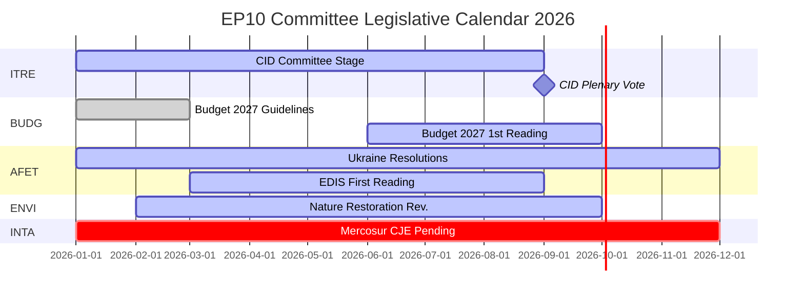

# תקציר מודיעיני — דוחות ועדות הפרלמנט האירופי: פרדוקס הפעילות השיאית

**תאריך**: 2026-05-25
**הרצה**: committee-reports-run267-1779688077
**סוג מאמר**: committee-reports
**מצב נתונים**: degraded-feeds (פידים 404; נתונים אסטרטגיים איכות גבוהה)
**ביטחון**: 🟡 MEDIUM | **דרגת אדמירליות**: B3
**רצועת WEP להערכה מובילה**: סביר (65–80%)

---

## SATs Applied
- **Key Assumptions Check**: הנחות תחזית מפורטות בסעיף §1
- **Quality of Information Check**: מגבלות נתונים מוכרות בסעיף §4

---

## 1. Principal Intelligence Assessment

**WEP: סביר (65–80%)** — מערכת הוועדות של הפרלמנט האירופי פועלת בשנת 2026 בעצימות חסרת תקדים היסטורי: 2,363 ישיבות ועדה מתוכננות (הגבוה ביותר שנרשם אי פעם), עלייה של 46.2% במעשי חקיקה לעומת 2025 ועלייה של 24.2% בשאלות פרלמנטריות. פעילות שיאית זו מתרחשת בתנאים של פיצול פוליטי מקסימלי (מספר מפלגות אפקטיבי = 6.59, הגבוה ביותר בתולדות הפרלמנט האירופי) והקצאות עוינות של יושבי ראש ועדות (ENVI ל-ECR, AFET ל-PfE).

הפרדוקס המרכזי — פיצול מקסימלי המייצר תפוקה מקסימלית — מוסבר בכוחות מבניים: ההרחבה במנדט החקיקתי של האיחוד האירופי מכוח אמנת ליסבון, ה-Clean Industrial Deal והאסטרטגיה האירופית לתעשיית ההגנה הדורשים תיאום אינטנסיבי בין ועדות מרובות, והתכנון המוסדי של מערכת הדווחנים המאפשר מסירה חקיקתית מונעת על ידי חבר פרלמנט בודד אפילו בסביבות פוליטיות מפוצלות.

**Key Assumptions Check**: הערכה זו מניחה שהמחצית השנייה של 2026 עוקבת אחרי דפוס ההאצה העונתי של שנות אמצע הקדנציה הקודמות. ההנחה המשמעותית ביותר היא שאין זעזוע גיאופוליטי גדול (הסלמה באוקראינה, משבר פיננסי) שמשבש את לוח הזמנים של ועדות המחצית השנייה של 2026. הסתברות של 20–30% לשיבוש משמעותי נלקחת בחשבון בתחזית התרחישים.

---

## 2. Legislative Priority Ranking (Evidence-Based)

מבוסס על 20 טקסטים שאומצו (ינואר–אפריל 2026) וסטטיסטיקות שנוצרו:

| עדיפות | תחום מדיניות | ועדה מובילה | סטטוס |
|-------|------------|------------|-------|
| 1 | Clean Industrial Deal | ITRE + ENVI, ECON, חוות דעת EMPL | שלב ועדה — הצבעה צפויה ברבעון 3 2026 |
| 2 | האסטרטגיה האירופית לתעשיית ההגנה | AFET/SEDE + BUDG, ITRE | קריאה ראשונה בתהליך |
| 3 | נוהל תקציב 2027 | BUDG | קריאה ראשונה אוקטובר 2026 |
| 4 | פיקוח אכיפת DMA | IMCO | החלטה אומצה; מתמשך |
| 5 | אחריות ותמיכה באוקראינה | AFET + CONT | מספר החלטות אומצו; מתמשך |
| 6 | EU-Mercosur | INTA | חוות דעת CJE התבקשה; התהליך הושעה |
| 7 | אמצעי יישום חוק הבינה המלאכותית | IMCO + LIBE | פיקוח מתמשך |
| 8 | חוק שיקום הטבע | ENVI | עדכון תחת יושב ראש ECR |

---

## 3. Political Intelligence — Committee Chair Dynamics

הקצאות יושבי ראש הוועדות ב-EP10 לאחר חישוב D'Hondt הניבו שני תוצאות פוליטיות משמעותיות:

**ENVI תחת ECR** (פרטלי איטליה של מלוני): ועדת הסביבה, שתחת EP9 הניעה חקיקת הסכם הירוק, נמצאת כעת בניהולה של קבוצה הרואה ביעדי האקלים חיסרון תחרותי. תוצאה ניתנת לצפייה: עדכון חוק שיקום הטבע, תקנות השימוש בר הקיימא בחומרי הדברה וכל תיקוני ה-Clean Industrial Deal בהובלת ENVI מתחילים מנקודת מוצא שמרנית יותר מאשר מקביליהם ב-EP9. קמפיינים נגדיים של ארגונים לא ממשלתיים הם אינטנסיביים.

**AFET תחת PfE** (פידס של אורבן + RN של מארין לה פן + ליגה): ועדת הענינים החיצוניים, המטפלת בהחלטות הגיאופוליטיות של הפרלמנט האירופי, מנוהלת על ידי קבוצה שיש לה סיבות מבניות לתמתן את שפת הסולידריות עם אוקראינה. ראיות: חמישה טקסטי מדיניות חוץ שאומצו ינואר–אפריל 2026 — מאחריות אוקראינה ועד חוסן דמוקרטי של ארמניה — כולם דרשו עבודה מסביב ליושב הראש ולא דרכו.

**השלכה** (WEP: סביר, 65–75%): EP10 יייצר חקיקת אקלים פחות שאפתנית וממדידה ופחות פרו-אוקראינית חד-משמעית מ-EP9 — לא משום שרוב המליאה השתנה בצורה דרמטית, אלא משום ששלב ניסוח הוועדה מתחיל מנקודת מוצא שמרנית יותר.

---

## 4. Data Limitations (Quality of Information Check)

הרצה זו פועלת תחת **מצב פיד נתונים מושחת** (גורם רצפה: 0.80). כל ארבעת נקודות הקצה של פיד ה-batch-POST של פורטל הנתונים הפתוח של הפרלמנט האירופי החזירו HTTP 404:
- `committee-documents-feed`: 404
- `procedures-feed`: נתונים היסטוריים בלבד (1972–1987)
- `events-feed`: 404
- `documents-feed`: 404

**מקורות מפצים בשימוש**: 20 טקסטים שאומצו (ינואר–אפריל 2026) + סטטיסטיקות שנוצרו על ידי הפרלמנט האירופי (ביטחון גבוה, עדכון שבועי) + 20 מסמכי ועדת AFCO (איכות מטא-נתונים נמוכה).

**פער מודיעיני**: אין פעילויות ועדה ספציפיות, הצבעות או החלטות מהשבוע 2026-05-18 עד 2026-05-25 זמינות. הניתוח מספק מודיעין אסטרטגי על דינמיקת ועדות EP10 ולא דיווח על אירועים שבועיים ספציפיים.

---

## 5. Key Signals to Watch

| אות | חשיבות | מסגרת זמן |
|----|-------|----------|
| הצבעת ועדת ITRE על Clean Industrial Deal | האירוע הגדול ביותר של הוועדה בשנת 2026 | רבעון 3 2026 |
| אימוץ קריאה ראשונה של תקציב 2027 על ידי BUDG | מועד אחרון מוסדי שנתי | אוקטובר 2026 |
| חוות דעת עורך הדין הכללי CJE על EU-Mercosur | עלול לחסום את הסכם הסחר הגדול ביותר בהמתנה של האיחוד האירופי | 12–18 חודשים |
| הודעות חקירת DMA של הנציבות | מעקב אחרי החלטת IMCO | רבעון 3–4 2026 |
| שיחות מיזוג קבוצת ECR-PfE | יבנה מחדש את כל יושבי ראש הוועדות | מתמשך |
| שחזור פידים של פורטל הנתונים הפתוח של הפרלמנט האירופי | ישחזר מודיעין ועדות בזמן אמת | לא ידוע |

---

## 6. One-Line Assessment for Each Major Committee (Evidence-Based)

| ועדה | הערכה בשורה אחת |
|------|----------------|
| ITRE | הצלחה או כישלון חקיקתי של ה-Clean Industrial Deal יגדיר את מורשת EP10 של ועדה זו |
| ECON | תפקיד פיקוח מוניטרי יציב; התקדמות איחוד שוקי ההון איטית יותר מ-EP9 |
| AFET | מייצרת החלטות חזקות בנושא אוקראינה למרות יושב ראש PfE — מתח מבני גלוי |
| ENVI | יושב ראש ECR ממתן שאיפות אקלים; קמפיינים של ארגונים לא ממשלתיים אינטנסיביים |
| INTA | בקשת חוות דעת CJE לEU-Mercosur מסמנת פנייה פרוטקציוניסטית תחת יושב ראש ECR |
| BUDG | תקציב 2027 במסלול; ארכיטקטורת מימון EDIS שנויה במחלוקת |
| IMCO | החלטת אכיפת DMA יוצרת תפקיד חדש של פיקוח פרלמנטרי |
| LIBE | יושב ראש RE מגן על מותנאות שלטון החוק; הגירה עדיין שנויה במחלוקת |
| EMPL | אחריות קבלנות משנה (TA-10-2026-0050) מראה יכולת S&D לקדם חקיקה חברתית |
| CONT | ניטור אחריות הלוואות EIB ואוקראינה בעצימות גבוהה |
| AGRI | רווחת כלבים/חתולים (TA-10-2026-0115) כהצלחת הגנת צרכן חוצת-גושים |
| AFCO | רפורמת חוק הבחירות — מכשולי אשרור במדינות חברות נותרים |

---

## 7. Conclusion: Record Activity Under Political Pressure

מערכת הוועדות של הפרלמנט האירופי בשנת 2026 היא בו-זמנית הפעילה ביותר (לפי תדירות ישיבות ותפוקה חקיקתית) והשנויה ביותר במחלוקת פוליטית (לפי פיצול והקצאת יושבי ראש לגוש הימני) בתולדות הפרלמנט האירופי. החוסן המבני של המוסד — מערכת הדווחנים, מומחיות הסקרטריון, דרישות רוב מוחלט — עומד במבחן בקנה מידה גדול.

**WEP (סביר, 65–80%)**: ועדות EP10 יספקו תפוקה חקיקתית משמעותית היסטורית בשנת 2026, עוגנת ב-Clean Industrial Deal וב-EDIS. התפוקה תהיה שמרנית יותר בשאיפת האקלים שלה ועמומה יותר בניסוח האוקראיני שלה מאשר התפוקה המקבילה באמצע הקדנציה של EP9. הפונקציה הדמוקרטית של מערכת הוועדות נשארת שלמה; כיוונה הפוליטי השתנה.

## 8. Legislative Calendar Outlook

## 9. Reader Briefing — Key Takeaways

**לקובעי מדיניות, עיתונאים וצופי האיחוד האירופי**: שלוש נקודות מרכזיות ממודיעין ועדות הפרלמנט האירופי השבוע:

1. **שיא לא אומר קיצוני**: ועדות EP10 מייצרות בקצב היסטורי, אך הכיוון הפוליטי תחת יושבי ראש ועדות ECR/PfE שמרני יותר מ-EP9 בנושא האקלים וזהיר יותר במדיניות חוץ. תפוקה מקסימלית + כיוון שמרני = פרדוקס EP10.

2. **ה-CID הוא האירוע החקיקתי המכריע של 2026**: כל השאר — EDIS, תקציב 2027, מדיניות סחר — הוא משני או מותנה בתוצאת ה-CID. עקוב אחרי ITRE לאותות על מה שה-CID הסופי ייראה.

3. **פער הנתונים הוא אמיתי**: ניתוח זה הופק בתנאי פיד מושחתים (כל ארבעת נקודות הקצה של ה-API של הפרלמנט האירופי החזירו 404). המודיעין האסטרטגי חזק; מודיעין הוועדה השבועי הספציפי אינו זמין. תשתית פורטל הנתונים הפתוח של הפרלמנט האירופי זקוקה לתשומת לב.

**דרגת אדמירליות**: B3 כולל | **ביטחון**: MEDIUM | **WEP להערכה מרכזית**: סביר (65–80%)
