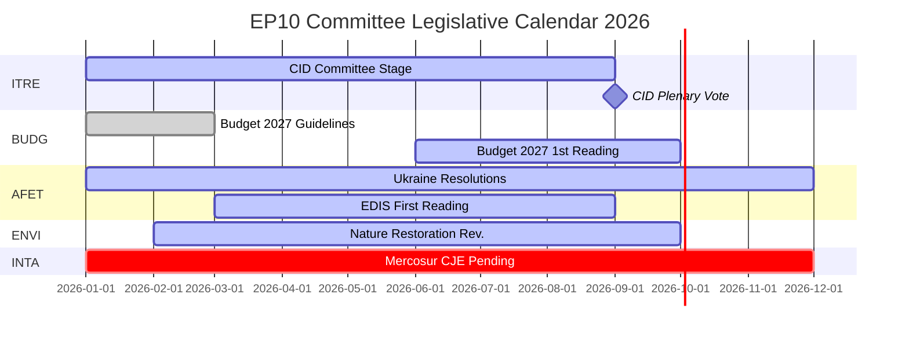

# インテリジェンス・ブリーフィング — 欧州議会委員会報告：記録的活動のパラドックス

**日付**: 2026-05-25
**実行番号**: committee-reports-run267-1779688077
**記事種別**: committee-reports
**データモード**: degraded-feeds（フィード 404；戦略データ 高品質）
**信頼度**: 🟡 MEDIUM | **海軍評価**: B3
**主要評価の WEP バンド**: 可能性が高い（65–80%）

---

## SATs Applied
- **Key Assumptions Check**: 予測前提条件を §1 に記載
- **Quality of Information Check**: データの制限事項を §4 に記載

---

## 1. Principal Intelligence Assessment

**WEP: 可能性が高い（65–80%）** — 欧州議会の委員会システムは2026年において歴史的に前例のない強度で運営されています。委員会会議は2,363回と予測されており（過去最高を記録）、2025年比で立法行為が46.2%増加し、議会質問が24.2%増加しています。この記録的な活動は、政治的分裂が最大化した状況（有効政党数 = 6.59、欧州議会史上最高）と、委員会委員長の敵対的な割り当て（ENVIをECRへ、AFETをPfEへ）のもとで発生しています。

中心的なパラドックス — 分裂最大化が最大の生産を生み出す — は構造的な力によって説明されます。ローマ条約に基づくEU立法権限の拡大、複数の委員会にまたがる集中的な調整を必要とするClean Industrial Dealと欧州防衛産業戦略、そして分裂した政治環境においても一人のMEPが主導する立法成果を可能にする報告者制度の制度的設計が挙げられます。

**Key Assumptions Check**: この評価は、2026年下半期が過去の中間期年における季節的加速パターンに沿って推移すると仮定しています。最も重要な前提は、ウクライナ情勢の悪化や金融危機などの大きな地政学的衝撃が2026年下半期の委員会スケジュールを乱さないということです。シナリオ予測には重大な混乱の確率20–30%が織り込まれています。

---

## 2. Legislative Priority Ranking (Evidence-Based)

2026年1月–4月の採択文書20件および生成された統計に基づく：

| 優先度 | 政策分野 | 主導委員会 | 状況 |
|-------|---------|----------|------|
| 1 | Clean Industrial Deal | ITRE + ENVI、ECON、EMPL意見 | 委員会段階 — 2026年第3四半期に投票予定 |
| 2 | 欧州防衛産業戦略 | AFET/SEDE + BUDG、ITRE | 第1読会進行中 |
| 3 | 2027年予算手続き | BUDG | 第1読会は2026年10月 |
| 4 | DMA執行監視 | IMCO | 決議採択済；進行中 |
| 5 | ウクライナの説明責任と支援 | AFET + CONT | 複数の決議採択済；進行中 |
| 6 | EU-メルコスール | INTA | CJE意見を要請；手続き一時停止 |
| 7 | AI法実施措置 | IMCO + LIBE | 監視継続中 |
| 8 | 自然回復法 | ENVI | ECR委員長のもと改正中 |

---

## 3. Political Intelligence — Committee Chair Dynamics

D'Hondt方式による計算後のEP10における委員会委員長の割り当ては、政治的に重大な2つの結果をもたらしました。

**ENVI（ECR傘下）**（メローニのフラテッリ・ディタリア）: EP9においてグリーンディール立法を推進した環境委員会は、気候目標を競争上の不利と見なすグループによって議長が務められることになりました。観察可能な結果：自然回復法の改正、農薬の持続可能な使用に関する規則、ENVIが主導するすべてのClean Industrial Deal修正案は、EP9の同等のものより保守的な出発点から始まっています。NGOの反対キャンペーンは激しさを増しています。

**AFET（PfE傘下）**（オルバンのフィデスツ + マリーヌ・ルペンのRN + レーガ）: EUの地政学的決議を処理する外務委員会は、ウクライナ連帯の言語を穏健化させる構造的な理由を持つグループによって議長が務められています。証拠：2026年1月–4月に採択された5件の外交政策文書 — ウクライナの説明責任からアルメニアの民主主義的回復力まで — すべてが委員長を通じてではなく、委員長を回避して作業することを必要としました。

**示唆**（WEP: 可能性が高い、65–75%）: EP10は、EP9よりも気候立法において測定可能に野心が低く、ウクライナ支持において明確でない決議を生産するでしょう — 本会議の多数派が大幅に変化したからではなく、委員会の草案作成段階がより保守的な出発点から始まるからです。

---

## 4. Data Limitations (Quality of Information Check)

この実行は**劣化したデータフィードモード**で運用されています（フロアファクター: 0.80）。欧州議会オープンデータポータルのすべての4つのバッチPOSTフィードエンドポイントがHTTP 404を返しました：
- `committee-documents-feed`: 404
- `procedures-feed`: 歴史的データのみ（1972–1987）
- `events-feed`: 404
- `documents-feed`: 404

**使用した補完的ソース**: 採択文書20件（2026年1月–4月）+ 欧州議会生成統計（高信頼度、週次更新）+ AFCO委員会文書20件（メタデータ品質低）。

**インテリジェンスの空白**: 2026年5月18日から2026年5月25日の週の特定の委員会活動、投票、または決定は利用できません。分析は週次の特定イベント報告ではなく、EP10委員会ダイナミクスに関する戦略的インテリジェンスを提供します。

---

## 5. Key Signals to Watch

| シグナル | 重要性 | 期間 |
|--------|------|------|
| ITRE Clean Industrial Deal委員会投票 | 2026年の委員会最大イベント | 2026年第3四半期 |
| BUDG 2027年予算第1読会採択 | 年次機関的期限 | 2026年10月 |
| CJE法務官EU-メルコスール意見 | EUの最大の保留中の貿易協定を阻止する可能性 | 12–18ヶ月 |
| 欧州委員会DMA調査発表 | IMCO決議のフォローアップ | 2026年第3–4四半期 |
| ECR-PfEグループ合併協議 | すべての委員会委員長を再編する | 進行中 |
| 欧州議会オープンデータポータルフィードの回復 | リアルタイム委員会インテリジェンスの回復 | 不明 |

---

## 6. One-Line Assessment for Each Major Committee (Evidence-Based)

| 委員会 | 一言評価 |
|------|--------|
| ITRE | Clean Industrial Dealの立法的成功か失敗かが、この委員会のEP10の遺産を定める |
| ECON | 安定した金融監視の役割；資本市場同盟の進展はEP9より遅い |
| AFET | PfE委員長にもかかわらず強力なウクライナ決議を生産 — 構造的緊張が顕在化 |
| ENVI | ECR委員長が気候野心を穏健化；NGOキャンペーンが激化 |
| INTA | EU-メルコスールCJE要請がECR委員長のもとでの保護主義的転換を示す |
| BUDG | 2027年予算は予定通り；EDIS財政アーキテクチャが争点 |
| IMCO | DMA執行決議が新たな議会監視の役割を創設 |
| LIBE | RE委員長が法の支配の条件性を擁護；移住は依然として争点 |
| EMPL | 下請け責任（TA-10-2026-0050）はS&Dの社会立法推進能力を示す |
| CONT | EIBとウクライナローン説明責任監視が高強度で継続 |
| AGRI | 犬猫の福祉（TA-10-2026-0115）ブロックを超えた消費者保護の成功例 |
| AFCO | 選挙法改正 — 加盟国での批准障壁が残存 |

---

## 7. Conclusion: Record Activity Under Political Pressure

2026年の欧州議会の委員会システムは、EP史上最も活発（会議頻度と立法成果の面で）であると同時に、最も政治的に争われている（分裂度と右翼ブロックへの委員長割り当ての面で）存在です。機関の構造的回復力 — 報告者制度、事務局の専門知識、絶対多数要件 — が大規模に試されています。

**WEP（可能性が高い、65–80%）**: EP10委員会は2026年にClean Industrial DealとEDISを軸として歴史的に重要な立法成果を届けるでしょう。その成果はEP9の同等の中間期成果より気候野心において保守的で、ウクライナの位置付けにおいて曖昧なものとなるでしょう。委員会システムの民主的機能は無傷のまま；その政治的方向性は変化しました。

## 8. Legislative Calendar Outlook

## 9. Reader Briefing — Key Takeaways

**政策立案者、ジャーナリスト、EU観察者へ**: 今週の欧州議会委員会インテリジェンスからの3つのポイント：

1. **記録は急進的を意味しない**: EP10委員会は歴史的なペースで生産していますが、ECR/PfE委員会委員長のもとでの政治的方向性は気候においてEP9より保守的で、外交政策においてより慎重です。最大の産出 + 保守的方向 = EP10のパラドックス。

2. **CIDは2026年の決定的な立法イベントです**: その他のすべて — EDIS、2027年予算、貿易政策 — はCIDの結果に対して二次的か条件付きです。最終的なCIDがどうなるかのシグナルをITREに注目してください。

3. **データの空白は現実です**: この分析は劣化したフィード条件のもとで生産されました（欧州議会APIバッチエンドポイントの4つすべてが404を返しました）。戦略的インテリジェンスは堅固です；週次の委員会インテリジェンスは利用できません。欧州議会オープンデータポータルのインフラには注目が必要です。

**海軍評価**: B3全体 | **信頼度**: MEDIUM | **主要評価のWEP**: 可能性が高い（65–80%）
