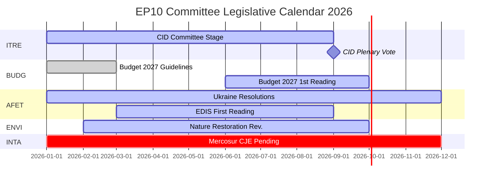

# 정보 브리핑 — 유럽의회 위원회 보고서: 기록적 활동의 역설

**날짜**: 2026-05-25
**실행**: committee-reports-run267-1779688077
**기사 유형**: committee-reports
**데이터 모드**: degraded-feeds (피드 404; 전략 데이터 고품질)
**신뢰도**: 🟡 MEDIUM | **해군 등급**: B3
**주요 평가 WEP 대역**: 가능성 높음 (65–80%)

---

## SATs Applied
- **Key Assumptions Check**: 예측 가정은 §1에 기술됨
- **Quality of Information Check**: 데이터 제한 사항은 §4에서 인정됨

---

## 1. Principal Intelligence Assessment

**WEP: 가능성 높음 (65–80%)** — 유럽의회 위원회 시스템은 2026년 역사적으로 전례 없는 강도로 운영되고 있습니다. 위원회 회의 2,363회가 예측되며(역대 최고 기록), 2025년 대비 입법 행위가 46.2% 증가하고, 의회 질문이 24.2% 증가했습니다. 이 기록적인 활동은 최대 정치 분열(유효 정당 수 = 6.59, 유럽의회 역사상 최고)과 적대적인 위원회 의장 배분(ENVI를 ECR에, AFET를 PfE에) 상황에서 발생하고 있습니다.

중심적인 역설 — 최대 분열이 최대 산출을 생성 — 은 구조적 힘으로 설명됩니다. 리스본 조약 하의 EU 입법 권한 확대, 여러 위원회에 걸쳐 집중적인 조정이 필요한 Clean Industrial Deal과 유럽 방위 산업 전략, 그리고 분열된 정치 환경에서도 단일 MEP 주도의 입법 성과를 가능하게 하는 보고원 시스템의 제도적 설계가 이에 해당합니다.

**Key Assumptions Check**: 이 평가는 2026년 하반기가 이전 중간 연도의 계절적 가속화 패턴을 따른다고 가정합니다. 가장 중요한 가정은 우크라이나 확전, 금융 위기 등 대규모 지정학적 충격이 2026년 하반기 위원회 일정을 방해하지 않는다는 것입니다. 시나리오 예측에는 중대한 방해의 20–30% 확률이 반영되어 있습니다.

---

## 2. Legislative Priority Ranking (Evidence-Based)

2026년 1월–4월 채택 문서 20건 및 생성된 통계를 기반으로:

| 우선순위 | 정책 영역 | 주도 위원회 | 상태 |
|--------|---------|----------|------|
| 1 | Clean Industrial Deal | ITRE + ENVI, ECON, EMPL 의견 | 위원회 단계 — 2026년 3분기 표결 예상 |
| 2 | 유럽 방위 산업 전략 | AFET/SEDE + BUDG, ITRE | 1차 독회 진행 중 |
| 3 | 2027년 예산 절차 | BUDG | 1차 독회 2026년 10월 |
| 4 | DMA 집행 감독 | IMCO | 결의안 채택; 진행 중 |
| 5 | 우크라이나 책임 및 지원 | AFET + CONT | 다수 결의안 채택; 진행 중 |
| 6 | EU-메르코수르 | INTA | CJE 의견 요청; 절차 중단 |
| 7 | AI법 이행 조치 | IMCO + LIBE | 지속적 감독 |
| 8 | 자연 복원법 | ENVI | ECR 의장 하 개정 중 |

---

## 3. Political Intelligence — Committee Chair Dynamics

D'Hondt 계산 후 EP10의 위원회 의장 배분은 두 가지 정치적으로 중요한 결과를 낳았습니다.

**ENVI (ECR 산하)** (멜로니의 프라텔리 디탈리아): EP9에서 그린딜 입법을 추진했던 환경 위원회는 이제 기후 목표를 경쟁적 불이익으로 보는 그룹이 의장을 맡고 있습니다. 관찰 가능한 결과: 자연 복원법 개정, 농약의 지속 가능한 사용에 관한 규정, ENVI 주도 Clean Industrial Deal 수정안 모두가 EP9 동등 제안보다 보수적인 기준점에서 출발하고 있습니다. NGO 반대 캠페인이 격렬합니다.

**AFET (PfE 산하)** (오르반의 피데스 + 마린 르펜의 RN + 레가): 유럽의회의 지정학적 결의안을 처리하는 외교 위원회는 우크라이나 연대 언어를 완화할 구조적 이유가 있는 그룹이 의장을 맡고 있습니다. 증거: 2026년 1월–4월 채택된 5건의 외교 정책 문서 — 우크라이나 책임부터 아르메니아 민주주의 회복력까지 — 모두가 의장을 통해서가 아니라 의장을 우회하여 작업해야 했습니다.

**함의** (WEP: 가능성 높음, 65–75%): EP10은 EP9보다 기후 입법에서 측정 가능하게 덜 야심적이고, 우크라이나 지지에서 덜 명확한 결의안을 생산할 것입니다 — 본회의 다수가 극적으로 변화했기 때문이 아니라, 위원회 초안 작성 단계가 보수적인 기준점에서 시작하기 때문입니다.

---

## 4. Data Limitations (Quality of Information Check)

이 실행은 **저하된 데이터 피드 모드**로 운영됩니다 (하한 계수: 0.80). 유럽의회 오픈 데이터 포털의 4개 배치 POST 피드 엔드포인트 모두가 HTTP 404를 반환했습니다.
- `committee-documents-feed`: 404
- `procedures-feed`: 역사적 데이터만 (1972–1987)
- `events-feed`: 404
- `documents-feed`: 404

**사용된 보완 소스**: 채택 문서 20건 (2026년 1월–4월) + 유럽의회 생성 통계 (높은 신뢰도, 주간 갱신) + AFCO 위원회 문서 20건 (낮은 메타데이터 품질).

**정보 공백**: 2026-05-18부터 2026-05-25 주의 특정 위원회 활동, 표결 또는 결정이 이용 불가합니다. 분석은 주간 특정 이벤트 보고가 아닌 EP10 위원회 역학에 관한 전략적 정보를 제공합니다.

---

## 5. Key Signals to Watch

| 신호 | 중요성 | 기간 |
|----|------|------|
| ITRE Clean Industrial Deal 위원회 표결 | 2026년 최대 위원회 이벤트 | 2026년 3분기 |
| BUDG 2027년 예산 1차 독회 채택 | 연간 기관 마감일 | 2026년 10월 |
| CJE 법무관 EU-메르코수르 의견 | EU 최대 대기 무역 협정을 차단할 가능성 | 12–18개월 |
| 유럽위원회 DMA 조사 발표 | IMCO 결의안 후속 조치 | 2026년 3–4분기 |
| ECR-PfE 그룹 합병 논의 | 모든 위원회 의장직 재편 | 진행 중 |
| 유럽의회 오픈 데이터 포털 피드 복구 | 실시간 위원회 정보 복구 | 미확정 |

---

## 6. One-Line Assessment for Each Major Committee (Evidence-Based)

| 위원회 | 한 줄 평가 |
|------|----------|
| ITRE | Clean Industrial Deal의 입법 성공 또는 실패가 이 위원회의 EP10 유산을 정의할 것입니다 |
| ECON | 안정적인 통화 감독 역할; 자본 시장 연합 진전은 EP9보다 느림 |
| AFET | PfE 의장에도 불구하고 강력한 우크라이나 결의안 생산 — 구조적 긴장 가시화 |
| ENVI | ECR 의장이 기후 야심을 완화; NGO 캠페인 격화 |
| INTA | EU-메르코수르 CJE 요청이 ECR 의장 하 보호주의적 전환을 신호 |
| BUDG | 2027년 예산 순조로움; EDIS 자금 조달 구조 논쟁 중 |
| IMCO | DMA 집행 결의안이 새로운 의회 감독 역할 창출 |
| LIBE | RE 의장이 법치 조건성 옹호; 이민은 여전히 논쟁 중 |
| EMPL | 하청 책임 (TA-10-2026-0050)은 S&D의 사회 입법 추진 능력을 보여줌 |
| CONT | EIB 및 우크라이나 대출 책임 모니터링 고강도 유지 |
| AGRI | 개/고양이 복지 (TA-10-2026-0115) 블록 횡단 소비자 보호 성공 |
| AFCO | 선거법 개혁 — 회원국 비준 장벽 잔존 |

---

## 7. Conclusion: Record Activity Under Political Pressure

2026년 유럽의회 위원회 시스템은 EP 역사상 가장 활발하면서(회의 빈도와 입법 산출 측면에서) 동시에 가장 정치적으로 논쟁 중인(분열 및 우파 블록 의장 배분 측면에서) 존재입니다. 기관의 구조적 회복력 — 보고원 시스템, 사무국 전문성, 절대 다수 요건 — 이 대규모로 시험되고 있습니다.

**WEP (가능성 높음, 65–80%)**: EP10 위원회는 Clean Industrial Deal과 EDIS를 중심으로 2026년 역사적으로 중요한 입법 산출을 달성할 것입니다. 그 산출은 EP9의 동등한 중간 기간 산출보다 기후 야심에서 더 보수적이고 우크라이나 프레이밍에서 더 모호할 것입니다. 위원회 시스템의 민주적 기능은 온전하게 유지됩니다; 정치적 방향은 변화했습니다.

## 8. Legislative Calendar Outlook

## 9. Reader Briefing — Key Takeaways

**정책 입안자, 기자 및 EU 관찰자를 위해**: 이번 주 EP 위원회 정보에서의 세 가지 핵심 사항:

1. **기록이 급진적을 의미하지 않습니다**: EP10 위원회는 역사적인 속도로 생산하고 있지만, ECR/PfE 위원회 의장 하의 정치적 방향은 기후에서 EP9보다 보수적이고 외교 정책에서 더 조심스럽습니다. 최대 산출 + 보수적 방향 = EP10의 역설.

2. **CID는 2026년의 결정적인 입법 이벤트입니다**: 다른 모든 것 — EDIS, 2027년 예산, 무역 정책 — 은 CID 결과에 종속되거나 그에 조건부입니다. 최종 CID가 어떻게 될지에 대한 신호를 ITRE에서 주목하십시오.

3. **데이터 공백은 실재합니다**: 이 분석은 저하된 피드 조건 하에서 생산되었습니다 (유럽의회 API 배치 엔드포인트 4개 모두 404 반환). 전략적 정보는 강력합니다; 주간 특정 위원회 정보는 이용 불가합니다. 유럽의회 오픈 데이터 포털 인프라에 주의가 필요합니다.

**해군 등급**: B3 전체 | **신뢰도**: MEDIUM | **핵심 평가 WEP**: 가능성 높음 (65–80%)
