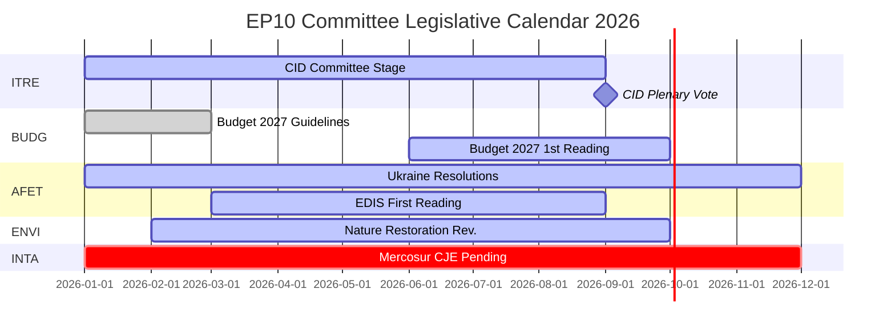

# Inlichtingenbriefing — EP-commissierapporten: De paradox van de recordactiviteit

**Datum**: 2026-05-25
**Run**: committee-reports-run267-1779688077
**Artikeltype**: committee-reports
**Gegevensmodus**: degraded-feeds (feeds 404; strategische gegevens HOGE kwaliteit)
**Betrouwbaarheid**: 🟡 MEDIUM | **Admiraliteitsnoot**: B3
**WEP-band voor hoofdbeoordeling**: WAARSCHIJNLIJK (65–80 %)

---

## SATs Applied
- **Key Assumptions Check**: Prognoseaannames vermeld in §1
- **Quality of Information Check**: Gegevensbeperkingen erkend in §4

---

## 1. Principal Intelligence Assessment

**WEP: WAARSCHIJNLIJK (65–80 %)** — Het commissiestelsel van het Europees Parlement opereert in 2026 met historisch ongekende intensiteit: 2.363 commissievergaderingen worden geprojecteerd (het hoogste ooit geregistreerde aantal), een stijging van 46,2 % in wetgevingshandelingen ten opzichte van 2025 en een stijging van 24,2 % in parlementaire vragen. Deze recordactiviteit vindt plaats onder omstandigheden van maximale politieke fragmentering (Effectief aantal partijen = 6,59, het hoogste in de EP-geschiedenis) en vijandige toewijzingen van commissievoorzitterschappen (ENVI aan ECR, AFET aan PfE).

De centrale paradox — maximale fragmentering die maximale output produceert — wordt verklaard door structurele krachten: het uitbreidende EU-wetgevingsmandat onder het Verdrag van Lissabon, de Clean Industrial Deal en de Europese Defensie-Industriële Strategie die intensieve coördinatie over meerdere commissies vereisen, en het institutionele ontwerp van het rapporteurssysteem dat wetgevingslevering door één individuele europarlementsleden mogelijk maakt, zelfs in gefragmenteerde politieke omgevingen.

**Key Assumptions Check**: Deze beoordeling gaat ervan uit dat het tweede halfjaar van 2026 het seizoensmatige versnellingspatroon van eerdere halverwege-termijnjaren volgt. De meest significante aanname is dat geen grote geopolitieke schok (Oekraïne-escalatie, financiële crisis) de commissieagenda van het tweede halfjaar van 2026 verstoort. Een kans van 20–30 % op een aanzienlijke verstoring is meegenomen in de scenarioprognose.

---

## 2. Legislative Priority Ranking (Evidence-Based)

Gebaseerd op 20 aangenomen teksten (jan.–apr. 2026) en gegenereerde statistieken:

| Prioriteit | Beleidsgebied | Leidende commissie | Status |
|------------|--------------|-------------------|--------|
| 1 | Clean Industrial Deal | ITRE + ENVI, ECON, EMPL-adviezen | Commissiefase — stemming verwacht K3 2026 |
| 2 | Europese Defensie-Industriële Strategie | AFET/SEDE + BUDG, ITRE | Eerste lezing bezig |
| 3 | Begrotingsprocedure 2027 | BUDG | Eerste lezing oktober 2026 |
| 4 | DMA-handhavingstoezicht | IMCO | Resolutie aangenomen; lopend |
| 5 | Verantwoordingsplicht en steun voor Oekraïne | AFET + CONT | Meerdere resoluties aangenomen; lopend |
| 6 | EU-Mercosur | INTA | CJE-advies gevraagd; proces opgeschort |
| 7 | Uitvoeringsmaatregelen AI Act | IMCO + LIBE | Lopend toezicht |
| 8 | Wet Natuurherstel | ENVI | Herziening onder ECR-voorzitter |

---

## 3. Political Intelligence — Committee Chair Dynamics

De toewijzing van commissievoorzitterschappen in EP10 na de D'Hondt-berekening leverde twee politiek significante uitkomsten op:

**ENVI onder ECR** (Meloni's Fratelli d'Italia): De milieucommissie, die onder EP9 de Green Deal-wetgeving aandreef, wordt nu voorgezeten door een groep die klimaatdoelstellingen beschouwt als een concurrentienadeel. Waarneembare consequentie: de herziening van de Wet Natuurherstel, de verordening inzake duurzaam gebruik van pesticiden en alle door ENVI geleide Clean Industrial Deal-amendementen starten vanuit een conservatievere uitgangspositie dan EP9-equivalenten. NGO-tegencampagnes zijn intensief.

**AFET onder PfE** (Orbáns Fidesz + Marine Le Pens RN + Lega): De commissie buitenlandse zaken, die de geopolitieke resoluties van het EP verwerkt, wordt voorgezeten door een groep met structurele redenen om de taal over Oekraïne-solidariteit te matigen. Bewijs: vijf buitenlandse beleidsteksten aangenomen jan.–apr. 2026 — van Oekraïense verantwoordingsplicht tot democratische veerkracht van Armenië — vereisten allemaal werken om de voorzitter heen in plaats van erdoorheen.

**Implicatie** (WEP: WAARSCHIJNLIJK, 65–75 %): EP10 zal meetbaar minder ambitieuze klimaatwetgeving en minder ondubbelzinnig pro-Oekraïense resoluties produceren dan EP9 — niet omdat plenummeerderheid dramatisch zijn verschoven, maar omdat de commissie-ontwerpfase vertrekt vanuit een conservatievere uitgangspositie.

---

## 4. Data Limitations (Quality of Information Check)

Deze run opereert onder een **gedegradeerde datafeedmodus** (vloerfactor: 0,80). Alle vier EP Open Data Portal-batch-POST-feed-eindpunten gaven HTTP 404 terug:
- `committee-documents-feed`: 404
- `procedures-feed`: Alleen historische gegevens (1972–1987)
- `events-feed`: 404
- `documents-feed`: 404

**Gebruikte compenserende bronnen**: 20 aangenomen teksten (jan.–apr. 2026) + EP-gegenereerde statistieken (HOGE betrouwbaarheid, wekelijkse verversing) + 20 AFCO-commissiedocumenten (lage metadatakwaliteit).

**Inlichtingenhiaat**: Geen specifieke commissieactiviteiten, stemmen of beslissingen van de week van 2026-05-18 tot 2026-05-25 zijn beschikbaar. De analyse biedt strategische inlichtingen over de EP10-commissiedynamiek in plaats van weekspecifieke verslaggeving over evenementen.

---

## 5. Key Signals to Watch

| Signaal | Belang | Tijdschema |
|---------|--------|-----------|
| ITRE Clean Industrial Deal-commissiestemming | Grootste commissie-evenement van 2026 | K3 2026 |
| BUDG Begroting 2027 eerste lezing aanneming | Jaarlijkse institutionele deadline | Oktober 2026 |
| CJE Advocaat-generaal advies over EU-Mercosur | Kan 's EU's grootste uitstaande handelsakkoord blokkeren | 12–18 maanden |
| Commissie DMA-onderzoeksaankondigingen | Follow-up IMCO-resolutie | K3–K4 2026 |
| ECR-PfE-groepsfusiediscussies | Zou alle commissievoorzitterschappen herstructureren | Lopend |
| Herstel van EP Open Data Portal-feeds | Zou real-time commissie-inlichtingen herstellen | Onbekend |

---

## 6. One-Line Assessment for Each Major Committee (Evidence-Based)

| Commissie | Beoordeling in één regel |
|-----------|-------------------------|
| ITRE | Het wetgevend succes of falen van de Clean Industrial Deal zal het EP10-erfgoed van deze commissie bepalen |
| ECON | Stabiele monetaire toezichtsrol; Capital Markets Union-vooruitgang langzamer dan EP9 |
| AFET | Produceert sterke Oekraïne-resoluties ondanks PfE-voorzitter — structurele spanning zichtbaar |
| ENVI | ECR-voorzitter matigt klimaatambitie; NGO-campagnes intensief |
| INTA | EU-Mercosur CJE-aanvraag signaleert protectionistische wending onder ECR-voorzitter |
| BUDG | Begroting 2027 op koers; EDIS-financieringsarchitectuur betwist |
| IMCO | DMA-handhavingsresolutie schept nieuwe parlementaire toezichtsrol |
| LIBE | RE-voorzitter verdedigt rechtsstaat-conditionaliteit; migratie nog steeds betwist |
| EMPL | Aansprakelijkheid onderaanneming (TA-10-2026-0050) toont S&D's vermogen om sociale wetgeving vooruit te helpen |
| CONT | EIB- en Oekraïne-leningverantwoordelijkheidsmonitoring met hoge intensiteit |
| AGRI | Honden/katten-welzijn (TA-10-2026-0115) als cross-bloc consumentenbeschermingssucces |
| AFCO | Hervorming Kieswet — ratificatiehindernissen in lidstaten blijven bestaan |

---

## 7. Conclusion: Record Activity Under Political Pressure

Het commissiestelsel van het Europees Parlement in 2026 is tegelijk het meest actieve (qua vergaderfrequentie en wetgevingsoutput) en het meest politiek betwiste (qua fragmentering en rechtsbloktoewijzing van voorzitterschappen) in de EP-geschiedenis. De structurele veerkracht van de instelling — rapporteurssysteem, expertise van het secretariaat, absolute meerderheidsvereisten — wordt op grote schaal getest.

**WEP (WAARSCHIJNLIJK, 65–80 %)**: EP10-commissies zullen in 2026 een historisch significante wetgevingsoutput leveren, verankerd in de Clean Industrial Deal en EDIS. De output zal conservatiever zijn in haar klimaatambitie en dubbelzinniger in haar Oekraïne-framing dan de equivalente EP9-halverwege-termijnoutput. De democratische functie van het commissiestelsel blijft intact; haar politieke richting is verschoven.

## 8. Legislative Calendar Outlook

## 9. Reader Briefing — Key Takeaways

**Voor beleidsmakers, journalisten en EU-volgers**: Drie inzichten uit de EP-commissie-inlichtingen van deze week:

1. **Record betekent niet radicaal**: EP10-commissies produceren in historisch tempo, maar de politieke richting onder ECR/PfE-commissievoorzitters is conservatiever dan EP9 op klimaat en voorzichtiger in buitenlands beleid. Maximale output + conservatieve richting = de EP10-paradox.

2. **De CID is het bepalende wetgevingsevenement van 2026**: Al het andere — EDIS, Begroting 2027, handelsbeleid — is ofwel secundair ofwel afhankelijk van de CID-uitkomst. Houd ITRE in de gaten voor signalen over hoe de definitieve CID eruit zal zien.

3. **Het datagat is reëel**: Deze analyse werd geproduceerd onder gedegradeerde feedomstandigheden (alle vier EP API-batch-eindpunten gaven 404 terug). De strategische inlichtingen zijn robuust; de weekspecifieke commissie-inlichtingen zijn niet beschikbaar. De EP Open Data Portal-infrastructuur heeft aandacht nodig.

**Admiraliteitsnoot**: B3 overall | **Betrouwbaarheid**: MEDIUM | **WEP voor kernevaluatie**: WAARSCHIJNLIJK (65–80 %)
