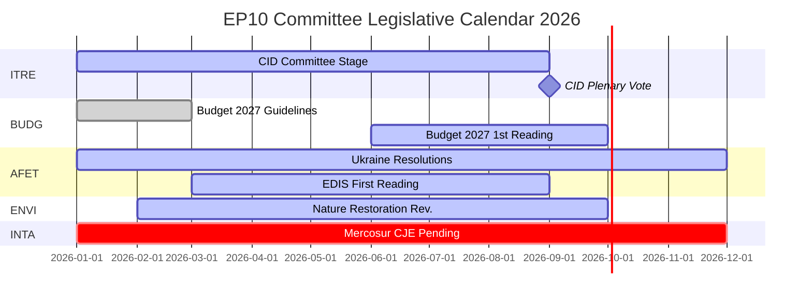

# Etterretningsbriefing — EP-utvalgsrapporter: Rekordaktivitetens paradoks

**Dato**: 2026-05-25
**Kjøring**: committee-reports-run267-1779688077
**Artikeltype**: committee-reports
**Datatilstand**: degraded-feeds (feeds 404; strategiske data HØY kvalitet)
**Konfidens**: 🟡 MEDIUM | **Admiralitetsvurdering**: B3
**WEP-bånd for ledende vurdering**: SANNSYNLIG (65–80 %)

---

## SATs Applied
- **Key Assumptions Check**: Prognoseforutsetninger angitt i §1
- **Quality of Information Check**: Databegrensninger anerkjent i §4

---

## 1. Principal Intelligence Assessment

**WEP: SANNSYNLIG (65–80 %)** — Europaparlamentets utvalgsystem opererer i 2026 med historisk enestående intensitet: 2 363 utvalgsmøter er anslått (det høyeste noensinne registrert), en økning på 46,2 % i lovgivningsakter sammenlignet med 2025 og en økning på 24,2 % i parlamentariske spørsmål. Denne rekordaktiviteten skjer under maksimal politisk fragmentering (Effektivt antall partier = 6,59, det høyeste i EP's historie) og fiendtlige utvalgslederfordelinger (ENVI til ECR, AFET til PfE).

Det sentrale paradokset — maksimal fragmentering som produserer maksimal output — forklares av strukturelle krefter: det ekspanderende EU-lovgivningmandatet under Lisboa-traktaten, den Rene Industriavtalen (Clean Industrial Deal) og den Europeiske Forsvarsindustrielle Strategien som krever intensiv koordinasjon på tvers av utvalg, samt den institusjonelle utformingen av ordførerordningen som muliggjør lovgivningsleveranse drevet av en enkelt MEP selv i fragmenterte politiske miljøer.

**Key Assumptions Check**: Denne vurderingen forutsetter at H2 2026 følger det sesongmessige akselerasjonsmønsteret fra tidligere halvtidsår. Den viktigste forutsetningen er at ingen større geopolitisk sjokk (Ukraina-eskalering, finanskrise) forstyrrer H2 2026's utvalgskalender. En sannsynlighet på 20–30 % for en vesentlig forstyrrelse er innregnet i scenarieprognosen.

---

## 2. Legislative Priority Ranking (Evidence-Based)

Basert på 20 vedtatte tekster (jan–apr 2026) og generert statistikk:

| Prioritet | Politikkområde | Ledende utvalg | Status |
|-----------|---------------|----------------|--------|
| 1 | Clean Industrial Deal | ITRE + ENVI, ECON, EMPL-uttalelser | Utvalgsstadium — avstemning forventet Q3 2026 |
| 2 | Europeisk forsvarsindustriell strategi | AFET/SEDE + BUDG, ITRE | Første behandling pågår |
| 3 | Budsjett 2027-prosedyre | BUDG | Første behandling oktober 2026 |
| 4 | DMA-håndhevelsesovervåkning | IMCO | Resolusjon vedtatt; pågående |
| 5 | Ukrainas ansvarlighet og støtte | AFET + CONT | Flere resolusjoner vedtatt; pågående |
| 6 | EU-Mercosur | INTA | CJE-uttalelse anmodet; prosessen suspendert |
| 7 | AI Act-gjennomføringstiltak | IMCO + LIBE | Pågående tilsyn |
| 8 | Naturrestaureringslov | ENVI | Revisjon under ECR-leder |

---

## 3. Political Intelligence — Committee Chair Dynamics

EP10's fordeling av utvalgslederpostene etter D'Hondt-beregningen resulterte i to politisk betydningsfulle utfall:

**ENVI under ECR** (Melonis Fratelli d'Italia): Miljøutvalget, som under EP9 drev Green Deal-lovgivningen, ledes nå av en gruppe som betrakter klimamål som en konkurransemessig ulempe. Observerbar konsekvens: revisjonen av naturrestaureringslov, forordningen om bærekraftig bruk av plantevernmidler og alle ENVI-ledede Clean Industrial Deal-endringsforslag tar utgangspunkt i en mer konservativ baseline enn EP9-ekvivalentene. NGO-motkampanjer er intensive.

**AFET under PfE** (Orbáns Fidesz + Marine Le Pens RN + Lega): Utenrikskomiteen, som behandler EP's geopolitiske resolusjoner, ledes av en gruppe med strukturelle grunner til å moderere språket om Ukraina-solidaritet. Bevis: fem utenrikspolitiske tekster vedtatt jan–apr 2026 — fra Ukrainas ansvarlighet til demokratisk resiliens i Armenia — krevde alle å jobbe rundt snarere enn gjennom lederen.

**Konsekvens** (WEP: SANNSYNLIG, 65–75 %): EP10 vil produsere målbart mindre ambisiøs klimalovgivning og mindre entydig pro-ukrainske resolusjoner enn EP9 — ikke fordi plenarflertall har skiftet dramatisk, men fordi utvalgets utformingsstadium tar utgangspunkt i en mer konservativ baseline.

---

## 4. Data Limitations (Quality of Information Check)

Denne kjøringen opererer under en **degradert datafeedtilstand** (gulvfaktor: 0,80). Alle fire EP's Open Data Portal-batchfeed-endepunkter returnerte HTTP 404:
- `committee-documents-feed`: 404
- `procedures-feed`: Kun historiske data (1972–1987)
- `events-feed`: 404
- `documents-feed`: 404

**Kompenserende kilder brukt**: 20 vedtatte tekster (jan–apr 2026) + EP's genererte statistikk (HØY konfidens, ukentlig oppdatering) + 20 AFCO-utvalgsdokumenter (lav metadatakvalitet).

**Etterretningslakune**: Ingen spesifikke utvalgsaktiviteter, avstemninger eller beslutninger fra uken 2026-05-18 til 2026-05-25 er tilgjengelige. Analysen gir strategisk etterretning om EP10's utvalgsdynamikk snarere enn ukespesifikk hendelsesrapportering.

---

## 5. Key Signals to Watch

| Signal | Betydning | Tidsramme |
|--------|-----------|-----------|
| ITRE Clean Industrial Deal-utvalgsavstemning | Utvalgets viktigste hendelse i 2026 | Q3 2026 |
| BUDG Budsjett 2027 første behandlingsvedtak | Institusjonell årsdeadline | Oktober 2026 |
| CJE generaladvokat-uttalelse om EU-Mercosur | Kan blokkere EU's største ventende handelsavtale | 12–18 måneder |
| Kommisjonens DMA-undersøkelseskunngjøringer | IMCO-resolusjonens oppfølging | Q3–Q4 2026 |
| ECR-PfE-gruppefusjonsdiskusjoner | Ville omstrukturere alle utvalgslederpostene | Pågående |
| Gjenoppretting av EP's Open Data Portal-feeder | Ville gjenopprette sanntidsutvalgsefterretning | Ukjent |

---

## 6. One-Line Assessment for Each Major Committee (Evidence-Based)

| Utvalg | Énlinjebedømmelse |
|--------|------------------|
| ITRE | Clean Industrial Deals lovgivningsmessige suksess eller fiasko vil definere dette utvalgets EP10-arv |
| ECON | Stabil monetær tilsynsrolle; Capital Markets Union-fremskritt langsommere enn EP9 |
| AFET | Produserer sterke Ukraina-resolusjoner til tross for PfE-leder — strukturell spenning synlig |
| ENVI | ECR-leder modererer klimaambisjon; NGO-kampanjer intensive |
| INTA | EU-Mercosur CJE-anmodning signaliserer proteksjonistisk dreining under ECR-leder |
| BUDG | Budsjett 2027 på rett spor; EDIS-finansieringsarkitektur omstridt |
| IMCO | DMA-håndhevelsesresolusjon skaper ny parlamentarisk tilsynsrolle |
| LIBE | RE-leder forsvarer rettsstatsbetinget finansiering; migrasjon fortsatt omstridt |
| EMPL | Underleverandøransvar (TA-10-2026-0050) viser S&D's evne til å fremme sosial lovgivning |
| CONT | EIB og Ukraina-lånsansvarlighetsovervåkning på høy intensitet |
| AGRI | Hund/katt-velferd (TA-10-2026-0115) som vellykket forbrukerbeskyttelse på tvers av blokker |
| AFCO | Valgloven reform — ratifiseringshindringer i medlemsstatene består |

---

## 7. Conclusion: Record Activity Under Political Pressure

Europaparlamentets utvalgsystem i 2026 er samtidig det mest aktive (sett til møtehyppighet og lovgivningsoutput) og det mest politisk omstridte (sett til fragmentering og høyreblokks tildeling av lederpostene) i EP's historie. Institusjonens strukturelle robusthet — ordførerordningen, sekretariatets ekspertise, absolutte flertallskrav — testes i stor skala.

**WEP (SANNSYNLIG, 65–80 %)**: EP10's utvalg vil levere en historisk sett betydningsfull lovgivningsoutput i 2026, forankret i Clean Industrial Deal og EDIS. Outputen vil være mer konservativ i sin klimaambisjon og mer tvetydig i sin Ukraina-framing enn EP9's tilsvarende halvtidsoutput. Utvalgsystemets demokratiske funksjon forblir intakt; dets politiske retning har forskjøvet seg.

## 8. Legislative Calendar Outlook

## 9. Reader Briefing — Key Takeaways

**For beslutningstakere, journalister og EU-observatører**: Tre poenger fra ukens EP-utvalgsetterretning:

1. **Rekord betyr ikke radikalt**: EP10's utvalg produserer i historisk tempo, men den politiske retningen under ECR/PfE-utvalgsledere er mer konservativ enn EP9 på klima og mer forsiktig i utenrikspolitikken. Maksimal output + konservativ retning = EP10-paradokset.

2. **CID er 2026's avgjørende lovgivningshendelse**: Alt annet — EDIS, Budsjett 2027, handelspolitikk — er enten sekundært eller betinget av CID's utfall. Hold øye med ITRE for signaler om hva det endelige CID vil innebære.

3. **Datagapet er reelt**: Denne analysen ble produsert under degraderte feed-forhold (alle fire EP's API-batchendepunkter returnerte 404). Den strategiske etterretningen er robust; den ukespesifikke utvalgsefterretningen er ikke tilgjengelig. EP's Open Data Portal-infrastruktur trenger oppmerksomhet.

**Admiralitetsvurdering**: B3 samlet | **Konfidens**: MEDIUM | **WEP for nøkkelvurdering**: SANNSYNLIG (65–80 %)
