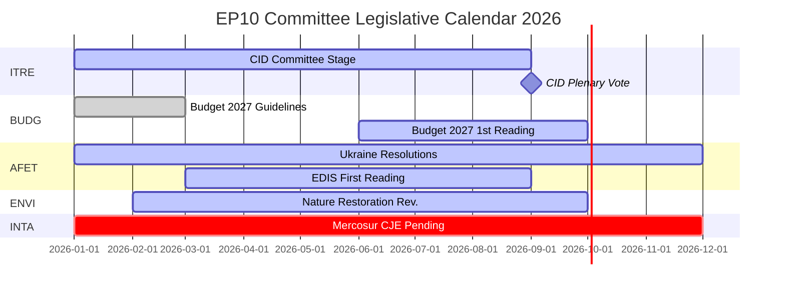

# Underrättelsebriefing — EP-utskottsrapporter: Rekordaktivitetens paradox

**Datum**: 2026-05-25
**Körning**: committee-reports-run267-1779688077
**Artikeltyp**: committee-reports
**Dataläge**: degraded-feeds (feeds 404; strategiska data HÖG kvalitet)
**Konfidens**: 🟡 MEDIUM | **Admiralitetsbetyg**: B3
**WEP-band på ledande bedömning**: TROLIGT (65–80 %)

---

## SATs Applied
- **Key Assumptions Check**: Prognosantaganden anges i §1
- **Quality of Information Check**: Databegränsningar erkänns i §4

---

## 1. Principal Intelligence Assessment

**WEP: TROLIGT (65–80 %)** — Europaparlamentets utskottssystem arbetar under 2026 med historiskt enastående intensitet: 2 363 utskottsmöten projiceras (det högsta som någonsin registrerats), en ökning med 46,2 % av lagstiftningsakter jämfört med 2025 och en ökning med 24,2 % av parlamentariska frågor. Denna rekordaktivitet sker under maximal politisk fragmentering (Effektivt antal partier = 6,59, det högsta i EP:s historia) och fientliga utskottsordförandetilldelningar (ENVI till ECR, AFET till PfE).

Den centrala paradoxen — maximal fragmentering som producerar maximal output — förklaras av strukturella krafter: den expanderande EU-lagstiftningens mandat under Lissabonfördraget, det Rena industriavtalet (Clean Industrial Deal) och den Europeiska försvarsindustrins strategi som kräver intensiv samordning mellan flera utskott, samt utskottssystemets institutionella design som möjliggör lagstiftningsleverans driven av en enda föredragande även i splittrade politiska miljöer.

**Key Assumptions Check**: Denna bedömning förutsätter att H2 2026 följer det säsongsmässiga accelerationsmönstret från tidigare halvtidsår. Det viktigaste antagandet är att ingen stor geopolitisk chock (eskalering i Ukraina, finanskris) stör H2 2026:s utskottskalender. En sannolikhet på 20–30 % för en väsentlig störning är inräknad i scenarioprognosen.

---

## 2. Legislative Priority Ranking (Evidence-Based)

Baserat på 20 antagna texter (jan–apr 2026) och genererade statistik:

| Prioritet | Politikområde | Ledande utskott | Status |
|-----------|--------------|-----------------|--------|
| 1 | Clean Industrial Deal | ITRE + ENVI, ECON, EMPL-yttranden | Utskottsstadium — omröstning förväntas Q3 2026 |
| 2 | Europeisk försvarsindustrisk strategi | AFET/SEDE + BUDG, ITRE | Första behandling pågår |
| 3 | Budgetprocedur 2027 | BUDG | Första behandling oktober 2026 |
| 4 | DMA-tillsynsövervakning | IMCO | Resolution antagen; pågående |
| 5 | Ukrainas ansvarsskyldighet och stöd | AFET + CONT | Flera resolutioner antagna; pågående |
| 6 | EU-Mercosur | INTA | CJE-yttrande begärt; processen suspenderad |
| 7 | AI Act-genomförandeåtgärder | IMCO + LIBE | Pågående tillsyn |
| 8 | Naturrestaureringslagen | ENVI | Revision under ECR-ordförande |

---

## 3. Political Intelligence — Committee Chair Dynamics

EP10:s tilldelning av utskotdsordförandeposter efter D'Hondt-beräkningen resulterade i två politiskt betydelsefulla utfall:

**ENVI under ECR** (Melonis Fratelli d'Italia): Miljöutskottet, som under EP9 drev Green Deal-lagstiftningen, leds nu av en grupp som betraktar klimatmål som en konkurrensnackdel. Observerbar konsekvens: revideringen av naturrestaureringslagen, förordningen om hållbar användning av bekämpningsmedel och samtliga ENVI-ledda Clean Industrial Deal-ändringsförslag utgår från en mer konservativ grundlinje än EP9-motsvarigheterna. NGO-motkampanjerna är intensiva.

**AFET under PfE** (Orbáns Fidesz + Marine Le Pens RN + Lega): Utrikesutskottet, som handlägger EP:s geopolitiska resolutioner, leds av en grupp med strukturella skäl att moderera språket om Ukrainasolidaritet. Bevis: fem utrikespolitiska texter antagna jan–apr 2026 — från Ukrainas ansvarsskyldighet till demokratisk resiliens i Armenien — krävde alla att man kringgick snarare än gick via ordföranden.

**Konsekvens** (WEP: TROLIGT, 65–75 %): EP10 kommer att producera mätbart mindre ambitiös klimatlagstiftning och mindre entydigt pro-ukrainska resolutioner än EP9 — inte för att plenarmajoriter har förskjutits dramatiskt, utan för att utskottets beredningsskede utgår från en mer konservativ grundlinje.

---

## 4. Data Limitations (Quality of Information Check)

Denna körning opererar under ett **degraderat dataläge** (golvfaktor: 0,80). Alla fyra EP:s Open Data Portal-batchflödesändpunkter returnerade HTTP 404:
- `committee-documents-feed`: 404
- `procedures-feed`: Historiska data enbart (1972–1987)
- `events-feed`: 404
- `documents-feed`: 404

**Kompenserande källor använda**: 20 antagna texter (jan–apr 2026) + EP:s genererade statistik (HÖG konfidens, veckouppdaterad) + 20 AFCO-utskottsdokument (låg metadatakvalitet).

**Underrättelselucka**: Inga specifika utskottsaktiviteter, omröstningar eller beslut från veckan 2026-05-18 till 2026-05-25 är tillgängliga. Analysen tillhandahåller strategisk underrättelse om EP10:s utskottsdynamik snarare än veckospecifik händelserapportering.

---

## 5. Key Signals to Watch

| Signal | Betydelse | Tidsram |
|--------|-----------|---------|
| ITRE Clean Industrial Deal-utskottsomröstning | Utskottets viktigaste händelse 2026 | Q3 2026 |
| BUDG Budget 2027 förstabehandlingsantagande | Institutionell årsdeadline | Oktober 2026 |
| CJE generaladvokatsyttrande om EU-Mercosur | Kan blockera EU:s största utestående handelsavtal | 12–18 månader |
| Kommissionens DMA-utredningsmeddelanden | IMCO-resolutionens uppföljning | Q3–Q4 2026 |
| ECR-PfE:s diskussioner om gruppfusion | Skulle omstrukturera alla utskottsordförandeposter | Pågående |
| Återställning av EP:s Open Data Portal-flöden | Skulle återställa underrättelse om utskott i realtid | Okänt |

---

## 6. One-Line Assessment for Each Major Committee (Evidence-Based)

| Utskott | Ettradsbedömning |
|---------|-----------------|
| ITRE | Clean Industrial Deals lagstiftningsframgång eller -misslyckande kommer att definiera detta utskotts EP10-arv |
| ECON | Stabil monetär tillsynsroll; Capital Markets Union-framstegen långsammare än EP9 |
| AFET | Producerar starka Ukrainaresolutioner trots PfE-ordförande — strukturell spänning synlig |
| ENVI | ECR-ordförande modererar klimatambitionen; NGO-kampanjer intensiva |
| INTA | EU-Mercosur CJE-begäran signalerar protektionistisk vändning under ECR-ordförande |
| BUDG | Budget 2027 på rätt spår; EDIS-finansieringsarkitektur omtvistad |
| IMCO | DMA-tillsynsresolution skapar ny parlamentarisk tillsynsroll |
| LIBE | RE-ordförande försvarar rättsstatsbetingad finansiering; migration fortfarande omtvistad |
| EMPL | Underentreprenadansvar (TA-10-2026-0050) visar S&D:s förmåga att driva social lagstiftning framåt |
| CONT | EIB och Ukrainalånets ansvarsskyldighetsövervakning på hög intensitet |
| AGRI | Hund/kattvälfärd (TA-10-2026-0115) som framgång för konsumentskydd över partigränser |
| AFCO | Vallagreformen — ratificeringshinder i medlemsstaterna kvarstår |

---

## 7. Conclusion: Record Activity Under Political Pressure

Europaparlamentets utskottssystem 2026 är samtidigt det mest aktiva (sett till mötesfrekvens och lagstiftningsoutput) och det mest politiskt omtvistade (sett till fragmentering och höger-blockstilldelning av ordförandeposter) i EP:s historia. Institutionens strukturella motståndskraft — föredragandesystemet, sekretariatets expertis, absoluta majoritetskrav — testas i stor skala.

**WEP (TROLIGT, 65–80 %)**: EP10:s utskott kommer att leverera en historiskt sett betydelsefull lagstiftningsoutput 2026, förankrad i Clean Industrial Deal och EDIS. Outputen kommer att vara mer konservativ i sin klimatambition och mer tvetydig i sin Ukrainaramning än EP9:s motsvarande halvtidsoutput. Utskottssystemets demokratiska funktion kvarstår intakt; dess politiska inriktning har förskjutits.

## 8. Legislative Calendar Outlook

## 9. Reader Briefing — Key Takeaways

**För beslutsfattare, journalister och EU-bevakare**: Tre lärdomar från veckans EP-utskottsunderrättelse:

1. **Rekord betyder inte radikalt**: EP10:s utskott producerar i historisk takt, men den politiska inriktningen under ECR/PfE-utskottsordförande är mer konservativ än EP9 vad gäller klimat och mer försiktig i utrikespolitiken. Maximal output + konservativ inriktning = EP10-paradoxen.

2. **CID är 2026:s avgörande lagstiftningshändelse**: Allt annat — EDIS, Budget 2027, handelspolitik — är antingen sekundärt eller beroende av CID:s utfall. Bevaka ITRE för signaler om vad det slutliga CID kommer att innebära.

3. **Datagapet är verkligt**: Denna analys producerades under degraderade feeder-förhållanden (alla fyra EP:s API-batchändpunkter returnerade 404). Den strategiska underrättelsen är robust; den veckospecifika utskottsunderrättelsen är inte tillgänglig. EP:s Open Data Portal-infrastruktur behöver uppmärksamhet.

**Admiralitetsbetyg**: B3 totalt | **Konfidens**: MEDIUM | **WEP på nyckelassessment**: TROLIGT (65–80 %)
