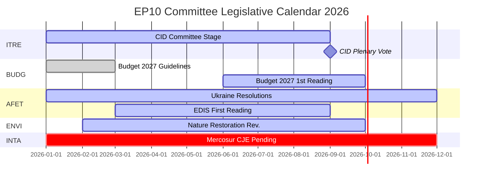

# 情报简报 — 欧洲议会委员会报告：创纪录活动的悖论

**日期**：2026-05-25
**运行编号**：committee-reports-run267-1779688077
**文章类型**：committee-reports
**数据模式**：degraded-feeds（数据流 404；战略数据高质量）
**置信度**：🟡 MEDIUM | **海军评级**：B3
**主要评估的 WEP 区间**：可能（65–80%）

---

## SATs Applied
- **Key Assumptions Check**：预测假设见 §1
- **Quality of Information Check**：数据局限性见 §4

---

## 1. Principal Intelligence Assessment

**WEP：可能（65–80%）** — 欧洲议会委员会系统在2026年以历史上前所未有的强度运作：预计召开委员会会议2,363次（创历史最高纪录），与2025年相比立法行为增加46.2%，议会问题增加24.2%。这一创纪录的活动发生在政治碎片化程度最高（有效政党数量 = 6.59，欧洲议会史上最高）以及委员会主席分配充满敌意（ENVI分配给ECR，AFET分配给PfE）的背景下。

核心悖论 — 最大碎片化产生最大产出 — 可以用结构性力量来解释：里斯本条约下不断扩展的欧盟立法授权、需要多委员会密集协调的Clean Industrial Deal和欧洲国防工业战略，以及报告员制度的制度设计，即使在政治分裂的环境中也能由单一议员推动立法成果。

**Key Assumptions Check**：此评估假设2026年下半年遵循以往中期年的季节性加速模式。最重要的假设是不会有重大地缘政治冲击（乌克兰局势升级、金融危机）干扰2026年下半年的委员会日历。情景预测中已考虑20–30%的重大干扰概率。

---

## 2. Legislative Priority Ranking (Evidence-Based)

基于2026年1月至4月的20份采纳文本及生成统计数据：

| 优先级 | 政策领域 | 牵头委员会 | 状态 |
|------|---------|---------|------|
| 1 | Clean Industrial Deal | ITRE + ENVI、ECON、EMPL意见 | 委员会阶段 — 预计2026年第三季度表决 |
| 2 | 欧洲国防工业战略 | AFET/SEDE + BUDG、ITRE | 一读进行中 |
| 3 | 2027年预算程序 | BUDG | 一读2026年10月 |
| 4 | DMA执法监督 | IMCO | 决议已采纳；持续中 |
| 5 | 乌克兰问责与支持 | AFET + CONT | 多项决议已采纳；持续中 |
| 6 | 欧盟-南方共同市场 | INTA | 已申请CJE意见；程序暂停 |
| 7 | 人工智能法实施措施 | IMCO + LIBE | 持续监督 |
| 8 | 自然恢复法 | ENVI | 在ECR主席领导下修订 |

---

## 3. Political Intelligence — Committee Chair Dynamics

EP10委员会主席按D'Hondt方法分配后产生了两个政治上具有重要意义的结果：

**ENVI（ECR领导下）**（梅洛尼的意大利兄弟党）：在EP9时期推动绿色协议立法的环境委员会，现由一个将气候目标视为竞争劣势的政治力量主持。可观察到的结果：自然恢复法修订、农药可持续使用法规以及ENVI主导的所有Clean Industrial Deal修正案均从比EP9更为保守的基准点出发。非政府组织的反对行动十分激烈。

**AFET（PfE领导下）**（欧尔班的青年民主党 + 勒庞的国民联盟 + 联盟党）：负责处理欧洲议会地缘政治决议的对外事务委员会，由一个在结构上有理由淡化乌克兰团结立场的政治力量主持。证据：2026年1月至4月采纳的五份对外政策文本 — 从乌克兰问责到亚美尼亚民主韧性 — 均需要绕开而非通过主席运作。

**含义**（WEP：可能，65–75%）：EP10将产生比EP9气候立法雄心更弱、乌克兰立场更模糊的政策文件 — 不是因为全体会议多数派发生了根本性变化，而是因为委员会起草阶段从更为保守的基准出发。

---

## 4. Data Limitations (Quality of Information Check)

本次运行在**数据流降级模式**下运作（底限系数：0.80）。欧洲议会开放数据门户的全部四个批量POST数据流端点均返回HTTP 404：
- `committee-documents-feed`：404
- `procedures-feed`：仅历史数据（1972–1987）
- `events-feed`：404
- `documents-feed`：404

**使用的补充数据源**：20份采纳文本（2026年1月至4月）+ 欧洲议会生成统计数据（高置信度，每周更新）+ 20份AFCO委员会文件（元数据质量低）。

**情报空白**：2026-05-18至2026-05-25当周的具体委员会活动、投票或决定均无法获取。本分析提供关于EP10委员会动态的战略情报，而非具体的每周事件报告。

---

## 5. Key Signals to Watch

| 信号 | 重要性 | 时间框架 |
|----|------|--------|
| ITRE Clean Industrial Deal委员会表决 | 2026年最重要的委员会事件 | 2026年第三季度 |
| BUDG 2027年预算一读采纳 | 年度机构性截止日期 | 2026年10月 |
| CJE法律顾问就欧盟-南方共同市场发表意见 | 可能阻断欧盟最大的待决贸易协定 | 12–18个月 |
| 欧盟委员会DMA调查公告 | IMCO决议后续行动 | 2026年第三至四季度 |
| ECR-PfE合并谈判 | 将重组所有委员会主席职位 | 持续中 |
| 欧洲议会开放数据门户数据流恢复 | 将恢复委员会实时情报 | 未知 |

---

## 6. One-Line Assessment for Each Major Committee (Evidence-Based)

| 委员会 | 单行评估 |
|------|--------|
| ITRE | Clean Industrial Deal的立法成败将定义该委员会的EP10历史遗产 |
| ECON | 货币监督职能稳定；资本市场联盟进展慢于EP9 |
| AFET | 尽管PfE担任主席，仍产出强有力的乌克兰决议 — 结构性紧张可见 |
| ENVI | ECR主席缓和气候雄心；非政府组织行动激烈 |
| INTA | 欧盟-南方共同市场CJE申请标志着ECR主席下的保护主义转向 |
| BUDG | 2027年预算进展顺利；EDIS融资架构有争议 |
| IMCO | DMA执法决议开创新的议会监督角色 |
| LIBE | RE主席捍卫法治条件性；移民问题仍有争议 |
| EMPL | 分包责任（TA-10-2026-0050）展示S&D推进社会立法的能力 |
| CONT | 欧洲投资银行及乌克兰贷款问责监督保持高强度 |
| AGRI | 犬猫福利（TA-10-2026-0115）作为跨派别消费者保护的成功案例 |
| AFCO | 选举法改革 — 成员国批准障碍持续存在 |

---

## 7. Conclusion: Record Activity Under Political Pressure

2026年的欧洲议会委员会系统同时是欧洲议会历史上最活跃（以会议频率和立法产出衡量）和政治争议最激烈（以碎片化程度和右翼阵营委员会主席分配衡量）的存在。机构的结构性韧性 — 报告员制度、秘书处专业知识、绝对多数要求 — 正在大规模接受考验。

**WEP（可能，65–80%）**：EP10委员会将在2026年以Clean Industrial Deal和EDIS为核心，交付具有历史意义的立法成果。其产出在气候雄心方面将比EP9同期的中期产出更为保守，在乌克兰立场的表述上更为模糊。委员会系统的民主功能保持完整；其政治方向已经改变。

## 8. Legislative Calendar Outlook

## 9. Reader Briefing — Key Takeaways

**政策制定者、记者和欧盟观察人士**：本周欧洲议会委员会情报的三点核心：

1. **创纪录不等于激进**：EP10委员会以历史性速度产出，但在ECR/PfE委员会主席领导下的政治方向在气候问题上比EP9更为保守，在外交政策上更为谨慎。最大产出 + 保守方向 = EP10悖论。

2. **CID是2026年决定性的立法事件**：其他一切 — EDIS、2027年预算、贸易政策 — 要么是次要的，要么取决于CID的结果。关注ITRE以获取最终CID走向的信号。

3. **数据空白是真实的**：本分析在数据流降级条件下生成（欧洲议会API四个批量端点均返回404）。战略情报扎实；每周具体委员会情报无法获取。欧洲议会开放数据门户基础设施需要关注。

**海军评级**：B3总体 | **置信度**：MEDIUM | **核心评估WEP**：可能（65–80%）
