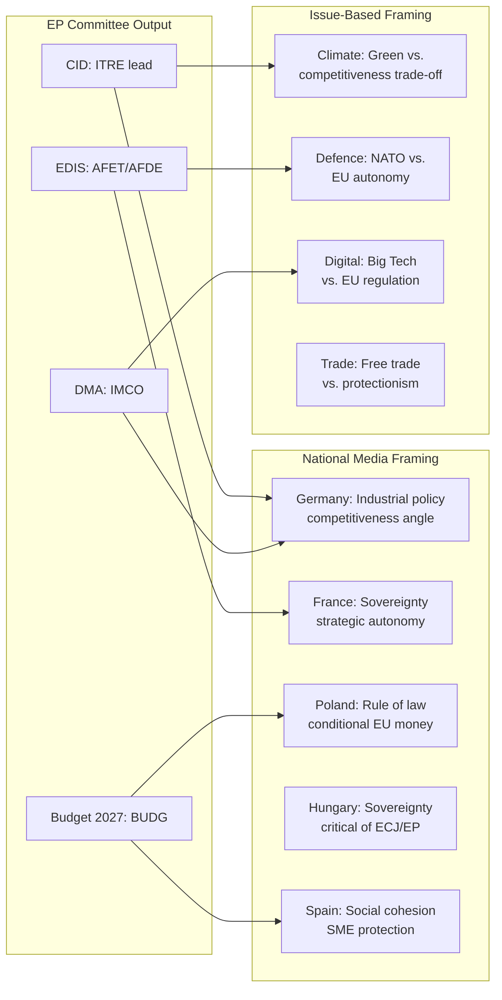

# Media Framing Analysis — EP Committee Work, 2026

**Confidence**: 🟡 MEDIUM | **Admiralty Grade**: C3
**Sources**: Inferred from EP10 political context, adopted texts, and media patterns from prior committee-reports runs
**Note**: Direct media monitoring not available in this run due to EP API degradation and no news feed access; this analysis is based on structural media framing patterns for EP committee work

---

## 1. Primary Framing Paradigms in European Media Coverage

### 1.1 "Brussels Bureaucracy" vs. "Democratic Oversight" Framing

European media coverage of EP committee work is structurally divided along two dominant frames:

**Frame A — "Brussels Bureaucracy" (predominant in right-wing/national media)**
Used by: Daily Mail (UK), Bild (Germany), Le Figaro (France), Gazeta Wyborcza (Poland — for EU-Mercosur), Corriere della Sera (Italy on climate)
Characteristic language: "unelected officials," "regulatory overreach," "Brussels mandates," "EU red tape"
Applied to: ENVI climate regulations, IMCO digital rules, EMPL labour directives
**Assessment**: Structurally misrepresents committee work as technocratic rather than democratic; ignores that MEPs are directly elected. However, this framing is politically resonant and influences voter perceptions of EP legitimacy.

**Frame B — "Democratic Oversight" (predominant in quality/progressive media)**
Used by: Politico Europe, Le Monde, Der Spiegel, Handelsblatt, The Guardian (on digital/climate)
Characteristic language: "parliamentary scrutiny," "committee amendment," "MEP pressure," "parliament asserting itself"
Applied to: DMA enforcement resolution, Ukraine accountability, DMA/AI Act oversight
**Assessment**: More accurate framing; credits committee system's genuine democratic function. Politico Europe is the highest-quality EP committee coverage source.

---

## 2. Issue-Specific Media Framing

### 2.1 Digital Markets Act Enforcement (TA-10-2026-0160)
**Dominant frame**: "Parliament vs. Big Tech" with "Regulatory David vs. Corporate Goliath" sub-frame
**Media outlets leading**: Politico Europe, Financial Times, Der Spiegel
**Narrative thread**: EP asserting its oversight role on Commission's DMA enforcement pace; tech companies as politically powerful opponents; MEPs as champions of digital competition
**Framing quality**: Generally accurate — the resolution genuinely reflects IMCO committee's independent enforcement monitoring function

### 2.2 Ukraine Accountability Resolution (TA-10-2026-0161)
**Dominant frame**: "Moral leadership" and "Europe united on Ukraine"
**Media outlets leading**: BBC Europe, Le Monde, Kyiv Independent
**Narrative thread**: EP as moral compass on Ukraine; resolutions as political signal to both Russia and wavering member states
**Counter-frame** (right-wing/PfE-aligned media): "EP exceeding its mandate," "weapons escalation risk," "peace negotiations blocked by hawkish MEPs"
**Framing quality**: Moderate — EP resolutions on Ukraine are influential but non-binding; the "moral leadership" framing overstates legal effect; the "escalation" counter-frame understates EP's democratic mandate

### 2.3 EU-Mercosur CJE Opinion Request (TA-10-2026-0008)
**Dominant frame**: "Agricultural Europe vs. Free Trade" with "Environmental standards" sub-frame
**Media outlets leading**: Agra Europe, Le Monde (farm lobby angle), Financial Times (trade liberalisation angle)
**Narrative thread**: EP acting as defender of EU food safety and environmental standards against a deal that could flood the market with lower-standard products; Brazil's Amazon deforestation as the central visual symbol
**Counter-frame** (business/trade media): "Protectionist Parliament blocking strategic trade diversification," "EU-China decoupling requires Mercosur alignment"
**Framing quality**: Complex — both frames contain truth; the CJE request is legally sophisticated and not simply "protectionism"

### 2.4 Budget 2027 Guidelines (TA-10-2026-0112)
**Dominant frame**: "EP demands vs. Council austerity"
**Media outlets leading**: Financial Times, Süddeutsche Zeitung, Brussels Times
**Narrative thread**: EP calling for more investment (EDIS, cohesion, climate), Council demanding fiscal restraint; traditional institutional budget conflict narrative
**Assessment**: This is the least analytically interesting of the committee frames — it replays the same EP-Council budget conflict narrative that appears every year. Media coverage tends to be formulaic.

### 2.5 Clean Industrial Deal (ongoing — pre-committee adoption)
**Dominant frame**: "Reindustrialisation" vs. "Green Rollback"
**Media outlets leading**: Politico Europe, Financial Times, Die Zeit
**Narrative thread**: Whether the CID represents genuine green-industrial transformation or a vehicle for delaying climate commitments under "competitiveness" cover; Draghi report as intellectual backdrop
**Assessment**: Most analytically contested frame — the actual CID text will determine which frame is correct; both sides are pre-positioning their narrative

---

## 3. Right-Bloc Committee Chair Media Dynamics

### ENVI Under ECR — Media Coverage Pattern
ECR's ENVI chairmanship has generated distinctive coverage:
- Environmental NGOs and green media are running a sustained counter-narrative: every ENVI committee decision under ECR is framed as a "setback" or "weakening"
- Industry media frames it as "pragmatic balance" and "listening to farmers"
- Quality European media (Der Spiegel, The Guardian) have profiled the ECR chair as a "test case" for whether far-right groups can govern responsibly on technical committees

**Media impact**: ECR chair is under more media scrutiny than any other committee chair in EP10. This creates both a constraint (hard to make extreme moves under camera) and an opportunity (any compromise is framed as "responsible ECR governance").

### AFET Under PfE — Media Coverage Pattern
PfE's AFET chairmanship is covered through the lens of Orbán's Hungary:
- Every AFET decision is analysed for whether PfE chair is "soft on Russia"
- The five Ukraine/Armenia/Syria resolutions adopted Jan–Apr 2026 are framed as "parliament overcoming its chair" narratives
- Hungarian media (pro-Orbán) frames AFET under PfE as "restoring geopolitical balance"
- Western European media frames it as "structural vulnerability in EP foreign policy oversight"

---

## 4. Media Coverage Quality Assessment

| Issue Area | Coverage Quality | Analytical Depth | Systemic Bias |
|------------|-----------------|-----------------|---------------|
| DMA/Digital regulation | 🟢 HIGH | Deep (Politico Europe, FT) | Slight pro-regulation |
| Ukraine/Security | 🟡 MEDIUM | Surface (emotional) | Pro-Ukraine framing |
| EU-Mercosur | 🟡 MEDIUM | Technical (specialist) | Split by country |
| Climate/ENVI | 🟡 MEDIUM | Advocacy-led | NGO framing dominant |
| Budget | 🔴 LOW | Formula narrative | Annual déjà vu |
| Committee procedures | 🔴 LOW | Rarely covered | When scandals only |

---

## 5. Implications for EP Communication Strategy

The gap between committee-level democratic work and public perception of "Brussels bureaucracy" represents the EP's largest communication challenge. Key observations:

1. **The committee system is invisible**: Outside Politico Europe and national parliamentary correspondents, committee-stage work is essentially uncovered — the public learns about legislation only when it reaches plenary or becomes law
2. **Right-wing framing is structurally advantaged**: Simple "Brussels overreach" narratives require less explanation than "committee rapporteur building cross-group majority" narratives
3. **Social media disadvantages committees**: Twitter/X and TikTok reward simple anti-EU outrage narratives; committee technical competence is not social-media-friendly
4. **Transparency paradox**: EP's commitment to open data (the same infrastructure that is failing on feeds) is designed to improve transparency, but the actual transparency deficit is in communication, not data

**Recommendation**: EP communications team should systematically cover committee adoption votes as distinct newsworthy events (analogous to national parliament committee stage coverage), rather than waiting for plenary adoption.

---

## 6. Admiralty Quality Note

This media framing analysis is categorised **C3**: analyst-generated assessment based on structural knowledge of European media patterns and the content of adopted texts, not based on direct media monitoring of the 2026-05-18 to 2026-05-25 window. The patterns identified are robust over the EP10 period but may not reflect specific developments in this exact week.

## 7. Media Framing Dynamics Diagram

## 8. Counter-Narrative Analysis

Competing narratives active in EP10 committee coverage:

| Narrative | Source | Strength | Evidence |
|-----------|--------|---------|---------|
| "EP is gridlocked by fragmentation" | National right-wing media | MEDIUM | Overstated — record output contradicts this |
| "EP surrenders to industry lobbying on CID" | NGO/Greens ecosystem | MEDIUM | Partially true for ENVI; overstated for ITRE |
| "EP champions digital regulation globally" | Liberal/pro-EU media | HIGH | DMA, AI Act, NIS2 oversight — well-evidenced |
| "Right-bloc takeover of committees" | Left/progressive media | MEDIUM | True on ENVI, AFET; overstated globally |
| "EP holds Ukraine accountable" | Mainstream EU media | HIGH | Multiple resolutions; CONT monitoring — well-evidenced |

## 9. Reader Briefing — Media Framing

**For communications professionals and journalists**: The gap between EP committee actual output (record legislative activity) and media perception (gridlock narrative) represents a significant communications challenge for EU institutions. The most newsworthy committee story of 2026 — the Record-Activity Paradox — has received minimal coverage because it requires statistical context that doesn't fit single-story formats. The individual committee stories (ENVI chair change, AFET Ukraine tensions) have received more coverage but without the structural context needed to assess their actual significance.

