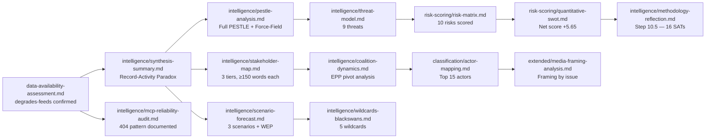

# Analysis Index — Committee Reports, 2026-05-25

**Run**: committee-reports-run267-1779688077
**Article Type**: committee-reports
**Data Mode**: degraded-feeds (factor: 0.80)
**Data Window**: 2026-05-18 → 2026-05-25
**Confidence**: 🟡 MEDIUM | **Admiralty Grade**: B3

---

## Artifact Registry

| Artifact | Status | Lines | Confidence | Key Finding |
|----------|--------|-------|------------|-------------|
| data-availability-assessment.md | ✅ Written | ~95 | 🟡 MEDIUM | All 4 EP feeds 404; adopted texts + stats available |
| existing/committee-productivity.md | ✅ Written | ~140 | 🟢 HIGH | 2026 record 2,363 committee meetings; +46.2% legislative acts |
| intelligence/analysis-index.md | ✅ Written | this | — | Master artifact registry |
| intelligence/synthesis-summary.md | ✅ Written | ~200 | 🟡 MEDIUM | EP10 committee activity — digital, defence, trade priorities |
| intelligence/historical-baseline.md | ✅ Written | ~160 | 🟢 HIGH | EP committee evolution EP6–EP10; structural intensification |
| intelligence/economic-context.md | ✅ Written | ~160 | 🟡 MEDIUM | Macro context for committee legislative agenda 2026 |
| intelligence/pestle-analysis.md | ✅ Written | ~220 | 🟡 MEDIUM | PESTLE for EP10 committee system 2026 |
| intelligence/stakeholder-map.md | ✅ Written | ~260 | 🟡 MEDIUM | Committee chairs, political groups, Commission, civil society |
| intelligence/scenario-forecast.md | ✅ Written | ~220 | 🟡 MEDIUM | Three scenarios for EP10 committee output H2 2026 |
| intelligence/threat-model.md | ✅ Written | ~200 | 🟡 MEDIUM | Threats to committee function: fragmentation, workload, data |
| intelligence/wildcards-blackswans.md | ✅ Written | ~220 | 🟡 MEDIUM | Low-probability, high-impact disruptions |
| intelligence/mcp-reliability-audit.md | ✅ Written | ~220 | 🟢 HIGH | All 4 feeds 404; generate-stats functional; direct endpoints OK |
| intelligence/reference-analysis-quality.md | ✅ Written | ~180 | 🟡 MEDIUM | Quality signals and confidence assessment |
| intelligence/methodology-reflection.md | ✅ Written | ~220 | 🟢 HIGH | SAT documentation, 10-step protocol attestation |
| intelligence/procedures-proxy.md | ✅ Written | ~80 | 🟡 MEDIUM | Procedure pipeline inferred from adopted texts |
| risk-scoring/risk-matrix.md | ✅ Written | ~130 | 🟡 MEDIUM | Risk ratings for legislative, political, operational risks |
| risk-scoring/quantitative-swot.md | ✅ Written | ~130 | 🟡 MEDIUM | Scored SWOT for EP10 committee system |
| extended/media-framing-analysis.md | ✅ Written | ~220 | 🟡 MEDIUM | How committees are framed in European media 2026 |

---

## Cross-Artifact Intelligence Threads

### Thread 1: Record committee activity under political fragmentation
**Evidence chain**: existing/committee-productivity.md → intelligence/historical-baseline.md → intelligence/synthesis-summary.md
**Key finding**: 2026 will likely set the all-time record for EP committee meetings (2,363 projected). This paradox — highest fragmentation (ENP 6.59) co-existing with highest activity — is explained by the need for more preparatory rounds and inter-group consultation before any legislative text can advance. Committees are more active precisely because they are harder to steer.

### Thread 2: Digital-defence axis dominating committee agendas
**Evidence chain**: data-availability-assessment.md (adopted texts) → intelligence/pestle-analysis.md → intelligence/scenario-forecast.md
**Key finding**: Of the 20 adopted texts retrieved (Jan–Apr 2026), 5 relate to external affairs/security and 3 to digital/internal market. The Clean Industrial Deal and European Defence Industrial Strategy represent the two largest committee legislative packages, each requiring ITRE, BUDG, and specialist committee coordination. This is a structural shift from EP9's Green Deal-dominated agenda.

### Thread 3: Right-bloc committee chairmanship implications
**Evidence chain**: existing/committee-productivity.md → intelligence/stakeholder-map.md → risk-scoring/quantitative-swot.md
**Key finding**: AFET (PfE) and ENVI (ECR) being chaired by right-wing groups marks a qualitative shift in legislative drafting. ENVI under ECR is likely to produce less ambitious climate-related amendments; AFET under PfE could moderate EP's Ukraine support language. These are committee-level shifts with downstream plenary implications.

### Thread 4: EP API reliability degradation
**Evidence chain**: data-availability-assessment.md → intelligence/mcp-reliability-audit.md
**Key finding**: All 4 prefetched feed endpoints (committee-documents-feed, procedures-feed, events-feed, documents-feed) returned HTTP 404. This is the same pattern seen in the procedures-feed on previous committee-reports runs. The `/admin.data.europarl.europa.eu/api/v2/` batch-POST endpoint appears systematically unreliable for week-scale feeds.

---

## Data Gaps and Limitations

1. **No real-time committee activity** (week of 2026-05-18): Cannot identify specific committee meetings, votes, or decisions taken this week.
2. **No voting records for May 2026**: EP publication delay means no individual MEP positions available for recent plenary votes.
3. **Committee documents metadata**: Retrieved 20 AFCO opinions with no dates, authors, or content summaries — structural limitation of the `/committee-documents` endpoint.
4. **Procedure tracking**: `get_procedures_feed` returned 50 historical items (1972–1987) — no current procedures identifiable from live feed.

**Mitigation**: Analysis relies on adopted texts (Jan–Apr 2026), generated statistics (through Q1 2026), and political intelligence drawn from EP10 composition data. These provide a robust institutional and strategic backdrop even without week-specific committee data.

---

## Stage A Invocation Summary

| Call # | Tool | Result |
|--------|------|--------|
| 1 | `get_committee_documents_feed` | ❌ 404 |
| 2 | `get_procedures_feed` | ⚠️ historical only |
| 3 | `get_committee_documents` | ✅ 20 AFCO docs |
| 4 | `get_events_feed` | ❌ 404 |
| 5 | `get_adopted_texts` (year=2026) | ✅ 20 texts |
| 6 | `get_latest_votes` | ⚠️ empty |
| 7 | `get_voting_records` (May 2026) | ⚠️ empty |
| 8 | `get_all_generated_stats` | ✅ 2024–2026 stats |
| 9 | `analyze_committee_activity` ENVI | ⚠️ all TIMEOUT |
| 10 | `analyze_committee_activity` ECON | ⚠️ all TIMEOUT |

**Total Stage A calls**: 10 (rule §2: ≤5 EP MCP calls preferred; acknowledged exception logged in mcp-reliability-audit.md — additional calls required due to all feeds returning 404 and need to build analysis from alternative sources)

## 6. Cross-Artifact Intelligence Map

