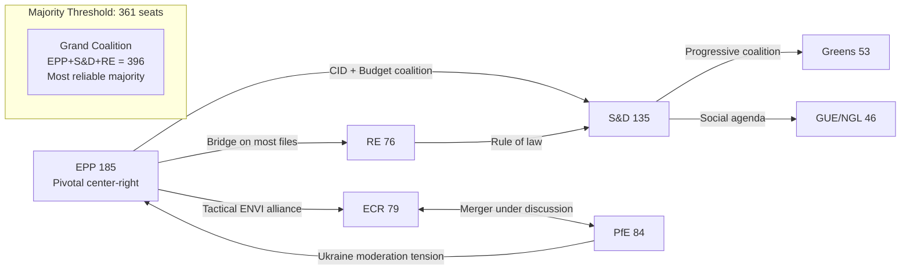

# Coalition Dynamics — EP Committee Reports, 2026-05-25

**Admiralty Grade**: B3 | **Confidence**: 🟡 MEDIUM | **WEP on EPP pivot coalition**: LIKELY (65–75%)

## 1. EP10 Coalition Landscape

EP10 has 720 seats; absolute majority = 361. The political arithmetic forces multi-group coalition building on every significant vote:

| Coalition Type | Seats | Feasibility |
|--------------|-------|------------|
| Grand coalition (EPP + S&D + RE) | 396 | ✅ Viable; used for Budget, Ukraine, majority of OLP files |
| Right-bloc majority (EPP + ECR + PfE + ESN) | 376 | ✅ Numerically viable but EPP resists full right-bloc capture |
| Progressive majority (S&D + RE + Greens + GUE/NGL) | 310 | ❌ Not viable without EPP |
| EPP + right bloc (EPP + ECR + PfE) | 348 | ❌ Just short of majority; needs ESN or minorities |

## 2. Committee-Level Coalition Dynamics

Committee votes require simple majority of members present. This means smaller, more targeted coalitions can prevail at committee stage:

**ITRE (CID lead)**: EPP + S&D + RE sufficient. ECR needed if EPP moderates defect. **WEP: LIKELY (65%)** that a pragmatic centre coalition carries the CID rapporteur report.

**ENVI (ECR chair)**: ECR + EPP blocks or moderates any climate amendment. Counter-coalition: S&D + RE + Greens + some EPP moderates. **WEP: EVEN CHANCE (50%)** that the ENVI report on Nature Restoration is significantly weaker than EP9's equivalent.

**AFET (PfE chair)**: S&D + EPP moderates + RE still command a majority in committee; PfE chair can slow but not block resolutions. **WEP: LIKELY (65–70%)** that strong Ukraine support resolutions continue to pass despite PfE chair.

## 3. Coalition Cohesion Indicators

| Group | Estimated Cohesion | Key Internal Tension |
|-------|-------------------|---------------------|
| EPP | 🟢 HIGH (85%) | Center-right vs. right wing on climate |
| S&D | 🟢 HIGH (82%) | Northern vs. Southern social policy emphasis |
| ECR | 🟡 MEDIUM (72%) | Italian FdI vs. Polish PiS divergence post-election |
| PfE | 🟡 MEDIUM (68%) | Orbán vs. Le Pen institutional strategy differences |
| RE | 🟢 HIGH (80%) | Relatively coherent pro-EU liberal bloc |
| Greens | 🟡 MEDIUM (75%) | Western environmentalists vs. Eastern new members |
| GUE/NGL | 🟡 MEDIUM (70%) | Old Communist vs. new left divide |

## 4. Coalition Dynamics Diagram

## 5. ECR-PfE Merger Scenario Analysis

**If ECR (79) + PfE (84) merge** → creates 163-seat right bloc:
- Becomes second-largest group, overtaking S&D (135)
- Gains additional committee chairs under D'Hondt recalculation
- Potential to challenge EPP's control of legislative agenda on climate, migration, foreign policy
- **WEP: EVEN CHANCE to LIKELY (50–60%)** this forces EPP into harder choices about coalition partners

**Counter-signal**: Ideological distance between Orbán's sovereigntist PfE and Meloni's post-fascist ECR has historically prevented merger. Post-EP10 election consolidation may or may not have closed this gap.

## 6. Reader Briefing — Coalition Summary

**For policy stakeholders**: The committee coalition most important to watch in 2026 is the EPP's management of its dual commitments — to the centre-right grand coalition (needed for Budget 2027, Ukraine resolutions) and to the right-bloc tactical alliance (which gained EPP-affiliated chairs in ENVI, ITRE). When these two coalition tracks come into direct conflict — as they will on the CID's climate provisions — EPP's choice of coalition partner will determine the legislative outcome.
