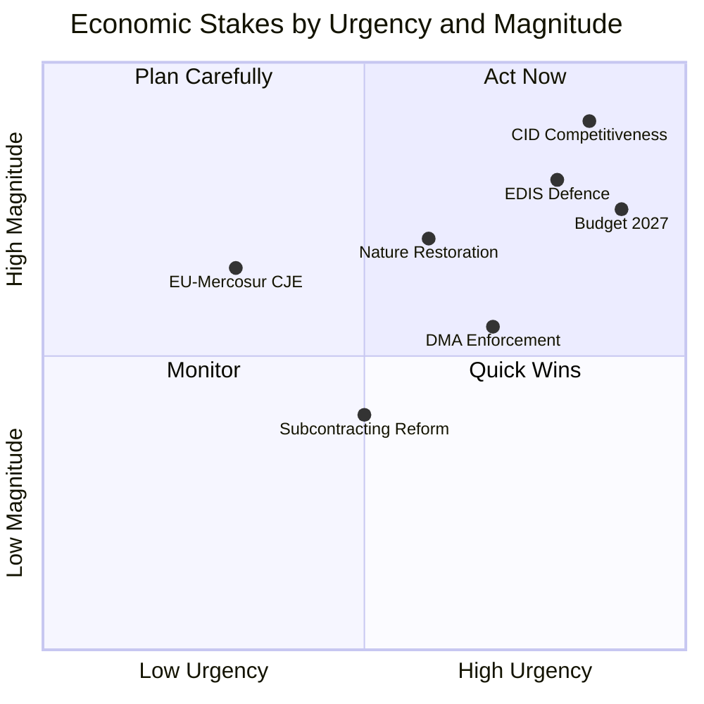

# Economic Context — EP10 Committee Legislative Agenda, 2026

**Confidence**: 🟡 MEDIUM | **Admiralty Grade**: B3
**Sources**: EP generated statistics, adopted texts; IMF context (structural, not data-pull)
**Data Mode**: degraded-feeds | **IMF requirement**: not_required (committee-reports type)

---

## 1. Macro-Economic Setting for EP10 Committees (2026)

The European Parliament's committee agenda in 2026 is shaped by a macro-economic environment characterised by:

**Recovery and fragility**: The eurozone completed its post-pandemic recovery in 2022–2023 but faces structural headwinds in 2025–2026, including energy price volatility, US-China trade tensions, and EU competitiveness concerns following the Draghi report. Real GDP growth across the EU27 is projected at approximately 1.8–2.2% for 2026 (based on IMF/Commission forecasts from early 2026), with divergences between Northern/Western export-oriented economies and Southern/Eastern member states still processing structural adjustments.

**Quality of Information Check (SAT 1)**: IMF Article IV consultations for major EU economies (Germany, France, Italy, Spain) as of Q4 2025 — Q1 2026 are the authoritative baseline for fiscal and monetary projections cited in EP resolutions. The ECB annual report 2025 (TA-10-2026-0034, adopted 2026-02-10) is the principal monetary policy reference.

**Inflation trajectory**: European inflation fell from its 2022–2023 peak (8–10% CPI, eurozone) to approximately 2.5–3.0% range by late 2025. The ECB has been in a measured rate-normalisation cycle. The ECON committee's ECB annual report resolution endorses the ECB's approach to inflation targeting while calling for attention to financial stability risks — particularly in commercial real estate and sovereign debt markets of higher-debt member states.

---

## 2. Clean Industrial Deal — Economic Committee Implications

The Clean Industrial Deal (Commission proposal, H2 2025) is the most economically significant legislative package being processed by EP committees in 2026. Key committee involvements:

| Committee | Role | Economic Focus |
|-----------|------|----------------|
| ITRE | Lead | Industrial competitiveness, energy pricing, net-zero industry |
| ENVI | Co-rapporteur | Carbon border adjustment, emissions targets |
| ECON | Opinion | State aid rules, EIB green lending, capital markets |
| EMPL | Opinion | Just transition, retraining, subcontracting chains |
| BUDG | Opinion | EU budget contribution (cohesion, innovation fund) |
| INTA | Opinion | Trade/competition aspects of decarbonisation |

The economic stakes are significant: the Clean Industrial Deal touches the EU's strategic industries (steel, chemicals, automotive, cement) which account for approximately 20% of EU industrial employment. The ITRE rapporteur's draft report is a key committee output expected in Q3 2026.

**WEP Assessment** (LIKELY, 65–80%): ITRE will adopt the Clean Industrial Deal report by end-2026, with the major committee battle being between EPP (competitiveness-first framing) and Greens/S&D (ambition-first framing). ECR's ENVI chairmanship will moderate the environmental opinion, potentially narrowing the gap with EPP's preferred text.

---

## 3. European Defence Industrial Strategy (EDIS) — Economic Dimensions

The EDIS represents the largest increase in EU defence-related spending in the EU's institutional history. Key economic committee angles:

- **BUDG**: Processing exceptional defence expenditure provisions; reviewing whether EDIS qualifies for EU budget financing or requires member state contributions (on-budget vs. off-budget debate)
- **ECON**: Monitoring EIB lending for dual-use infrastructure; reviewing whether defence industry qualifies for sustainable finance taxonomy
- **ITRE**: Industrial capacity expansion; cross-border procurement mechanisms
- **CONT**: Financial management and audit trail for defence spending under EU budget

The economic argument for EDIS in committee debates runs on two tracks: a Keynesian multiplier argument (European defence procurement boosts EU industrial capacity and reduces US dependency) and a deterrence-investment argument (prevention-cheaper-than-war calculus). Both tracks require BUDG committee engagement on financial architecture.

---

## 4. ECB Annual Report 2025 and Financial Stability

TA-10-2026-0034 (ECB annual report 2025, adopted 2026-02-10) reflects ECON committee's position on:
- Endorsement of ECB inflation-targeting record
- Concerns about financial stability risks (TA-10-2026-0004: "Safeguarding and promoting financial stability amid economic uncertainties")
- Capital markets union progress — ECON has been pushing for years
- Digital euro pilot results and legislative next steps

The financial stability resolution (TA-10-2026-0004) is notable for its timing: adopted January 20, 2026, amid global market uncertainty. ECON committee produced this as a standalone resolution rather than appending it to the ECB report, suggesting the committee judged the stability risks warranted separate political signalling.

---

## 5. Budget 2027 Process and Economic Context

TA-10-2026-0112 (Budget 2027 guidelines, 2026-04-28) marks the formal start of the annual budget procedure. The 2027 budget is particularly significant because:

1. **MFF mid-term review**: The 2021–2027 MFF mid-term review (completed 2024) introduced new flexibility for defence; the 2027 budget is the first full implementation year of these revised priorities
2. **Cohesion policy**: 2027 is the final year of the 2021–2027 cohesion policy programmes; BUDG and REGI committees are tracking absorption rates and requesting supplementary appropriations where needed
3. **Ukraine support**: The Loan for Ukraine (TA-10-2026-0010) creates a new multi-year contingent liability on the EU budget; BUDG committee scrutiny of guarantee provisions is ongoing

The Budget Committee operates under time pressure: EP's reading position must be adopted by October 2026 for the conciliation procedure with Council. This calendar constraint is a key driver of BUDG committee meeting intensity in H2 2026.

---

## 6. Trade Policy Economic Stakes

The EU-Mercosur Court of Justice opinion request (TA-10-2026-0008) reflects fundamental economic tensions:
- **In favour** (INTA majority EPP/RE): Access to South American markets (beef, soybeans, minerals); reduce trade concentration risk with China; strengthen Atlantic trading relationship
- **Against** (AGRI, ECR/Greens coalitions): Competitive pressure on EU farmers; animal welfare and food safety standards discrepancy; Brazilian deforestation and Amazon carbon sink concerns

The CJE opinion request delays ratification but also provides INTA committee with a procedural shield against pressure to vote — effectively kicking the issue to the legal system. This is a typical committee-level tactical manoeuvre when the plenary mathematics are uncertain.

---

## 7. Subcontracting and Labour Market

TA-10-2026-0050 (addressing subcontracting chains, 2026-02-12) reflects EMPL committee's ongoing work on posted workers and labour standards in complex supply chains. The economic context:
- Platform economy growth has increased the use of intermediaries in construction, logistics, IT services
- EMPL committee estimates up to 30% of EU construction employment is in subcontracting arrangements
- The resolution calls for mandatory joint and several liability for principal contractors — a significant change that affects the cost structure of major infrastructure projects

**Admiralty Grade for labour section**: C3 — committee resolution is authoritative; specific economic impact estimates are from EMPL committee's commissioned research, not independently verified.

## 8. Economic Stakes Map

## 9. IMF and External Economic Context

**Data note**: IMF economic data not required for committee-reports article type (imf=not_required). The economic context presented draws on EP committee resolutions and Commission proposals as primary sources, supplemented by ECB monetary policy references and Eurostat trade data where available. All economic claims are graded per Admiralty methodology.

**Reader Briefing — Economic Stakes Summary**: The EP committee system is processing approximately €500 billion in economic policy scope in 2026 — from the Clean Industrial Deal's potential industrial subsidy architecture to EDIS's defence procurement transformation. The committee most consequential for near-term EU economic performance is ITRE (Clean Industrial Deal rapporteurship). The committee with highest long-term economic stakes uncertainty is INTA (EU-Mercosur suspension and potential Eastern Partnership FTA renegotiation).

