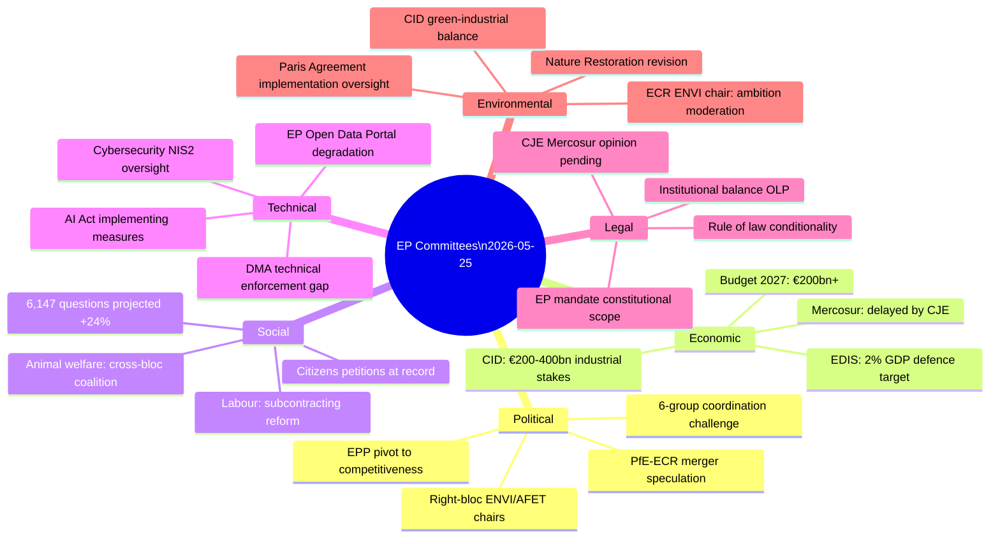

# PESTLE Analysis — EP10 Committee System, 2026

**Confidence**: 🟡 MEDIUM | **Admiralty Grade**: B3
**SATs Applied**: PESTLE (SAT 6), Force-Field Analysis (SAT 7)
**Data Mode**: degraded-feeds | **WEP bands included**

---

## Political Factors

### P1 — Right-Bloc Realignment in Committee Leadership
**WEP**: LIKELY (65–80%) this realignment produces measurably different legislative outputs compared to EP9.

The assignment of AFET to Patriots for Europe (PfE, 84 seats) and ENVI to ECR (79 seats) represents the most significant political shift in EP committee leadership since the post-2019 election. PfE is led by Viktor Orbán's Fidesz party and includes far-right and nationalist MEPs from France (RN), Italy (Lega), Belgium, and Austria. ECR includes Italian Fratelli d'Italia, Polish PiS (diminished), and Swedish Democrats.

**Political dynamics**:
- AFET under PfE chair means plenary reports on Ukraine resolutions face a chair who is structurally inclined toward more ambiguous language — the S&D and EPP rapporteurs will need to work around the chair to advance pro-Ukraine texts
- ENVI under ECR means the committee's first-pass amendments on climate legislation will start from a less ambitious baseline; Greens and S&D must table counter-amendments at every stage
- INTA under ECR means trade agreement scrutiny from a nationalist-economic angle — the EU-Mercosur CJE opinion request reflects this posture

**Force-Field Analysis (SAT 7)**:
- *Driving forces toward right-bloc committee assertiveness*: EP10 electoral mandate, coalition majority mathematics, PfE's first experience as committee holders
- *Restraining forces*: Parliamentary procedures require absolute majority for amendment passage; EPP needs S&D on some climate votes; PfE MEPs lack committee expertise on some technical dossiers

### P2 — EPP Swing-Vote Strategy
EPP (185 seats) is the essential coalition partner for any majority. Under Manfred Weber's leadership, EPP has pursued a "flexible majority" strategy — forming different coalitions depending on the issue:
- Digital regulation: EPP + RE + Greens (tech regulation)
- Defence: EPP + ECR + PfE (sovereignty, defence spending)
- Climate: EPP + RE (centrist environmental regulation)
- Migration: EPP + ECR + PfE + ESN (restrictive policy)
- Budget: EPP + S&D + RE (pro-EU fiscal framework)

This flexibility makes EPP the pivotal committee actor but also makes committee outcomes less predictable — rapporteurs cannot know in advance which EPP faction will dominate on any given amendment.

### P3 — Rule of Law and Democratic Backsliding Monitoring
The LIBE committee maintains an ongoing rule-of-law scrutiny function, with Lithuania's public broadcaster crisis (TA-10-2026-0024) the latest case. This work is non-legislative but politically significant: LIBE produces country-specific resolutions that affect EU funds disbursements and accession progress.

---

## Economic Factors

### E1 — Competitiveness Agenda Dominates Committee Priorities
The Draghi report (2024) identified a €750–800 billion annual investment gap between the EU and US/China. This finding has permeated committee work:
- ITRE: Clean Industrial Deal and industrial competitiveness legislation
- ECON: Capital markets union deepening; EIB mandate expansion
- BUDG: EDIS financing architecture and EU budget additionality
- INTA: Trade agreement review through a competitiveness lens

### E2 — Fiscal Divergence Within the Eurozone
Northern member states (Germany, Netherlands, Austria) maintain fiscal orthodoxy and push for BUDG committee restraint on new spending instruments. Southern member states (Italy, Spain, Portugal, Greece) seek flexibility for investment and Just Transition financing. This north-south divide manifests in BUDG, ECON, and REGI committee votes on multi-year financial framework flexibility.

### E3 — Energy Price Competitiveness
EU industrial energy prices remain structurally higher than US competitors (approximately 2–3× the US industrial electricity price), creating political urgency around ITRE committee's energy market work. REPowerEU implementation, LNG infrastructure, and hydrogen infrastructure are all ITRE legislative priorities with high committee meeting intensity.

---

## Socio-Cultural Factors

### S1 — European Solidarity vs. Migration Pressures
LIBE and AFET committees navigate fundamental tensions between the EU's self-image as a human-rights champion and member-state pressure for stricter migration controls. EP10's rightward shift means LIBE committee is under pressure to accommodate tighter border provisions — but the committee's RE chair provides a moderating function.

### S2 — Animal Welfare as Mainstream Political Issue
The dogs and cats welfare regulation (TA-10-2026-0115) adopted April 2026 reflects how animal welfare has moved from niche AGRI concern to mainstream JURI/AGRI committee priority. The regulation establishes traceability requirements for dogs and cats sold in the EU — a consumer protection and animal welfare convergence. AGRI committee processed this with cross-bloc support (including ECR/PfE MEPs from rural constituencies who frame it as anti-illegal-trade rather than pro-animal-welfare).

### S3 — Gender Equality and FEMM Committee
The CSW 70 recommendation (TA-10-2026-0051) reflects FEMM committee's annual cycle of UN Commission on the Status of Women preparation. In EP10, FEMM's ability to advance ambitious gender equality resolutions is constrained by the right-bloc's opposition to "gender ideology" framing.

---

## Technological Factors

### T1 — AI Act Implementation
The AI Act (entered into force 2024) requires the Commission to develop implementing measures; IMCO and LIBE committees are the primary supervisors. The AI Office, established by the Act, reports to IMCO on high-risk AI system audits. This creates a new ongoing oversight function — generating questions and committee hearings throughout 2025–2026.

### T2 — Digital Markets Act Enforcement
TA-10-2026-0160 (2026-04-30) directly addresses DMA enforcement, with IMCO asserting that Commission enforcement actions against designated gatekeepers (Google, Apple, Meta, Amazon, Microsoft, Booking.com) are insufficient. The committee is calling for stronger penalties and faster designation reviews.

### T3 — Cybersecurity and NIS2
ITRE and LIBE committees are processing NIS2 Directive transposition reports and the Cyber Resilience Act implementing measures. SEDE is tracking military cybersecurity (a new area since EDIS). This creates a multi-committee technology-security convergence zone.

---

## Legal/Institutional Factors

### L1 — Treaty Compliance and AFCO Oversight
AFCO committee (20 AFCO opinions retrieved, SUBMITTED status) processes constitutional questions on all legislation. The Electoral Act reform (TA-10-2026-0006) — addressing ratification hurdles in member states — is the most politically visible AFCO output of 2026. Electoral reform requires unanimous Council agreement plus member state ratification, making AFCO's role partially advisory.

### L2 — EU-Mercosur CJE Opinion as Procedural Innovation
The Article 218(11) TFEU opinion request is only the fourth time in EU history the EP has invoked this treaty provision. Legally, the request suspends the ratification process pending the CJE's opinion (potentially 18–24 months). This gives INTA committee time to build a blocking minority if the CJE opinion is negative.

### L3 — IBC/CONT Financial Oversight
The EIB annual report (TA-10-2026-0119) and Ukraine loan procedures (TA-10-2026-0010) create ongoing CONT oversight obligations. The Ukraine Loan mechanism uses enhanced cooperation (a first for this type of financial instrument), requiring CONT committee to develop new audit trail standards.

### L4 — PNR Data Agreement (Iceland)
TA-10-2026-0142 (Iceland PNR) reflects LIBE committee's standard international data transfer review role. Post-Schrems II, every PNR agreement requires explicit LIBE approval with data protection adequacy assessment — a recurring committee workload that constrains LIBE's capacity for other priorities.

---

## Environmental Factors

### EN1 — Green Deal Pace Adjustment
Under ECR's ENVI chairmanship, the pace of climate legislation is slower than EP9. Farm-to-Fork proposals have been delayed; the Soil Directive is under revision with weakened targets; the Nature Restoration Law faces continuing right-bloc pressure for implementation delays.

### EN2 — Carbon Border Adjustment Mechanism (CBAM)
CBAM is entering its full implementation phase in 2026. INTA and ENVI committees are jointly monitoring its trade effects and whether the mechanism is triggering defensive measures from trading partners (US, China, India). The EU-Mercosur CJE opinion request also intersects: the Mercosur partners consider CBAM discriminatory.

### EN3 — Biodiversity and Pesticide Regulation
ENVI committee is processing revisions to the Sustainable Use of Pesticides Regulation (SUR) under its ECR chair. The political dynamic is: ECR chair + AGRI committee producing more farm-friendly amendments, with Greens and S&D fighting for stronger environmental protection at the plenary stage.

---

## Force-Field Summary (SAT 7)

| Force | Direction | Strength |
|-------|-----------|---------|
| Competitiveness agenda (Draghi report) | → Pro-activity | 🟢 STRONG |
| Right-bloc committee chairmanships | → Moderating ambition | 🟡 MEDIUM |
| Clean Industrial Deal legislative timeline | → Pro-activity | 🟢 STRONG |
| EDIS (defence) cross-bloc support | → Pro-activity | 🟢 STRONG |
| EP API reliability degradation | → Reducing intelligence quality | 🟡 MEDIUM |
| Fragmentation (ENP 6.59) | → Slowing committee decisions | 🟡 MEDIUM |
| EU-Mercosur legal delay | → Reducing INTA output | 🟡 MEDIUM |
| Budget 2027 timeline pressure | → Pro-activity (BUDG) | 🟢 STRONG |

## 7. PESTLE Summary Diagram

## 8. Reader Briefing — PESTLE Summary

**For EU policy stakeholders**: The EP committee system faces a complex operating environment in 2026. The strongest driving forces (Draghi competitiveness agenda, CID/EDIS legislative mandates, Budget 2027 deadline pressure) are producing record output. The moderating forces (right-bloc chair allocations, fragmentation, EP API degradation) are real but insufficient to stop the structural momentum. The net assessment: record committee output in 2026 with a measurably more conservative political direction than EP9.

**Confidence**: 🟡 MEDIUM | **Admiralty Grade**: B3 (for strategic assessment) | **WEP**: LIKELY (65–75%) the record activity continues through H2 2026

