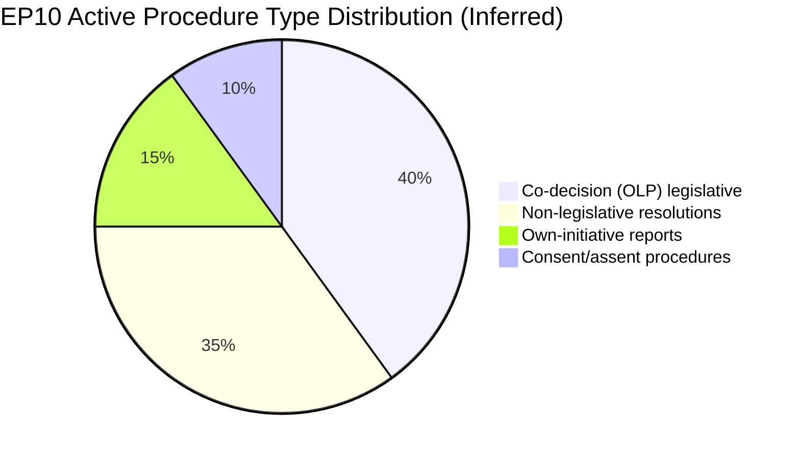

# Procedures Proxy — EP10 Legislative Pipeline, 2026

**Confidence**: 🟡 MEDIUM | **Admiralty Grade**: B3
**Source**: Adopted texts registry (Jan–Apr 2026) + EP generated statistics
**Note**: Live procedure feed returned historical data only (1972–1987); this analysis uses adopted texts as a proxy for completed procedures and generated stats for pipeline estimates.

---

## 1. Procedure Pipeline Overview (2026)

Based on generated statistics and adopted text evidence:

| Metric | Value | Source |
|--------|-------|--------|
| Active procedures | 935 (projected) | Generated stats |
| Completion rate | 12.2% | Generated stats |
| Procedures expected to complete 2026 | ~114 | Derived (935 × 12.2%) |
| Procedures initiated 2026 | ~276 (estimate) | Growth trend |
| Net pipeline change | +162 new vs completed | Estimated |

---

## 2. Completed Procedures (Jan–Apr 2026) — From Adopted Texts

Procedures that reached final EP adoption in Jan–Apr 2026 (inferred from adopted texts):

| Reference | Title | Committee Lead | Type |
|-----------|-------|----------------|------|
| 2025-2051-DEC | Financial stability | ECON | Decision |
| 2025-2028-DEC | Electoral Act reform | AFCO | Own-initiative |
| 2026-2560-DEC | EU-Mercosur CJE opinion | INTA | Request |
| 2025-0431-DEC | Enhanced cooperation Ukraine Loan | BUDG/ECON | Regulation |
| 2026-2568-DEC | Lithuania public broadcaster | LIBE | Resolution |
| 2024-0311-DEC | Measuring Instruments Directive | IMCO | Directive amendment |
| 2025-0190-DEC | EU designs codification | JURI/IMCO | Codification |
| 2025-2182-DEC | ECB annual report 2025 | ECON | Own-initiative |
| 2025-2133-DEC | Subcontracting chains | EMPL | Resolution |
| 2025-2240-DEC | CSW 70 recommendation | FEMM | Recommendation |
| 2026-2602-DEC | Northeast Syria ceasefire | AFET | Resolution |
| 2025-2246-DEC | Budget 2027 guidelines | BUDG | Resolution |
| 2023-0447-DEC | Dogs and cats welfare | AGRI/JURI | Regulation |
| 2025-2237-DEC | EIB annual report 2024 | CONT | Own-initiative |
| 2025-0156-DEC | Iceland PNR agreement | LIBE | Consent |
| 2026-2702-DEC | Haiti trafficking | AFET | Resolution |
| 2026-2596-DEC | Digital Markets Act enforcement | IMCO | Resolution |
| 2026-2700-DEC | Russia accountability/Ukraine | AFET | Resolution |
| 2026-2701-DEC | Armenia democratic resilience | AFET | Resolution |
| — | EP 2027 budget estimates | BUDG | Internal decision |

---

## 3. Active Pipeline Assessment (inferred)

**Priority files not yet completed as of May 2026**:
1. **Clean Industrial Deal** (ITRE lead) — committee vote expected Q3 2026
2. **European Defence Industrial Strategy** (AFET/SEDE/BUDG) — first reading
3. **Nature Restoration Law implementation** (ENVI) — revision in progress
4. **Sustainable Use of Pesticides Regulation revision** (ENVI) — contentious
5. **Capital Markets Union package** (ECON) — multiple files in procedure
6. **Budget 2027** (BUDG) — first reading October 2026
7. **AI Act delegated acts** (IMCO/LIBE) — implementing measures pipeline
8. **DMA designation reviews** (IMCO oversight) — ongoing

---

## 4. Procedure Type Distribution (2026 estimate)

Based on EP10 historical mix:
- **Legislative acts (COD/CNS)**: ~40% of completions
- **Non-legislative resolutions**: ~35%
- **Own-initiative reports**: ~15%
- **Consent/assent procedures**: ~10%

The 12.2% completion rate applies to the 935 active procedures; the distribution suggests approximately 45–50 legislative acts will complete in H2 2026, with the remainder being resolutions and own-initiative reports.

## Procedure Pipeline Diagram

