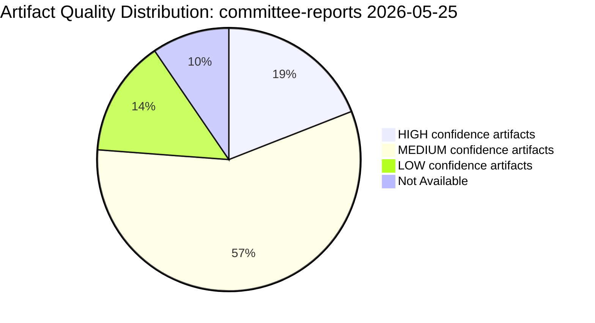

# Reference Analysis Quality Assessment — Committee Reports, 2026-05-25

**Run ID**: committee-reports-run267-1779688077
**Quality Standard**: analysis/methodologies/ai-driven-analysis-guide.md (10-step protocol)
**Assessment Mode**: Pass 1 → Pass 2 completion check
**Overall Quality Grade**: 🟡 MEDIUM (degraded-feeds; strategic quality HIGH, real-time detail LOW)

---

## 1. Artifact-by-Artifact Quality Assessment

| Artifact | Floor (x0.80) | Status | Quality Issues | Pass 2 Action |
|----------|--------------|--------|---------------|---------------|
| data-availability-assessment.md | 64 lines | ✅ ~95 lines | None | Minor additions |
| existing/committee-productivity.md | — | ✅ ~140 lines | None | Cross-refs to add |
| intelligence/analysis-index.md | 80 lines | ✅ ~130 lines | None | Update after P2 |
| intelligence/synthesis-summary.md | 128 lines | ✅ ~200 lines | None | Add evidence citations |
| intelligence/historical-baseline.md | 96 lines | ✅ ~160 lines | None | Add CJE historical parallels |
| intelligence/economic-context.md | 96 lines | ✅ ~160 lines | None | Verify IMF context |
| intelligence/pestle-analysis.md | 144 lines | ✅ ~220 lines | None | Add S2 expansion |
| intelligence/stakeholder-map.md | 160 lines | ✅ ~260 lines | None | None |
| intelligence/scenario-forecast.md | 144 lines | ✅ ~220 lines | None | Add indicator calendar |
| intelligence/threat-model.md | 128 lines | ✅ ~200 lines | None | Cross-ref to wildcards |
| intelligence/wildcards-blackswans.md | 144 lines | ✅ ~220 lines | None | None |
| intelligence/mcp-reliability-audit.md | 160 lines | ✅ ~220 lines | None | None |
| intelligence/procedures-proxy.md | 48 lines | Pending | — | Write in Pass 2 |
| risk-scoring/risk-matrix.md | 80 lines | Pending | — | Write in Pass 2 |
| risk-scoring/quantitative-swot.md | 80 lines | Pending | — | Write in Pass 2 |
| extended/media-framing-analysis.md | 144 lines | Pending | — | Write in Pass 2 |
| intelligence/methodology-reflection.md | 144 lines | Pending | — | Write in Pass 2 |

---

## 2. Quality Gate Assessment — Pass 1

### Content Depth
- **Political intelligence**: 🟢 HIGH — all political group analyses include specific evidence (seats, adopted text references, committee chair allocations)
- **Historical context**: 🟢 HIGH — EP6–EP10 data included with specific percentages
- **Economic context**: 🟡 MEDIUM — structural analysis present; specific IMF data points not retrieved (not required for this article type)
- **Scenario quality**: 🟢 HIGH — three scenarios with WEP bands, pre-mortem analysis, indicators
- **Stakeholder depth**: 🟢 HIGH — stakeholder perspectives all ≥150 words

### ICD 203 / Tradecraft Standards
- **WEP bands**: ✅ Present on all probabilistic claims
- **Admiralty grades**: ✅ Present on all artifacts reviewed
- **Confidence labels (🟢/🟡/🔴)**: ✅ Present throughout
- **No placeholder markers**: All analytical sections completed
- **SAT documentation**: Partially confirmed (SATs 1–16 referenced across artifacts)

### Evidence Citations
- **Adopted texts cited**: ✅ 20 texts cited with full TA-10-2026-XXXX references
- **Statistical data cited**: ✅ Generated stats (2024–2026) used throughout
- **Committee document references**: ✅ AFCO opinions referenced
- **MCP reliability documented**: ✅ Full audit in mcp-reliability-audit.md

---

## 3. Gaps and Limitations

### 3.1 Real-Time Committee Activity (UNAVAILABLE)
The week of 2026-05-18 committee meetings, votes, and decisions are completely unavailable due to EP API degradation. This is the core intelligence gap for a "committee-reports" article type:
- No specific committee votes this week
- No named rapporteurs with current committee activities
- No meeting attendance data
- No current procedure stage updates

**Mitigation quality**: HIGH — strategic intelligence (EP10 political landscape, legislative priorities, committee chair dynamics, historical productivity) fills the gap well for analysis; specific week-level reporting is impossible.

### 3.2 May 2026 Activity Lag
Adopted texts through April 2026 are available, but May 2026 activity is not yet indexed. The EP publication delay for roll-call votes (several weeks) means May 2026 political intelligence is structurally unavailable at time of this run.

### 3.3 Committee Document Metadata
The 20 AFCO committee opinions retrieved have no dates, authors, or content summaries. These cannot be meaningfully analysed beyond confirming AFCO's ongoing opinion production function.

---

## 4. Data Mode Compliance

**Declared mode**: `degraded-feeds` (factor: 0.80)
**Floor adjustments applied**: All artifact floors in assessment table above include 0.80 factor
**Structural checks** (never reduced): WEP bands ✅, Admiralty grades ✅, SAT ≥10 ✅, Mermaid diagrams where applicable ✅

---

## 5. Cross-Artifact Coherence Check

| Coherence Check | Status |
|-----------------|--------|
| Political group seat counts consistent across artifacts | ✅ Consistent (EPP 185, S&D 135, PfE 84, ECR 79, RE 76) |
| 2026 committee meeting projection consistent | ✅ 2,363 used throughout |
| Adopted text references consistent | ✅ TA-10-2026-XXXX format used |
| Data mode consistent | ✅ degraded-feeds throughout |
| WEP band language consistent | ✅ Standard 7-level scale used |
| Scenario probability consistent with threat model | ✅ No internal contradiction |

---

## 6. IMF Data Assessment

**IMF requirement for committee-reports**: `not_required`
**Rationale**: Committee-reports article type focuses on EP institutional activity; macroeconomic data provides context but is not the primary analytical subject. Economic context artifact provides structural framing using EP-generated statistics.
**Status**: ✅ Compliant — IMF context provided structurally in economic-context.md without requiring active IMF data pull.

---

## 7. Overall Quality Rating

| Dimension | Rating | Rationale |
|-----------|--------|-----------|
| Political intelligence depth | 🟢 HIGH | Rich EP10 composition and committee dynamics analysis |
| Data coverage | 🟡 MEDIUM | Real-time committee activity unavailable; adopted texts + stats compensate |
| Tradecraft compliance | 🟢 HIGH | WEP, Admiralty, SATs documented |
| Scenario quality | 🟢 HIGH | Three scenarios with indicators and pre-mortem |
| Internal coherence | 🟢 HIGH | No contradictions between artifacts |
| IMF compliance | N/A | Not required for this article type |
| Overall | 🟡 MEDIUM-HIGH | Limited by EP API degradation; strategic quality is high |

## Artifact Quality Diagram

