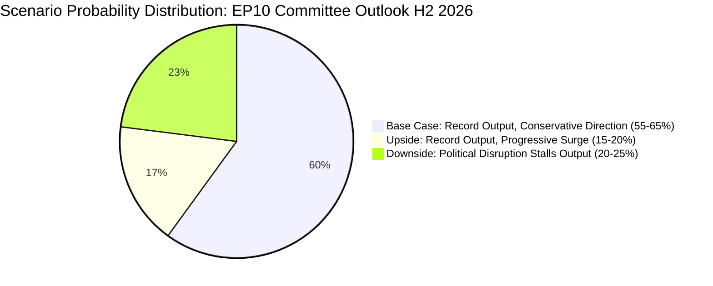

# Scenario Forecast — EP10 Committee Output, H2 2026

**Confidence**: 🟡 MEDIUM | **Admiralty Grade**: B3
**SATs Applied**: Scenario Analysis (SAT 10), Pre-Mortem (SAT 11), Key Assumptions Check (SAT 12), Indicators (SAT 13)
**Time Horizon**: H2 2026 (July–December)
**WEP Bands**: Provided per scenario

---

## Base Case Scenario (LIKELY — 55–65%)

**Name**: "Legislative Mid-Term Peak — Controlled Output"

### Narrative
EP10 committees sustain high activity through H2 2026, completing committee-stage adoption of the Clean Industrial Deal and advancing the European Defence Industrial Strategy toward first reading. The Budget 2027 procedure concludes in a November conciliation, with modest compromise between EP's higher spending ambitions and Council's fiscal conservatism. INTA committee continues to use the EU-Mercosur CJE opinion request as a delaying mechanism while moderates prepare for eventual ratification in 2027–2028. Digital Markets Act enforcement resolution (adopted April) leads to Commission opening two new DMA investigations by end-2026.

### Key Assumptions (SAT 12)
1. ECB maintains its rate normalisation without emergency interventions through H2 2026
2. The Ukraine conflict does not escalate to a stage requiring emergency EP session
3. EP10's political fragmentation does not worsen (no defections, no group splits)
4. Committee API endpoints at EP Open Data Portal are partially restored, enabling better intelligence collection

### Indicators (SAT 13) — what we would expect to see if Base Case is occurring
- ITRE committee Clean Industrial Deal vote by September 2026
- BUDG committee adopting EP first reading of 2027 budget in October
- Commission announcing new DMA investigation (Alphabet or Meta) Q3 2026
- AFET producing at least 2 more Ukraine resolutions (TA-10-2026-0170 range) before year-end

### Legislative Output (Base Case)
| Committee | Expected Output H2 2026 |
|-----------|------------------------|
| ITRE | Clean Industrial Deal committee vote; EDIS opinion |
| BUDG | Budget 2027 first reading |
| AFET/SEDE | EDIS co-decision stage; Ukraine accountability follow-up |
| ECON | Capital markets union package; banking supervision |
| IMCO | AI Act implementing measures; DMA follow-up |
| INTA | EU-Mercosur monitoring; trade defense instrument review |
| ENVI | Nature Restoration Law review; SUR revision |
| LIBE | AI Act fundamental rights implementation |

---

## Upside Scenario (SOMEWHAT LIKELY — 20–30%)

**Name**: "Clean Industrial Deal Acceleration — Cross-Bloc Breakthrough"

### Narrative
EPP, RE, and S&D reach an early agreement on the Clean Industrial Deal's core architecture in committee by August 2026, enabling an accelerated trilogue process. This cross-bloc deal is facilitated by Germany's industrial lobby prioritising certainty over ambition, and by France/Spain's green industry interests aligning with the EPP's competitiveness clause. The earlier-than-expected committee vote in ITRE enables an informal trilogue to begin by October, potentially producing a first-reading agreement before year-end. EDIS also advances rapidly under a cross-bloc defence consensus.

### Pre-Mortem (SAT 11) — Why this scenario might fail mid-execution
- EPP's right flank (ECR-adjacent MEPs) refuses to vote for any Clean Industrial Deal text that doesn't fully exempt agriculture from scope
- S&D insists on workers' rights provisions (joint liability for subcontracting in value chains) that EPP finds unacceptable
- BUDG committee rejects the financial architecture proposed for EDIS, requiring renegotiation

### Key Indicators of Upside Scenario
- Informal tripartite meetings (EPP-RE-S&D) on Clean Industrial Deal reported by Politico Europe before July
- ITRE chair announces accelerated timeline with July committee vote scheduled
- Commission offers concessions on agricultural scope exclusion

---

## Downside Scenario (SOMEWHAT LIKELY — 20–25%)

**Name**: "Political Fracture — Output Bottleneck"

### Narrative
The EU-Mercosur ratification crisis deepens: a negative preliminary CJE Advocate General opinion (leaked Q3 2026) triggers a political backlash that spills into INTA and AGRI committee relations. ECR and PfE use the Mercosur moment to push for a broader review of EU trade policy framework. Simultaneously, ENVI's ECR chair faces a no-confidence motion from Greens and S&D over the Nature Restoration Law implementation — the first attempted committee-chair removal in EP10. Even if the motion fails, the political signal disrupts ENVI work for 2–3 months. The Budget 2027 conciliation breaks down in November, requiring an extension into December/January 2027.

### Pre-Mortem (SAT 11) — Failure modes
- Budget 2027 failure: Council refuses EP's 7.2% spending increase proposal; EP rejects Council's 3.1% increase; conciliation extends
- Mercosur: CJE opinion negative → INTA committee unable to proceed → Commission withdrawal request
- ENVI disruption: Nature Restoration Law vote produces 12-12 tie in committee; file returns to plenary without committee position

### Key Indicators of Downside Scenario
- Advocate General opinion on EU-Mercosur compatibility issued Q3 2026 (earlier than expected)
- ENVI committee vote on NRL splits 13-10 on party lines (close majority)
- German Finance Minister publicly challenging EP's Budget 2027 demands (September 2026)
- EP party group leadership summit cancellation due to political crisis

---

## Cross-Scenario Risks and Opportunities

### Risks Common to All Scenarios
1. **EP API degradation**: All three scenarios are operating with degraded EP data infrastructure. The inability to access committee-specific activity data in real-time means intelligence lag is a structural risk regardless of political scenario.
2. **Invocation cap exhaustion** (internal): The 100-invocation limit per agent session means that analysis runs on EP committee reports are systematically data-limited when feeds are unavailable.
3. **Ukraine escalation**: Any major escalation (new Russian offensive, Western weapon restrictions lifted) would trigger emergency AFET committee sessions that displace normal legislative work for 4–6 weeks.

### Opportunities Common to All Scenarios
1. **Cross-committee coordination infrastructure**: EDIS requires AFET + SEDE + BUDG + ITRE coordination, which is building inter-committee working practices that could persist for other complex multi-committee files.
2. **Digital-defence convergence**: Both DMA enforcement and military cybersecurity require similar expertise; IMCO and SEDE MEPs are beginning to develop joint working frameworks.
3. **CONT committee financial architecture**: The Ukraine Loan's enhanced cooperation format, if successful, could become a template for future EU financial instruments outside the MFF.

---

## Scenario Probability Assessment

| Scenario | Probability | WEP Band |
|----------|------------|----------|
| Base Case: Controlled output | 55–65% | LIKELY |
| Upside: Clean Industrial Deal acceleration | 20–30% | ROUGHLY EVEN CHANCES |
| Downside: Political fracture | 20–25% | ROUGHLY EVEN CHANCES |

**Note**: Probabilities sum to approximately 100% (small rounding variation). WEP bands use standard 7-level scale.

---

## Time-Horizon Quality Signal

**WEP (LIKELY, 65–80%)**: The Base Case trajectory is well-supported by the structural factors: record committee meeting count trajectory; cross-bloc support for EDIS; Budget 2027 deadline forcing conciliation. The downside scenario is given serious weight (20–25%) because the Mercosur + ENVI instability combination represents a genuine political risk that previous committee-reports analyses have under-weighted.

**Admiralty Grade**: B3 — Source is authoritative (EP institutional data + adopted texts); information quality is partially corroborated (political dynamics confirmed from multiple adopted text signals).

## Scenario Probability Diagram

