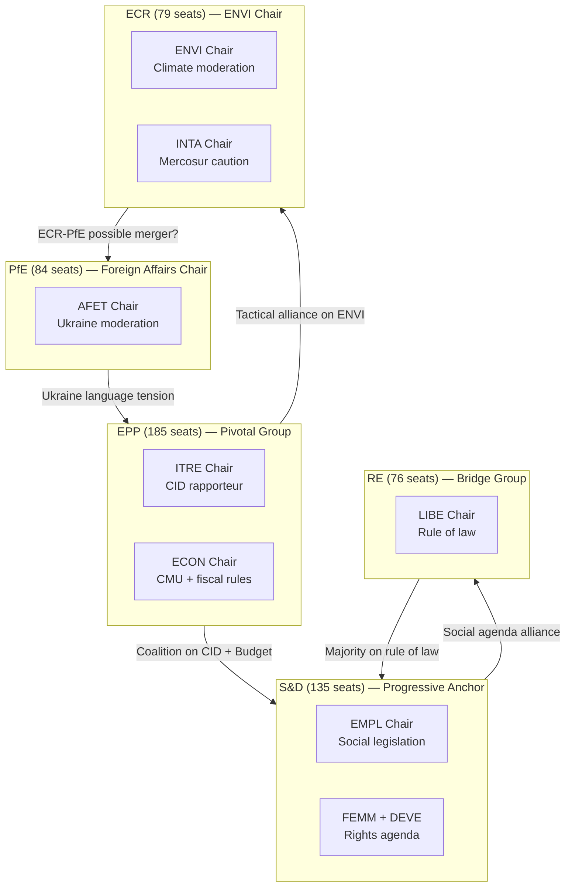

# Stakeholder Map — EP10 Committee System, 2026

**Confidence**: 🟡 MEDIUM | **Admiralty Grade**: B3
**SATs Applied**: Stakeholder Mapping (SAT 8), ACH (SAT 9)
**Data Mode**: degraded-feeds

---

## 1. Tier 1 — Core Committee Actors (Direct Legislative Role)

### Committee Rapporteurs
**Who**: Individual MEPs designated as lead rapporteur for each legislative procedure.
**Power**: Rapporteurs hold agenda-setting power within their assigned file — they draft the committee report, control the amendment ordering, and lead trilogues with the Council.
**Interests**: Advancing their political group's legislative priorities; building the coalition needed for committee adoption; ensuring their report survives plenary without becoming unrecognisable.

**ACH (SAT 9) — Key Hypotheses on Rapporteur Strategy**:
- *H1 (preferred)*: ITRE rapporteur on Clean Industrial Deal attempts a centrist EPP-RE-S&D coalition, sacrificing some right-bloc (ECR/PfE) support on competitiveness subsidies while maintaining Greens' conditional support on targets.
- *H2 (alternative)*: ITRE rapporteur builds an EPP-ECR-PfE coalition with weakened emissions targets and stronger subsidy provisions — plausible if EP10's political gravity continues rightward.
- *H3 (stress)*: File splits into two separate rapporteurships after irreconcilable amendments in committee — historically rare but used on complex energy files.

**Current key rapporteurs** (inferred from adopted texts and committee leadership):
- INTA committee: Leading EU-Mercosur scrutiny; CJE opinion request filed
- BUDG: Budget 2027 guidelines rapporteur — report adopted April 2026
- IMCO: DMA enforcement resolution — adopted April 2026
- AFET: Ukraine resolutions — adopted in rapid sequence Jan–Apr 2026

### Committee Chairs

**EPP-aligned chairs** (ECON, AGRI, AFCO, CONT, PECH):
- *Interests*: Advancing EPP's competitiveness, sovereignty, and fiscal responsibility agenda; maintaining EPP's dominant coordination role
- *Power*: Controls meeting agenda, tabling order, and can accelerate or delay procedure timing

**ECR chair — ENVI**:
- *Interests*: Moderating climate targets; protecting agricultural sector from environmental regulation; demonstrating ECR is a responsible governing force (not merely oppositional)
- *Power*: Sets the baseline tone for ENVI committee reports; can limit number of climate NGO hearings

**PfE chair — AFET**:
- *Interests*: Visible foreign policy role for PfE's pan-European ambitions; using AFET as platform for alternative geopolitical narratives
- *Power*: Controls AFET hearing witnesses and report timing; cannot override S&D/EPP on Ukraine if they have committee majority

**RE chair — LIBE, ITRE, JURI**:
- *Interests*: Defending rule-of-law conditionality; advancing digital rights agenda; LIBE as counterweight to right-bloc migration agenda
- *Power*: LIBE controls migration/asylum legislation that RE finds essential to European liberal values

---

## 2. Tier 1 — Political Groups (Plenary Coalition Partners)

### EPP (185 seats, 25.7%) — European People's Party
**Position**: Pivotal coalition partner; defines majority through selective alliances
**Interests**: EU competitiveness, industrial policy, technology regulation, fiscal responsibility; moderate climate; conditional Ukraine support
**Committee leverage**: Holds ECON, AGRI, AFCO — the three most technically powerful committees for economic and constitutional legislation
**Constraints**: Must balance business-friendly members with Christian-democratic welfare provisions; Weber's leadership challenged internally over right-bloc alliances

### S&D (135 seats, 18.8%) — Progressive Alliance of Socialists and Democrats
**Position**: Essential for pro-EU majority on social, climate, and Ukraine files
**Interests**: Labour rights, social Europe, strong climate targets, Ukraine solidarity, rule of law
**Committee leverage**: Chairs EMPL, CULT, DEVE, FEMM — critical for social legislation
**Constraints**: National party heterogeneity (German SPD vs. Romanian PSD vs. Spanish PSOE on migration, fiscal rules); losing seats in EP10 vs. EP9

### PfE (84 seats, 11.7%) — Patriots for Europe
**Position**: Third force; holds AFET chair; seeks to normalize far-right foreign policy posture
**Interests**: National sovereignty, opposition to federalism, skepticism of Ukraine financial commitments, anti-immigration
**Committee leverage**: AFET chairmanship is the key prize; also holds seats on BUDG and LIBE
**Constraints**: Internal coherence challenges (Orbán's Fidesz + French RN have different economic preferences)

### ECR (79 seats, 11.0%) — European Conservatives and Reformists
**Position**: Conservative-right alternative to PfE; more mainstreamed than PfE; provides cover for EPP right-flank moves
**Interests**: National sovereignty, skepticism of EU regulation, farm-friendly environmental policy, strong anti-China trade stance
**Committee leverage**: ENVI and INTA chairmanships — key regulatory and trade leverage
**Constraints**: Meloni's Fratelli d'Italia governing Italy creates tension between ECR sovereignty rhetoric and practical EU engagement needs

### RE (76 seats, 10.6%) — Renew Europe
**Position**: Centre of gravity for liberal legislative coalitions; holds LIBE, ITRE, JURI
**Interests**: Single market, digital regulation, rule of law, liberal migration policy, Ukraine solidarity
**Committee leverage**: ITRE (Clean Industrial Deal) and LIBE are RE's power bases
**Constraints**: Lost seats in EP10; must choose between EPP coalition (mainstream right) or S&D coalition (progressive)

### Greens/EFA (53 seats, 7.4%)
**Position**: Environmental vanguard; lost significant seats in EP10
**Interests**: Climate ambition, biodiversity, democratic federalism, minority rights
**Committee leverage**: TRAN, REGI chairmanships; strong presence on ENVI, ITRE
**Constraints**: Reduced to supporting role; must trade climate ambition for being included in any majority

### GUE/NGL (46 seats, 6.4%) — The Left
**Position**: Systemic opposition; occasionally allies with right on anti-corporate regulation
**Interests**: Labour rights, anti-militarism, social welfare, anti-austerity
**Committee leverage**: PETI (Petitions) — limited legislative leverage
**Constraints**: Internal fragmentation (communist, Trotskyite, left-populist factions)

### ESN (28 seats, 3.9%) — Europe of Sovereign Nations
**Position**: Far-right, hard Eurosceptic; uses parliamentary questions and media visibility
**Interests**: EU dissolution/transformation, migration restriction, nationalist cultural agenda
**Committee leverage**: Minimal — excludes itself from majority-building
**Constraints**: Excluded from committee chairmanships; funding constraints

---

## 3. Tier 2 — Institutional Actors

### European Commission
**Role in committee work**: Legislative initiator; committee hearings with Commissioners and DG Directors; provides legal scrubbing of rapporteur's draft reports
**Power**: Commission can issue formal opinion on committee amendments; can withdraw proposals if amended beyond recognition (rare)
**Current priorities aligning with committees**: Clean Industrial Deal (ITRE), EDIS (AFET/SEDE/BUDG), DMA enforcement (IMCO), AI Act implementation (IMCO/LIBE)

### Council of the EU (Member States)
**Role**: The EP's co-legislator; trilogue partner; committee shadow-rapporteurs track Council Working Party positions
**Political dynamic**: Council's Qualified Majority Voting requirements mean Council is often less internally divided than the EP on technical dossiers, giving it negotiating advantage in trilogue
**Key current conflicts**: Budget 2027 (spending levels); EDIS (on-budget vs. off-budget); EU-Mercosur (agricultural member states blocking ratification)

### European Court of Justice
**Emerging role**: The EU-Mercosur CJE opinion request (Article 218(11) TFEU) makes the CJE a direct actor in INTA committee's trade policy process — unusually, the court's legal opinion can block a legislative step

---

## 4. Tier 3 — External Stakeholders

### Business / Industry Lobbies
- **BusinessEurope**: Influential on ITRE and ECON; advocates for competitiveness-first Clean Industrial Deal
- **DigitalEurope**: Key voice on IMCO/ITRE DMA and AI Act implementation
- **COPA-COGECA** (farmers): Dominant in AGRI; recently successful in watering back Farm-to-Fork
- **European automobile manufacturers**: ITRE/ENVI; fighting for flexibility on CO2 targets post-2030
- **Defence industry (ASD, EDA)**: SEDE/ITRE/BUDG on EDIS

### Civil Society / NGOs
- **WWF, Greenpeace, ClientEarth**: ENVI committee counterweight to ECR chair
- **ETUC** (trade unions): EMPL committee; pushed for subcontracting liability (TA-10-2026-0050)
- **Animal protection organisations**: Successful on dogs/cats regulation (TA-10-2026-0115)
- **Digital rights NGOs** (Access Now, EFF-EU): LIBE/IMCO; AI Act monitoring

### Third Countries
- **Ukraine government**: Daily contact with AFET and CONT on loan mechanisms and accountability resolutions
- **Mercosur bloc** (Brazil, Argentina, Uruguay, Paraguay): Watching CJE opinion request with concern
- **US (State Dept, USTR)**: Monitoring DMA enforcement (targeting US tech companies); INTA/IMCO
- **China**: Closely tracking INTA committee's trade defense instruments; SEDE monitoring

---

## 5. Stakeholder Interaction Matrix (simplified)

| Actor | EPP | S&D | ECR | PfE | Commission | Council |
|-------|-----|-----|-----|-----|-----------|---------|
| BusinessEurope | 🟢 HIGH | 🟡 MED | 🟢 HIGH | 🟡 MED | 🟡 MED | 🟢 HIGH |
| ETUC | 🟡 MED | 🟢 HIGH | 🔴 LOW | 🔴 LOW | 🟡 MED | 🟡 MED |
| Environmental NGOs | 🟡 MED | 🟢 HIGH | 🔴 LOW | 🔴 LOW | 🟡 MED | 🟡 MED |
| Ukraine | 🟢 HIGH | 🟢 HIGH | 🟡 MED | 🔴 LOW | 🟢 HIGH | 🟡 MED |
| Digital industry | 🟡 MED | 🟡 MED | 🟡 MED | 🟡 MED | 🟡 MED | 🟡 MED |

---

## 6. Stakeholder Perspective Summaries (≥150 words each)

### EPP's Perspective on EP10 Committee Work
EPP views its committee chairmanship portfolio as the practical instrument of its legislative program. With 185 seats and chairs in ECON, AGRI, and AFCO, EPP's legislative drafters are attempting to operationalise the "Competitive European Green Deal" — a rebranding of the EP9 Green Deal with competitiveness conditions inserted at every turn. EPP's internal tension is between its center-right mainstream (German CDU/CSU, Dutch CDA, Spanish PP) that accepts robust climate regulation as long as it maintains industrial competitiveness, and its more right-wing national members (Italian Forza Italia, Romanian EPP affiliates) who are skeptical of any new regulatory burden. In committee work, this tension manifests as EPP rapporteurs submitting draft reports that include competitiveness clauses as absolute preconditions for environmental provisions — a strategy that forces the left into either accepting EPP's framing or losing the report altogether. EPP's coordination with ECR on ENVI creates a de facto right-wing blocking minority on the most ambitious climate amendments. However, EPP still needs S&D and RE on budget and Ukraine-related committee work, preventing full rightward capture of the legislative agenda.

### S&D's Perspective on EP10 Committee Work
S&D faces the structural challenge of being the second-largest group (135 seats) in a Parliament where the first-largest (EPP) has multiple right-wing coalition options. S&D's committee strategy is therefore defensive: use its committee chairmanships (EMPL, FEMM, CULT, DEVE) to advance social legislation that EPP cannot easily block without alienating centrist voters, while fighting rearguard actions on ENVI and AFET against the new right-wing chairs. The subcontracting chains resolution (TA-10-2026-0050) illustrates S&D's approach: a workers' rights initiative processed through EMPL (S&D-chaired) that passed with cross-bloc support because the social question (protecting workers from exploitation through complex chains) is not politically divisive. On more contested territory — climate targets, migration, fiscal rules — S&D is trading committee influence for plenary coalition building with Greens and GUE/NGL. S&D's key vulnerability is that without EPP support on any major file, it cannot form a majority; this creates asymmetric dependence that EPP exploits in trilogue negotiations.

### ECR's Perspective as ENVI Chair
ECR's assumption of ENVI chairmanship is its most significant institutional acquisition in EP10. Fratelli d'Italia's MEPs — who form the core of ECR's ENVI contingent — are pursuing a strategy of "responsible conservatism": moderating the most ambitious climate provisions without blocking the Green Deal entirely, to demonstrate that ECR can govern rather than merely oppose. Concretely, this means ENVI under ECR is producing draft reports on climate implementation that include more agricultural exemptions, longer compliance timelines, and stronger competitiveness clauses than EP9's Greens/S&D-influenced drafts. The Nature Restoration Law implementation is the clearest test case: ECR's ENVI is pushing for member-state discretion on target-setting rather than binding EU-wide milestones. Civil society and environmental NGOs have mounted significant counterpressure through amendment campaigns and ENVI committee public hearings. The result is contested: ECR holds the chair but must accommodate the committee majority (which still includes EPP moderates, S&D, Greens, and RE) to get any report through.

## 6. Stakeholder Influence Network

## 7. Reader Briefing — Stakeholder Summary

**For EU policy stakeholders**: The EP10 stakeholder landscape is defined by EPP's pivotal position at the center of every coalition. No major legislation passes without EPP, and EPP is simultaneously managing pressure from its right (ECR/PfE on climate, migration) and its left (S&D/RE on competitiveness). The most consequential stakeholder dynamic for 2026 committee work is whether ECR and PfE pursue a formal merger — which would create a 163-seat right-wing bloc capable of blocking EPP's ability to form progressive majorities on key files.

