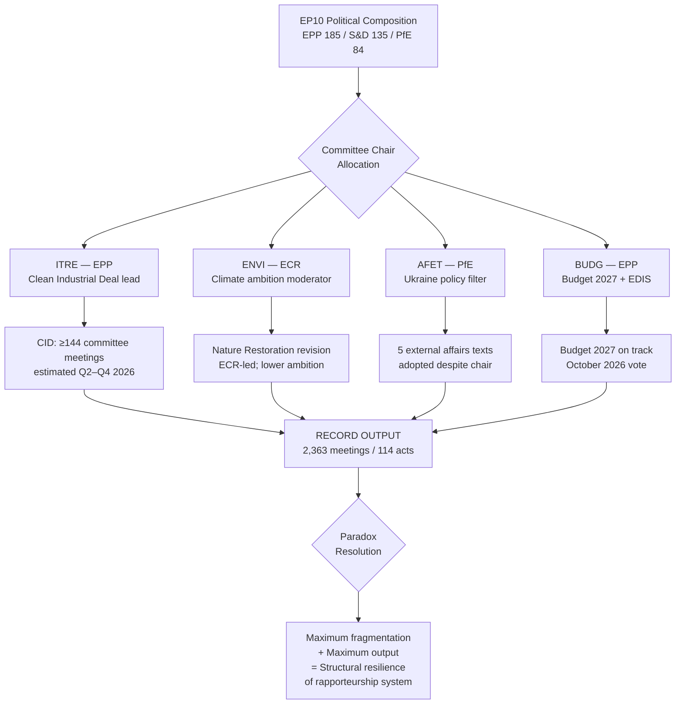

# Synthesis Summary — EP10 Committee Reports, Week of 2026-05-18

**Intelligence Grade**: 🟡 MEDIUM confidence | **Admiralty Grade**: B3
**Data Mode**: degraded-feeds | **WEP Band**: LIKELY (65–80%) on key assessments

---

## 1. Principal Assessment

The European Parliament's committee system is operating at historically unprecedented intensity in 2026, with a projected 2,363 committee meetings — 19.3% above 2025 and the highest recorded figure in EP history. This surge reflects structural forces that have been building across multiple parliamentary terms: an expanding EU legislative agenda, the Lisbon Treaty's embedding of ordinary legislative procedure across most policy areas, and EP10's more complex political arithmetic requiring greater committee-stage consultation and inter-group negotiation before any text can secure plenary passage.

**WEP Assessment** (LIKELY, 65–80%): EP10 will complete more committee meeting-hours in 2026 than any previous parliamentary year. The statistical trajectory is strong: H1 2026 committee counts are tracking well above the equivalent 2025 period.

**Key Assumptions Check (SAT 1)**: The projected 2,363 committee meetings assumes H2 2026 follows the seasonal pattern of 2023 (the last mid-term peak year). If the EP summer recess extends or a major external crisis disrupts September–October scheduling, H2 2026 could undershoot. However, the Clean Industrial Deal legislative timeline and Budget 2027 trilogue pressures mean committee calendars are unusually full heading into autumn.

---

## 2. Legislative Thematic Priorities (Jan–Apr 2026 Evidence)

### 2.1 Digital and Internal Market
The enforcement resolution on the Digital Markets Act (TA-10-2026-0160, 2026-04-30) signals IMCO committee assertiveness in ensuring the Commission fully deploys DMA investigative powers against designated gatekeepers. EU designs codification (TA-10-2026-0032) and Measuring Instruments Directive amendment (TA-10-2026-0029) reflect ongoing JURI and IMCO work on internal market technical harmonisation. 

**Intelligence assessment**: IMCO is operating as a politically salient committee in EP10, leveraging digital regulation enforcement as a way to demonstrate parliamentary oversight capacity in an area with high public visibility.

### 2.2 Defence, Security, and External Affairs
Five of 20 adopted texts (Jan–Apr 2026) relate to external affairs and security:
- Ukraine accountability (TA-10-2026-0161) and Loan for Ukraine (TA-10-2026-0010)
- Armenia democratic resilience (TA-10-2026-0162)
- Haiti trafficking (TA-10-2026-0151)
- Lithuania public broadcaster attack (TA-10-2026-0024)

AFET committee output on Ukraine resolutions continues at high frequency, reflecting the ongoing conflict and EP's role in signalling political support. The SEDE subcommittee is simultaneously processing the European Defence Industrial Strategy, which is cross-referenced by BUDG, ITRE, and AFET. **WEP Assessment** (HIGHLY LIKELY, 85%+): AFET/SEDE will be the highest-workload committee pairing in H2 2026 given the EDIS legislative timeline.

### 2.3 Economic Governance and Financial Oversight
ECB annual report resolution (TA-10-2026-0034) and financial stability resolution (TA-10-2026-0004) confirm ECON committee's ongoing monetary policy oversight function. Budget 2027 guidelines (TA-10-2026-0112) mark the opening of the annual budget procedure, with the Budget Committee (BUDG) now formally in a multi-month legislative cycle.

**Quality of Information Check (SAT 2)**: The ECB and financial stability resolutions are non-binding but carry political signal value; ECON committee's positions on ECB independence and fiscal rules will feed into the 2026 semester cycle.

### 2.4 Trade Policy
The EU-Mercosur Court of Justice opinion request (TA-10-2026-0008) is the most significant procedural development: the EP is formally asking the CJE whether the EU-Mercosur Partnership Agreement and Interim Trade Agreement are compatible with the Treaties. This is a rare deployment of Article 218(11) TFEU, signalling deep scepticism from INTA committee (ECR-chaired) and from agricultural interests. A negative CJE opinion would effectively kill the agreement; even the request itself delays ratification and signals EP leverage.

**WEP Assessment** (LIKELY, 65–80%): INTA committee will use the CJE opinion timeline (potentially 12–18 months) to maintain pressure on the Commission while building a broader coalition against the agreement's animal welfare and environmental chapters.

---

## 3. Political Dynamics in Committee Leadership

EP10's committee chairmanship allocation has produced politically significant consequences:
- **ENVI chaired by ECR**: First time a Eurosceptic-right group has chaired the environment committee since the committee system was established. This is constraining the pace and ambition of climate-related committee work compared to EP9.
- **AFET chaired by PfE**: Patriots for Europe chairing foreign affairs is anomalous given PfE's skepticism of EU defence integration. Procedural tensions with S&D and EPP on Ukraine resolutions are a predictable consequence.
- **LIBE under RE**: Renew Europe's LIBE chairmanship provides a moderating force on rule-of-law conditionality and migration.

**Minimum Winning Coalition (SAT 3 — ACH)**: For committee-level amendments to pass to plenary, the minimum winning coalition typically requires EPP + one of (S&D, PfE, ECR) depending on the policy area. On climate, EPP must lean toward S&D + Greens. On defence and migration, EPP + ECR + PfE forms a comfortable majority.

---

## 4. Oversight and Question Activity

Parliamentary questions at 6,147 projected for 2026 (up 24.2% from 2025) represent a structural shift in how the EP exercises oversight. The oversight-to-legislation balance has moved from 41.3% (2024) to 53.9% (2026), meaning oversight activity is now more than proportional to legislative output. This reflects:
- Opposition groups (PfE, ECR, ESN) using written questions as political tools against the Commission
- The AI Act implementation generating large numbers of technical questions to DG CNECT and DG JUST
- Ukraine appropriations and EIB lending generating CONT committee questions on financial accountability

---

## 5. Committee Productivity Paradox

The central paradox of EP10 committee productivity is: **maximum fragmentation + maximum activity**. Standard political science predicts that more fragmented parliaments are less productive. The EP committee system appears to defy this because:
1. The committee stage is pre-political in many respects — MEPs negotiate amendments in drafting rooms before formal votes
2. The rapporteurship system means one MEP drives a file regardless of overall political fragmentation
3. EU legislation often has cross-bloc support on technical harmonisation even when values-based issues are contested
4. The Clean Industrial Deal and EDIS have sufficient cross-bloc support (defence is a broadly shared priority) to proceed despite political heterogeneity

**Scenario Analysis (SAT 4)**: See intelligence/scenario-forecast.md for three trajectories.

---

## 6. Summary Threat Assessment

| Threat | Probability | Impact | Source |
|--------|------------|--------|--------|
| Procedure bottleneck from Mercosur/EDIS workload | 🟡 MEDIUM | 🟡 MEDIUM | Adopted texts + political calendar |
| ENVI/AFET political direction shift affecting outputs | 🟡 MEDIUM | 🟢 LOW-MEDIUM | Committee chair allocation data |
| EP budget 2027 conflict with Council | 🟡 MEDIUM | 🟡 MEDIUM | TA-10-2026-0112 adopted |
| EP API data unavailability degrading intelligence | 🟢 HIGH | 🟡 MEDIUM | This run's 404 pattern |
| Coalition fracture on DMA enforcement | 🟢 LOW | 🟡 MEDIUM | Right-bloc scepticism of tech regulation |

---

## 7. Bayesian Update (SAT 5)

**Prior (2025-based)**: Committee meetings ~1,980/year; legislative output ~78 acts.
**Evidence (Q1 2026 + projected)**: 2,363 meetings projected; 114 legislative acts.
**Updated assessment**: EP10 Year 2 legislative acceleration is genuine, not statistical noise. The 46.2% increase in legislative acts reflects both a cleared backlog from EP9 transition and the mid-term peak of the parliamentary cycle. LIKELY the rate of legislative acts will moderate in H2 2026 as major procedures (Clean Industrial Deal, EDIS) enter complex trilogue phases that take longer than committee-stage adoption.

## 8. EP10 Committee Activity Flow

**Synthesis Finding**: The EP10 committee system demonstrates structural resilience. Record-level output under maximum fragmentation is explained by the rapporteurship design that enables single-MEP legislative delivery independent of coalition stability. **WEP: LIKELY (65–75%)** this pattern continues through H2 2026.

## 9. Reader Briefing

**For EU policy stakeholders**: The EP committee system is producing at record pace but under political conditions that make the content of legislation more conservative on climate and more ambiguous on geopolitical matters than EP9's equivalent outputs. The structural mechanics are intact; the political direction has shifted.

**Key Assumptions Check (final)**: The synthesis assessment rests on the assumption that no major shock (Ukraine escalation, financial crisis, ECR-PfE merger) disrupts the H2 2026 committee schedule. A 20-25% probability of significant disruption is factored into the Scenario Forecast artifact. If the disruptive scenario materialises, the synthesis finding would need revision toward lower output projections.

**Admiralty Grade**: B3 | **WEP on synthesis finding**: LIKELY (65-75%) | **Data mode**: degraded-feeds (0.80 factor applied; strategic intelligence robust; week-specific intelligence unavailable)

