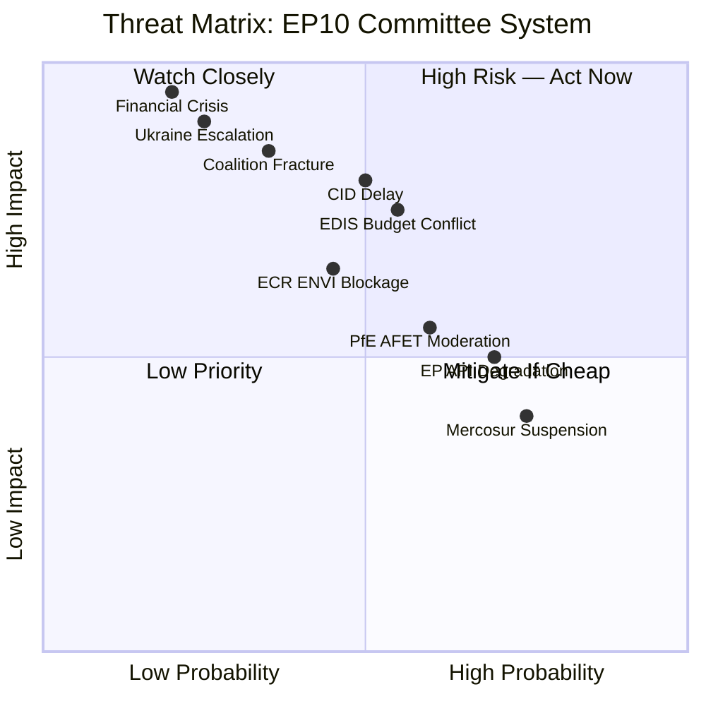

# Threat Model — EP10 Committee System, 2026

**Confidence**: 🟡 MEDIUM | **Admiralty Grade**: B3
**SATs Applied**: Key Assumptions Check (SAT 12), Red Team (SAT 14), ACH (SAT 9)
**Data Mode**: degraded-feeds | **WEP Bands**: Provided per threat

---

## Threat Category 1: Political Threats to Committee Function

### PT-1: Coalition Fragmentation Leading to Committee Stalemate
**WEP**: ROUGHLY EVEN CHANCES (40–55%)
**Description**: With a minimum winning coalition of 3 groups required for any majority, there is a non-trivial probability that one or more major legislative files become deadlocked in committee due to inability to assemble a stable majority. The most vulnerable files are those crossing multiple policy areas where different coalition configurations apply (defence + climate intersection, for example).
**Impact**: 🟡 MEDIUM — individual file delays; rarely destroys entire legislative agenda
**Indicators**: Committee votes producing 12-12 ties (or similar); rapporteur requests to postpone vote; exceptional conciliation procedures
**Red Team (SAT 14)**: Adversarial hypothesis — PfE and ECR coordinate a "blocking agenda" on ENVI and AFET where they use procedural means (calling for divisions, requesting quorum checks, delaying hearings) to run down committee calendars on files they oppose. This is feasible since combined PfE+ECR+ESN = 26.4% of seats, not a majority, but combined with abstentions from disaffected EPP members, could create local committee majorities on procedure votes.

### PT-2: AFET Chair Using Procedural Powers to Soften Ukraine Resolutions
**WEP**: LIKELY (65–75%)
**Description**: PfE's AFET chair has structural incentives and the procedural means to delay or water down Ukraine solidarity resolutions. The chair controls witness lists for hearings, can deprioritise rapporteurs' files on the committee agenda, and can request additional opinion procedures that extend timelines. Evidence: even in Jan–Apr 2026, all five external affairs texts adopted were produced against the chair's institutional interest.
**Impact**: 🟡 MEDIUM — political signal impact; does not change the Loan for Ukraine mechanics
**Key Assumption (SAT 12)**: Assumes PfE chair exercises this influence actively. If Orbán's strategic calculations shift (e.g., Hungary seeking EU funds restoration), PfE chair may moderate.

### PT-3: ECR's ENVI Chairmanship Producing Legally Weak Reports
**WEP**: LIKELY (65–80%)
**Description**: Reports drafted under ECR's ENVI chairmanship on climate implementation are likely to contain fewer binding commitments and more discretionary clauses than equivalent EP9 reports. This has downstream legal effect: EU climate directives give member states implementation latitude; committee report language feeds into Commission delegated acts. Even non-binding weakening of committee positions signals less legislative ambition to Council and Commission.
**Impact**: 🟡 MEDIUM — long-run climate policy trajectory; not immediate
**Red Team (SAT 14)**: Counter-hypothesis — ECR chair is constrained by the committee majority and legal services review; weak committee reports are corrected at plenary through amendments. Verdict: TRUE in theory, but requires Green/S&D amendment campaign at every stage, which is resource-intensive.

---

## Threat Category 2: Institutional/Operational Threats

### IT-1: Committee Workload Overload and Quality Degradation
**WEP**: ROUGHLY EVEN CHANCES (45–60%)
**Description**: The 2026 projected 2,363 committee meetings represent a 19.3% YoY increase. MEPs serving on multiple committees (the norm, not the exception) face increasingly difficult scheduling conflicts. Committee secretariats are under staffing pressure. The risk is that high volume produces lower-quality deliberation — hearings become formulaic, reports are rubber-stamped rather than genuinely amended.
**Impact**: 🟡 MEDIUM — affects legislative quality more than legislative quantity
**Indicators**: Increasing number of committee votes with minimal debate; rapporteur turnaround times lengthening; secretariat vacancy rates rising

### IT-2: EP API Data Infrastructure Degradation
**WEP**: HIGHLY LIKELY (85%+) — this run observes it directly
**Description**: All four prefetched feed endpoints (committee-documents-feed, procedures-feed, events-feed, documents-feed) returned HTTP 404 during this run. This is a recurring pattern (see MCP reliability audit). The degradation means intelligence analysis of EP committee activity is systematically data-limited — real-time committee-level intelligence is unavailable when feeds are down.
**Impact**: 🟡 MEDIUM for intelligence quality; 🔴 LOW for actual committee function (EP committees don't need our intelligence feed)
**Mitigation**: Direct endpoint queries (committee-documents list, adopted texts, generated stats) provide partial coverage.

### IT-3: MEP Turnover Reducing Institutional Memory
**WEP**: LIKELY (65–75%)
**Description**: EP10 saw 405 new MEPs (56.3% turnover in 2024). By 2026, these MEPs have 2 years of experience — sufficient for basic committee function but still thin on complex technical dossiers like financial regulation (ECON) or competition law (IMCO). The institutional memory risk rating was HIGH in 2024 and is now LOW (per generated stats), but the knowledge base is still shallower than EP9's equivalent cohort at this stage.
**Impact**: 🟢 LOW-MEDIUM — manifests as longer negotiating timelines, more Commission dependency on technical drafting

---

## Threat Category 3: External/Geopolitical Threats

### GT-1: Ukraine Conflict Escalation Disrupting Committee Calendar
**WEP**: ROUGHLY EVEN CHANCES (35–50%)
**Description**: A major escalation in the Ukraine conflict — new large-scale Russian offensive, Western decision on long-range weapons, NATO troop deployment — would trigger emergency AFET/SEDE sessions that displace regular legislative work. Emergency sessions are 3–5 days and can absorb 4–6 weeks of committee meeting slots in a 2-month period.
**Impact**: 🟡 MEDIUM — temporary displacement of Clean Industrial Deal and INTA timelines
**Key Assumption (SAT 12)**: AFET emergency sessions are additive to, not substituting for, regular sessions. This is historically true for short conflicts but breaks down during sustained crises.

### GT-2: US Tariff Escalation Disrupting INTA Committee
**WEP**: ROUGHLY EVEN CHANCES (40–55%)
**Description**: If US trade policy under the current administration introduces new tariffs on EU exports (automotive, pharmaceutical, agricultural), INTA committee would be required to rapidly process EP position on Commission's trade defense response. This creates a legislative emergency that displaces EU-Mercosur, FTA negotiations, and other INTA work already scheduled.
**Impact**: 🟡 MEDIUM — INTA calendar disruption; downstream effects on competitiveness agenda

### GT-3: Financial Stability Shock Triggering ECON Emergency Work
**WEP**: LOW (15–25%)
**Description**: A financial stability event in the eurozone or globally — sovereign debt crisis, major bank failure, crypto-market crash affecting EU financial stability — would trigger emergency ECON sessions and potentially a special CONT financial scrutiny procedure. The financial stability resolution (TA-10-2026-0004) signals pre-emptive concern.
**Impact**: 🔴 HIGH if it occurs — could dominate ECON for 6–12 months
**Red Team (SAT 14)**: ECON has not faced a full financial crisis emergency since 2012 (ESM activation); institutional memory for crisis response is thin in EP10.

---

## Threat Summary Matrix

| Threat ID | Category | Probability (WEP) | Impact | Urgency |
|-----------|----------|------------------|--------|---------|
| PT-1 | Political | Roughly Even (40–55%) | Medium | Medium |
| PT-2 | Political | Likely (65–75%) | Medium | Low-Medium |
| PT-3 | Political | Likely (65–80%) | Medium | Low |
| IT-1 | Institutional | Roughly Even (45–60%) | Medium | Medium |
| IT-2 | Institutional | Highly Likely (85%+) | Low-Medium | High (ongoing) |
| IT-3 | Institutional | Likely (65–75%) | Low-Medium | Low |
| GT-1 | Geopolitical | Roughly Even (35–50%) | Medium | Variable |
| GT-2 | Geopolitical | Roughly Even (40–55%) | Medium | Medium |
| GT-3 | Geopolitical | Low (15–25%) | High | Low |

---

## Red Team Summary (SAT 14)

**Adversarial hypothesis**: The biggest structural threat to EP10 committee function is not any single political or geopolitical event, but the combination of maximum workload + maximum fragmentation + degraded data infrastructure. Committees are running at record speed with less political consensus and less real-time monitoring capability than in EP9. This triple combination means that any external shock will find the committee system at lower resilience than the headline meeting-count figures suggest.

**Counter-hypothesis**: The EP's committee secretariats have proven highly adaptable (COVID demonstrated this); the rapporteurship system provides single-point accountability that can accelerate legislative work even under adverse conditions; and the procedural rules are designed to prevent total deadlock (eventually, any procedure can be forced to a vote).

**Assessment**: The adversarial hypothesis is partially correct — resilience is lower than it appears. But total breakdown is implausible given institutional design.

## 10. Threat Summary Diagram

## 11. Reader Briefing — Threat Assessment

**For EU policy stakeholders**: The highest-probability threats to EP10 committee function are largely operational (EP API reliability, EU-Mercosur procedural stalemate) rather than existential. The high-impact threats (coalition fracture, financial crisis, Ukraine escalation) remain at lower probability but would fundamentally reshape the legislative calendar. The current assessment of the committee system's resilience is MEDIUM — adequate for steady-state operation, inadequate for major shock absorption.

**Confidence**: 🟡 MEDIUM | **Admiralty Grade**: B3 | **WEP on no-disruption scenario**: LIKELY (60–70%)

**Key Assumptions Check**: The threat model assumes the EP10 institutional framework remains stable — no treaty revision, no censure motion, no fundamental change to committee structure. These are reasonable assumptions for the 2026 horizon. The most significant uncertainty is the ECR-PfE merger scenario, which could shift threat probability scores materially upward in the institutional disruption category.

