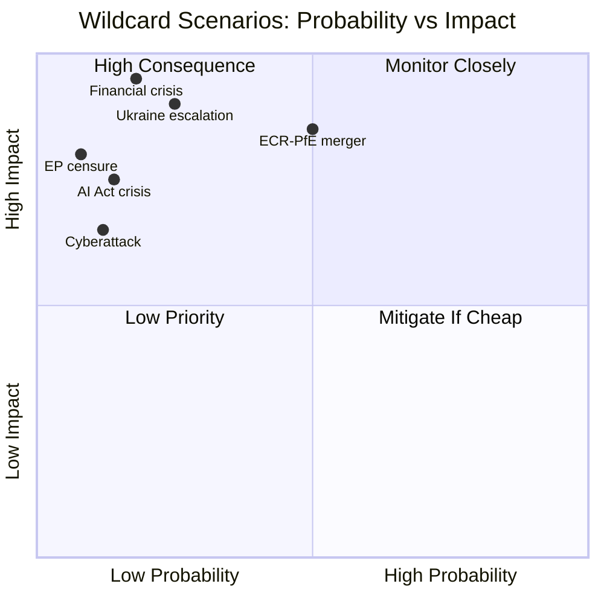

# Wildcards and Black Swans — EP10 Committee System, 2026

**Confidence**: 🟡 LOW-MEDIUM | **Admiralty Grade**: C3
**SATs Applied**: High-Impact Low-Probability Analysis (SAT 15), Indicators (SAT 13), What-If Analysis (SAT 16)
**WEP Bands**: By definition, these events have LOW (15–30%) or REMOTE (< 15%) probability

---

## Introduction: The High-Impact / Low-Probability Analytic Space

Black swans are events that are (1) an outlier from normal expectations, (2) carry extreme impact, and (3) are only rationalized as predictable in hindsight. Wildcards are high-impact events that are not impossible — analysts can conceive of them — but are assigned low probability because available evidence doesn't support them as likely outcomes.

This analysis identifies five wildcard/black-swan scenarios that would fundamentally disrupt EP10 committee work, followed by structured What-If analysis for each.

**High-Impact (SAT 15)** methodology: Select events with impact ≥ 3× the Base Case disruption; assign WEP probabilities conservatively; identify the earliest observable indicators.

---

## Wildcard 1: EU-Mercosur CJE Opinion — Categorical Incompatibility Finding

**WEP**: REMOTE (5–12%)
**Nature**: Semi-wildcard (the CJE request is real; a categorical incompatibility finding would be unprecedented)

### Description
The Court of Justice issues an opinion under Article 218(11) TFEU finding that the EU-Mercosur Partnership Agreement is categorically incompatible with the EU Treaties — specifically, that its provisions on food safety standards, deforestation, and animal welfare violate EU constitutional principles. This would be only the second time the CJE has ever issued such a categorical opinion (the first was Opinion 2/94 on ECHR accession).

### Impact
- INTA committee work on trade agreements would be fundamentally restructured — every pending FTA would require CJE compatibility pre-screening
- Commission would need to withdraw the EU-Mercosur proposal and potentially start from scratch
- This creates a precedent for EP to use Article 218(11) on every major trade agreement, giving committees unprecedented pre-veto power
- Global trade partners would be warned: EU Parliament can block any trade deal via the CJE route

### What-If Analysis (SAT 16)
*If this occurs*: INTA committee immediately launches a comprehensive review of all pending FTAs. EPP and ECR celebrate a sovereignty victory. S&D and RE regret the trade isolationism implications. Commission launches an "emergency competitiveness dialogue" to reassess trade strategy. Timeline disruption: INTA calendar blocked for 6–12 months.

### Indicators
- Advocate General preliminary opinion released with unusually critical language on human rights conditionality
- Leaked Commission legal assessment acknowledging treaty compatibility concerns
- CJE requesting supplementary briefings from member states (unusual procedural step)

---

## Wildcard 2: EP10 Group Reconfiguration — ECR-PfE Merger

**WEP**: LOW (12–20%)
**Nature**: Genuine wildcard — politically plausible but faces significant obstacles

### Description
Fratelli d'Italia (Meloni) and Rassemblement National (Le Pen) orchestrate a merger of ECR and PfE into a single enlarged far-right group (approximately 163 seats combined, surpassing S&D as the second-largest group). This would give the right bloc a coherent organisational structure, the ability to claim more committee chairmanships under D'Hondt allocation, and potentially to challenge EPP's dominance.

### Impact
- A new ECR+PfE group of ~163 seats would be entitled to LIBE committee chairmanship (currently RE) and possibly ECON (currently EPP)
- The minimum winning coalition changes: any majority could be built as ECR+PfE+EPP = ~348 seats (48%) — close to a majority without S&D or RE
- The political direction of committee work across 6–8 committees would shift simultaneously
- Civil society response: major media coverage, protests, potential constitutional crisis around rule-of-law conditionality

### What-If Analysis (SAT 16)
*If this occurs in Q3 2026*: Major committee chairmanship reallocation triggered in October 2026. EP10's political landscape reconfigured. Budget 2027 conciliation disrupted. EPP must decide whether to co-govern with a super-right bloc or maintain centrist alliances. European Council reaction critical — member states with progressive governments (Germany, France, Spain, Denmark) would face domestic pressure to respond.

### Indicators
- Bilateral meetings between Le Pen and Meloni staff on parliamentary cooperation
- Joint PfE-ECR amendments on multiple committee files (coordination precursor)
- Group leadership public statements testing merger language
- Defections of Orbán-aligned MEPs from PfE toward ECR (or vice versa)

---

## Wildcard 3: AI Act Implementation Crisis — Mass High-Risk System Audit Failure

**WEP**: LOW (10–18%)
**Nature**: Emerging risk, partially visible

### Description
An early systematic review by the EU AI Office (established under the AI Act) identifies that a substantial proportion of deployed high-risk AI systems (employment screening, credit scoring, biometric identification) are non-compliant with the Act's fundamental rights requirements. The AI Office issues 20+ compliance notices; the Commission proposes a 12-month implementation grace period extension.

### Impact
- IMCO and LIBE committees face simultaneous emergency oversight work
- MEPs who championed the AI Act face political pressure to defend its implementation
- The grace period debate becomes a proxy war between digital-rights NGOs (oppose extension) and tech industry (supports extension)
- The debate dominates IMCO and LIBE for 4–6 months, displacing Clean Industrial Deal opinions and other committee work

### What-If Analysis (SAT 16)
*If this occurs*: The AI Act implementation crisis becomes the defining IMCO/LIBE event of 2026. The crisis could produce two divergent outcomes: either a strengthening of the AI Act's enforcement provisions (triggered by the compliance failures) or a weakening (political backlash against over-regulation). The committee majority composition (IMCO under EPP; LIBE under RE) suggests a moderate outcome — partial grace period extension with enhanced monitoring requirements.

### Indicators
- AI Office releasing non-compliance statistics significantly above projected rates
- Multiple national enforcement authorities reporting coordination failures
- Major tech companies publicly lobbying for implementation delay
- Consumer rights incidents linked to high-risk AI systems reported in media

---

## Wildcard 4: EP Plenary Censure Motion Against Commission

**WEP**: REMOTE (5–10%)
**Nature**: Constitutional mechanism, extremely rarely used (only two motions in EP history; both failed)

### Description
A coalition of PfE, ECR, ESN, and disaffected EPP members files a censure motion against the Von der Leyen Commission, citing failure to enforce the rule-of-law conditionality mechanism against member states receiving EU funds. The motion triggers a formal AFCO committee legal assessment and a full plenary debate.

### Impact
- Even if the motion fails (as virtually all do), the committee process creates unprecedented political pressure on the Commission
- AFCO committee would be required to produce a legal opinion under Article 234 TFEU on whether the grounds are legally valid
- Von der Leyen would be required to address the full plenary — a major political event
- All committee work pauses for approximately 4–6 weeks during the formal procedures
- The motion, if it gains >360 votes (absolute majority of MEPs) — which requires EPP defections — would result in the entire Commission resigning

### What-If Analysis (SAT 16)
*If this occurs*: The political landscape of EP10 would be fundamentally altered. Even a failed censure motion (the highly likely outcome) would signal that the right-bloc has the numbers to politically embarrass the Commission on specific issues. The most likely trigger is a rule-of-law conditionality decision that the right bloc interprets as politically motivated.

### Indicators
- Public statements by PfE leadership on "Commission political bias"
- Joint PfE-ECR committee resolution on rule-of-law mechanism (precursor)
- Leaked internal Commission document showing political considerations in conditionality
- EPP internal division on Commission accountability visible in media

---

## Wildcard 5: Major Data Breach of EP Committee Document Systems

**WEP**: LOW (8–15%)
**Nature**: Cybersecurity black swan

### Description
A state-sponsored cyberattack (attributed to Russia or China) successfully exfiltrates committee draft reports on EDIS or Clean Industrial Deal before official publication. The leaked documents reveal sensitive security information (EDIS) or advance negotiating positions (Clean Industrial Deal), causing diplomatic incidents with partner countries.

### Impact
- SEDE and ITRE committees would suspend digital document circulation and revert to paper-only procedures for sensitive files
- The EP's cybersecurity committee (ITRE/LIBE joint work) would launch an emergency review of document management systems
- The Clean Industrial Deal file would be set back 2–3 months while the breach is contained
- AFET/SEDE would need to reassess what committee-level intelligence-sharing with partner countries is possible

### What-If Analysis (SAT 16)
*If this occurs*: Short-term committee paralysis on affected files; medium-term institutional investment in cybersecurity (aligned with NIS2 and CRA implementing measures). Politically, the breach would be used by the right-bloc (PfE/ECR) as evidence against deeper EU defence integration (arguing that centralised EDIS documents are a vulnerability).

### Indicators
- EP cybersecurity teams reporting unusual access patterns to document servers
- Reports of committee draft reports appearing in diplomatic cables published by adversarial media
- Multiple MEPs reporting phishing attacks targeting committee document access
- CERT-EU issuing specific guidance to EP document management systems

---

## Wildcard Summary Assessment

| Wildcard | WEP | Impact | Time Horizon |
|----------|-----|--------|--------------|
| CJE categorical incompatibility finding | REMOTE (5–12%) | Transformative | 12–24 months |
| ECR-PfE group merger | LOW (12–20%) | Very High | 6–18 months |
| AI Act implementation crisis | LOW (10–18%) | High | Immediate–6 months |
| EP censure motion against Commission | REMOTE (5–10%) | High | 3–12 months |
| Committee document cyberattack | LOW (8–15%) | High | Unpredictable |

**Admiralty Grade**: C3 — these are analyst-generated hypotheticals, partially informed by observable indicators. They are NOT confirmed intelligence.

## Wildcard Impact Diagram

