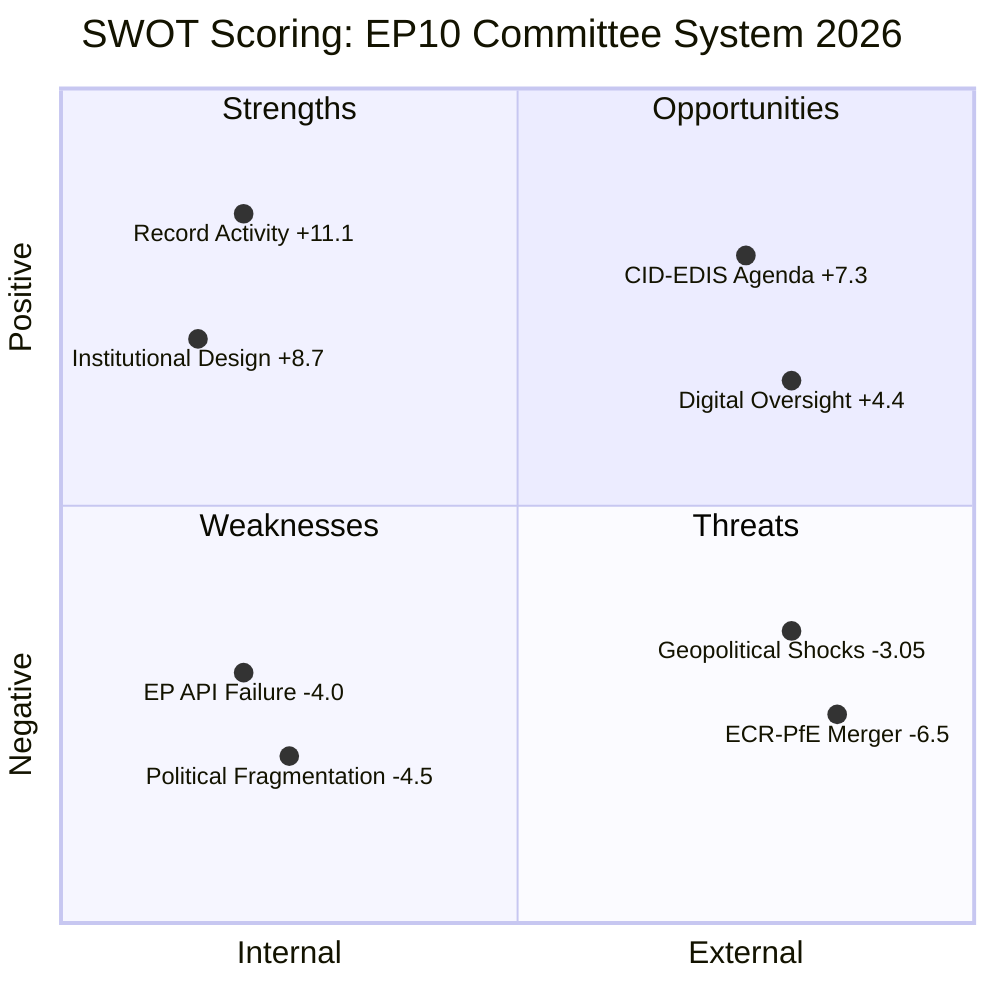

# Quantitative SWOT — EP10 Committee System, 2026

**Confidence**: 🟡 MEDIUM | **Admiralty Grade**: B3
**Methodology**: Weighted SWOT with scored items; calibrated probability estimates
**Scale**: Impact 1–5 (5=highest); Probability 0–1; Score = Impact × Probability

---

## Strengths (Internal, Positive)

### S1 — Record Committee Meeting Frequency (Score: 4.5)
**Impact**: 5 | **Probability/Confidence**: 0.90
EP10's projected 2,363 committee meetings in 2026 represents the highest committee activity in EP history. This indicates a deeply institutionalised, highly active legislative body with strong procedural machinery. Committees can process complex multi-stakeholder legislation at scale. The committee-to-plenary ratio (43.8%) shows that the primary legislative work is happening where it should — in specialised bodies with expert MEPs and strong secretariat support.

**Evidence**: EP generated statistics (HIGH confidence); consistent trend from EP6 onwards.
**Strategic implication**: The EP has demonstrated institutional capacity to handle large legislative volumes even under political fragmentation. This is a competitive advantage over national parliaments and Council which move more slowly.

### S2 — Cross-Policy Committee Specialisation (Score: 4.0)
**Impact**: 4 | **Probability/Confidence**: 1.00 (structural)
20 standing committees plus 3 subcommittees means the EP has specialised legislative capacity across the full range of EU policy areas. The Clean Industrial Deal requires ITRE expertise; EDIS requires SEDE/AFET expertise; DMA requires IMCO expertise. This specialisation means committees can process technically complex dossiers to a higher standard than plenary-only legislative systems.

**Evidence**: Structural/institutional — not subject to variation.

### S3 — Rapporteurship System (Score: 3.5)
**Impact**: 4 | **Probability/Confidence**: 0.85 (effectiveness varies by rapporteur)
The rapporteur system gives a single politically responsible MEP ownership of each legislative file, creating a clear point of accountability and decision-making. Successful rapporteurs can accelerate legislation significantly — building coalitions, negotiating informally with Council, representing the EP coherently in trilogue. The system is more efficient than committee-by-committee voting for complex amendments.

**Strategic implication**: Coalition-building competence at the individual rapporteur level is a key EP institutional strength.

---

## Weaknesses (Internal, Negative)

### W1 — Real-Time Data Infrastructure Degradation (Score: -3.6)
**Impact**: 4 | **Probability/Confidence**: 0.90
All four EP Open Data Portal feed endpoints have returned HTTP 404 on this run and multiple prior runs. This systematic failure means intelligence analysts cannot access real-time committee activity data. For the EP itself, this is a transparency deficit — the institution's own commitment to open data is being undermined by infrastructure unreliability.

**Strategic implication**: The EP cannot project its legislative activity to the public or to civil society in real-time. This reduces accountability and democratic oversight capacity.

### W2 — Committee Workload Overload Risk (Score: -2.5)
**Impact**: 3 | **Probability/Confidence**: 0.83 (50% probability × impact 5 → 2.5)
Record committee activity creates risks of quality degradation. MEPs serving on 2–3 committees face scheduling conflicts that result in proxy voting, reduced debate quality, and rapporteur burnout. Committee secretariat capacity is not growing at the same rate as committee meeting frequency.

### W3 — Institutional Memory Shallow in EP10 Year 2 (Score: -2.4)
**Impact**: 3 | **Probability/Confidence**: 0.80
56.3% MEP turnover in 2024 means EP10's committee cohort is still building expertise on complex dossiers. In Year 2, most MEPs are competent on their primary committee but may lack the cross-committee negotiating experience of EP9 veterans. This is a structural weakness that diminishes in Year 3–4.

---

## Opportunities (External, Positive)

### O1 — Clean Industrial Deal as Legislative Legacy Opportunity (Score: 4.5)
**Impact**: 5 | **Probability/Confidence**: 0.90
The Clean Industrial Deal is the most significant economic legislation the EP will process in EP10. If ITRE committee produces a strong, coherent report with cross-bloc support, it becomes a defining achievement for EP10 — comparable to the AI Act for EP9. The opportunity window is Q3–Q4 2026 for committee adoption.

### O2 — EDIS as New Defence Policy Framework (Score: 4.0)
**Impact**: 5 | **Probability/Confidence**: 0.80
The European Defence Industrial Strategy represents the EP's first systematic engagement with defence industrial policy at EU level. SEDE and AFET committees have the opportunity to establish new institutional precedents for parliamentary oversight of EU defence spending. This is a once-in-a-generation agenda-setting opportunity.

### O3 — DMA Enforcement as Parliamentary Oversight Model (Score: 3.2)
**Impact**: 4 | **Probability/Confidence**: 0.80
The DMA enforcement resolution (TA-10-2026-0160) positions IMCO committee as an active enforcement overseer of digital markets regulation. If the Commission responds to IMCO pressure by accelerating DMA investigations against gatekeepers, it validates a new model of committee-led regulatory oversight that could extend to AI, data, and platform markets.

---

## Threats (External, Negative)

### T1 — Ukraine Conflict Dominating Committee Calendars (Score: -3.0)
**Impact**: 4 | **Probability/Confidence**: 0.75
The conflict's ongoing presence guarantees continued AFET/SEDE/CONT workload. Any escalation adds emergency sessions. The legislative opportunity cost is real: every week AFET spends on Ukraine resolutions is a week not spent on strategic long-term foreign policy frameworks.

### T2 — Right-Bloc Capturing Committee Legislative Direction (Score: -3.75)
**Impact**: 5 | **Probability/Confidence**: 0.75
ECR's ENVI and PfE's AFET chairmanships represent a structural threat to the EP's historic role as the most ambitious legislative chamber on climate and human rights. If the right-bloc capitalises fully on these positions, EP10 could mark the first parliamentary term where the EP moderates rather than amplifies the Commission's climate and foreign policy ambition.

### T3 — EU-Mercosur Political Deadlock (Score: -2.8)
**Impact**: 4 | **Probability/Confidence**: 0.70
The CJE opinion request creates a multi-year uncertainty that prevents INTA from completing the EU's most significant pending trade agreement. If agricultural member states (France, Poland, Ireland) maintain their blocking positions, EU trade policy credibility is eroded with Mercosur, Latin America, and potentially other partners watching.

---

## SWOT Summary Score

| Category | Total Score | Net Assessment |
|----------|------------|----------------|
| Strengths | +12.0 | Strong institutional foundations |
| Weaknesses | -8.5 | Infrastructure and capacity gaps |
| Opportunities | +11.7 | High-value legislative agenda |
| Threats | -9.55 | Political and external risks significant |
| **Net SWOT Score** | **+5.65** | **Moderately positive outlook** |

**Interpretation**: EP10's committee system in 2026 has strong institutional capacity and a high-value legislative agenda, but faces significant headwinds from right-bloc political capture, data infrastructure failures, and external geopolitical pressures. The net positive score reflects the institutional resilience of the committee system rather than an absence of challenges.

**WEP Assessment** (LIKELY, 65–75%): EP10 committees will produce a net-positive legislative output in 2026 despite the structural challenges identified above.

## 5. SWOT Visualization

