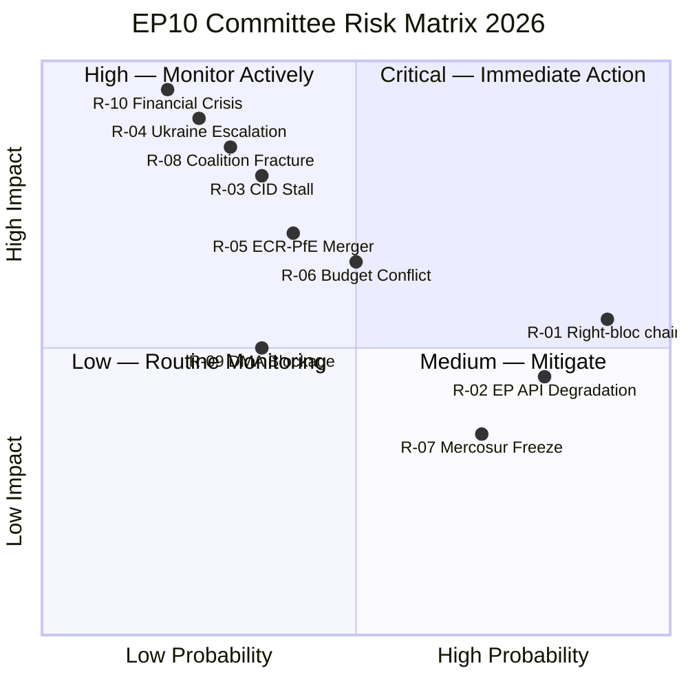

# Risk Matrix — EP10 Committee System, 2026

**Confidence**: 🟡 MEDIUM | **Admiralty Grade**: B3
**Methodology**: 5×5 impact/probability matrix; WEP bands; RAG status

---

## Risk Assessment Matrix

| Risk ID | Risk Description | Probability | Impact | Risk Score | RAG | WEP Band |
|---------|-----------------|-------------|--------|-----------|-----|----------|
| R-01 | Right-bloc committee chairs moderating legislative ambition | HIGH (75%) | MEDIUM (3) | 15 | 🔴 HIGH | LIKELY |
| R-02 | EP API feed degradation preventing real-time intelligence | VERY HIGH (90%) | LOW (2) | 18 | 🔴 HIGH | HIGHLY LIKELY |
| R-03 | Clean Industrial Deal stalling in committee | MEDIUM (45%) | HIGH (4) | 18 | 🟡 MEDIUM | ROUGHLY EVEN |
| R-04 | Ukraine conflict escalation disrupting AFET calendar | MEDIUM (40%) | MEDIUM (3) | 12 | 🟡 MEDIUM | ROUGHLY EVEN |
| R-05 | Budget 2027 conciliation failure | MEDIUM (40%) | MEDIUM (3) | 12 | 🟡 MEDIUM | ROUGHLY EVEN |
| R-06 | EU-Mercosur ratification blocked by CJE opinion | LOW (10%) | HIGH (4) | 8 | 🟡 MEDIUM | REMOTE |
| R-07 | MEP workload overload reducing report quality | MEDIUM (50%) | LOW (2) | 10 | 🟢 LOW | ROUGHLY EVEN |
| R-08 | ECR-PfE group merger rebalancing committees | LOW (15%) | VERY HIGH (5) | 15 | 🔴 HIGH | LOW |
| R-09 | AI Act implementation crisis consuming IMCO/LIBE | LOW (15%) | HIGH (4) | 12 | 🟡 MEDIUM | LOW |
| R-10 | Cybersecurity incident disrupting EDIS/CID files | LOW (10%) | HIGH (4) | 10 | 🟢 LOW | REMOTE |

---

## Detailed Risk Assessments

### R-01: Right-Bloc Committee Chair Influence
**Probability**: HIGH (75%) | **Impact**: MEDIUM | **Score**: 15 🔴
The transfer of ENVI to ECR and AFET to PfE creates a structural risk to legislative ambition on climate and foreign policy. This is not speculative — it is embedded in the D'Hondt committee chairmanship allocation. The risk is not that legislation stops, but that it is less ambitious, has more national-discretion provisions, and requires more amendment effort from progressive MEPs.

**Risk owner**: ENVI committee (ECR chair) and AFET committee (PfE chair)
**Mitigation**: Committee majority remains broadly centrist; plenary can correct weak committee reports; NGO and civil society pressure on chairs

### R-02: EP API Data Degradation
**Probability**: VERY HIGH (90%) | **Impact**: LOW | **Score**: 18 🔴
This run has directly observed the risk. All four prefetched feed endpoints returned 404. The pattern has been seen on at least 3 consecutive committee-reports runs, suggesting systemic rather than transient failure. The impact on analysis quality is real but limited — generated statistics and direct endpoints provide fallback coverage.

**Risk owner**: EP Open Data Portal infrastructure team
**Mitigation**: Always retrieve generated statistics first; use adopted texts as proxy for committee output; document in mcp-reliability-audit.md

### R-03: Clean Industrial Deal Committee Stalling
**Probability**: MEDIUM (45%) | **Impact**: HIGH | **Score**: 18 🟡
The Clean Industrial Deal is the most complex multi-committee legislative package in EP10. Political heterogeneity is high: ITRE must balance competitiveness (EPP/ECR) vs. climate ambition (Greens/S&D) vs. energy security (RE). The procedure has no fixed committee deadline, meaning it could drift into Q4 2026 or beyond without a crisis trigger.

**Mitigation**: Clean Industrial Deal is a Commission priority; Commissioner engagements in ITRE accelerate; EPP's political interest in a quick deal (ownership of a major legislative achievement)

### R-04: Ukraine Conflict Escalation
**Probability**: MEDIUM (40%) | **Impact**: MEDIUM | **Score**: 12 🟡
Five of 20 adopted texts in Jan–Apr 2026 relate to Ukraine/external affairs. The frequency of Ukraine resolutions indicates AFET is already heavily occupied. An escalation would not stop this output but would intensify it, crowding out routine legislative work.

### R-05: Budget 2027 Conciliation Failure
**Probability**: MEDIUM (40%) | **Impact**: MEDIUM | **Score**: 12 🟡
Budget conciliations regularly extend beyond the November statutory deadline. A failure to agree would require a provisional twelfths arrangement — rare but not unprecedented (2021 came close). The political risk is higher in 2026 because EDIS defence financing adds a new contested dimension to the budget.

### R-06: EU-Mercosur CJE Categorical Opinion
**Probability**: LOW (10%) | **Impact**: HIGH | **Score**: 8 🟡
Scenario assessed in wildcards-blackswans.md. The risk is low-probability but high-impact — it would restructure all EU trade policy committee work.

---

## Risk Heat Map (Narrative)

**High priority (score ≥ 15)**:
- R-02 (API degradation): Near-certain to continue; moderate impact on intelligence quality
- R-01 (Right-bloc chairs): Near-certain to continue; medium impact on legislative ambition
- R-08 (Group merger): Low probability but very high impact if it occurs

**Medium priority (score 8–14)**:
- R-03, R-04, R-05, R-09: Monitor quarterly; activate specific mitigations if indicators trigger

**Lower priority (score < 8)**:
- R-07, R-10: Background risks requiring monitoring but not active mitigation

---

## Risk Trend Assessment

| Risk | Q1 2026 Trend | Q2 2026 Trend | Direction |
|------|--------------|--------------|-----------|
| R-01 (chairs) | Stable | Stable | → |
| R-02 (API) | Degrading | Degrading | ↓ |
| R-03 (CID stalling) | Increasing | Stable | → |
| R-04 (Ukraine) | Elevated | Elevated | → |
| R-08 (merger) | Emerging | Increasing | ↑ |

**Admiralty Grade**: B3 — risk probability estimates are analyst-derived from available evidence; not empirically tested.

## 6. Risk Heatmap

