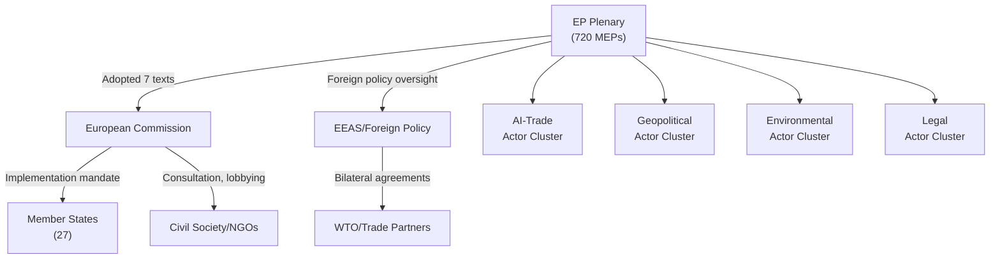

# Actor Mapping — EU Parliament Motions, Week 18–25 May 2026

**Date**: 2026-05-25  
**Classification**: Actor Intelligence Analysis  
**Confidence**: 🟡 MEDIUM  
**Admiralty Grade**: C3 (Fairly Reliable; Possibly True)

---

## Primary Actors by Motion Category

### AI-Trade Strategy (T10-0183/2026)
| Actor | Role | Interest | Power | Stance |
|-------|------|----------|-------|--------|
| EP Internal Market Committee | Primary | Digital trade governance | High | Champion |
| European Commission (DG TRADE) | Implementing | Trade defence AI tools | High | Supportive with reservations |
| EU AI Office | Technical authority | AI Act cross-border application | High | Engaged |
| WTO JSI members (91 states) | International | Digital trade norms | Medium | Watching |
| China/India | Affected third parties | Anti-dumping AI transparency | High | Skeptical |
| CCIA/DigitalEurope | Industry lobbyists | Low compliance costs | Medium | Cautious |

### Forest Reproductive Material (T10-0168/2026)
| Actor | Role | Interest | Power | Stance |
|-------|------|----------|-------|--------|
| EP ENVI Committee | Primary | Climate-adapted forestry | High | Champion |
| European Forest Institute | Technical | Scientific backing | Medium | Supportive |
| Member State forestry ministries | Implementing | National nursery sectors | High | Mixed |
| Nursery sector SMEs | Affected | Regulatory compliance costs | Medium | Cautious |
| Greens/EFA | Political | Environmental protection | Medium | Strong support |

### Geopolitical Agreements (T10-0174, T10-0177, T10-0178, T10-0179)
| Actor | Role | Interest | Power | Stance |
|-------|------|----------|-------|--------|
| EP AFET Committee | Primary | External relations oversight | High | Champion |
| EEAS | Implementing | EU foreign policy | High | Supportive |
| Uzbekistan government | Partner | EPCA benefits, EU market access | High | Eager |
| Lebanon judiciary | Partner | Eurojust cooperation | Medium | Supportive |
| Pacific island states | Partner | Fisheries revenue | Medium | Dependent |
| EP Left/Greens | Conditional support | Human rights conditionality | Medium | Watch closely |

### Pappas Immunity Case (T10-0166/2026)
| Actor | Role | Interest | Power | Stance |
|-------|------|----------|-------|--------|
| Stelios Papas (MEP) | Subject | Own legal protection | High | Waiver subject |
| Greek judiciary | Requesting | Legal proceedings | High | Requesting waiver |
| EP Legal Affairs Committee | Advising | Parliamentary privilege rules | High | Advisory |
| EP Plenary | Deciding | Institutional integrity | High | Approved waiver |

---

## Actor Network Map

---

## Actor Influence Assessment

**High-influence actors** whose preferences shaped the week's motions:
1. **EPP internal market faction** — drove AI-Trade resolution language toward competitiveness framing
2. **S&D social rights faction** — secured human rights conditionality language in Uzbekistan EPCA
3. **Greens/EFA** — strengthened forest biodiversity provisions in T10-0168
4. **EEAS** — pre-negotiated all four external agreements; EP role was approval/oversight

**Low-influence actors** (excluded from shaping outcomes):
- Patriots/ESN: voted against most resolutions with minimal amendment success
- ECR: split votes on most files, reducing their coalition leverage

---

**Admiralty Grade**: C3 | **WEP**: Structural actor analysis — not vote-dependent
