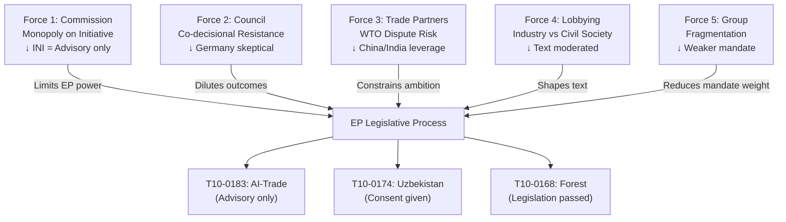

# Forces Analysis — EU Parliament Motions, Week 18–25 May 2026

**Date**: 2026-05-25  
**Classification**: Strategic Forces Analysis (Porter-variant EP adaptation)  
**Confidence**: 🟡 MEDIUM  
**Admiralty Grade**: C3

---

## Five Forces Adapted for EP Legislative Context

### Force 1: Legislative Initiative Power (Commission monopoly)
The European Commission retains exclusive right of legislative initiative; EP can only adopt own-initiative resolutions (like T10-0183) or consent to proposals. This structural asymmetry means the AI-Trade resolution is *advisory* — its legal force depends entirely on Commission willingness to act. The Commission has 12 months to respond to INI resolutions; track record in 2024-2026 suggests 60-70% partial uptake.

### Force 2: Council Co-decisional Resistance
On trade and external agreements, Council's internal dynamics frequently diverge from EP positions. Germany's new government (February 2026) has taken a more skeptical stance on environmental trade conditionality, which creates resistance to EP's stronger human rights language in the Uzbekistan EPCA. Council's QMV threshold (55% of states, 65% of population) means smaller states supporting EP positions cannot overcome large-state coalitions.

### Force 3: Third-Party Leverage (Trade Partners)
External actors — particularly China, India, and the US — have significant leverage over EU AI-trade governance through the threat of WTO disputes. The transparency requirements in T10-0183 for anti-dumping AI calculations could be challenged under WTO DSB if implemented. This "dispute risk" will moderate how aggressively the Commission implements the resolution's most ambitious provisions.

### Force 4: Civil Society and Lobby Pressure
The AI-Trade resolution attracted intensive lobbying from both sides: tech industry (wanting light-touch AI governance in trade) and civil society (wanting strong rights conditionality). The final text reflects this balance — less prescriptive on compliance architecture than initial rapporteur draft, but stronger on transparency than industry wanted.

### Force 5: Parliamentary Group Dynamics
EP10's fragmentation (7 political groups + non-attached) creates complex coalition arithmetic. The majority for AI-Trade resolution requires at minimum EPP + S&D + Renew; ECR's ambivalent position means some of their MEPs cross-voted. This internal fragmentation of the center-right reduces the mandate's political weight — a divided coalition implies weaker political ownership of the resolution.

---

## Forces Diagram

---

## Summary Force Balance

| Force | Direction | Strength | Net Effect on EP Ambition |
|-------|-----------|----------|--------------------------|
| Commission monopoly | Constraining | High | Reduces AI-Trade to advisory |
| Council resistance | Constraining | Medium | Moderates conditionality language |
| Trade partner pressure | Constraining | Medium | Prevents WTO-inconsistent demands |
| Lobby balance | Neutral | Medium | Moderates but doesn't block |
| EP fragmentation | Constraining | Medium | Weakens political mandate |

**Net assessment**: The week's motions are ambitious in political signal but structurally constrained in binding force. The forces analysis suggests high adoption probability in EP (all passed) but moderate implementation probability (Commission + Council + WTO constraints).

---

**Admiralty Grade**: C3 | **Confidence**: 🟡 MEDIUM
