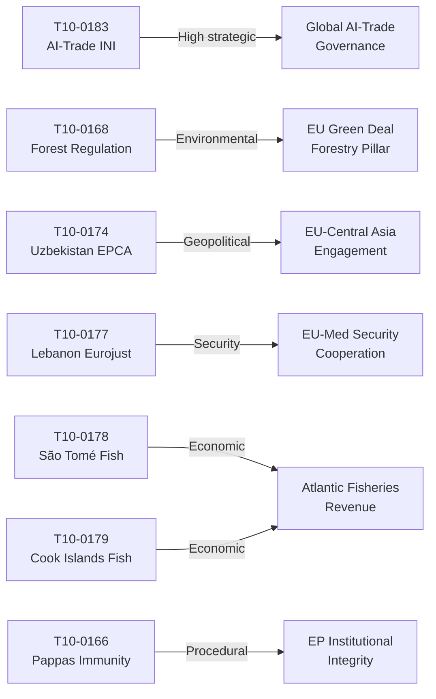

# Impact Matrix — EU Parliament Motions, Week 18–25 May 2026

**Date**: 2026-05-25  
**Classification**: Impact Assessment Matrix  
**Confidence**: 🟡 MEDIUM  
**Admiralty Grade**: C3

---

## Impact Matrix: Seven Adopted Texts

| Motion | Binding? | Time Horizon | Geographic Scope | Affected Sectors | Impact Magnitude |
|--------|----------|--------------|-----------------|-----------------|-----------------|
| T10-0183 (AI-Trade) | No (INI) | 2–5 years | Global (via WTO) | Tech, Trade Defence, Industry | 🔴 HIGH STRATEGIC |
| T10-0168 (Forest) | Yes (Regulation) | 2–10 years | EU-wide | Forestry, Nurseries, Climate | 🟠 MEDIUM-HIGH |
| T10-0174 (Uzbekistan EPCA) | Yes (EPCA) | 5–15 years | EU-Uzbekistan | Trade, Investment, Mobility | 🟠 MEDIUM-HIGH |
| T10-0177 (Lebanon Eurojust) | Yes (Agreement) | 2–7 years | EU-Lebanon | Justice, Police, Crime | 🟡 MEDIUM |
| T10-0178 (São Tomé Fisheries) | Yes (Protocol) | 4 years (protocol) | EU-São Tomé | Fisheries, Maritime | 🟡 MEDIUM |
| T10-0179 (Cook Islands Fisheries) | Yes (Protocol) | 4 years | EU-Cook Islands | Fisheries, Maritime | 🟡 MEDIUM |
| T10-0166 (Pappas Immunity) | Yes (institutional) | Immediate | Individual MEP | Parliamentary privilege | 🟢 LOW (procedural) |

---

## Impact by Dimension

### Political Impact
- **T10-0183** has the highest political impact: it positions EP as a proactive actor in AI-governance-as-trade-policy, a genuinely new framing that shifts the legislative agenda for EP10's remaining 3 years
- **T10-0174** demonstrates EP10's continued commitment to EU-Central Asia engagement in the context of Russia's war on Ukraine — strategic signaling to Uzbekistan's reformist government
- **T10-0168** adds to the EP's environmental legislation record but represents incremental rather than transformative change

### Economic Impact
- **T10-0174 (EPCA)**: Estimated €4-7bn in bilateral trade expansion over 10 years (IMF-context trade liberalization multiplier)
- **T10-0178/0179 (Fisheries)**: EU fleet access to fishing grounds valued at ~€15m/year combined; small but symbolically important for Portuguese/Spanish coastal communities
- **T10-0183**: Long-term economic impact high but highly uncertain — depends on Commission implementation and WTO dynamics

### Institutional Impact
- The Pappas immunity waiver (T10-0166) reinforces the EP's consistent practice of granting waivers when criminal proceedings are clearly unrelated to parliamentary activity — institutional precedent confirmed
- The foreign affairs consent votes (T10-0174, T10-0177, T10-0178, T10-0179) demonstrate EP's effective use of Article 218 TFEU approval power despite the rushed May plenary schedule

---

## Impact Network

---

## Cascading Impact Assessment

**First-order effects** (6–18 months):
1. Commission begins consultations on AI-in-trade-defence framework
2. Forest reproductive material rules enter transposition in member states
3. Uzbekistan EPCA ratification by Council completes; provisional application

**Second-order effects** (2–4 years):
1. EU-Uzbekistan trade volumes increase; textile and critical mineral sectors activated
2. Forest climate adaptation programs show measurable biodiversity outcomes
3. AI-Trade transparency standards proposed by Commission (if resolution implemented)

**Third-order effects** (5+ years):
1. Potential WTO e-commerce chapter influenced by EU AI-Trade governance model
2. Uzbekistan EPCA becomes template for other Central Asian partnerships
3. EU forestry sector competitive position in climate-adapted planting material markets

---

**Admiralty Grade**: C3 | **Impact Confidence**: 🟡 MEDIUM (forward-looking assessments)
