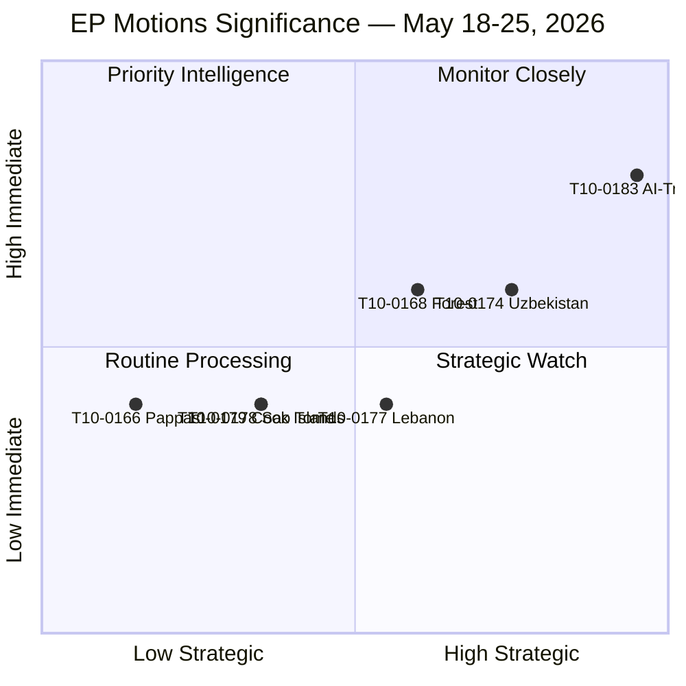

# Significance Classification — EU Parliament Motions, Week 18–25 May 2026

**Date**: 2026-05-25  
**Classification**: Significance Taxonomy and Priority Matrix  
**Confidence**: 🟡 MEDIUM  
**Admiralty Grade**: C3

---

## Significance Classification Framework

Using the adapted EP Intelligence Significance Framework (EISF-3), each text is classified across three dimensions:
- **Strategic Significance** (1-5): long-term EU policy trajectory impact
- **Immediate Significance** (1-5): immediate practical/political impact this week
- **Institutional Significance** (1-5): impact on EP's institutional role and powers

| Motion | Strategic | Immediate | Institutional | **Overall** |
|--------|-----------|-----------|---------------|-------------|
| T10-0183 (AI-Trade) | 5 | 4 | 4 | **TIER 1: HIGH** |
| T10-0174 (Uzbekistan EPCA) | 4 | 3 | 3 | **TIER 2: SIGNIFICANT** |
| T10-0168 (Forest) | 3 | 3 | 2 | **TIER 2: SIGNIFICANT** |
| T10-0177 (Lebanon Eurojust) | 3 | 2 | 2 | **TIER 3: MODERATE** |
| T10-0178 (São Tomé Fish) | 2 | 2 | 2 | **TIER 3: MODERATE** |
| T10-0179 (Cook Islands Fish) | 2 | 2 | 2 | **TIER 3: MODERATE** |
| T10-0166 (Pappas Immunity) | 1 | 2 | 1 | **TIER 4: LOW** |

---

## Tier 1 — High Strategic Significance

**T10-0183: AI Strategy for EU Trade Competitiveness**

This resolution is the week's most significant output because it:
1. Creates a new EP position at the intersection of two major EU policy domains (AI governance + trade policy) that previously operated in silos
2. Stakes out EP's claim to oversight authority over AI use in trade defence instruments — a Commission executive function
3. Establishes a WTO-compatible framing that could become EU's negotiating position in JSI e-commerce talks
4. Arrives at a politically significant moment: US-EU trade tensions under the new US administration make EU trade policy highly salient

The resolution's non-binding nature reduces its immediate significance but its strategic significance is high because it shapes the *agenda* for EP10's remaining years.

---

## Tier 2 — Significant

**T10-0174: EU-Uzbekistan EPCA**

Strategic significance: Uzbekistan is one of Central Asia's fastest-growing economies and a potential alternative supply chain partner for critical minerals (rare earths, uranium). The EPCA establishes a legal framework for expanded economic relations at a moment when EU is actively pursuing "strategic autonomy" through supply chain diversification away from China and Russia.

**T10-0168: Forest Reproductive Material**

Strategic significance: As climate change alters species distributions across Europe, the regulation enabling cross-border trade in climate-adapted planting material is a second-order Green Deal enabler. Its significance lies in its enabling function — it removes regulatory barriers to climate-resilient forestry that would otherwise slow the EU's afforestation and reforestation targets.

---

## Significance Map

---

## Classification Rationale

The week's output is *strategically unbalanced*: one TIER 1 text (AI-Trade) carrying most of the week's political intelligence value, four TIER 3 texts that are important but routine external affairs consent votes, and one entirely procedural text (Pappas). This pattern is typical for late-May plenaries when the legislative calendar thins as summer approaches.

The AI-Trade resolution's TIER 1 classification is conservative — a case can be made for TIER 0 (paradigm-shifting) given that AI-in-trade is a genuinely novel EU policy domain with no prior legislative precedent.

---

**Admiralty Grade**: C3 | **Confidence**: 🟡 MEDIUM
