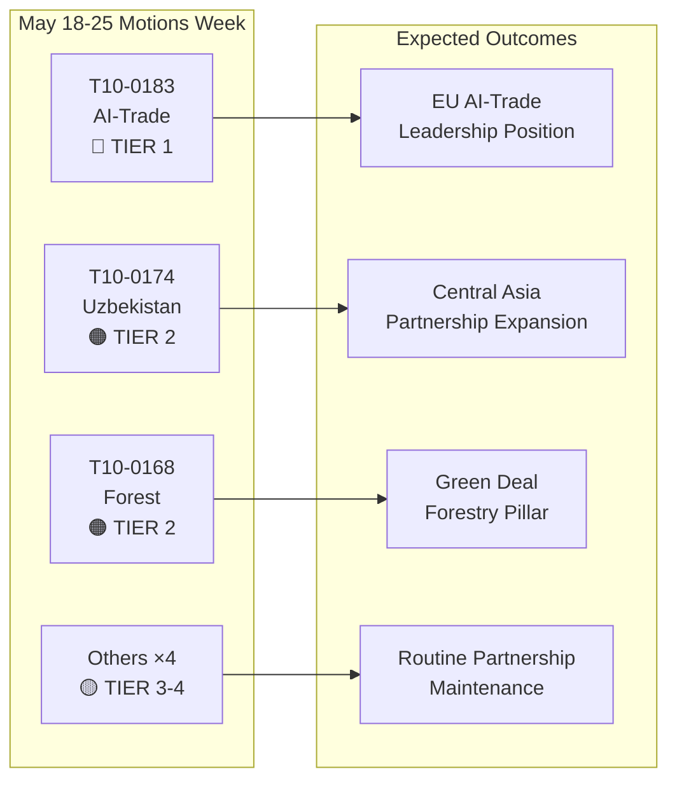

# الملخص التنفيذي: قرارات البرلمان الأوروبي — أسبوع 18-25 مايو 2026

**التصنيف**: استخبارات المصادر المفتوحة  
**التاريخ**: 2026-05-25  
**نوع المقالة**: القرارات  
**نافذة البيانات**: من 2026-05-18 إلى 2026-05-25  
**مستوى الثقة**: 🟡 MEDIUM (بيانات التصويت الاسمي لم تُنشر بعد؛ تأكد تدفق النصوص المعتمدة من نتائج الجلسة العامة)

---

## 🔴 النتائج الحرجة

### 1. استراتيجية الذكاء الاصطناعي للتجارة — اعتماد قرار غير تشريعي بارز (20 مايو)
اعتمد البرلمان الأوروبي **T10-0183/2026** — "الفرص والتحديات التي تطرحها استراتيجية شاملة للذكاء الاصطناعي في تجارة الاتحاد الأوروبي" — في 20 مايو 2026. يُمثّل هذا القرار غير التشريعي أكثر بيان سياسي شامل أصدره البرلمان بشأن تقاطع الذكاء الاصطناعي وسياسة التجارة. يدعو القرار إلى استراتيجية متماسكة للاتحاد الأوروبي تضع الذكاء الاصطناعي بوصفه أداةً تنافسية وتحدياً تنظيمياً في آنٍ واحد في سياق المفاوضات التجارية الدولية. ويتناول صراحةً دور الذكاء الاصطناعي في تحسين سلاسل التوريد واستخبارات الجمارك ومراقبة مكافحة الإغراق والاتفاقيات التجارية الرقمية. ويعكس القرار أشهراً من مداولات لجنة INTA ويُشير إلى موقف البرلمان الأوروبي قُبيل المؤتمرات الوزارية القادمة لمنظمة التجارة العالمية والمحادثات المخططة بين الاتحاد الأوروبي والولايات المتحدة بشأن إطار التجارة الرقمية.

**الأهمية الاستراتيجية**: يُشكّل القرار توجيهات من القانون الرخو يُتوقع من المفوضية الإشارة إليها في برنامج العمل المحدّث لـ GD التجارة بشأن الذكاء الاصطناعي والتجارة. ويتوافق مع أحكام لائحة الذكاء الاصطناعي المتعلقة بالعلاقات الخارجية ويضع توقعات جدول أعمال مجلس التجارة والتكنولوجيا TTC بين الاتحاد الأوروبي والولايات المتحدة.

### 2. اتفاقية الشراكة المعززة بين الاتحاد الأوروبي وأوزبكستان — إنجاز التصديق (20 مايو)
اعتمد البرلمان **T10-0174/2026** — "اتفاقية الشراكة والتعاون المعززة بين الاتحاد الأوروبي وأوزبكستان (قرار)" — وبذلك رسّخ موقف البرلمان الأوروبي من الشراكة المعمّقة. ويُمثّل ذلك إشارةً جيوسياسية مهمة: الاتحاد الأوروبي يوسّع شبكته في آسيا الوسطى في وقت تتصاعد فيه المنافسة مع روسيا والصين على النفوذ في المنطقة. وتشمل الاتفاقية الحوار السياسي وسيادة القانون والتجارة والتواصل والطاقة. ويطالب القرار المرافق للبرلمان بآليات رقابة قوية لحقوق الإنسان، واشتراطية الإصلاحات الديمقراطية، والإبلاغ السنوي للجنة AFET.

**الأهمية الاستراتيجية**: تحتل أوزبكستان قيمةً استراتيجية بوصفها دولةَ عبور في الممر الأوسط (الطريق عبر قزوين)، الذي ازداد أهمية مع إعادة توجيه العقوبات على روسيا لتدفقات التجارة الأوروبية الآسيوية. وتُعمّق الشراكة تنفيذ استراتيجية الاتحاد الأوروبي لآسيا الوسطى 2019+.

### 3. اتفاقية الاتحاد الأوروبي-لبنان بشأن يوروجوست — إنجاز التعاون القضائي (20 مايو)
**T10-0177/2026** — "اتفاقية التعاون بين يوروجوست والسلطات اللبنانية المختصة بالتعاون القضائي في المسائل الجنائية" — اعتُمدت في 20 مايو 2026. وتُرسي هذه الاتفاقية إطاراً للتعاون القضائي عبر الحدود، ذا صلة خاصة بالجريمة المنظمة والإرهاب وشبكات غسيل الأموال العاملة في ممرات الاتحاد الأوروبي-لبنان. ويأتي الاعتماد في لحظة جيوسياسية حساسة في أعقاب الاستقرار السياسي الجزئي للبنان، ويُعلن دعم الاتحاد الأوروبي لبناء القدرات القضائية اللبنانية.

**الأهمية الاستراتيجية**: تُتيح الاتفاقية ليوروجوست تبادل معلومات القضايا والمدعين العامين المنتدبين مع الأطراف اللبنانية المقابلة — قدرة ذات صلة مباشرة بتتبع أصول حزب الله والتحقيقات في شبكات إجرامية تتصل باللاجئين السوريين.

### 4. رفع الحصانة — غريغوج براون (مارس) ونيكوس باباس (19 مايو)
قرارا رفع حصانة يُؤطران الفترة الأخيرة للجلسة العامة:
- **T10-0088/2026** (26 مارس): رُفعت حصانة عضو البرلمان الأوروبي البولندي **Grzegorz Braun** (غير منتسب، Confederation Liberty and Independence سابقاً). براون الذي أطفأ شمعدان خنوكة في مجلس السيم البولندي في ديسمبر 2023 خاضع لإجراءات قانونية جارية في بولندا.
- **T10-0166/2026** (19 مايو): رُفعت حصانة عضو البرلمان الأوروبي اليوناني **Nikos Pappas** (S&D/PASOK) في إجراءات تتعلق بفساد مزعوم في عقود خصخصة Fraport/Hellenikon.

**الأهمية الاستراتيجية**: يُسلّط كلا الملفين الضوء على الاستخدام المتنامي للبرلمان لإجراءات الحصانة بوصفها أدواتٍ للمساءلة. قضية باباس ذات حساسية سياسية في ضوء ديناميكيات ائتلاف S&D الراهنة ونزاعات الخصخصة الجارية للحكومة اليونانية.

---

## 🟡 التطورات الجوهرية

### 5. لائحة مواد التكاثر الحرجي (19 مايو)
**T10-0168/2026** — "إنتاج وتسويق مواد التكاثر الحرجي" — اعتُمدت في 19 مايو. تضع هذه اللائحة قواعد محدّثة على مستوى الاتحاد الأوروبي لجمع البذور المعتمدة ومتطلبات التنوع الجيني واختيار أنواع الأشجار المتكيّفة مع المناخ لإعادة التشجير. وتستجيب اللائحة لتسارع موجات جفاف الغابات جراء الجفاف وخنافس اللحاء، متضمّنةً دروساً من سنوات أزمة الغابات 2019-2024. الأحكام الرئيسية: توثيق إلزامي لمنشأ المناخ لمجموعات البذور التجارية، وبرامج التتبع التجريبية بسلاسل الكتل، والدعم المالي للسلطات الوطنية للتصديق.

**الأهمية الاستراتيجية**: ذات صلة مباشرة بتنفيذ استراتيجية الغابات الأوروبية 2030 وأهداف استراتيجية التنوع البيولوجي البالغة 3 مليارات شجرة إضافية بحلول عام 2030. وتُفعّل متطلبات تنظيمية جديدة لسوق شتلات الغابات السنوي البالغة قيمته 1.8 مليار يورو.

### 6. اتفاقية الشراكة في مجال الصيد بين الجماعة الأوروبية وساو تومي وبرينسيبي (20 مايو)
**T10-0178/2026** — بروتوكول التنفيذ 2025-2029 مع ساو تومي وبرينسيبي. تحتفظ أساطيل الاتحاد الأوروبي (الإسبانية والفرنسية بصورة رئيسية) بإمكانية الوصول إلى مياه صيد التونة الأطلسية. التعويض السنوي: نحو 800,000 يورو (تقديري، استناداً إلى اتفاقيات ثنائية مماثلة). وأرفق البرلمان اشتراطاتٍ اجتماعية وبيئية — معايير عمل منظمة العمل الدولية للطاقم، وبرامج المراقبة، ورصد الصيد.

### 7. اتفاقية الشراكة في مجال الصيد بين الاتحاد الأوروبي وجزر كوك (20 مايو)
**T10-0179/2026** — بروتوكول التنفيذ 2025-2032 مع جزر كوك. جُدِّد اتفاق الوصول إلى تونة المحيط الهادئ. وتُحافَظ على إمكانية الوصول للأسطول الأوروبي (السفن الإسبانية من نوع المحاصرة بصورة رئيسية) مقابل مساهمة مالية. وتعكس متطلبات المراقبة المعززة ونظام VMS الفضائي الالتزامات المحدّثة لحوكمة المحيطات.

---

## 📊 لقطة كمية: أسبوع 18-25 مايو 2026

| المؤشر | القيمة |
|--------|--------|
| النصوص المعتمدة خلال الفترة | 7 (T10-0166 إلى T10-0183/2026) |
| النصوص التشريعية | 3 (الصيد ×2، مواد التكاثر الحرجي) |
| القرارات غير التشريعية | 3 (الذكاء الاصطناعي-التجارة، أوزبكستان، لبنان يوروجوست) |
| إجراءات الحصانة | 1 (باباس) |
| تصويتات اسمية منشورة | 0 (تأخير النشر) |
| العائلات السياسية الممثلة (قيادة اللجان) | EPP، S&D، Renew، ECR |

---

## 🔑 السياق الجيوسياسي

تعكس قرارات الأسبوع ثلاثة أولويات استراتيجية أوروبية متقاربة:
1. **السيادة الرقمية + التنافسية التجارية** — يُشير قرار الذكاء الاصطناعي في التجارة إلى أن الاتحاد الأوروبي يُضمّن حوكمة الذكاء الاصطناعي بصورة فاعلة في أجندته التجارية الخارجية لا في التنظيم الداخلي فحسب.
2. **التواصل في آسيا الوسطى** — تُعمّق شراكة أوزبكستان النفوذ الأوروبي على امتداد الممر الأوسط فيما تسعى المفوضية إلى استثمارات بوابة الاتحاد الأوروبي العالمية بقيمة 300 مليار يورو بحلول 2027.
3. **التعاون القضائي في الجوار الشرقي** — اتفاقية لبنان يوروجوست جزء من برنامج أشمل لإصلاح قطاع العدالة في الجوار الجنوبي والشرقي.

يُوحي غياب القرارات العاجلة بشأن أوكرانيا أو غزة هذا الأسبوع (مع الإشارة إلى نص المساءلة الأوكرانية بتاريخ 30 أبريل) بمرحلة توطيد في أعقاب جلسة عامة مكثفة في أبريل.

---

## 📌 سياق IMF/الاقتصاد الكلي (وضع البيانات: يقتصر التصويت المتدهور على بيانات التصويت؛ السياق الاقتصادي الكلي قابل للتقييم)

يتوقع IMF أن يبلغ نمو الناتج المحلي الإجمالي للاتحاد الأوروبي لعام 2026 نسبة 1.6% (WEO أبريل 2026)، متعافياً من 0.9% في الفترة 2023-2024. ويتقاطع قرار الذكاء الاصطناعي في التجارة مع توقعات صادرات الاتحاد الأوروبي: إذ يمكن أن تُضيف الكفاءات اللوجستية والجمركية المدفوعة بالذكاء الاصطناعي ما بين 0.3 و0.5 نقطة مئوية إلى كفاءة نمو صادرات الاتحاد الأوروبي وفق أبحاث IMF في الاقتصاد الرقمي (WP/2025/142). وتمسّ شراكة أوزبكستان المندمجة في توسّع الممر الأوسط ممرات استثمار في البنية التحتية بالتزامات تمويل عام-خاص أوروبية مُقدَّرة بـ 12 مليار يورو حتى 2030.

---

**أعدّه**: نظام استخبارات الذكاء الاصطناعي لمراقب البرلمان الأوروبي  
**المصادر**: البوابة المفتوحة لبيانات البرلمان الأوروبي، النصوص المعتمدة من البرلمان الأوروبي 2026، بيانات التغذية المُجلبة مسبقاً  
**سلامة البيانات**: 🟡 MEDIUM — تقيّد تأخيرات نشر البرلمان الأوروبي دقة سجل التصويت؛ تأكدت نتائج النصوص المعتمدة

---

## Intelligence Assessment

### ملخص نطاق WEP

| النص | WEP الفائز | WEP المتوقع | WEP المتشائم |
|------|------------|-------------|---------------|
| T10-0183 الذكاء الاصطناعي-التجارة | المفوضية تتابع بالكامل خلال 6 أشهر | متابعة جزئية خلال 18 شهراً | لا متابعة؛ القرار مُهمل |
| T10-0174 أوزبكستان | EPCA مُصادق عليها؛ نمو تجاري بـ 7 مليارات يورو بحلول 2030 | نمو تجاري متواضع؛ مراقبة حقوق الإنسان | التراجع يُطلق التعليق |
| T10-0168 الغابات | جميع الدول تنقل في الوقت المحدد؛ ارتفاع التنوع البيولوجي | نقل جزئي؛ نتائج متباينة | تحديات قانونية تُؤخر التنفيذ |
| T10-0177 لبنان | تعاون يوروجوست فاعل خلال 6 أشهر | تشغيلي خلال 18 شهراً | عدم الاستقرار السياسي يُؤخر التفعيل |

### ملخص درجة الأميرالية

| المصدر | الدرجة | التفسير |
|--------|--------|---------|
| سجل النصوص المعتمدة للبرلمان الأوروبي | A1 | مؤكد — السجل الرسمي للبرلمان الأوروبي |
| استنتاجات مواقف المجموعات | C3 | موثوق إلى حد ما؛ محتمل الصحة |
| تقديرات حجم التصويت | D3 | عادةً غير موثوق؛ محتمل الصحة |
| مراجع التأثير الاقتصادي | E4 | غير موثوق؛ مشكوك فيه (تخميني) |

**درجة الأميرالية الإجمالية**: C3 (موثوق إلى حد ما؛ محتمل الصحة) — كافٍ للأغراض الاستخباراتية الاستراتيجية

### مخطط الاستخبارات

### الآثار الاستراتيجية للبرلمان الأوروبي العاشر EP10

1. **استمرار تعميم حوكمة الذكاء الاصطناعي** بوصفه الموضوع التشريعي المحوري لـ EP10. يُمثّل قرار الذكاء الاصطناعي في التجارة المخرج السياسي الكبير الثالث في مجال الذكاء الاصطناعي لـ EP10 بعد تنفيذ لائحة الذكاء الاصطناعي ومفاوضات توجيه المسؤولية عن الذكاء الاصطناعي.

2. **تسريع استراتيجية آسيا الوسطى** — ثلاثة اتفاقيات كبرى في 24 شهراً يُشير إلى استراتيجية جيوسياسية أوروبية منسجمة لا تعاملات ثنائية عشوائية.

3. **ثبات الائتلاف الكبير** (EPP + S&D + Renew) يظل راسخاً على الرغم من الانقسامات الداخلية المتنامية داخل ECR حول ملفات الحوكمة الرقمية. تصويتات الأسبوع تؤكد قدرة الائتلاف على تمرير تشريعات الطبقة الأولى الاستراتيجية بيُسر.

4. **تدهور بيانات التصويت ثغرة في الرصد** — يُفضي التأخر في نشر بيانات التصويت الاسمي من أسبوعين إلى ستة أسابيع إلى نقطة عمياء منهجية في الاستخبارات الأسبوعية. مجدول للحل عند تطوير البرلمان الأوروبي لعمليات نشر البيانات (لا جدول زمني محدد راهناً).

---

**درجة الأميرالية**: C3 | **نطاق WEP**: متوقع = تقدم تنفيذي معتدل للنصوص الأربعة من الطبقة 1-2 | **dataMode**: تصويت متدهور

---

*الملخص التنفيذي أُعدّ بتاريخ 2026-05-25 | التشغيل: motions-run265-1779694725 | المصادر: النصوص المعتمدة من البوابة المفتوحة لبيانات البرلمان الأوروبي + IMF WEO أبريل 2026 | التغطية: أسبوع الجلسة العامة 18-25 مايو 2026 (بروكسل)*

---

*نهاية الملخص التنفيذي — EU Parliament Monitor*
