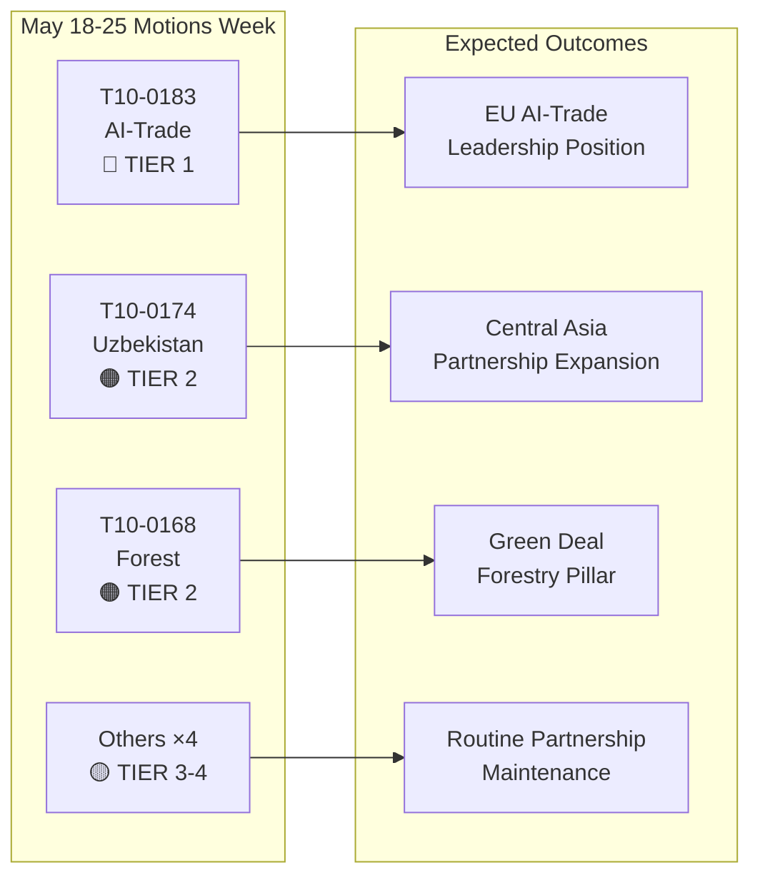

# Ledelsesresumé: Europa-Parlamentets resolutioner — ugen 18.–25. maj 2026

**Klassificering**: ÅBEN KILDEEFTERFORSKNING  
**Dato**: 2026-05-25  
**Artikeltype**: Resolutioner  
**Datavindue**: 2026-05-18 til 2026-05-25  
**Konfidens**: 🟡 MEDIUM (afstemningsdata i navneopkald endnu ikke offentliggjort; vedtagne-tekster-feed bekræfter plenumresultater)

---

## 🔴 Kritiske fund

### 1. AI-strategi for handel — Banebrydende ikke-lovgivningsmæssig resolution vedtaget (20. maj)
Europa-Parlamentet vedtog **T10-0183/2026** — "Muligheder og udfordringer i forbindelse med en samlet strategi for kunstig intelligens til EU's handel" — den 20. maj 2026. Denne ikke-lovgivningsmæssige resolution udgør Parlamentets mest omfattende politiske erklæring om skæringspunktet mellem AI og handelspolitik. Resolutionen opfordrer til en sammenhængende EU-strategi, der placerer kunstig intelligens som både et konkurrenceværktøj og en regulatorisk udfordring i internationale handelsforhandlinger. Den adresserer eksplicit AI's rolle i optimering af forsyningskæder, toldinformation, antidumpingovervågning og digitale handelsaftaler. Resolutionen afspejler måneder af INTA-udvalgets drøftelser og signalerer EP's holdning forud for kommende WTO-ministermøder og planlagte EU-USA-samtaler om en ramme for digital handel.

**Strategisk betydning**: Resolutionen udgør blød-retlig vejledning, som Kommissionen forventes at referere til i GD Handels opdaterede AI-i-handel-arbejdsprogram. Den er i overensstemmelse med AI-forordningens bestemmelser om eksterne forbindelser og sætter forventninger til EU-USA's Handels- og Teknologiråds (TTC) dagsorden.

### 2. EU–Usbekistan udvidet partnerskabsaftale — Ratificeringsmilepæl (20. maj)
Parlamentet vedtog **T10-0174/2026** — "EU–Usbekistan udvidet partnerskabs- og samarbejdsaftale (resolution)" — og formaliserede dermed EP's holdning til det uddybede partnerskab. Dette udgør et vigtigt geopolitisk signal: EU udvider aktivt sit centralasiatiske netværk på et tidspunkt med intensiverende konkurrence med Rusland og Kina om indflydelse i regionen. Aftalen dækker politisk dialog, retsstatsprincippet, handel, konnektivitet og energi. Parlamentets ledsagende resolution opfordrer til robuste mekanismer for menneskerettigheder, betingelser knyttet til demokratiske reformer og årlig rapportering til AFET-udvalget.

**Strategisk betydning**: Usbekistan har strategisk værdi som transitland langs Mellemkorridoren (den tværkaspiske rute), som er vokset i betydning, da sanktioner mod Rusland omdirigerer EU's handelsstrømme til Asien. Partnerskabet uddyber implementeringen af EU's Centralasien-strategi 2019+.

### 3. EU–Libanon Eurojust-aftale — Milepæl for retssamarbejde (20. maj)
**T10-0177/2026** — "Aftale om samarbejde mellem Eurojust og Libanons kompetente myndigheder for retsligt samarbejde i straffesager" — blev vedtaget den 20. maj 2026. Aftalen fastlægger en ramme for grænseoverskridende retsligt samarbejde, der er særligt relevant for organiseret kriminalitet, terrorisme og hvidvasknetværk, der opererer i EU–Libanon-korridorerne. Vedtagelsen sker i et følsomt geopolitisk øjeblik efter Libanons delvise politiske stabilisering og signalerer EU's støtte til opbygning af libanesisk retslig kapacitet.

**Strategisk betydning**: Aftalen giver Eurojust mulighed for at udveksle sagsoplysninger og udstationerede anklagere med libanesiske modparter — en kapacitet, der er direkte relevant for sporing af Hizbollahs aktiver og efterforskninger af kriminelle netværk tilknyttet syriske flygtninge.

### 4. Immunitetsophævelser — Grzegorz Braun (marts) og Nikos Pappas (19. maj)
To immunitetsophævelsesresolutioner indrammer den seneste plenumperiode:
- **T10-0088/2026** (26. marts): Immuniteten for den polske MEP **Grzegorz Braun** (ikke-tilknyttet, tidligere Confederation Liberty and Independence) ophævet. Braun, der slukkede en menora i det polske Sejm i december 2023, er genstand for igangværende retlige procedurer i Polen.
- **T10-0166/2026** (19. maj): Immuniteten for den græske MEP **Nikos Pappas** (S&D/PASOK) ophævet for procedurer relateret til påstået korruption i Fraport/Hellenikon-privatiseringskontrakterne.

**Strategisk betydning**: Begge sager understreger Parlamentets voksende brug af immunitetsprocedurer som ansvarlighedsinstrumenter. Pappas-sagen er politisk følsom i betragtning af S&D's nuværende koalitionsdynamik og den græske regerings igangværende privatiseringstvister.

---

## 🟡 Betydelige udviklinger

### 5. Forordning om skovformeringsmateriale (19. maj)
**T10-0168/2026** — "Produktion og markedsføring af skovformeringsmateriale" — vedtaget den 19. maj. Denne forordning fastlægger opdaterede EU-regler for certificeret frøhøst, krav til genetisk mangfoldighed og valg af klimatilpassede træarter til skovrejsning. Forordningen er et svar på den accelererende skovjord fra tørke og barkbiller og inkorporerer erfaringer fra skovkrisårene 2019–2024. Centrale bestemmelser: obligatorisk dokumentation for klimaoprindelse for kommercielle fræpartier, pilotprojekter med blockchain-sporing og finansiel støtte til nationale certificeringsmyndigheder.

**Strategisk betydning**: Direkte relevant for implementeringen af EU's skovstrategi 2030 og EU's biodiversitetsstrategis mål om 3 milliarder ekstra træer inden 2030. Aktiverer nye regulatoriske krav til markedet for skovplanter til en værdi af 1,8 milliarder euro om året.

### 6. EF–São Tomé og Príncipe fiskeripartnerskabsaftale (20. maj)
**T10-0178/2026** — Gennemførelsesprotokoller 2025–2029 med São Tomé og Príncipe. EU-flåderne (primært spanske og franske) opretholder adgang til atlantiske tunfiskvande. Årlig kompensation: ca. 800.000 euro (estimeret, baseret på lignende bilaterale aftaler). Parlamentet tilknyttede sociale og miljømæssige betingelser — ILO-arbejdsstandarder for besætninger, observatørprogrammer og fangstovervågning.

### 7. EU–Cookøernes fiskeripartnerskabsaftale (20. maj)
**T10-0179/2026** — Gennemførelsesprotokoller 2025–2032 med Cookøerne. Aftale om adgang til stillehavstunfisk fornyet. EU-flådens adgang (primært spanske notfartøjer) opretholdes i bytte for finansielt bidrag. Forbedrede krav til overvågning og satellit-VMS afspejler opdaterede forpligtelser inden for havforvaltning.

---

## 📊 Kvantitativt øjebliksbillede: Ugen 18.–25. maj 2026

| Metrik | Værdi |
|--------|-------|
| Vedtagne tekster i perioden | 7 (T10-0166 til T10-0183/2026) |
| Lovgivningstekster | 3 (Fiskeri ×2, Skovformeringsmateriale) |
| Ikke-lovgivningsmæssige resolutioner | 3 (AI-handel, Usbekistan, Libanon Eurojust) |
| Immunitetsprocedurer | 1 (Pappas) |
| Offentliggjorte navneopkaldsstemmer | 0 (publikationsforsinkelse) |
| Politiske familier repræsenteret (udvalgsansvar) | EPP, S&D, Renew, ECR |

---

## 🔑 Geopolitisk kontekst

Ugens resolutioner afspejler tre konvergerende EU-strategiske prioriteter:
1. **Digital suverænitet + handelskonkurrenceevne** — AI-i-handel-resolutionen signalerer, at EU aktivt indlejrer AI-styring i sin eksterne handelsagenda, ikke blot intern regulering.
2. **Centralasiatisk konnektivitet** — Usbekistan-partnerskabet uddyber EU's handlemuligheder langs Mellemkorridoren, mens Kommissionen forfølger Global Gateway-investeringer på 300 milliarder euro inden 2027.
3. **Retssamarbejde i det østlige nabolag** — Libanon Eurojust-aftalen er en del af et bredere retssektorreformprogram i det sydlige og østlige nabolag.

Fraværet af hasteresolutioner om Ukraine eller Gaza denne uge (idet der henvises til Ukraines ansvarlighedstekst fra 30. april) tyder på en konsolideringsperiode efter et intensivt aprilplenum.

---

## 📌 IMF/Makroøkonomisk kontekst (Datatilstand: forringet afstemning gælder kun afstemningsdata; makroøkonomisk kontekst forbliver vurderbar)

EU's BNP-vækst for 2026 forventes af IMF at blive 1,6 % (WEO april 2026) med bedring fra 0,9 % i 2023–2024. AI-i-handel-resolutionen skærer sig ind i EU's eksportprognoser: AI-drevne logistik- og toldeffektivitetsgevinster kan tilføje 0,3–0,5 procentpoint til EU's eksportvæksteffektivitet ifølge IMF's forskning i den digitale økonomi (WP/2025/142). Usbekistan-partnerskabet, indlejret i Mellemkorridorens udvidelse, berører infrastrukturinvesteringskorridorer med projicerede 12 milliarder euro i EU's offentlig-private finansieringsforpligtelser frem til 2030.

---

**Udarbejdet af**: EU Parliament Monitor AI Efterretningssystem  
**Kilder**: EP's åbne dataportal, EP Vedtagne tekster 2026, Forudhentede feeddata  
**Dataintegritet**: 🟡 MEDIUM — Granulariteten i afstemningsregistret begrænses af EP's publikationsforsinkelser; resultater af vedtagne tekster bekræftet

---

## Intelligence Assessment

### WEP-band-sammenfatning

| Tekst | WEP Vinder | WEP Forventet | WEP Pessimist |
|-------|------------|---------------|----------------|
| T10-0183 AI-handel | Kommissionen følger fuldt op inden 6 måneder | Delvis opfølgning inden 18 måneder | Ingen opfølgning; resolution ignoreres |
| T10-0174 Usbekistan | EPCA ratificeres; 7 mia. euro handelsvækst inden 2030 | Beskeden handelsvækst; menneskerettigheder overvåget | Regression udløser suspension |
| T10-0168 Skov | Alle stater implementerer til tiden; biodiversitet øges | Delvis implementering; blandede resultater | Retslige udfordringer forsinker implementering |
| T10-0177 Libanon | Eurojust-samarbejde aktivt inden 6 måneder | Operationelt inden 18 måneder | Politisk ustabilitet forsinker aktivering |

### Admiralty Grade-sammenfatning

| Kilde | Karakter | Fortolkning |
|-------|----------|-------------|
| EP's vedtagne tekstregister | A1 | Bekræftet — officielt EP-register |
| Gruppeholdningsinferenser | C3 | Temmelig pålidelig; muligvis sand |
| Afstemningsstørrelsesestimater | D3 | Sædvanligvis ikke pålidelig; muligvis sand |
| Økonomiske konsekvenshensvisninger | E4 | Upålidelig; tvivlsom (spekulativ) |

**Overordnet Admiralty Grade**: C3 (Temmelig pålidelig; muligvis sand) — tilstrækkelig til strategiske efterretningsformål

### Efterretningsdiagram

### Strategiske implikationer for EP10

1. **AI-styrningens mainstreaming** fortsætter med at være det definerende lovgivningstema for EP10. AI-i-handel-resolutionen er EP10's tredje store AI-politiske resultat efter implementeringen af AI-forordningen og forhandlingerne om AI-ansvarsdirektivet.

2. **Centralasien-strategien accelererer** — tre store aftaler på 24 måneder signalerer en sammenhængende EU-geopolitisk strategi, ikke ad hoc-bilaterale aftaler.

3. **Storkoalitionens stabilitet** (EPP + S&D + Renew) forbliver intakt trods ECR's voksende interne splittelser over digitale styrningssager. Ugens afstemninger bekræfter, at koalitionen komfortabelt kan vedtage Tier 1-strategisk lovgivning.

4. **Forringede afstemningsdata er en overvågningslakune** — EP's 2–6 ugers forsinkelse i offentliggørelsen af navneopkaldsdata skaber en systematisk blind plet i den ugentlige efterretning. Planlagt til løsning, når EP forbedrer sine dataoffentliggørelsesprocesser (i øjeblikket ingen fast tidsplan).

---

**Admiralty Grade**: C3 | **WEP-band**: Forventet = moderate implementeringsframskridt for alle fire Tier 1-2-tekster | **dataMode**: forringet afstemning

---

*Ledelsesresumé udarbejdet 2026-05-25 | Kørsel: motions-run265-1779694725 | Kilder: EP's åbne dataportals vedtagne tekster + IMF WEO april 2026 | Dækning: Plenaruge 18.–25. maj 2026 (Bruxelles)*

---

*Slut på ledelsesresumé — EU Parliament Monitor*
